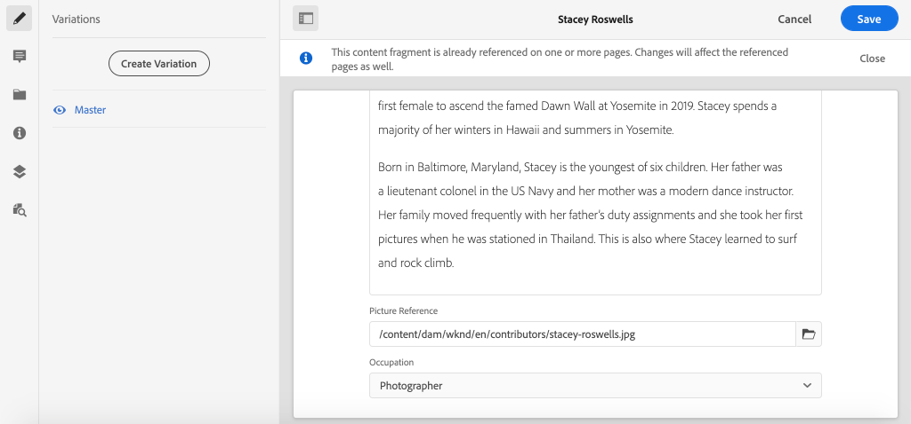
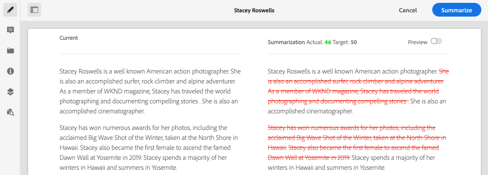

# Authoring frammento di contenuto {#authoring-content-fragments}

>[!CAUTION]
>
> L&#39;API AEM GraphQL per la distribuzione dei frammenti di contenuto verrà rilasciata all&#39;inizio del 2021.
> La documentazione correlata è disponibile a scopo di anteprima.

In questo capitolo verrà creato e modificato un nuovo frammento di contenuto basato sul [modello di frammento di contenuto del collaboratore appena definito](./content-fragment-models.md). Verrà inoltre illustrato come creare varianti di frammenti di contenuto.

## Prerequisiti {#prerequisites}

Si tratta di un&#39;esercitazione con più parti e si presume che i passaggi descritti in [Defining Content Fragment Models](./content-fragment-models.md) (Definizione dei modelli di frammento di contenuto) siano stati completati.

## Obiettivi {#objectives}

* Creazione di un frammento di contenuto basato su un modello di frammento di contenuto
* Creare una variante di frammento di contenuto

## Panoramica sull&#39;authoring dei frammenti di contenuto {#overview}

>[!VIDEO](https://video.tv.adobe.com/v/22451/?quality=12&learn=on)

Questo video offre una panoramica di alto livello sull’authoring dei frammenti di contenuto.

## Creare un frammento di contenuto {#create-content-fragment}

Nel capitolo precedente, [Defining Content Fragment Models](./content-fragment-models.md) (Definizione dei modelli di frammenti di contenuto), è stato creato un modello **Contributor**. Creare un nuovo frammento di contenuto utilizzando questo modello.

1. Dal menu **AEM Start** passare a **Risorse** > **File**.
1. Fare clic tra le cartelle per passare a **Sito WKND** > **Inglese** > **Collaboratori**. Questa cartella contiene un elenco di foto principali per i collaboratori del marchio WKND.

1. Fare clic su **Crea** in alto a destra e selezionare **Frammento di contenuto**:

   

1. Selezionare il modello **Collaboratore** e fare clic su **Avanti**.

   

   Si tratta dello stesso modello **Collaboratore** creato nel capitolo precedente.

1. Immettere **Stacey Roswells** per il titolo e fare clic su **Crea**.
1. Fare clic su **Apri** nella finestra di dialogo **Success** per aprire il frammento appena creato.

   

   Osservate che i campi definiti dal modello sono ora disponibili per creare questa istanza del frammento di contenuto.

1. Per **Nome completo** immettere: **Stacey Roswells**.
1. Per **Biografia** inserire una breve biografia. Hai bisogno di ispirazione? Non esitate a riutilizzare questo [file di testo](assets/author-content-fragments/stacey-roswells-bio.txt).
1. Per **Picture Reference** fare clic sull&#39;icona **cartella** e individuare **WKND Site** > **English** > **Contributor** > **stack-roswells.jpg**. Questo verrà valutato in base al percorso: `/content/dam/wknd/en/contributors/stacey-roswells.jpg`.
1. Per **Occupazione** scegliere **Fotografo**.

   

1. Fare clic su **Salva** per salvare le modifiche.

## Creare una variante di frammento di contenuto

Tutti i frammenti di contenuto iniziano con una variante **Master**. La variante **Master** può essere considerata il contenuto *predefinito* del frammento e viene utilizzata automaticamente quando il contenuto viene esposto tramite le API GraphQL. È inoltre possibile creare varianti di un frammento di contenuto. Questa funzione offre un&#39;ulteriore flessibilità per la progettazione e l&#39;implementazione.

Le varianti possono essere utilizzate per indirizzare canali specifici. Ad esempio, è possibile creare una variante **mobile** che contiene una quantità minore di testo o fa riferimento a un&#39;immagine specifica per il canale. Il modo in cui vengono utilizzate le variazioni dipende dall&#39;implementazione. Come per qualsiasi funzione, prima di utilizzare occorre effettuare una pianificazione accurata.

Quindi, create una nuova variante per ottenere un&#39;idea delle funzionalità disponibili.

1. Riaprire il frammento di contenuto **Stacey Roswells**.
1. Nella barra laterale sinistra fate clic su **Crea variante**.
1. Nella **Nuova variante** modale immettere un Titolo di **Riepilogo**.

   

1. Fare clic nel campo multi-riga **Biografia** e fare clic sul pulsante **Espandi** per inserire la visualizzazione a schermo intero per il campo multi-riga.

   

1. Fare clic su **Riepiloga testo** nel menu in alto a destra.

1. Immettete un **Target** di **50** parole e fate clic su **Start**.

   

   Viene aperta un&#39;anteprima del riepilogo. AEM processore del linguaggio del computer tenterà di riepilogare il testo in base al numero di parole di destinazione. Potete anche selezionare frasi diverse da rimuovere.

1. Fare clic su **Riepilogo** quando si è soddisfatti del riepilogo. Fare clic nel campo di testo su più righe e attivare il pulsante **Espandi** per tornare alla vista principale.

1. Fare clic su **Salva** per salvare le modifiche.

## Creare un frammento di contenuto aggiuntivo

Ripetere i passaggi descritti in [Creare un frammento di contenuto](#create-content-fragment) per creare un altro **collaboratore**. Questo verrà utilizzato nel capitolo successivo come esempio per eseguire una query su più frammenti.

1. Nella cartella **Collaboratori** fare clic su **Crea** in alto a destra e selezionare **Frammento contenuto**:
1. Selezionare il modello **Collaboratore** e fare clic su **Avanti**.
1. Immettere **Jacob Wester** per il titolo e fare clic su **Crea**.
1. Fare clic su **Apri** nella finestra di dialogo **Success** per aprire il frammento appena creato.
1. Per **Nome completo** immettere: **Jacob Wester**.
1. Per **Biografia** inserire una breve biografia. Hai bisogno di ispirazione? Non esitate a riutilizzare questo [file di testo](assets/author-content-fragments/jacob-wester.txt).
1. Per **Riferimento immagine** fare clic sull&#39;icona **cartella** e passare a **Sito WKND** > **Inglese** > **Collaboratori** > **jacob_wester.jpg**. Questo verrà valutato in base al percorso: `/content/dam/wknd/en/contributors/jacob_wester.jpg`.
1. Per **Occupazione** scegliere **Writer**.
1. Fare clic su **Salva** per salvare le modifiche. Non è necessario creare una variante, a meno che non si desideri!

   

   È ora necessario disporre di due frammenti **Collaboratori**.

## Congratulazioni! {#congratulations}

Congratulazioni, hai appena creato più frammenti di contenuto e creato una variante.

## Passaggi successivi {#next-steps}

Nel capitolo successivo, [Esplora API GraphQL](explore-graphql-api.md), esplorerai AEM API GraphQL utilizzando lo strumento GrapiQL incorporato. Scoprite come AEM generare automaticamente uno schema GraphQL basato su un modello di frammento di contenuto. È possibile sperimentare la creazione di query di base utilizzando la sintassi GraphQL.