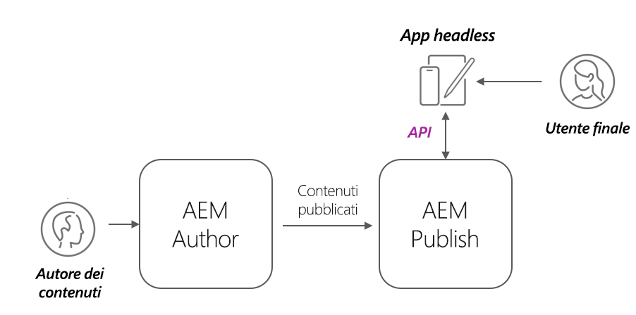

# Implementazioni senza titolo AEM

AEM le implementazioni client headless si presentano in molti modi; SPA in hosting AEM, SPA esterni, sito web, app mobile o persino processo server-to-server.

A seconda del client e della modalità di distribuzione, le distribuzioni senza intestazione AEM hanno considerazioni diverse.

## Architettura del servizio AEM

Prima di esaminare le considerazioni relative all’implementazione, è fondamentale comprendere AEM’architettura logica e la separazione e i ruoli dei livelli di servizio di AEM as a Cloud Service. AEM as a Cloud Service è composto da due servizi logici:

+ __AEM Author__ è il servizio in cui i team creano, collaborano e pubblicano frammenti di contenuto (e altre risorse).
+ __Pubblicazione AEM__ è il servizio che sono stati pubblicati Frammenti di contenuto (e altre risorse) vengono replicati per il consumo generale.
+ __Anteprima AEM__ è il servizio che imita il comportamento di AEM Publish, ma con il contenuto pubblicato a tale servizio a scopo di anteprima o revisione. AEM anteprima è destinata al pubblico interno e non alla distribuzione generale dei contenuti. L’utilizzo di Anteprima AEM è facoltativo, in base al flusso di lavoro desiderato.

Architettura di distribuzione headless as a Cloud Service tipica AEM

I client AEM headless che operano in una capacità di produzione generalmente interagiscono con AEM Publish, che contiene il contenuto approvato e pubblicato. I clienti che interagiscono con AEM Author devono prestare particolare attenzione, in quanto AEM Author è sicuro per impostazione predefinita, richiede l’autorizzazione per tutte le richieste e può contenere anche contenuti in corso di elaborazione o non approvati.

## Implementazioni client headless

    <!-- Single-page App (SPA) -->
    

       

           

               <figure class="image is-16by9">
                   
               </figure>
           

           

               

                   
<a href="./spa.md" title="App a pagina singola (SPA)">App a pagina singola (SPA)</a>

                   
Scopri le considerazioni sulla distribuzione delle app a pagina singola (SPA).

                   <a href="./spa.md" class="spectrum-Button spectrum-Button--outline spectrum-Button--primary spectrum-Button--sizeM">
                       Scopri
                   </a>
               

           

       

    

<!-- Web component/JS -->

   

       

           <figure class="image is-16by9">
               
           </figure>
       

       

           

               
<a href="./web-component.md" title="Componente Web/JS">Componente Web/JS</a>

               
Scopri le considerazioni sulla distribuzione per i componenti web e i consumatori JavaScript headless basati su browser.

               <a href="./web-component.md" class="spectrum-Button spectrum-Button--outline spectrum-Button--primary spectrum-Button--sizeM">
                   Scopri
               </a>
           

       

   

<!-- Mobile apps -->

   

       

           <figure class="image is-16by9">
               
           </figure>
       

       

           

               
<a href="./mobile.md" title="App mobili">App mobile</a>

               
Scopri le considerazioni sulla distribuzione delle app mobili.

               <a href="./mobile.md" class="spectrum-Button spectrum-Button--outline spectrum-Button--primary spectrum-Button--sizeM">
                   Scopri
               </a>
           

       

   

<!-- Server-to-server apps -->

   

       

           <figure class="image is-16by9">
               
           </figure>
       

       

           

               
<a href="./server-to-server.md" title="App server-to-server">App server-to-server</a>

               
Informazioni sulle considerazioni di implementazione per le app server-to-server

               <a href="./server-to-server.md" class="spectrum-Button spectrum-Button--outline spectrum-Button--primary spectrum-Button--sizeM">
                   Scopri
               </a>
           

       

   

