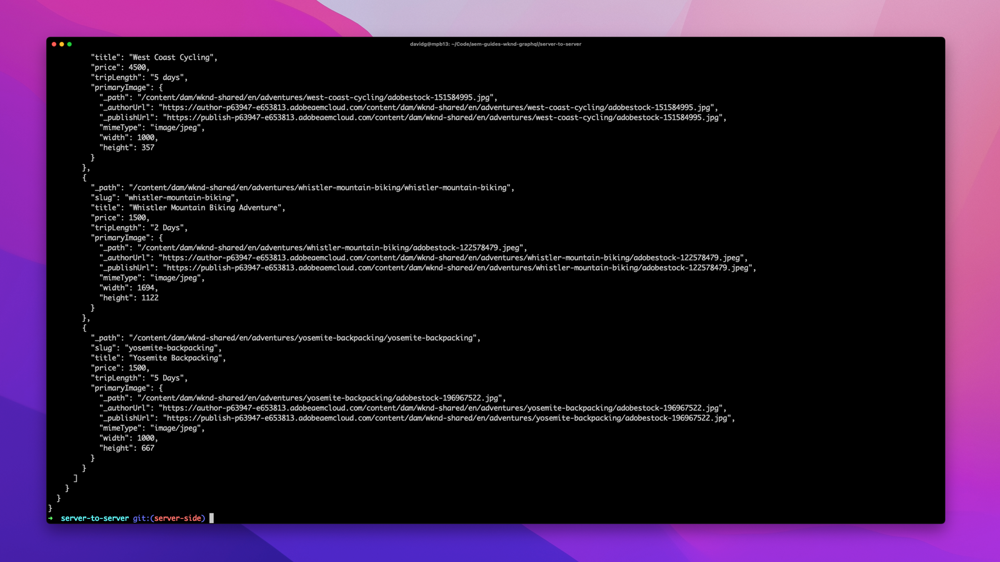

# Implementazioni senza intestazione server-to-server AEM

Le implementazioni server-to-server headless di AEM includono applicazioni o processi lato server che utilizzano e interagiscono con i contenuti in modo AEM headless.

Le implementazioni server-to-server richiedono una configurazione minima, in quanto le connessioni HTTP a AEM API headless non vengono avviate nel contesto di un browser.

## Configurazioni di distribuzione

La seguente configurazione di distribuzione deve essere in-place per le distribuzioni da server a server delle app.

| L’app da server a server si connette a | Autore AEM | AEM Publish | Anteprima AEM |
|---------------------------------------------------------------:|:----------:|:-----------:|:-----------:|
| [Filtri del Dispatcher](./configurations/dispatcher-filters.md) | ✘ | ↓ | ↓ |
| Condivisione delle risorse tra le origini (CORS) | ✘ | ✘ | ✘ |
| [Host AEM](./configurations/aem-hosts.md) | ↓ | ↓ | ↓ |

## Requisiti di autorizzazione

Le richieste autorizzate a AEM API GraphQL si verificano in genere nel contesto di app da server a server, a partire da altri tipi di app, come ad esempio [app a pagina singola](./spa.md), [mobile](./mobile.md)oppure [Componenti web](./web-component.md), in genere l’autorizzazione viene utilizzata in quanto è difficile proteggere le credenziali .

Quando autorizzi le richieste a AEM as a Cloud Service, utilizza [autenticazione token basata sulle credenziali del servizio](https://experienceleague.adobe.com/docs/experience-manager-cloud-service/content/implementing/developing/generating-access-tokens-for-server-side-apis.html). Per ulteriori informazioni sull’autenticazione delle richieste a AEM as a Cloud Service, consulta la sezione [esercitazione sull&#39;autenticazione basata su token](https://experienceleague.adobe.com/docs/experience-manager-learn/getting-started-with-aem-headless/authentication/overview.html). Il tutorial esplora l’autenticazione basata su token utilizzando [API HTTP AEM Assets](https://experienceleague.adobe.com/docs/experience-manager-cloud-service/content/assets/admin/mac-api-assets.html) ma gli stessi concetti e approcci sono applicabili alle app che interagiscono con AEM API GraphQL headless.

## Esempio di app server-to-server

Adobe fornisce un esempio di app server-to-server codificata in Node.js.

    <!-- Server-to-server app -->
    

       

           

               <figure class="image is-16by9">
                   
               </figure>
           

           

               

                   
<a href="../example-apps/server-to-server-app.md" title="App server-to-server">App server-to-server</a>

                   
Un’app server-to-server di esempio, scritta in Node.js, che consuma contenuti da AEM API GraphQL headless.

                   <a href="../example-apps/server-to-server-app.md" class="spectrum-Button spectrum-Button--outline spectrum-Button--primary spectrum-Button--sizeM">
                       Visualizza esempio
                   </a>
               

           

       

    

