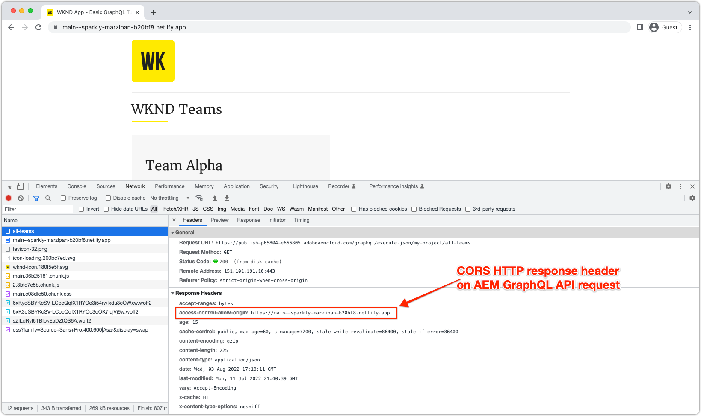

# Distribuzioni di SPA headless AEM

Le distribuzioni di app AEM headless a pagina singola (SPA) coinvolgono applicazioni basate su JavaScript create utilizzando framework come React o Vue, che utilizzano e interagiscono con i contenuti in AEM in modo headless.

Distribuire un SPA che interagisca con l’AEM in modo headless implica ospitare l’SPA e renderlo accessibile tramite un browser web.

## Ospitare l&#39;SPA

Un SPA è costituito da una raccolta di risorse web native: **HTML, CSS e JavaScript**. Queste risorse vengono generate durante il _build_ processo (ad esempio, `npm run build`) e implementato in un host per l&#39;utilizzo da parte degli utenti finali.

Sono disponibili vari **hosting** a seconda dei requisiti aziendali:

1. **Provider cloud** come **Azure** o **AWS**.

2. **On-premise** hosting in un&#39;azienda **data center**

3. **Piattaforme di hosting front-end** come **AWS Amplify**, **Servizio app Azure**, **Netlify**, **Heroku**, **Vercel**, ecc.

## Configurazioni di distribuzione

Quando si ospita un SPA che interagisce con l&#39;AEM headless, la considerazione principale è se l&#39;SPA è accessibile tramite il dominio AEM (o host) o su un dominio diverso.  Il motivo è che SPA è applicazioni web in esecuzione nei browser web e quindi sono soggette ai criteri di sicurezza dei browser web.

### Dominio condiviso

Un SPA e un AEM condividono domini quando entrambi sono accessibili agli utenti finali dallo stesso dominio. Ad esempio:

+ L’AEM è accessibile tramite: `https://wknd.site/`
+ L’accesso a SPA avviene tramite `https://wknd.site/spa`

Poiché sia l’AEM che l’SPA sono accessibili dallo stesso dominio, i browser web consentono all’SPA di creare endpoint da XHR a AEM headless senza la necessità di CORS e consentono la condivisione di cookie HTTP (come AEM `login-token` cookie).

Sta a te definire il modo in cui il traffico SPA e AEM viene instradato sul dominio condiviso: rete CDN con più origini, server HTTP con proxy inverso, hosting dell’SPA direttamente nell’AEM e così via.

Di seguito sono riportate le configurazioni di distribuzione necessarie per le distribuzioni di produzione dell’SPA, se ospitate sullo stesso dominio dell’AEM.

| L’SPA si connette a | Autore AEM | Pubblicazione AEM | Anteprima AEM |
|---------------------------------------------------:|:----------:|:-----------:|:-----------:|
| [Filtri del Dispatcher](./configurations/dispatcher-filters.md) | ✘ | ✔ | ✔ |
| Condivisione delle risorse tra le origini (CORS) | ✘ | ✘ | ✘ |
| Host AEM | ✘ | ✘ | ✘ |

### Domini diversi

Un SPA e un AEM hanno domini diversi quando gli utenti finali vi accedono dal diverso dominio. Ad esempio:

+ L’AEM è accessibile tramite: `https://wknd.site/`
+ L’accesso a SPA avviene tramite `https://wknd-app.site/`

Poiché l’accesso all’AEM e all’SPA avviene da domini diversi, i browser web applicano politiche di sicurezza quali [condivisione delle risorse tra origini (CORS)](./configurations/cors.md)e impediscono la condivisione di cookie HTTP (come AEM `login-token` cookie).

Di seguito sono riportate le configurazioni di distribuzione necessarie per le distribuzioni di produzione dell’SPA, se ospitate su un dominio diverso da quello dell’AEM.

| L’SPA si connette a | Autore AEM | Pubblicazione AEM | Anteprima AEM |
|---------------------------------------------------:|:----------:|:-----------:|:-----------:|
| [Filtri del Dispatcher](./configurations/dispatcher-filters.md) | ✘ | ✔ | ✔ |
| [Condivisione delle risorse tra le origini (CORS)](./configurations/cors.md) | ✔ | ✔ | ✔ |
| [Host AEM](./configurations/aem-hosts.md) | ✔ | ✔ | ✔ |

#### Esempio di implementazione dell’SPA in domini diversi

In questo esempio, l&#39;SPA viene distribuito a un dominio Netlify (`https://main--sparkly-marzipan-b20bf8.netlify.app/`) e l’SPA utilizza le API GraphQL dell’AEM dal dominio di pubblicazione AEM (`https://publish-p65804-e666805.adobeaemcloud.com`). Le schermate seguenti evidenziano il requisito CORS.

1. L’SPA viene gestito da un dominio Netlify, ma effettua una chiamata XHR alle API GraphQL dell’AEM su un dominio diverso. Questa richiesta cross-site richiede [CORS](./configurations/cors.md) essere configurato sull’AEM per consentire al dominio Netlify di richiedere l’accesso al suo contenuto.

   

2. Ispezione della richiesta XHR all’API GraphQL dell’AEM, il `Access-Control-Allow-Origin` è presente, indicando al browser web che l’AEM consente a questa richiesta del dominio Netlify di accedere al suo contenuto.

   Se l&#39;AEM [CORS](./configurations/cors.md) era mancante o non includeva il dominio Netlify, il browser Web non riusciva a soddisfare la richiesta XHR e segnalava un errore CORS.

   

## Esempio di app a pagina singola

Un Adobe fornisce un’app a pagina singola codificata in React.

<!-- React app -->

   

       

           <figure class="image is-16by9">
               
           </figure>
       

       

           

               
<a href="../example-apps/react-app.md" title="React app">React app</a>

               
Un’app a pagina singola di esempio, scritta in React, che utilizza contenuti delle API GraphQL headless dell’AEM.

               <a href="../example-apps/react-app.md" class="spectrum-Button spectrum-Button--outline spectrum-Button--primary spectrum-Button--sizeM">
                   Visualizza esempio
               </a>
           

       

   

<!-- Next.js app -->

   

       

           <figure class="image is-16by9">
               
           </figure>
       

       

           

               
<a href="../example-apps/next-js.md" title="App Next.js">App Next.js</a>

               
Un’app a pagina singola di esempio, scritta in Next.js, che utilizza contenuti delle API GraphQL headless dell’AEM.

               <a href="../example-apps/next-js.md" class="spectrum-Button spectrum-Button--outline spectrum-Button--primary spectrum-Button--sizeM">
                   Visualizza esempio
               </a>
           

       

   

