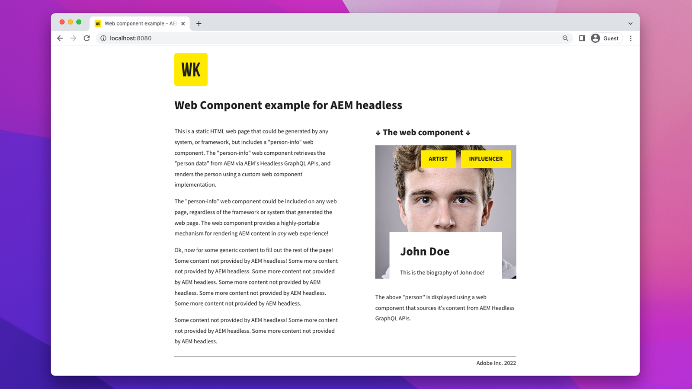

# Distribuzione di componenti web headless AEM

AEM senza testa [Componente Web](https://developer.mozilla.org/en-US/docs/Web/Web_Components)Le implementazioni /JS sono semplici app JavaScript eseguite in un browser web che utilizzano e interagiscono con i contenuti in AEM in modo headless. Le distribuzioni di componenti web/JS differiscono da [Implementazioni SPA](./spa.md) in quanto non utilizzano un solido framework di SPA, e si prevede che saranno incorporati nel contesto di qualsiasi sito web, consegnati, per far emergere contenuti da AEM.

## Configurazioni di distribuzione

La seguente configurazione di distribuzione deve essere in-place per le distribuzioni di componenti Web/JS.

| L’app Web Component/JS si connette a | Autore AEM | AEM Publish | Anteprima AEM |
|---------------------------------------------------:|:----------:|:-----------:|:-----------:|
| [Filtri del Dispatcher](./configurations/dispatcher-filters.md) | ✘ | ↓ | ↓ |
| [Condivisione delle risorse tra le origini (CORS)](./configurations/cors.md) | ↓ | ↓ | ↓ |
| [Host AEM](./configurations/aem-hosts.md) | ↓ | ↓ | ↓ |

## Esempio di componente Web

Adobe fornisce un esempio di componente Web.

    <!-- Web Component -->
    

       

           

               <figure class="image is-16by9">
                   
               </figure>
           

           

               

                   
<a href="../example-apps/web-component.md" title="Componente Web">Componente Web</a>

                   
Un componente Web di esempio, scritto in JavaScript puro, che consuma contenuti dalle API GraphQL headless AEM.

                   <a href="../example-apps/web-component.md" class="spectrum-Button spectrum-Button--outline spectrum-Button--primary spectrum-Button--sizeM">
                       Visualizza esempio
                   </a>
               

           

       

    

