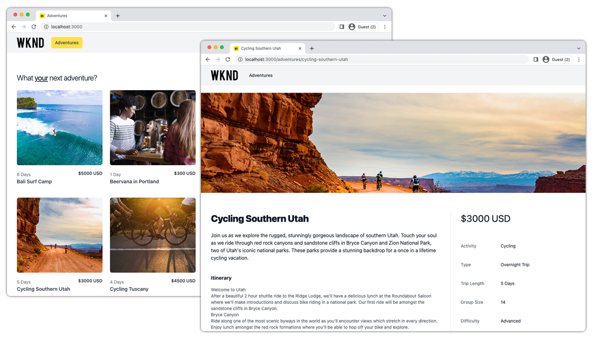

# App Next.js

Le applicazioni di esempio sono un ottimo modo per esplorare le funzionalità headless di Adobe Experience Manager (AEM). Questa applicazione Next.js illustra come eseguire query sui contenuti che utilizzano le API GraphQL dell’AEM utilizzando query persistenti. Il client AEM headless per JavaScript viene utilizzato per eseguire le query persistenti di GraphQL che alimentano l’app.



Visualizza [codice sorgente su GitHub](https://github.com/adobe/aem-guides-wknd-graphql/tree/main/next-js)

## Prerequisiti {#prerequisites}

I seguenti strumenti devono essere installati localmente:

+ [Node.js v18](https://nodejs.org/)
+ [Git](https://git-scm.com/)

## Requisiti AEM

L’app Next.js funziona con le seguenti opzioni di distribuzione AEM. Tutte le distribuzioni richiedono [WKND Shared v3.0.0+](https://github.com/adobe/aem-guides-wknd-shared/releases/latest) o [Sito WKND v3.0.0+](https://github.com/adobe/aem-guides-wknd/releases/latest) da installare nell’ambiente as a Cloud Service AEM.

Questo esempio di app Next.js è progettata per connettersi a __Pubblicazione AEM__ servizio.

### Requisiti dell’autore AEM

Il file Next.js è progettato per connettersi a __Pubblicazione AEM__ e accedere a contenuti non protetti. Next.js può essere configurato per connettersi all’istanza di authoring di AEM tramite `.env` proprietà descritte di seguito. Le immagini trasmesse da AEM Author richiedono l’autenticazione, pertanto anche l’utente che accede all’app Next.js deve essere registrato in AEM Author.

## Come usare

1. Clona il `adobe/aem-guides-wknd-graphql` archivio:

   ```shell
   $ git clone git@github.com:adobe/aem-guides-wknd-graphql.git
   ```

1. Modifica il `aem-guides-wknd-graphql/next-js/.env.local` file e set `NEXT_PUBLIC_AEM_HOST` al servizio AEM.

   ```plain
   # AEM service
   NEXT_PUBLIC_AEM_HOST=https://publish-p123-e456.adobeaemcloud.com/
   ...
   ```

   Se ci si connette al servizio di authoring AEM, è necessario fornire l’autenticazione in quanto il servizio di authoring AEM è protetto per impostazione predefinita.

   Per utilizzare un set di account AEM locale `AEM_AUTH_METHOD=basic` e fornire il nome utente e la password nella `AEM_AUTH_USER` e `AEM_AUTH_PASSWORD` proprietà.

   ```plain
   ...
   # The variables are not prefixed with NEXT_PUBLIC so they are only available server-side
   AEM_AUTH_METHOD=basic
   AEM_AUTH_USER=aem-user-account 
   AEM_AUTH_PASSWORD=password-for-the-aem-user-account
   ```

   Per utilizzare un&#39; [Token di sviluppo locale as a Cloud Service AEM](https://experienceleague.adobe.com/docs/experience-manager-cloud-service/content/implementing/developing/generating-access-tokens-for-server-side-apis.html#generating-the-access-token) set `AEM_AUTH_METHOD=dev-token` e fornisci il valore del token di sviluppo completo nella `AEM_AUTH_DEV_TOKEN` proprietà.

   ```plain
   ...
   # The variables are not prefixed with NEXT_PUBLIC so they are only available server-side
   AEM_AUTH_METHOD=dev-token
   AEM_AUTH_DEV_TOKEN=my-dev-token
   ```

1. Modifica il `aem-guides-wknd-graphql/next-js/.env.local` file e convalida  `NEXT_PUBLIC_AEM_GRAPHQL_ENDPOINT` è impostato sull’endpoint GraphQL dell’AEM appropriato.

   Quando si utilizza [WKND condiviso](https://github.com/adobe/aem-guides-wknd-shared/releases/latest) o [Sito WKND](https://github.com/adobe/aem-guides-wknd/releases/latest), utilizza `wknd-shared` Endpoint API GraphQL.

   ```plain
   ...
   NEXT_PUBLIC_AEM_GRAPHQL_ENDPOINT=wknd-shared
   ...
   ```

1. Apri un prompt dei comandi e avvia l’app Next.js utilizzando i seguenti comandi:

   ```shell
   $ cd aem-guides-wknd-graphql/next-js
   $ npm install
   $ npm run dev
   ```

1. Una nuova finestra del browser apre l’app Next.js in [http://localhost:3000](http://localhost:3000)
1. L’app Next.js mostra un elenco di avventure. Quando si seleziona un’avventura, i relativi dettagli vengono aperti in una nuova pagina.

## Il codice

Di seguito è riportato un riepilogo di come viene creata l’app Next.js, di come si connette a AEM Headless per recuperare contenuti utilizzando query persistenti di GraphQL e di come vengono presentati i dati. Il codice completo è disponibile su [GitHub](https://github.com/adobe/aem-guides-wknd-graphql/tree/main/next-js).

### Query persistenti

Seguendo le best practice di AEM Headless, l’app Next.js utilizza query persistenti di AEM GraphQL per eseguire query sui dati dell’avventura. L’app utilizza due query persistenti:

+ `wknd/adventures-all` query persistente, che restituisce tutte le avventure in AEM con un set abbreviato di proprietà. Questa query persistente guida l’elenco di avventure della visualizzazione iniziale.

```
# Retrieves a list of all Adventures
#
# Optional query variables:
# - { "offset": 10 }
# - { "limit": 5 }
# - { 
#    "imageFormat": "JPG",
#    "imageWidth": 1600,
#    "imageQuality": 90 
#   }
query ($offset: Int, $limit: Int, $sort: String, $imageFormat: AssetTransformFormat=JPG, $imageWidth: Int=1200, $imageQuality: Int=80) {
  adventureList(
    offset: $offset
    limit: $limit
    sort: $sort
    _assetTransform: {
      format: $imageFormat
      width: $imageWidth
      quality: $imageQuality
      preferWebp: true
  }) {
    items {
      _path
      slug
      title
      activity
      price
      tripLength
      primaryImage {
        ... on ImageRef {
          _path
          _dynamicUrl
        }
      }
    }
  }
}
```

+ `wknd/adventure-by-slug` query persistente, che restituisce una singola avventura di `slug` (proprietà personalizzata che identifica in modo univoco un’avventura) con un set completo di proprietà. Questa query persistente attiva le visualizzazioni dei dettagli dell’avventura.

```
# Retrieves an Adventure Fragment based on it's unique slug.
#
# Required query variables:
# - {"slug": "bali-surf-camp"}
#
# Optional query variables:
# - { 
#     "imageFormat": "JPG",
#     "imageSeoName": "my-adventure",
#     "imageWidth": 1600,
#     "imageQuality": 90 
#   }
#  
# This query returns an adventure list but since the the slug property is set to be unique in the Content Fragment Model, only a single Content Fragment is expected.

query ($slug: String!, $imageFormat:AssetTransformFormat=JPG, $imageSeoName: String, $imageWidth: Int=1200, $imageQuality: Int=80) {
  adventureList(
    filter: {slug: {_expressions: [{value: $slug}]}}
    _assetTransform: {
      format: $imageFormat
      seoName: $imageSeoName
      width: $imageWidth
      quality: $imageQuality
      preferWebp: true
  }) {
    items {
      _path
      title
      slug
      activity
      adventureType
      price
      tripLength
      groupSize
      difficulty
      price
      primaryImage {
        ... on ImageRef {
          _path
          _dynamicUrl
        }
      }
      description {
        json
        plaintext
        html
      }
      itinerary {
        json
        plaintext
        html
      }
    }
    _references {
      ... on AdventureModel {
        _path
        slug
        title
        price
        __typename
      }
    }
  }
}
```

### Esegui query persistente GraphQL

Le query persistenti dell’AEM vengono eseguite tramite HTTP GET, pertanto [Client AEM headless per JavaScript](https://github.com/adobe/aem-headless-client-js) viene utilizzato per [eseguire le query GraphQL persistenti;](https://github.com/adobe/aem-headless-client-js/blob/main/api-reference.md#aemheadlessrunpersistedquerypath-variables-options--promiseany) contro l’AEM e carica il contenuto dell’avventura nell’app.

Ogni query persistente ha una funzione corrispondente in `src/lib//aem-headless-client.js`, che chiama l’endpoint GraphQL dell’AEM e restituisce i dati dell’avventura.

Ogni funzione a sua volta richiama il `aemHeadlessClient.runPersistedQuery(...)`, esecuzione della query GraphQL persistente.

```js
// src/lib/aem-headless-client.js

...
/**
 * Invokes the 'adventures-all` persisted query using the parameterizable namespace.
 * 
 * @returns a GraphQL response of all adventures.
 */
async getAllAdventures() {
  const queryAdventuresAll = process.env.NEXT_PUBLIC_AEM_GRAPHQL_ENDPOINT + '/adventures-all';
    
  try {
    return await this.aemHeadlessClient.runPersistedQuery(queryAdventuresAll);
  } catch(e) {
    console.error(e)
  }    
}

// And so on, and so forth ... 

async getAdventureSlugs(queryVariables) { ... }

async getAdventuresBySlug(slug, queryVariables) { ... }
...
```

### Pagine

L’app Next.js utilizza due pagine per presentare i dati dell’avventura.

+ `src/pages/index.js`

  Usa [getServerSideProps() di Next.js](https://nextjs.org/docs/basic-features/data-fetching/get-server-side-props) per chiamare `getAllAdventures()` e mostra ogni avventura come una scheda.

  L&#39;uso di `getServerSiteProps()` consente il rendering lato server di questa pagina Next.js.

+ `src/pages/adventures/[...slug].js`

  A [Route dinamica Next.js](https://nextjs.org/docs/routing/dynamic-routes) mostra i dettagli di una singola avventura. Questo percorso dinamico preacquisisce i dati di ogni avventura utilizzando [getStaticProps() di Next.js](https://nextjs.org/docs/basic-features/data-fetching/get-static-props) tramite una chiamata a `getAdventureBySlug(slug, queryVariables)` utilizzando `slug` param passato tramite la selezione di avventura sul `adventures/index.js` pagina e `queryVariables` per controllare il formato, la larghezza e la qualità dell&#39;immagine.

  La route dinamica è in grado di prerecuperare i dettagli di tutte le avventure utilizzando [getStaticPaths() di Next.js](https://nextjs.org/docs/basic-features/data-fetching/get-static-paths) e popolando tutte le permutazioni di route possibili in base all’elenco completo delle avventure restituite dalla query GraphQL  `getAdventurePaths()`

  L&#39;uso di `getStaticPaths()` e `getStaticProps(..)` ha consentito la generazione di siti statici per queste pagine Next.js.

## Configurazione della distribuzione

Le app Next.js, soprattutto nel contesto del rendering lato server (SSR) e della generazione lato server (SSG), non richiedono configurazioni di sicurezza avanzate come la condivisione delle risorse tra le origini (CORS).

Tuttavia, se Next.js effettua richieste HTTP all’AEM dal contesto del client, potrebbero essere necessarie configurazioni di sicurezza nell’AEM. Rivedi [Tutorial sull’implementazione di app a pagina singola AEM headless](../deployment/spa.md) per ulteriori dettagli.
