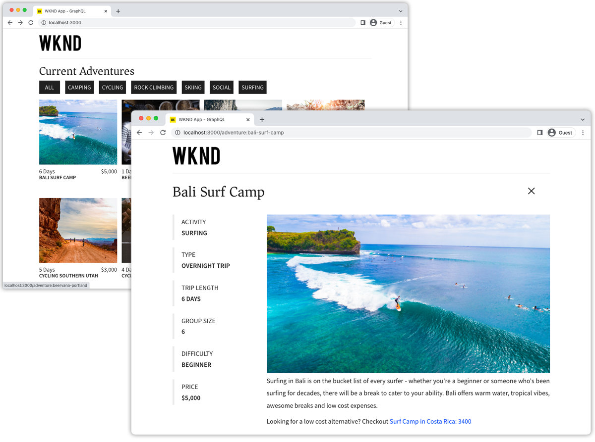

# Reagire all&#39;app{#react-app}

Le applicazioni di esempio sono un ottimo modo per esplorare le funzionalità headless di Adobe Experience Manager (AEM). Questa applicazione React illustra come eseguire query sul contenuto utilizzando AEM API GraphQL utilizzando query persistenti. Il client AEM Headless per JavaScript viene utilizzato per eseguire le query persistenti GraphQL che alimentano l&#39;app.



Visualizza la [codice sorgente su GitHub](https://github.com/adobe/aem-guides-wknd-graphql/tree/main/react-app)

A [esercitazione completa passo passo](https://experienceleague.adobe.com/docs/experience-manager-learn/getting-started-with-aem-headless/graphql/multi-step/overview.html?lang=it) descrive come è disponibile questa build dell’app React.

>[!CONTEXTUALHELP]
>id="aemcloud_sites_trial_admin_content_fragments_react_app"
>title="Personalizzare il contenuto di un’app React di esempio"
>abstract="Abbiamo impostato una moderna app React che puoi utilizzare per imparare a personalizzare i contenuti utilizzando le funzioni headless impostate."

## Prerequisiti {#prerequisites}

È necessario installare localmente i seguenti strumenti:

+ [JDK 11](https://experience.adobe.com/#/downloads/content/software-distribution/en/general.html?1_group.propertyvalues.property=.%2Fjcr%3Acontent%2Fmetadata%2Fdc%3AsoftwareType&amp;1_group.property.operation=equals&amp;1_group.property.values.0_values=software-type%3Atooling&amp;fulltext=Oracle%7E+JDK%7E+11%7E&amp;orderby=%40jcr%3Acontent%2Fjcr%3AlastModified&amp;orderby.sort=desc&amp;layout=list&amp;p.offset=0&amp;p.limit=14)
+ [Node.js v10+](https://nodejs.org/it/)
+ [npm 6+](https://www.npmjs.com/)
+ [Git](https://git-scm.com/)

## Requisiti AEM

L&#39;applicazione React funziona con le seguenti opzioni di distribuzione AEM. Tutte le implementazioni richiedono l’ [Sito WKND v2.0.0+](https://github.com/adobe/aem-guides-wknd/releases/tag/aem-guides-wknd-2.1.0) da installare.

+ [AEM as a Cloud Service](https://experienceleague.adobe.com/docs/experience-manager-cloud-service/content/implementing/deploying/overview.html?lang=it)
+ Configurazione locale tramite [l’SDK di AEM Cloud Service](https://experienceleague.adobe.com/docs/experience-manager-learn/cloud-service/local-development-environment-set-up/overview.html?lang=it)
+ [AEM 6.5 SP13+ QuickStart](https://experienceleague.adobe.com/docs/experience-manager-learn/foundation/development/set-up-a-local-aem-development-environment.html?lang=it?lang=en#install-local-aem-instances)

L&#39;applicazione React è progettata per connettersi a un __Pubblicazione AEM__ Tuttavia, se nella configurazione dell’applicazione React viene fornita l’autenticazione, può generare contenuti da AEM Author.

## Come utilizzare

1. Clona il `adobe/aem-guides-wknd-graphql` archivio:

   ```shell
   $ git clone git@github.com:adobe/aem-guides-wknd-graphql.git
   ```

1. Modifica le `aem-guides-wknd-graphql/react-app/.env.development` file e set `REACT_APP_HOST_URI` per puntare al vostro AEM di destinazione.

   Aggiorna il metodo di autenticazione se ti connetti a un&#39;istanza dell&#39;autore.

   ```plain
   # Server namespace
   REACT_APP_HOST_URI=http://localhost:4503
   
   #AUTH (Choose one method)
   # Authentication methods: 'service-token', 'dev-token', 'basic' or leave blank to use no authentication
   REACT_APP_AUTH_METHOD=basic
   
   # For Bearer auth, use DEV token (dev-token) from Cloud console
   REACT_APP_DEV_TOKEN=dev-token
   
   # For Service toke auth, provide path to service token file (download file from Cloud console)
   REACT_APP_SERVICE_TOKEN=auth/service-token.json
   
   # For Basic auth, use AEM ['user','pass'] pair (eg for Local AEM Author instance)
   REACT_APP_BASIC_AUTH_USER=admin
   REACT_APP_BASIC_AUTH_PASS=admin
   ```

1. Apri un terminale ed esegui i comandi:

   ```shell
   $ cd aem-guides-wknd-graphql/react-app
   $ npm install
   $ npm start
   ```

1. Viene caricata una nuova finestra del browser [http://localhost:3000](Http://localhost:3000)
1. Nell’applicazione deve essere visualizzato un elenco delle avventure del sito di riferimento WKND.

## Il codice

Di seguito è riportato un riepilogo di come viene creata l&#39;applicazione React, di come si connette a AEM Headless per recuperare il contenuto utilizzando le query persistenti GraphQL e di come tali dati vengono presentati. Il codice completo è disponibile all&#39;indirizzo [GitHub](https://github.com/adobe/aem-guides-wknd-graphql/tree/main/react-app).


### Query persistenti

Seguendo AEM best practice headless, l’applicazione React utilizza query persistenti AEM GraphQL per eseguire query sui dati di avventura. L&#39;applicazione utilizza due query persistenti:

+ `wknd/adventures-all` query persistente, che restituisce tutte le avventure in AEM con un set abbreviato di proprietà. Questa query persistente guida l&#39;elenco di avventura della visualizzazione iniziale.

```
# Retrieves a list of all adventures
{
    adventureList {
        items {
            _path
            slug
            title
            price
            tripLength
            primaryImage {
                ... on ImageRef {
                _path
                mimeType
                width
                height
                }
            }
        }
    }
}
```

+ `wknd/adventure-by-slug` query persistente, che restituisce una singola avventura per `slug` (proprietà personalizzata che identifica in modo univoco un’avventura) con un set completo di proprietà. Questa query persistente potenzia le visualizzazioni dei dettagli dell’avventura.

```
# Retrieves an adventure Content Fragment based on it's slug
# Example query variables: 
# {"slug": "bali-surf-camp"} 
# Technically returns an adventure list but since the the slug 
# property is set to be unique in the CF Model, only a single CF is expected

query($slug: String!) {
  adventureList(filter: {
        slug: {
          _expressions: [ { value: $slug } ]
        }
      }) {
    items {
      _path
      title
      slug
      activity
      adventureType
      price
      tripLength
      groupSize
      difficulty
      price
      primaryImage {
        ... on ImageRef {
          _path
          mimeType
          width
          height
        }
      }
      description {
        json
        plaintext
      }
      itinerary {
        json
        plaintext
      }
    }
    _references {
      ...on AdventureModel {
        _path
        slug
        title
        price
        __typename
      }
    }
  }
}
```

### Esegui query persistente GraphQL

Le query persistenti AEM vengono eseguite su HTTP GET e quindi, il [Client AEM headless per JavaScript](https://github.com/adobe/aem-headless-client-js) è utilizzato per [eseguire le query GraphQL persistenti](https://github.com/adobe/aem-headless-client-js/blob/main/api-reference.md#aemheadlessrunpersistedquerypath-variables-options--promiseany) su AEM e carica il contenuto dell’avventura nell’app.

Ogni query persistente ha un React corrispondente [useEffect](https://reactjs.org/docs/hooks-effect.html) aggancio `src/api/usePersistedQueries.js`, che richiama in modo asincrono il punto finale della query persistente AEM HTTP GET e restituisce i dati dell’avventura.

Ogni funzione a sua volta richiama il `aemHeadlessClient.runPersistedQuery(...)`, esecuzione della query GraphQL persistente.

```js
// src/api/usePersistedQueries.js

/**
 * React custom hook that returns a list of adevntures by activity. If no activity is provided, all adventures are returned.
 * 
 * Custom hook that calls the 'wknd-shared/adventures-all' or 'wknd-shared/adventures-by-activity' persisted query.
 *
 * @returns an array of Adventure JSON objects, and array of errors
 */
export function useAdventuresByActivity(adventureActivity) {
  ...
  // If an activity is provided (i.e "Camping", "Hiking"...) call wknd-shared/adventures-by-activity query
  if (adventureActivity) {
    // The key is 'activity' as defined in the persisted query
    const queryParameters = { activity: adventureActivity };

    // Call the AEM GraphQL persisted query named "wknd-shared/adventures-by-activity" with parameters
    response = await fetchPersistedQuery("wknd-shared/adventures-by-activity", queryParameters);
  } else {
    // Else call the AEM GraphQL persisted query named "wknd-shared/adventures-all" to get all adventures
    response = await fetchPersistedQuery("wknd-shared/adventures-all");
  }
  
  ... 
}

...
/**
 * Private function that invokes the AEM Headless client.
 * 
 * @param {String} persistedQueryName the fully qualified name of the persisted query
 * @param {*} queryParameters an optional JavaScript object containing query parameters
 * @returns the GraphQL data or an error message 
 */
async function fetchPersistedQuery(persistedQueryName, queryParameters) {
  let data;
  let err;

  try {
    // AEM GraphQL queries are asynchronous, either await their return or use Promise-based .then(..) { ... } syntax
    const response = await aemHeadlessClient.runPersistedQuery(
      persistedQueryName,
      queryParameters
    );
    // The GraphQL data is stored on the response's data field
    data = response?.data;
  } catch (e) {
    // An error occurred, return the error messages
    err = e
      .toJSON()
      ?.map((error) => error.message)
      ?.join(", ");
    console.error(e.toJSON());
  }

  return { data, err };
}
```

### Viste

L’applicazione React utilizza due visualizzazioni per presentare i dati dell’avventura nell’esperienza web.

+ `src/components/Adventures.js`

   Richiama `getAdventuresByActivity(..)` da `src/api/usePersistedQueries.js` e visualizza le avventure restituite in un elenco.

+ `src/components/AdventureDetail.js`

   Richiama il `getAdventureBySlug(..)` utilizzando `slug` Param passato attraverso la selezione dell&#39;avventura sul `Adventures` e visualizza i dettagli di una singola avventura.

### Variabili di ambiente

Diversi [variabili di ambiente](https://create-react-app.dev/docs/adding-custom-environment-variables) vengono utilizzati per connettersi a un ambiente AEM. L’impostazione predefinita si connette a AEM Publish in esecuzione in `http://localhost:4503`. Aggiorna `.env.development` per modificare la connessione AEM :

+ `REACT_APP_HOST_URI=http://localhost:4502`: Imposta su AEM host di destinazione
+ `REACT_APP_GRAPHQL_ENDPOINT=/content/graphql/global/endpoint.json`: Imposta il percorso dell&#39;endpoint GraphQL. Questa app React non viene utilizzata perché utilizza solo query persistenti.
+ `REACT_APP_AUTH_METHOD=`: Il metodo di autenticazione preferito. Facoltativo, per impostazione predefinita non viene utilizzata alcuna autenticazione.
   + `service-token`: Utilizzare le credenziali del servizio per ottenere un token di accesso su AEM as a Cloud Service
   + `dev-token`: Usa token di sviluppo locale per AEM as a Cloud Service
   + `basic`: Utilizzare user/pass per lo sviluppo locale con AEM Author locale
   + Lascia vuoto per connettersi a AEM senza autenticazione
+ `REACT_APP_AUTHORIZATION=admin:admin`: Imposta le credenziali di autenticazione di base da utilizzare se ti connetti a un ambiente AEM Author (solo per lo sviluppo). Se ci si connette a un ambiente di pubblicazione, questa impostazione non è necessaria.
+ `REACT_APP_DEV_TOKEN`: Stringa token di sviluppo. Per connettersi all’istanza remota, oltre all’autenticazione di base (user:pass) puoi utilizzare l’autenticazione Bearer con il token DEV dalla console Cloud
+ `REACT_APP_SERVICE_TOKEN`: Percorso del file di credenziali del servizio. Per connettersi all’istanza remota, è possibile eseguire l’autenticazione anche con il token del servizio (file di download dalla Console per sviluppatori).

### Richieste di AEM proxy

Quando si utilizza il server di sviluppo del webpack (`npm start`) il progetto si basa su un [configurazione proxy](https://create-react-app.dev/docs/proxying-api-requests-in-development/#configuring-the-proxy-manually) utilizzo `http-proxy-middleware`. Il file è configurato in [src/setupProxy.js](https://github.com/adobe/aem-guides-wknd-graphql/blob/main/react-app/src/setupProxy.js) e si basa su diverse variabili di ambiente personalizzate impostate in `.env` e `.env.development`.

Se ci si connette a un ambiente di authoring AEM, il corrispondente [è necessario configurare il metodo di autenticazione](#environment-variables).

### Condivisione delle risorse tra le origini (CORS)

Questa applicazione React si basa su una configurazione CORS basata su AEM in esecuzione nell’ambiente AEM di destinazione e presuppone che l’app React venga eseguita su `http://localhost:3000` in modalità di sviluppo. La [Configurazione CORS](https://github.com/adobe/aem-guides-wknd/blob/main/ui.config/src/main/content/jcr_root/apps/wknd/osgiconfig/config.author/com.adobe.granite.cors.impl.CORSPolicyImpl~wknd-graphql.cfg.json) fa parte del [Sito WKND](https://github.com/adobe/aem-guides-wknd).


