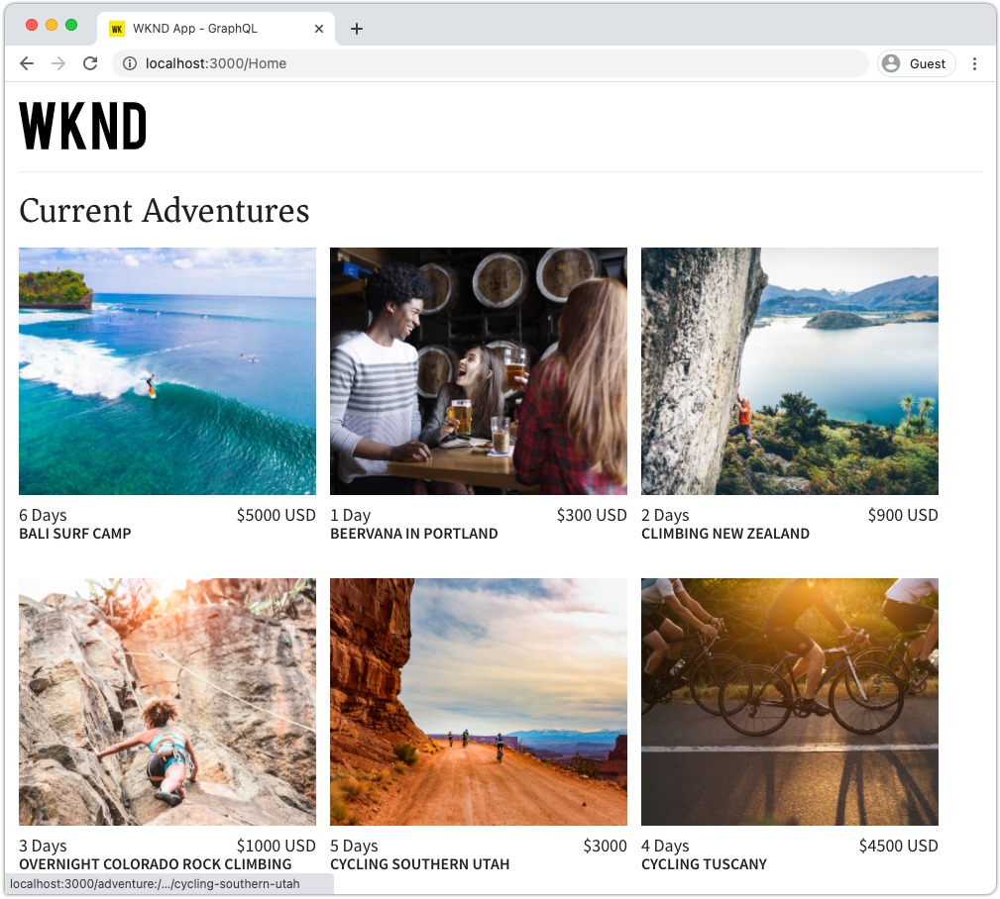
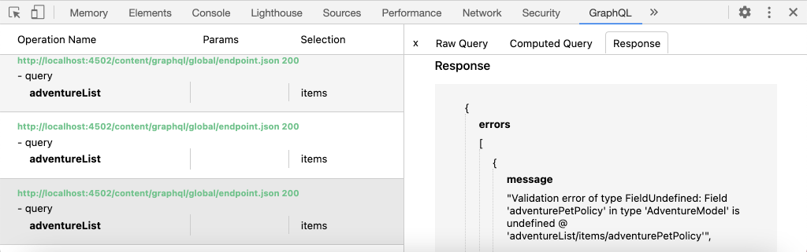

# AEM query utilizzando GraphQL da un&#39;app esterna

In questo capitolo, scopriamo come AEM GraphQL API possono essere utilizzate per guidare l&#39;esperienza in un&#39;applicazione esterna.

Questa esercitazione utilizza una semplice app React per eseguire query e visualizzare il contenuto Adventure esposto dalle API GraphQL AEM. L&#39;uso di React è in gran parte poco importante e l&#39;applicazione esterna consueta potrebbe essere scritta in qualsiasi contesto per qualsiasi piattaforma.

## Prerequisiti

Si tratta di un&#39;esercitazione con più parti e si presume che i passaggi descritti nelle parti precedenti siano stati completati.

_Le schermate IDE in questo capitolo provengono da  [Visual Studio Code](https://code.visualstudio.com/)_

Se necessario, installate un&#39;estensione del browser come [GraphQL Network](https://chrome.google.com/webstore/detail/graphql-network/igbmhmnkobkjalekgiehijefpkdemocm) per visualizzare ulteriori dettagli su una query GraphQL.

## Obiettivi

In questo capitolo impareremo come:

* Avviare e comprendere le funzionalità dell&#39;app React di esempio
* Scopri come vengono effettuate le chiamate dall’app esterna ai punti finali AEM GraphQL
* Definire una query GraphQL per filtrare un elenco di frammenti di contenuto di avventure per attività
* Aggiornate l&#39;app React per fornire i controlli per filtrare tramite GraphQL, l&#39;elenco delle avventure per attività

## Avviare l&#39;app React

Poiché questo capitolo si concentra sullo sviluppo di un client per utilizzare frammenti di contenuto su GraphQL, l&#39;esempio di codice sorgente [WKND GraphQL React dell&#39;app deve essere scaricato e configurato](./setup.md#react-app) nel computer locale, mentre l&#39;SDK [AEM è in esecuzione come servizio Author](./setup.md#aem-sdk) con il [sito WKND di esempio installato](./setup.md#wknd-site).

L&#39;avvio dell&#39;app React è descritto più dettagliatamente nel capitolo [Configurazione rapida](./setup.md), tuttavia è possibile seguire le istruzioni abbreviate:

1. Se non lo avete già fatto, clonate l&#39;app di reazione WKND GraphQL di esempio da [Github.com](https://github.com/adobe/aem-guides-wknd-graphql)

   ```shell
   $ git clone --branch tutorial/react git@github.com:adobe/aem-guides-wknd-graphql.git
   ```

1. Apri l’app WKND GraphQL React nell’IDE

   

1. Dalla riga di comando, andate alla cartella `react-app`
1. Avviate l&#39;app WKND GraphQL React eseguendo il seguente comando dalla directory principale del progetto (la cartella `react-app`)

   ```shell
   $ cd aem-guides-wknd-graphql/react-app
   $ npm start
   ```

1. Rivedete l&#39;app all&#39;indirizzo [http://localhost:3000/](Http://localhost:3000/). L&#39;app React di esempio ha due parti principali:

   * L&#39;esperienza principale funge da indice di WKND Adventures, ma è possibile eseguire query su __Adventure__ frammenti di contenuto in AEM utilizzando GraphQL. In questo capitolo, modificheremo questa vista per supportare il filtraggio delle avventure per attività.

      

   * L&#39;esperienza dei dettagli dell&#39;avventura utilizza GraphQL per eseguire una query sul frammento di contenuto __Adventure__ specifico e visualizza più punti dati.

      

1. Utilizzate gli strumenti di sviluppo del browser e un&#39;estensione del browser come [GraphQL Network](https://chrome.google.com/webstore/detail/graphql-network/igbmhmnkobkjalekgiehijefpkdemocm) per analizzare le query GraphQL inviate a AEM e le relative risposte JSON. Questo approccio può essere utilizzato per monitorare le richieste GraphQL e le risposte per assicurarsi che siano formulate correttamente, e le loro risposte sono come previsto.

   

   *Query GraphQL inviata a AEM dall&#39;app React*

   

   *Risposta JSON da AEM all’app React*

   Le query e la risposta devono corrispondere a quanto visualizzato nell&#39;IDE GraphiQL.

   >[!NOTE]
   >
   > Durante lo sviluppo, l&#39;app React è configurata per le richieste HTTP proxy tramite il server di sviluppo webpack da AEM. L&#39;app React sta effettuando richieste a `http://localhost:3000`, che vengono inviate al servizio AEM Author in esecuzione su `http://localhost:4502`. Per ulteriori informazioni, esaminare il file `src/setupProxy.js` e `env.development`.
   >
   > In scenari non di sviluppo, l&#39;app React sarebbe configurata direttamente per effettuare richieste di AEM.

## Esplora il codice GraphQL dell&#39;app

1. Nell&#39;IDE, aprire il file `src/api/useGraphQL.js`.

   Si tratta di un [Gruppo di effetti di reazione](https://reactjs.org/docs/hooks-overview.html#effect-hook) che ascolta le modifiche apportate alla `query` dell&#39;app, e una volta apportate modifiche, invia una richiesta di POST HTTP al punto finale AEM GraphQL e restituisce la risposta JSON all&#39;app.

   Ogni volta che l&#39;app React deve eseguire una query GraphQL, richiama questo gancio `useGraphQL(query)` personalizzato, passando in GraphQL per l&#39;invio a AEM.

   Questo Gancio utilizza il semplice modulo `fetch` per effettuare la richiesta HTTP POST GraphQL, ma altri moduli come [Apollo GraphQL client](https://www.apollographql.com/docs/react/) possono essere utilizzati in modo simile.

1. Aprire `src/components/Adventures.js` nell&#39;IDE, responsabile dell&#39;elenco delle avventure della vista principale, e rivedere l&#39;invocazione del gancio `useGraphQL`.

   Questo codice imposta il valore predefinito `query` come `allAdventuresQuery` definito nella parte inferiore del file.

   ```javascript
   const [query, setQuery] = useState(allAdventuresQuery);
   ```

   ... e ogni volta che la variabile `query` cambia, viene richiamato l&#39;amo `useGraphQL`, che a sua volta esegue la query GraphQL rispetto a AEM, restituendo l&#39;JSON alla variabile `data`, che viene quindi utilizzata per rappresentare l&#39;elenco delle avventure.

   ```javascript
   const { data, errorMessage } = useGraphQL(query);
   ```

   La `allAdventuresQuery` è una query GraphQL costante definita nel file, che esegue una query su tutti i frammenti di contenuto di avventura, senza filtri, e restituisce solo i punti dati necessari per eseguire il rendering della vista principale.

   ```javascript
   const allAdventuresQuery = `
   {
       adventureList {
         items {
           _path
           adventureTitle
           adventurePrice
           adventureTripLength
           adventurePrimaryImage {
           ... on ImageRef {
               _path
               mimeType
               width
               height
             }
           }
         }
     }
   }
   `;
   ```

1. Aprite `src/components/AdventureDetail.js`, il componente React responsabile della visualizzazione dell&#39;esperienza dei dettagli dell&#39;avventura. Questa visualizzazione richiede un frammento di contenuto specifico, utilizzando il percorso JCR come ID univoco e riproduce i dettagli forniti.

   Analogamente a `Adventures.js`, il `useGraphQL` React Hook personalizzato viene riutilizzato per eseguire la query GraphQL rispetto a AEM.

   Il percorso del frammento di contenuto viene raccolto dalla parte superiore del componente `props` per specificare il frammento di contenuto per il quale eseguire la query.

   ```javascript
   const contentFragmentPath = props.location.pathname.substring(props.match.url.length);
   ```

   ... e la query con parametri GraphQL viene costruita utilizzando la funzione `adventureDetailQuery(..)` e passata a `useGraphQL(query)` che esegue la query GraphQL rispetto a AEM e restituisce i risultati alla variabile `data`.

   ```javascript
   const { data, errorMessage } = useGraphQL(adventureDetailQuery(contentFragmentPath));
   ```

   La funzione `adventureDetailQuery(..)` racchiude semplicemente una query GraphQL di filtro, che utilizza AEM sintassi `<modelName>ByPath` per eseguire una query su un singolo frammento di contenuto identificato dal percorso JCR, e restituisce tutti i punti dati specificati necessari per rappresentare i dettagli dell&#39;avventura.

   ```javascript
   function adventureDetailQuery(_path) {
   return `{
       adventureByPath (_path: "${_path}") {
         item {
           _path
           adventureTitle
           adventureActivity
           adventureType
           adventurePrice
           adventureTripLength
           adventureGroupSize
           adventureDifficulty
           adventurePrice
           adventurePrimaryImage {
               ... on ImageRef {
               _path
               mimeType
               width
               height
               }
           }
           adventureDescription {
               html
           }
           adventureItinerary {
               html
           }
         }
       }
   }
   `;
   }
   ```

## Creare una query GraphQL con parametri

Quindi, modificate l&#39;app React per eseguire query GraphQL con parametri che filtrano la visualizzazione iniziale in base all&#39;attività delle avventure.

1. Nell’IDE, apri il file: `src/components/Adventures.js`. Questo file rappresenta il componente &quot;Avventure&quot; dell&#39;esperienza principale, che richiede e visualizza le schede &quot;Avventures&quot;.
1.  Inspect la funzione `filterQuery(activity)`, che non è utilizzata, ma è stata preparata per formulare una query GraphQL che filtra le avventure di `activity`.

   Notate che il parametro `activity` viene inserito nella query GraphQL come parte di un campo `filter` nel campo `adventureActivity`, per cui il valore di quel campo deve corrispondere al valore del parametro.

   ```javascript
   function filterQuery(activity) {
       return `
           {
           adventures (filter: {
               adventureActivity: {
               _expressions: [
                   {
                   value: "${activity}"
                   }
                 ]
               }
           }){
               items {
               _path
               adventureTitle
               adventurePrice
               adventureTripLength
               adventurePrimaryImage {
               ... on ImageRef {
                   _path
                   mimeType
                   width
                   height
               }
               }
             }
         }
       }
       `;
   }
   ```

1. Aggiornare l&#39;istruzione `return` del componente React Adventures per aggiungere pulsanti che richiamano il nuovo `filterQuery(activity)` con parametri per fornire le avventure da elencare.

   ```javascript
   function Adventures() {
       ...
       return (
           <div className="adventures">
   
           {/* Add these three new buttons that set the GraphQL query accordingly */}
   
           {/* The first button uses the default `allAdventuresQuery` */}
           <button onClick={() => setQuery(allAdventuresQuery)}>All</button>
   
           {/* The 2nd and 3rd button use the `filterQuery(..)` to filter by activity */}
           <button onClick={() => setQuery(filterQuery('Camping'))}>Camping</button>
           <button onClick={() => setQuery(filterQuery('Surfing'))}>Surfing</button>
   
           <ul className="adventure-items">
           ...
       )
   }
   ```

1. Salvate le modifiche e ricaricate l&#39;app React nel browser Web. I tre nuovi pulsanti vengono visualizzati nella parte superiore e facendo clic su di essi si ricollega automaticamente AEM per i frammenti di contenuto di avventura con l&#39;attività corrispondente.

   

1. Provate ad aggiungere altri pulsanti di filtro per le attività: `Rock Climbing`, `Cycling` e `Skiing`

## Gestire gli errori GraphQL

GraphQL è fortemente tipizzato e pertanto può restituire utili messaggi di errore se la query non è valida. Quindi, simuliamo una query non corretta per visualizzare il messaggio di errore restituito.

1. Aprire nuovamente il file `src/api/useGraphQL.js`.  Inspect il frammento di codice seguente per visualizzare la gestione degli errori:

   ```javascript
   //useGraphQL.js
   .then(({data, errors}) => {
           //If there are errors in the response set the error message
           if(errors) {
               setErrors(mapErrors(errors));
           }
           //Otherwise if data in the response set the data as the results
           if(data) {
               setData(data);
           }
       })
       .catch((error) => {
           setErrors(error);
       });
   ```

   La risposta viene esaminata per verificare se include un oggetto `errors`. L&#39;oggetto `errors` verrà inviato da AEM in caso di problemi con la query GraphQL, ad esempio un campo non definito basato sullo schema. Se non è presente un oggetto `errors`, `data` viene impostato e restituito.

   La `window.fetch` include un&#39;istruzione `.catch` a *catch* qualsiasi errore comune come una richiesta HTTP non valida o se non è possibile effettuare la connessione al server.

1. Aprire il file `src/components/Adventures.js`.
1. Modificare la `allAdventuresQuery` per includere una proprietà non valida `adventurePetPolicy`:

   ```javascript
   /**
    * Query for all Adventures
    * adventurePetPolicy has been added beneath items
   */
   const allAdventuresQuery = `
   {
       adventureList {
         items {
           adventurePetPolicy
           _path
           adventureTitle
           adventurePrice
           adventureTripLength
           adventurePrimaryImage {
           ... on ImageRef {
               _path
               mimeType
               width
               height
           }
           }
         }
       }
   }
   `;
   ```

   Sappiamo che `adventurePetPolicy` non fa parte del modello di avventura, quindi questo dovrebbe causare un errore.

1. Salvate le modifiche e tornate al browser. Dovresti visualizzare un messaggio di errore simile al seguente:

   

   L&#39;API GraphQL rileva che `adventurePetPolicy` non è definito in `AdventureModel` e restituisce un messaggio di errore appropriato.

1.  Inspect la risposta da AEM utilizzando gli strumenti di sviluppo del browser per visualizzare l&#39;oggetto JSON `errors`:

   

   L&#39;oggetto `errors` è dettagliato e include informazioni sulla posizione della query e sulla classificazione dell&#39;errore in formato non valido.

1. Tornate a `Adventures.js` e ripristinate la modifica della query, per ripristinare lo stato corretto dell&#39;app.

## Congratulazioni!{#congratulations}

Congratulazioni! Hai esplorato con successo il codice dell&#39;app WKND GraphQL React di esempio e l&#39;hai aggiornato con parametri, filtrando le query GraphQL per elencare le avventure per attività! È inoltre possibile esaminare alcuni metodi di base per la gestione degli errori.

## Passaggi successivi {#next-steps}

Nel capitolo successivo, [Modellazione dati avanzata con i riferimenti ai frammenti](./fragment-references.md) verrà illustrato come utilizzare la funzione Riferimento frammenti per creare una relazione tra due diversi frammenti di contenuto. Verrà inoltre illustrato come modificare una query GraphQL per includere un campo da un modello di riferimento.
