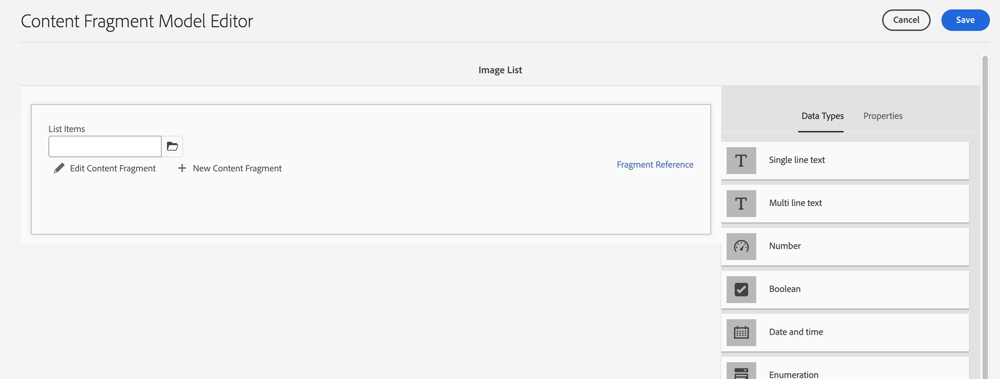

# Modellazione dei contenuti

Ti diamo il benvenuto nel capitolo del tutorial su Frammenti di contenuto ed endpoint GraphQL in Adobe Experience Manager (AEM). Scopriremo come sfruttare i frammenti di contenuto, creare modelli di frammenti e utilizzare gli endpoint di GraphQL nell’AEM.

I frammenti di contenuto offrono un approccio strutturato alla gestione dei contenuti attraverso i canali, garantendo flessibilità e riutilizzabilità. L’abilitazione dei frammenti di contenuto nell’AEM consente la creazione di contenuti modulari, migliorando la coerenza e l’adattabilità.

Innanzitutto, ti guideremo attraverso l’abilitazione dei frammenti di contenuto in AEM, coprendo le configurazioni e le impostazioni necessarie per un’integrazione fluida.

Vengono quindi descritti la creazione di modelli per frammenti, che definiscono struttura e attributi. Scopri come progettare modelli allineati ai requisiti di contenuto e gestirli in modo efficace.

Quindi, verrà fornita una dimostrazione della creazione di frammenti di contenuto dai modelli, con istruzioni dettagliate sull’authoring e la pubblicazione.

Inoltre, esploreremo la definizione degli endpoint AEM-GraphQL. GraphQL recupera in modo efficiente i dati dall’AEM e configurerà gli endpoint per esporre i dati desiderati. Le query persistenti ottimizzano le prestazioni e la memorizzazione in cache.

Nel corso dell’esercitazione forniremo spiegazioni, esempi di codice e suggerimenti pratici. Entro la fine, avrai le competenze necessarie per abilitare Frammenti di contenuto, creare Modelli di frammenti, generare Frammenti e definire endpoint GraphQL AEM e query persistenti. Iniziamo!

## Configurazione in base al contesto

1. Accedi a __Strumenti > Browser configurazioni__ per creare una configurazione per l’esperienza headless.

   

   Fornisci un __titolo__ e __nome__, e verifica __Query persistenti GraphQL__ e __Modelli per frammenti di contenuto__.


## Modelli per frammenti di contenuto

1. Accedi a __Strumenti > Modelli per frammenti di contenuto__ e seleziona la cartella con il nome della configurazione creata al passaggio 1.

   

1. Nella cartella, seleziona __Crea__ e assegna un nome al modello __Teaser__. Aggiungi i seguenti tipi di dati a __Teaser__ modello.

   | Tipo di dati | Nome | Obbligatorio | Opzioni |
   |----------|------|----------|---------|
   | Riferimento contenuto | Risorsa | sì | Se lo desideri, aggiungi un’immagine predefinita. Esempio: /content/dam/wknd-headless/assets/AdobeStock_307513975.mp4 |
   | Testo su riga singola | Titolo | sì |
   | Testo su riga singola | Pre-titolo | no |
   | Testo su più righe | Descrizione | no | Assicurati che il tipo predefinito sia RTF |
   | Enumerazione | Stile | sì | Menu a discesa Rendering come. Le opzioni sono Eroe -> protagonista e In primo piano -> in primo piano |

   

1. All’interno della cartella, crea un secondo modello denominato __Offerta__. Fai clic su Crea e assegna al modello il nome &quot;Offerta&quot; e aggiungi i seguenti tipi di dati:

   | Tipo di dati | Nome | Obbligatorio | Opzioni |
   |----------|------|----------|---------|
   | Riferimento contenuto | Risorsa | sì | Aggiungi immagine predefinita. Esempio: `/content/dam/wknd-headless/assets/AdobeStock_238607111.jpeg` |
   | Testo su più righe | Descrizione | no |  |
   | Testo su più righe | Articolo | no |  |

   

1. All’interno della cartella, crea un terzo modello denominato __Elenco immagini__. Fai clic su Crea e assegna al modello il nome &quot;Elenco immagini&quot; e aggiungi i seguenti tipi di dati:

   | Tipo di dati | Nome | Obbligatorio | Opzioni |
   |----------|------|----------|---------|
   | Riferimento frammento | Elementi di elenco | sì | Esegui rendering come campo multiplo. Il modello per frammenti di contenuto consentito è Offerta. |

   

## Frammenti di contenuto

1. Passa ora ad Assets e crea una cartella per il nuovo sito. Fai clic su Crea e assegna un nome alla cartella.

   

1. Dopo aver creato la cartella, selezionala e apri i relativi __Proprietà__.
1. Nel file __Configurazioni cloud__ , seleziona la configurazione [creato in precedenza](#enable-content-fragments-and-graphql).

   

   Fai clic su nella nuova cartella e crea un teaser. Clic __Crea__ e __Frammento di contenuto__ e seleziona la __Teaser__ modello. Denomina il modello __Eroe__ e fai clic su __Crea__.

   | Nome | Note |
   |----------|------|
   | Risorsa | Lascia come valore predefinito o scegli un’altra risorsa (video o immagine) |
   | Titolo | `Explore. Discover. Live.` |
   | Pre-titolo | `Join use for your next adventure.` |
   | Descrizione | Lascia vuoto |
   | Stile | `Hero` |

   

## Endpoint GraphQL

1. Accedi a __Strumenti > GraphQL__

   

1. Clic __Crea__ e assegna un nome al nuovo endpoint e scegli la configurazione appena creata.

   

## Query persistenti GraphQL

1. Testiamo il nuovo endpoint. Accedi a __Strumenti > Editor query di GraphQL__ e scegli il nostro endpoint per il menu a discesa in alto a destra nella finestra.

1. Nell’editor delle query, crea alcune query diverse.


   ```graphql
   {
       teaserList {
           items {
           title
           }
       }
   }
   ```

   Dovresti ottenere un elenco contenente il singolo frammento creato [sopra](#create-content).

   Per questo esercizio, crea una query completa utilizzata dall’app AEM headless. Crea una query che restituisce un singolo teaser per percorso. Nell’editor delle query, immetti la seguente query:

   ```graphql
   query TeaserByPath($path: String!) {
   component: teaserByPath(_path: $path) {
       item {
       __typename
       _path
       _metadata {
           stringMetadata {
           name
           value
           }
       }
       title
       preTitle
       style
       asset {
           ... on MultimediaRef {
           __typename
           _authorUrl
           _publishUrl
           format
           }
           ... on ImageRef {
           __typename
           _authorUrl
           _publishUrl
           mimeType
           width
           height
           }
       }
       description {
           html
           plaintext
       }
       }
   }
   }
   ```

   In __variabili di query__ in basso, immettere:

   ```json
   {
       "path": "/content/dam/pure-headless/hero"
   }
   ```

   >[!NOTE]
   >
   > Potrebbe essere necessario modificare la variabile di query `path` in base ai nomi di cartelle e frammenti.


   Esegui la query per ricevere i risultati del frammento di contenuto creato in precedenza.

1. Clic __Salva__  per rendere persistente (salvare) la query e denominarla __teaser__. Questo consente di fare riferimento alla query per nome nell’applicazione.

## Passaggi successivi

Congratulazioni. Hai configurato correttamente AEM as a Cloud Service per consentire la creazione di frammenti di contenuto ed endpoint GraphQL. Hai anche creato un modello per frammenti di contenuto e un frammento di contenuto, definito un endpoint GraphQL e una query persistente. Ora puoi passare al prossimo capitolo dell’esercitazione, dove scoprirai come creare un’applicazione AEM Headless React che utilizza i frammenti di contenuto e l’endpoint GraphQL creati in questo capitolo.

[Prossimo capitolo: API headless AEM e React](./2-aem-headless-apis-and-react.md)