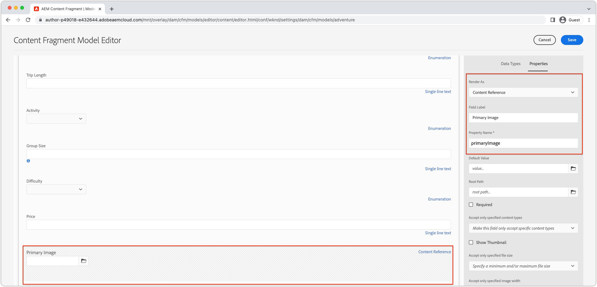

# Immagini con AEM headless {#images-with-aem-headless}

Le immagini sono un aspetto fondamentale [sviluppo di esperienze ricche e coinvolgenti AEM senza testa](https://experienceleague.adobe.com/docs/experience-manager-learn/getting-started-with-aem-headless/graphql/multi-step/overview.html?lang=it). AEM Headless supporta la gestione delle risorse di immagini e la loro distribuzione ottimizzata.

I frammenti di contenuto utilizzati nella modellazione AEM contenuto headless fanno spesso riferimento a risorse di immagini destinate alla visualizzazione nell’esperienza headless. AEM le query GraphQL possono essere scritte per fornire URL alle immagini in base a dove si fa riferimento all&#39;immagine.

La `ImageRef` Il tipo dispone di tre opzioni URL per i riferimenti di contenuto:

+ `_path` è il percorso a cui si fa riferimento in AEM e non include un&#39;origine AEM (nome host)
+ `_authorUrl` è l’URL completo della risorsa immagine su AEM Author
   + [AEM Author](https://experienceleague.adobe.com/docs/experience-manager-learn/cloud-service/underlying-technology/introduction-author-publish.html) può essere utilizzato per fornire un&#39;esperienza di anteprima dell&#39;applicazione headless.
+ `_publishUrl` è l’URL completo della risorsa immagine su AEM Publish
   + [Pubblicazione AEM](https://experienceleague.adobe.com/docs/experience-manager-learn/cloud-service/underlying-technology/introduction-author-publish.html) è in genere il luogo in cui l&#39;implementazione di produzione dell&#39;applicazione headless visualizza le immagini da.

I campi vengono utilizzati al meglio in base ai seguenti criteri:

| Campi ImageRef | App web client servita da AEM | Query app client AEM Author | Query app client AEM Publish |
|--------------------|:------------------------------:|:-----------------------------:|:------------------------------:|
| `_path` | ↓ | ● (L&#39;app deve specificare l&#39;host nell&#39;URL) | ● (L&#39;app deve specificare l&#39;host nell&#39;URL) |
| `_authorUrl` | ✘ | ✔ | ✘ |
| `_publishUrl` | ✘ | ✘ | ✔ |

Utilizzo di `_authorUrl` e `_publishUrl` devono essere allineati con l&#39;endpoint GraphQL AEM utilizzato per la sorgente della risposta GraphQL.

>[!CONTEXTUALHELP]
>id="aemcloud_learn_headless_graphql_images"
>title="Immagini con AEM headless"
>abstract="Scopri come AEM Headless supporta la gestione delle risorse di immagini e la loro distribuzione ottimizzata."

## Modello per frammenti di contenuto

Assicurati che il campo Frammento di contenuto contenente il riferimento all’immagine sia del __riferimento contenuto__ tipo di dati.

I tipi di campo vengono esaminati nella sezione [Modello per frammento di contenuto](https://experienceleague.adobe.com/docs/experience-manager-cloud-service/content/assets/content-fragments/content-fragments-models.html), selezionando il campo e controllando il __Proprietà__ a destra.



## Query persistente GraphQL

Nella query GraphQL, restituisce il campo come `ImageRef` digitare e richiedere i campi appropriati `_path`, `_authorUrl`oppure `_publishUrl` richiesto dalla tua applicazione. Ad esempio, la query di un&#39;avventura nel [Progetto sito WKND](https://github.com/adobe/aem-guides-wknd) e l’URL dell’immagine per i riferimenti alla risorsa immagine nel relativo `primaryImage` può essere eseguito con una nuova query persistente `wknd-shared/adventure-image-by-path` definito come:

```graphql
query ($path: String!) {
  adventureByPath(_path: $path) {
    item {
      title,
      primaryImage {
        ... on ImageRef {
          _path
          _authorUrl
          _publishUrl
        }
      }
    }
  }
}
```

La `$path` nella variabile `_path` Il filtro richiede il percorso completo del frammento di contenuto (ad esempio `/content/dam/wknd-shared/en/adventures/bali-surf-camp/bali-surf-camp`).

## Risposta GraphQL

La risposta JSON risultante contiene i campi richiesti contenenti gli URL delle risorse immagine.

```json
{
  "data": {
    "adventureByPath": {
      "item": {
        "adventurePrimaryImage": {
          "_path": "/content/dam/wknd-shared/en/adventures/bali-surf-camp/adobestock-175749320.jpg",
          "_authorUrl": "https://author-p123-e456.adobeaemcloud.com/content/dam/wknd-shared/en/adventures/bali-surf-camp/adobestock-175749320.jpg",
          "_publishUrl": "https://publish-p123-e789.adobeaemcloud.com/content/dam/wknd-shared/en/adventures/bali-surf-camp/adobestock-175749320.jpg"
        }
      }
    }
  }
}
```

Per caricare l&#39;immagine di riferimento nell&#39;applicazione, utilizza il campo appropriato, `_path`, `_authorUrl`oppure `_publishUrl` del `adventurePrimaryImage` come URL sorgente dell’immagine.

I domini `_authorUrl` e `_publishUrl` sono automaticamente definiti da AEM as a Cloud Service utilizzando [Esternalizzatore](https://experienceleague.adobe.com/docs/experience-manager-cloud-service/content/implementing/developer-tools/externalizer.html).

In React, la visualizzazione dell&#39;immagine da AEM Publish ha l&#39;aspetto seguente:

```html

```

## Rendering delle immagini

Le risorse immagine supportano la personalizzazione [rendering](../../../assets/authoring/renditions.md), che sono rappresentazioni alternative della risorsa originale. Le rappresentazioni personalizzate possono essere utili per ottimizzare un’esperienza headless. Invece di richiedere la risorsa immagine originale, che è spesso un file ad alta risoluzione di grandi dimensioni, le rappresentazioni ottimizzate possono essere richieste dall&#39;applicazione headless.

### Creare rappresentazioni

Gli amministratori di AEM Assets definiscono le rappresentazioni personalizzate utilizzando Profili di elaborazione. I Profili di elaborazione possono quindi essere applicati a cartelle o risorse specifiche direttamente per generare le rappresentazioni per tali risorse.

#### Profili di elaborazione

Le specifiche dei rendering delle risorse sono definite in [Profili di elaborazione](../../../assets/configuring/processing-profiles.md) da parte degli amministratori di AEM Assets.

Crea o aggiorna un profilo di elaborazione e aggiungi definizioni di rendering per le dimensioni dell&#39;immagine richieste dall&#39;applicazione headless. Le rappresentazioni possono essere denominate con qualsiasi nome, ma devono essere denominate in modo semantico.


In questo esempio vengono create tre rappresentazioni:

| Nome della rappresentazione | Estensione | Larghezza max |
|-----------------------|:---------:|----------:|
| grande ottimizzato per il web | Web | 1200 px |
| media ottimizzata per il web | Web | 900 px |
| web-ottimizzato-small | Web | 600 px |

Gli attributi indicati nella tabella precedente sono importanti:

+ __Nome della rappresentazione__ viene utilizzato per richiedere il rendering.
+ __Estensione__ è l&#39;estensione utilizzata per richiedere il __nome del rendering__. Preferisci `webp` rappresentazioni in quanto sono ottimizzate per la distribuzione web.
+ __Larghezza max__ viene utilizzato per informare lo sviluppatore quale rendering deve essere utilizzato in base al suo utilizzo nell&#39;applicazione headless.

Le definizioni di rendering dipendono dalle esigenze dell’applicazione headless, quindi assicurati di definire il set di rendering ottimale per il tuo caso d’uso e sono denominate semanticamente per quanto riguarda il modo in cui vengono utilizzate.

#### Rielaborazione delle risorse{#reprocess-assets}

Con il profilo di elaborazione creato (o aggiornato), rielabora le risorse per generare le nuove rappresentazioni definite nel profilo di elaborazione. Le nuove rappresentazioni non esistono finché le risorse non vengono elaborate con il profilo di elaborazione.

+ Preferibilmente, [ha assegnato il profilo di elaborazione a una cartella](../../../assets/configuring//processing-profiles.md) quindi, tutte le nuove risorse caricate in tale cartella generano automaticamente le rappresentazioni. Le risorse esistenti devono essere rielaborate utilizzando l’approccio ad hoc seguente.

+ Oppure, ad hoc, selezionando una cartella o una risorsa, selezionando __Rielaborazione delle risorse__ e selezionando il nuovo nome del profilo di elaborazione.

   

#### Revisione delle rappresentazioni

Le rappresentazioni possono essere convalidate da [apertura della visualizzazione rendering di una risorsa](../../../assets/authoring/renditions.md)e selezionando le nuove rappresentazioni da visualizzare in anteprima nella barra delle rappresentazioni. Se mancano le rappresentazioni, [assicurati che le risorse siano elaborate utilizzando il profilo di elaborazione](#reprocess-assets).


#### Pubblicare le risorse

Assicurati che le risorse con le nuove rappresentazioni siano [(ri)pubblicato](../../../assets/sharing/publish.md) le nuove rappresentazioni sono quindi accessibili su AEM Publish.

### Accedere alle rappresentazioni

Le rappresentazioni sono accessibili direttamente aggiungendo la __nomi di rendering__ e __estensioni di rendering__ definito nel profilo di elaborazione per l’URL della risorsa.

| URL della risorsa | Sottopercorso delle rappresentazioni | Nome della rappresentazione | Estensione rendering |  | URL di rendering |
|-----------|:------------------:|:--------------:|--------------------:|:--:|---|
| https://publish-p123-e789.adobeaemcloud.com/content/dam/example.jpeg | /_jcr_content/renditions/ | grande ottimizzato per il web | .webp | → | https://publish-p123-e789.adobeaemcloud.com/content/dam/example.jpeg/_jcr_content/renditions/web-optimized-large.webp |
| https://publish-p123-e789.adobeaemcloud.com/content/dam/example.jpeg | /_jcr_content/renditions/ | media ottimizzata per il web | .webp | → | https://publish-p123-e789.adobeaemcloud.com/content/dam/example.jpeg/_jcr_content/renditions/web-optimized-medium.webp |
| https://publish-p123-e789.adobeaemcloud.com/content/dam/example.jpeg | /_jcr_content/renditions/ | web-ottimizzato-small | .webp | → | https://publish-p123-e789.adobeaemcloud.com/content/dam/example.jpeg/_jcr_content/renditions/web-optimized-small.webp |

{style=&quot;table-layout:auto&quot;}

### Query GraphQL{#renditions-graphl-query}

AEM GraphQL richiede una sintassi aggiuntiva per richiedere il rendering delle immagini. Invece [le immagini vengono interrogate](#images-graphql-query) nel modo consueto, e il rendering desiderato viene specificato nel codice. È importante [assicurati che le risorse immagini utilizzate dall&#39;applicazione headless abbiano le stesse rappresentazioni denominate](#reprocess-assets).

### React example

Creiamo una semplice applicazione React che visualizza tre rappresentazioni di una singola risorsa immagine ottimizzate per il web, di dimensioni ridotte per il web, per il mezzo ottimizzato per il web e per la grande per il web.


#### Componente Crea immagine{#react-example-image-component}

Crea un componente React che esegue il rendering delle immagini. Questo componente accetta quattro proprietà:

+ `assetUrl`: L’URL della risorsa immagine fornito tramite la risposta della query GraphQL.
+ `renditionName`: Nome del rendering da caricare.
+ `renditionExtension`: Estensione del rendering da caricare.
+ `alt`: Testo alt per l’immagine; l&#39;accessibilità è importante!

Questo componente costruisce il [URL di rendering utilizzando il formato descritto in __Accedere alle rappresentazioni__](#access-renditions). Un `onError` viene impostato per visualizzare la risorsa originale nel caso in cui il rendering non sia presente.

In questo esempio viene utilizzato l’url della risorsa originale come fallback in `onError` handler, in questo evento, manca un rendering.

```javascript
// src/Image.js

export default function Image({ assetUrl, renditionName, renditionExtension, alt }) {
  // Construct the rendition Url in the format:
  //   <ASSET URL>/_jcr_content/renditions<RENDITION NAME>.<RENDITION EXTENSION>
  const renditionUrl = `${assetUrl}/_jcr_content/renditions/${renditionName}.${renditionExtension}`;

  // Load the original image asset in the event the named rendition is missing
  const handleOnError = (e) => { e.target.src = assetUrl; }

  return (
    <>
      
    </>
  );
}
```

#### Definisci la `App.js`{#app-js}

Questo semplice `App.js` le query AEM per un&#39;immagine Avventura e quindi visualizzano le tre rappresentazioni dell&#39;immagine: web-ottimizzato-small, web-optimized-medium e web-optimized-large.

L&#39;operazione di Query rispetto a AEM viene eseguita nel gancio React personalizzato [useAdventureByPath che utilizza l&#39;SDK AEM Headless](./aem-headless-sdk.md#graphql-persisted-queries).

I risultati della query e i parametri di rendering specifici vengono passati al [Componente React immagine](#react-example-image-component).

```javascript
// src/App.js

import "./App.css";
import { useAdventureByPath } from './api/persistedQueries'
import Image from "./Image";

function App() {

  // Get data from AEM using GraphQL persisted query as defined above 
  // The details of defining a React useEffect hook are explored in How to > AEM Headless SDK
  let { data, error } = useAdventureByPath("/content/dam/wknd-shared/en/adventures/bali-surf-camp/bali-surf-camp");

  // Wait for GraphQL to provide data
  if (!data) { return <></> }

  return (
    <div className="app">
      
      <h2>Small rendition</h2>
      {/* Render the web-optimized-small rendition for the Adventure Primary Image */}
      <Image
        assetUrl={data.adventureByPath.item.primaryImage._publishUrl}
        renditionName="web-optimized-small"
        renditionExtension="webp"
        alt={data.adventureByPath.item.title}
      />

      <hr />

      <h2>Medium rendition</h2>
      {/* Render the web-optimized-medium rendition for the Adventure Primary Image */}
      <Image
        assetUrl={data.adventureByPath.item.primaryImage._publishUrl}
        renditionName="web-optimized-medium"
        renditionExtension="webp"
        alt={data.adventureByPath.item.title}
      />

      <hr />

      <h2>Large rendition</h2>
      {/* Render the web-optimized-large rendition for the Adventure Primary Image */}
      <Image
        assetUrl={data.adventureByPath.item.primaryImage._publishUrl}
        renditionName="web-optimized-large"
        renditionExtension="webp"
        alt={data.adventureByPath.item.title}
      />
    </div>
  );
}

export default App;
```
