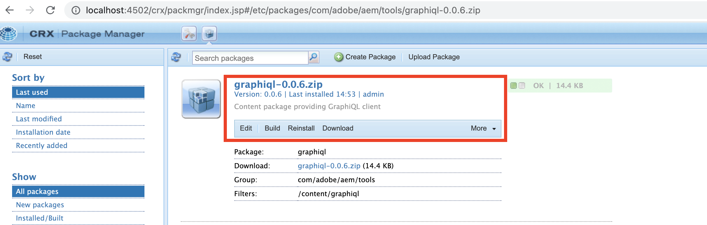
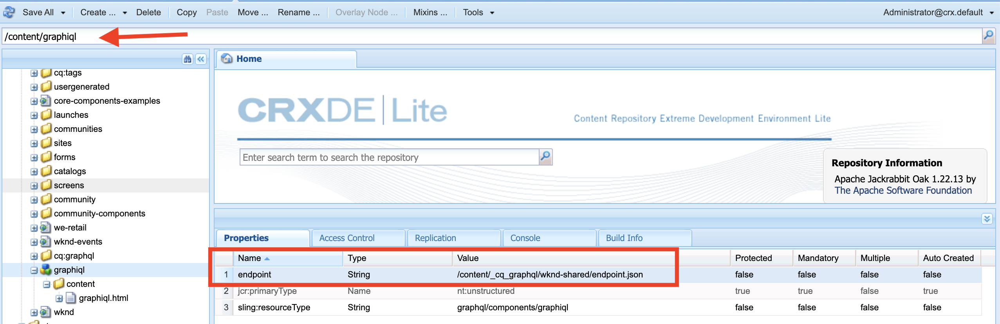
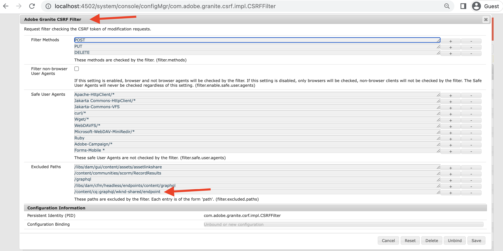

# Installa GraphiQL IDE su AEM 6.5.X

Nella AEM 6.5 lo strumento IDE GraphiQL deve essere installato manualmente, segui i passaggi seguenti per l&#39;installazione e le configurazioni.

1. Vai a **[Portale di distribuzione software](https://experience.adobe.com/#/downloads/content/software-distribution/it/aemcloud.html)** > **AEM as a Cloud Service**.
1. Cerca “GraphiQL” (assicurati di includere **i** in **GraphiQL**.
1. Scarica la versione più recente del **pacchetto di contenuti GraphiQL v.x.x.x**

   

   Il file zip è un pacchetto AEM che può essere installato direttamente.

1. Dal menu Start AEM, passa a **Strumenti** > **Distribuzione** > **Pacchetti**.
1. Fai clic su **Carica pacchetto**, quindi seleziona il pacchetto scaricato nel passaggio precedente. Per installare il pacchetto, fai clic su **Installa**.

   

1. Passa a **CRXDE Lite** > **Pannello Repository** > seleziona `/content/graphiql` node (ad esempio, <http://localhost:4502/crx/de/index.jsp#/content/graphiql>).
1. In **Proprietà** valore di modifica della scheda di `endpoint` proprietà di `/content/_cq_graphql/wknd-shared/endpoint.json`.
   

1. Passa a **Configurazione della console Web** Interfaccia utente > Ricerca **Filtro CSRF** configurazione (ad esempio,<http://localhost:4502/system/console/configMgr/com.adobe.granite.csrf.impl.CSRFFilter)>
1. In `Excluded Paths` aggiornamento del campo del nome della proprietà, percorso dell&#39;endpoint GraphQL WKND a `/content/cq:graphql/wknd-shared/endpoint`.
   

1. Accedi all’editor GraphiQL utilizzando `//HOST:PORT/content/graphiql.html`e verifica di poter creare una nuova query o di eseguire una query esistente. (ad es. <http://localhost:4502/content/graphiql.html>)

>[!TIP]
>
>Per supportare lo schema GraphQL specifico del progetto e l’esecuzione delle query, è necessario apportare le modifiche corrispondenti per `endpoint` e `Excluded Paths` nei passaggi precedenti.
