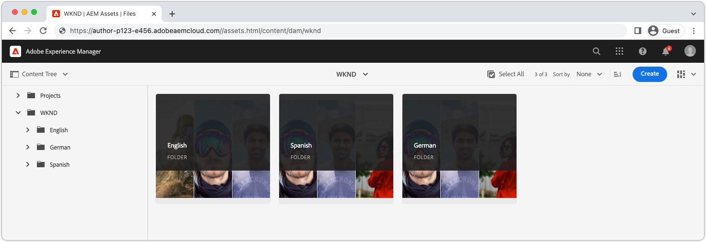

# Contenuto localizzato con AEM Headless

AEM fornisce un [framework di integrazione della traduzione](https://experienceleague.adobe.com/docs/experience-manager-cloud-service/content/sites/administering/reusing-content/translation/integration-framework.html?lang=it) per contenuti headless, che consente di tradurre facilmente frammenti di contenuto e risorse di supporto per l&#39;utilizzo in più lingue. Si tratta dello stesso framework utilizzato per tradurre altri contenuti AEM, come pagine, frammenti di esperienza, Assets e Forms. Una volta tradotto [il contenuto headless](https://experienceleague.adobe.com/docs/experience-manager-cloud-service/content/headless/journeys/translation/overview.html?lang=it) e pubblicato, è pronto per essere utilizzato dalle applicazioni headless.

## Struttura delle cartelle di Assets{#assets-folder-structure}

Assicurati che i frammenti di contenuto localizzati in AEM seguano la [struttura di localizzazione consigliata](https://experienceleague.adobe.com/docs/experience-manager-cloud-service/content/headless/journeys/translation/getting-started.html?lang=it#recommended-structure).



Le cartelle delle impostazioni locali devono essere di pari livello e il nome della cartella, anziché il titolo, deve essere un [codice ISO 639-1](https://en.wikipedia.org/wiki/List_of_ISO_639-1_codes) valido che rappresenta le impostazioni locali del contenuto contenuto nella cartella.

Il codice locale è anche il valore utilizzato per filtrare i Frammenti di contenuto restituiti dalla query GraphQL.

| Codice lingua | Percorso AEM | Impostazioni locali contenuto |
|--------------------------------|----------|----------|
| de | /content/dam/.../**de**/... | Contenuto tedesco |
| en | /content/dam/.../**en**/... | Contenuto inglese |
| es | /content/dam/.../**es**/... | Contenuto spagnolo |

## Query persistente GraphQL

AEM fornisce un filtro di GraphQL `_locale` che filtra automaticamente il contenuto in base al codice locale. Ad esempio, è possibile eseguire una query su tutte le avventure in inglese nel [progetto del sito WKND](https://github.com/adobe/aem-guides-wknd) con una nuova query persistente `wknd-shared/adventures-by-locale` definita come:

```graphql
query($locale: String!) {
  adventureList(_locale: $locale) {
    items {      
      _path
      title
    }
  }
}
```

La variabile `$locale` utilizzata nel filtro `_locale` richiede il codice locale (ad esempio `en`, `en_us` o `de`) specificato nella [convenzione di localizzazione basata su cartelle di risorse di AEM](#assets-folder-structure).

## Esempio di React

Creiamo una semplice applicazione React che controlla quale contenuto Adventure eseguire query da AEM in base a un selettore delle impostazioni internazionali utilizzando il filtro `_locale`.

Quando __Inglese__ è selezionato nel selettore delle impostazioni internazionali, vengono restituiti i frammenti di contenuto di avventura in inglese in `/content/dam/wknd/en`, quando è selezionato __Spagnolo__, quindi i frammenti di contenuto in spagnolo in `/content/dam/wknd/es` e così via e così via.


### Crea un `LocaleContext`{#locale-context}

Creare innanzitutto un [contesto React](https://reactjs.org/docs/context.html) per consentire l&#39;utilizzo delle impostazioni locali nei componenti dell&#39;applicazione React.

```javascript
// src/LocaleContext.js

import React from 'react'

const DEFAULT_LOCALE = 'en';

const LocaleContext = React.createContext({
    locale: DEFAULT_LOCALE, 
    setLocale: () => {}
});

export default LocaleContext;
```

### Crea un componente React `LocaleSwitcher`{#locale-switcher}

Creare quindi un componente React del commutatore delle impostazioni internazionali che imposti il valore [LocaleContext](#locale-context) sulla selezione dell&#39;utente.

Questo valore delle impostazioni locali viene utilizzato per indirizzare le query GraphQL e garantisce che restituiscano solo il contenuto corrispondente alle impostazioni locali selezionate.

```javascript
// src/LocaleSwitcher.js

import { useContext } from "react";
import LocaleContext from "./LocaleContext";

export default function LocaleSwitcher() {
  const { locale, setLocale } = useContext(LocaleContext);

  return (
    <select value={locale}
            onChange={e => setLocale(e.target.value)}>
      <option value="de">Deutsch</option>
      <option value="en">English</option>
      <option value="es">Español</option>
    </select>
  );
}
```

### Eseguire query sul contenuto utilizzando il filtro `_locale`{#adventures}

Il componente Avventure richiede ad AEM tutte le avventure per lingua ed elenca i relativi titoli. Ciò si ottiene passando il valore delle impostazioni locali memorizzato nel contesto React alla query utilizzando il filtro `_locale`.

Questo approccio può essere esteso ad altre query nell’applicazione, garantendo che tutte le query includano solo il contenuto specificato dalla selezione locale di un utente.

La query su AEM viene eseguita nell&#39;hook React personalizzato [getAdventuresByLocale, descritto più dettagliatamente nella documentazione relativa alla query su AEM GraphQL](./aem-headless-sdk.md).

```javascript
// src/Adventures.js

import { useContext } from "react"
import { useAdventuresByLocale } from './api/persistedQueries'
import LocaleContext from './LocaleContext'

export default function Adventures() {
    const { locale } = useContext(LocaleContext);

    // Get data from AEM using GraphQL persisted query as defined above 
    // The details of defining a React useEffect hook are explored in How to > AEM Headless SDK
    let { data, error } = useAdventuresByLocale(locale);

    return (
        <ul>
            {data?.adventureList?.items?.map((adventure, index) => { 
                return <li key={index}>{adventure.title}</li>
            })}
        </ul>
    )
}
```

### Definisci `App.js`{#app-js}

Infine, collegarle tutte racchiudendo l&#39;applicazione React in con `LanguageContext.Provider` e impostando il valore locale. Questo consente agli altri componenti React, [LocaleSwitcher](#locale-switcher) e [Adventures](#adventures) di condividere lo stato di selezione delle impostazioni locali.

```javascript
// src/App.js

import { useState, useContext } from "react";
import LocaleContext from "./LocaleContext";
import LocaleSwitcher from "./LocaleSwitcher";
import Adventures from "./Adventures";

export default function App() {
  const [locale, setLocale] = useState(useContext(LocaleContext).locale);

  return (
    <LocaleContext.Provider value={{locale, setLocale}}>
      <LocaleSwitcher />
      <Adventures />
    </LocaleContext.Provider>
  );
}
```
