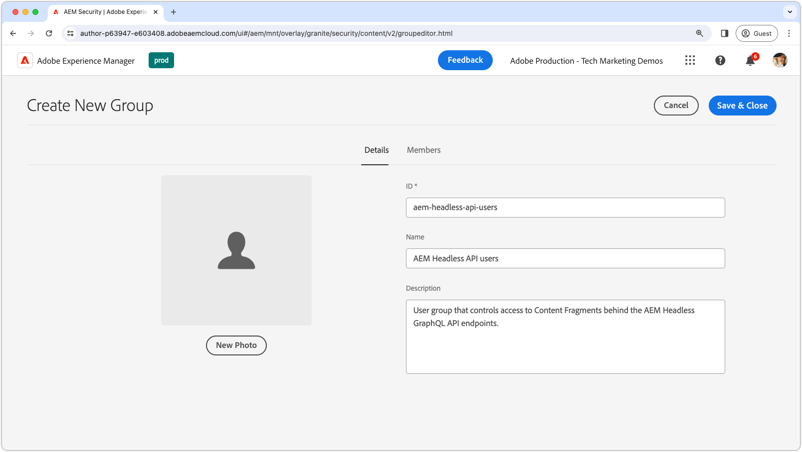

# Protezione dei contenuti in AEM headless

Garantire l’integrità e la sicurezza dei dati durante la trasmissione di contenuti headless AEM da AEM Publish è fondamentale per la trasmissione di contenuti sensibili. Questo tutorial illustra come proteggere il contenuto fornito dagli endpoint API GraphQL headless dell’AEM.

Questo manuale non tratta:

- Proteggere direttamente gli endpoint, ma concentrarsi sulla protezione del contenuto che distribuiscono.
- Autenticazione per pubblicazione AEM o recupero dei token di accesso. I metodi di autenticazione e il passaggio delle credenziali dipendono dai singoli casi d’uso e dalle implementazioni.

## Gruppi di utenti

Innanzitutto, dobbiamo definire un’ [gruppo utenti](https://experienceleague.adobe.com/en/docs/experience-manager-learn/cloud-service/accessing/aem-users-groups-and-permissions) contenente gli utenti che devono avere accesso al contenuto protetto.

{align="center"}

I gruppi di utenti assegnano l’accesso a contenuti headless AEM, inclusi frammenti di contenuto o altre risorse di riferimento.

1. Accedi a AEM Author come **amministratore utenti**.
1. Accedi a **Strumenti** > **Sicurezza** > **Gruppi**.
1. Seleziona **Crea** nell’angolo in alto a destra.
1. In **Dettagli** , specificare **ID gruppo** e **Nome gruppo**.
   - L’ID gruppo e il Nome gruppo possono essere qualsiasi cosa, ma in questo esempio utilizza il nome **Utenti API headless AEM**.
1. Seleziona **Salva e chiudi**.
1. Seleziona il gruppo appena creato, quindi scegli **Attiva** dalla barra delle azioni.

Se sono necessari vari livelli di accesso, crea più gruppi di utenti che possono essere associati a contenuti diversi.

### Aggiunta di utenti ai gruppi di utenti

Per consentire alle richieste API GraphQL headless dell’AEM di accedere a contenuti protetti, puoi associare la richiesta headless a un utente appartenente a un gruppo di utenti specifico. Di seguito sono riportati due approcci comuni:

1. **AEM as a Cloud Service [conti tecnici](https://experienceleague.adobe.com/en/docs/experience-manager-learn/getting-started-with-aem-headless/authentication/service-credentials):**
   - Crea un account tecnico nella Console per sviluppatori as a Cloud Service dell’AEM.
   - Accedi a AEM Author una volta con l’account tecnico.
   - Aggiungere l’account tecnico al gruppo di utenti tramite **Strumenti > Sicurezza > Gruppi > Utenti API headless AEM > Membri**.
   - **Attiva** sia l’utente dell’account tecnico che il gruppo di utenti alla pubblicazione AEM.
   - Questo metodo richiede che il client headless non esponga le credenziali del servizio all’utente, in quanto sono credenziali per un utente specifico e non devono essere condivise.

   {align="center"}

2. **Utenti denominati:**
   - Autentica gli utenti denominati e aggiungili direttamente al gruppo di utenti nella pubblicazione AEM.
   - Questo metodo richiede che il client headless autentichi le credenziali utente con Pubblicazione AEM, ottenga un token di accesso o AEM e utilizzi questo token per le richieste successive all’AEM. I dettagli su come ottenere questo risultato non sono descritti in questa procedura e dipendono dall’implementazione.

## Protezione dei frammenti di contenuto

La protezione dei frammenti di contenuto è essenziale per la salvaguardia dei contenuti headless AEM e si ottiene associando i contenuti a un gruppo utenti chiuso (CUG). Quando un utente effettua una richiesta all’API GraphQL headless dell’AEM, il contenuto restituito viene filtrato in base ai CUG dell’utente.

{align="center"}

Per ottenere questo risultato, segui la procedura riportata di seguito. [Gruppi utenti chiusi (CUG)](https://experienceleague.adobe.com/en/docs/experience-manager-learn/assets/advanced/closed-user-groups).

1. Accedi a AEM Author come **Utente DAM**.
2. Accedi a **Risorse > File** e seleziona la **cartella** contenente i frammenti di contenuto da proteggere. I CUG vengono applicati in modo gerarchico ed hanno effetto sulle sottocartelle, a meno che non siano sostituiti da un CUG diverso.
   - Assicurati che gli utenti appartenenti ad altri canali che utilizzano il contenuto delle cartelle siano inclusi in questo gruppo di utenti. In alternativa, includi i gruppi di utenti associati a tali canali nell’elenco dei CUG. In caso contrario, il contenuto non sarà accessibile a tali canali.
3. Seleziona la cartella e scegli **Proprietà** dalla barra degli strumenti.
4. Seleziona la **Autorizzazioni** scheda.
5. Digita nella **Nome gruppo** e seleziona la **Aggiungi** per aggiungere il nuovo CUG.
6. **Salva** per applicare il CUG.
7. **Seleziona** nella cartella delle risorse e seleziona **Pubblica** per inviare la cartella con i gruppi utenti chiusi (CUG) applicati alla pubblicazione AEM, dove verrà valutata come autorizzazione.

Segui gli stessi passaggi per tutte le cartelle contenenti frammenti di contenuto da proteggere, applicando i CUG corretti a ciascuna cartella.

Ora, quando viene effettuata una richiesta HTTP all’endpoint API GraphQL headless dell’AEM, nel risultato verranno inclusi solo i Frammenti di contenuto accessibili dai CUG specificati dell’utente richiedente. Se l’utente non ha accesso a nessun frammento di contenuto, il risultato sarà vuoto, ma verrà comunque restituito il codice di stato HTTP 200.

### Protezione del contenuto di riferimento

I frammenti di contenuto spesso fanno riferimento ad altri contenuti AEM come le immagini. Per proteggere il contenuto a cui si fa riferimento, applica i CUG alle cartelle di risorse in cui sono memorizzate le risorse a cui si fa riferimento. Tieni presente che le risorse di riferimento vengono comunemente richieste utilizzando metodi diversi da quelli delle API GraphQL headless dell’AEM. Di conseguenza, il modo in cui i token di accesso vengono trasmessi alle richieste di tali risorse a cui si fa riferimento può variare.

A seconda dell’architettura dei contenuti, potrebbe essere necessario applicare gruppi utenti chiusi (CUG) a più cartelle per garantire la protezione di tutti i contenuti di riferimento.

## Impedisci la memorizzazione nella cache di contenuto protetto

AEM as a Cloud Service [memorizza nella cache le risposte HTTP per impostazione predefinita](https://experienceleague.adobe.com/en/docs/experience-manager-learn/cloud-service/caching/publish) per migliorare le prestazioni. Tuttavia, questo può causare problemi nella distribuzione dei contenuti protetti. Per evitare la memorizzazione nella cache di tali contenuti, [rimuovi intestazioni cache per endpoint specifici](https://experienceleague.adobe.com/en/docs/experience-manager-learn/cloud-service/caching/publish#how-to-customize-cache-rules-1) nella configurazione Apache dell’istanza di pubblicazione AEM.

Aggiungi la seguente regola al file di configurazione Apache del progetto Dispatcher per rimuovere le intestazioni cache per endpoint specifici:

```xml
# dispatcher/src/conf.d/available_vhosts/example.vhost

<VirtualHost *:80>
    ...
    # Replace `example` with the name of your GraphQL endpoint's configuration name.
    <LocationMatch "^/graphql/execute.json/example/.*$">
        # Remove cache headers for protected endpoints so they are not cached
        Header unset Cache-Control
        Header unset Surrogate-Control
        Header set Age 0
    </LocationMatch>
    ...
</VirtualHost>
```

Tieni presente che questo comporterà una riduzione delle prestazioni in quanto il contenuto non verrà memorizzato nella cache dal dispatcher o dalla CDN. Si tratta di un compromesso tra prestazioni e sicurezza.

## Protezione degli endpoint API di GraphQL headless AEM

Questa guida non descrive come proteggere [Endpoint API per GraphQL headless AEM](https://experienceleague.adobe.com/en/docs/experience-manager-cloud-service/content/headless/graphql-api/graphql-endpoint) ma si concentra piuttosto sulla messa in sicurezza dei contenuti da loro forniti. Tutti gli utenti, inclusi gli utenti anonimi, possono accedere agli endpoint contenenti contenuto protetto. Verrà restituito solo il contenuto accessibile dai gruppi utenti chiusi dell’utente. Se nessun contenuto è accessibile, la risposta API headless dell’AEM avrà ancora un codice di stato di risposta HTTP 200, ma i risultati saranno vuoti. In genere, la protezione del contenuto è sufficiente, in quanto gli endpoint stessi non espongono intrinsecamente dati sensibili. Se devi proteggere gli endpoint, applica ad essi gli ACL nella pubblicazione AEM tramite [Script di inizializzazione dell’archivio Sling (repoinit)](https://sling.apache.org/documentation/bundles/repository-initialization.html#repoinit-parser-test-scenarios).

