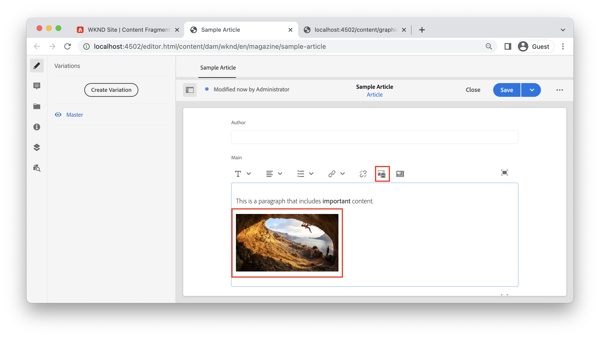

# Rich text con AEM headless

Il campo di testo a più righe è un tipo di dati Frammenti di contenuto che consente agli autori di creare contenuti di testo RTF. I riferimenti ad altri contenuti, come immagini o altri frammenti di contenuto, possono essere inseriti in linea in modo dinamico all’interno del flusso di testo. Il campo di testo a riga singola è un altro tipo di dati Frammenti di contenuto che deve essere utilizzato per elementi di testo semplici.

AEM’API GraphQL offre una solida capacità di restituire testo RTF come HTML, testo normale o come JSON puro. La rappresentazione JSON è potente in quanto offre all’applicazione client il pieno controllo su come eseguire il rendering del contenuto.

## Editor a più righe

>[!VIDEO](https://video.tv.adobe.com/v/342104/?quality=12&learn=on)

Nell’Editor frammento di contenuto, la barra dei menu del campo di testo a più righe offre agli autori funzionalità di formattazione RTF standard, ad esempio **audace**, *corsivo* e sottolineano. L’apertura del campo a più righe in modalità a schermo intero consente [strumenti di formattazione aggiuntivi come tipo di paragrafo, trova e sostituisci, controllo ortografico e altro ancora](https://experienceleague.adobe.com/docs/experience-manager-cloud-service/content/assets/content-fragments/content-fragments-variations.html).

>[!NOTE]
>
> I plug-in Rich Text nell’editor a più righe non possono essere personalizzati.

## Tipo di dati a più righe {#multi-line-data-type}

Utilizza la **Testo a più righe** tipo di dati durante la definizione del modello di frammento di contenuto per abilitare la creazione di testo RTF.


È possibile configurare diverse proprietà del campo Multiriga.

La **Rendering come** può essere impostata su:

* Area di testo - esegue il rendering di un singolo campo a più righe
* Campo multiplo : esegue il rendering di più campi di riga


La **Tipo predefinito** può essere impostato su:

* Formato RTF
* Markdown
* Testo normale

La **Tipo predefinito** influenza direttamente l’esperienza di modifica e determina se sono presenti gli strumenti rich text.

È inoltre possibile [abilita riferimenti in linea](#insert-fragment-references) ad altri frammenti di contenuto selezionando la **Consenti riferimento frammento** e la configurazione **Modelli di frammenti di contenuto consentiti**.

Se il contenuto verrà localizzato, controlla il **Traducibile** scatola. È possibile localizzare solo il testo RTF e il testo normale. Vedi [utilizzo dei contenuti localizzati per ulteriori dettagli](./localized-content.md).

## Risposta in formato RTF con API GraphQL

Quando crei una query GraphQL, gli sviluppatori possono scegliere diversi tipi di risposta da `html`, `plaintext`, `markdown`e `json` da un campo a più righe.

Gli sviluppatori possono utilizzare [Anteprima JSON](https://experienceleague.adobe.com/docs/experience-manager-cloud-service/content/assets/content-fragments/content-fragments-json-preview.html) nell’editor Frammento di contenuto per mostrare tutti i valori del frammento di contenuto corrente che possono essere restituiti utilizzando l’API GraphQL.

### Esempio JSON

La `json` Le risposte offrono la massima flessibilità agli sviluppatori front-end quando si lavora con contenuti rich text. Il contenuto RTF viene consegnato come array di tipi di nodi JSON che possono essere elaborati in modo univoco in base alla piattaforma client.

Di seguito è riportato un tipo di risposta JSON di un campo multi-riga denominato `main` che contiene un paragrafo: &quot;*Questo è un paragrafo che include **importante**contenuto.*&quot; dove &quot;importante&quot; è contrassegnato come **audace**.

**Query GraphQL:**

```graphql
{
  articleByPath(_path: "/content/dam/wknd/en/magazine/sample-article")
  {
    item {
      _path
      main {
        json
      }
    }
  }
}
```

**Risposta GraphQL:**

```json
{
  "data": {
    "articleByPath": {
      "item": {
        "_path": "/content/dam/wknd/en/magazine/sample-article",
        "main": {
          "json": [
            {
              "nodeType": "paragraph",
              "content": [
                {
                  "nodeType": "text",
                  "value": "This is a paragraph that includes "
                },
                {
                  "nodeType": "text",
                  "value": "important",
                  "format": {
                    "variants": [
                      "bold"
                    ]
                  }
                },
                {
                  "nodeType": "text",
                  "value": " content. "
                }
              ]
            }
          ]
        }
      }
    }
  }
}
```

### Altri esempi

Di seguito sono riportati diversi esempi di tipi di risposta di un campo con più righe denominato `main` che contiene un paragrafo: &quot;Questo è un paragrafo che include **importante** content.&quot; dove &quot;importante&quot; è contrassegnato come **audace**.

Esempio +++HTML

**Query GraphQL:**

```graphql
{
  articleByPath(_path: "/content/dam/wknd/en/magazine/sample-article")
  {
    item {
      _path
      main {
        html
      }
    }
  }
}
```

**Risposta GraphQL:**

```json
{
  "data": {
    "articleByPath": {
      "item": {
        "_path": "/content/dam/wknd/en/magazine/sample-article",
        "main": {
            "html": "<p>This is a paragraph that includes <b>important</b> content.&nbsp;</p>\n"
        }
      }
    }
  }
}
```

+++

+++Esempio di Markdown

**Query GraphQL:**

```graphql
{
  articleByPath(_path: "/content/dam/wknd/en/magazine/sample-article")
  {
    item {
      _path
      main {
        markdown
      }
    }
  }
}
```

**Risposta GraphQL:**

```json
{
  "data": {
    "articleByPath": {
      "item": {
        "_path": "/content/dam/wknd/en/magazine/sample-article",
        "main": {
            "markdown": "This is a paragraph that includes **important** content. \n\n ",
        }
      }
    }
  }
}
```

+++

++Esempio di testo normale

**Query GraphQL:**

```graphql
{
  articleByPath(_path: "/content/dam/wknd/en/magazine/sample-article")
  {
    item {
      _path
      main {
        plaintext
      }
    }
  }
}
```

**Risposta GraphQL:**

```json
{
  "data": {
    "articleByPath": {
      "item": {
        "_path": "/content/dam/wknd/en/magazine/sample-article",
        "main": {
            "plaintext": "This is a paragraph that includes important content. ",
        }
      }
    }
  }
}
```

La `plaintext` l’opzione di rendering elimina qualsiasi formattazione.

+++


## Rendering di una risposta JSON RTF {#render-multiline-json-richtext}

La risposta JSON in formato RTF del campo a più righe è strutturata in una struttura gerarchica. Ogni oggetto o nodo rappresenta un blocco HTML diverso del testo RTF.

Di seguito è riportato un esempio di risposta JSON di un campo di testo a più righe. Osserva che ogni oggetto, o nodo, include un `nodeType` che rappresenta il blocco HTML dal testo RTF come `paragraph`, `link`e `text`. Ogni nodo contiene facoltativamente `content` che è un sottoarray contenente elementi secondari del nodo corrente.

```json
"json": [// root "content" or child nodes
            {
                "nodeType": "paragraph", // node for a paragraph
                "content": [ // children of current node
                {
                    "nodeType": "text", // node for a text
                    "value": "This is the first paragraph. "
                },
                {
                    "nodeType": "link",
                    "data": {
                        "href": "http://www.adobe.com"
                    },
                    "value": "An external link"
                }
                ],
            },
            {
                "nodeType": "paragraph",
                "content": [
                {
                    "nodeType": "text",
                    "value": "This is the second paragraph."
                },
                ],
            },
]
```

Il modo più semplice per eseguire il rendering di più righe `json` la risposta consiste nell&#39;elaborare ogni oggetto o nodo nella risposta ed elaborare tutti gli elementi secondari del nodo corrente. Una funzione ricorsiva può essere utilizzata per attraversare la struttura JSON.

Di seguito è riportato un codice di esempio che illustra un approccio di traversata ricorsivo. Gli esempi sono basati su JavaScript e utilizzano React&#39;s [JSX](https://reactjs.org/docs/introducing-jsx.html)Tuttavia, i concetti di programmazione possono essere applicati a qualsiasi lingua.

```javascript
// renderNodeList - renders a list of nodes
function renderNodeList(childNodes) {
    
    if(!childNodes) {
        // null check
        return null;
    }

    return childNodes.map(node, index) => {
        return renderNode(node);
    }
}
```

La `renderNodeList` è il punto di ingresso nell&#39;algoritmo ricorsivo. La `renderNodeList` la funzione richiede un array di `childNodes`. Ogni nodo dell&#39;array viene quindi trasmesso a una funzione `renderNode`.

```javascript
// renderNode - renders an individual node
function renderNode(node) {

    // if the current node has children, recursively process them
    const children = node.content ? renderNodeList(node.content) : null;

    // use a map to render the current node based on its nodeType
    return nodeMap[node.nodeType]?.(node, children);
}
```

La `renderNode` la funzione richiede un singolo oggetto denominato `node`. Un nodo può avere elementi secondari elaborati in modo ricorsivo utilizzando `renderNodeList` funzione descritta sopra. Infine, un `nodeMap` viene utilizzato per eseguire il rendering del contenuto del nodo in base al relativo `nodeType`.

```javascript
// nodeMap - object literal that maps a JSX response based on a given key (nodeType)
const nodeMap = {
    'paragraph': (node, children) => <p>{children}</p>,
    'link': node => <a href={node.data.href} target={node.data.target}>{node.value}</a>,
    'text': node => node.value,
    'unordered-list': (node, children) => <ul>{children}</ul>,
    'ordered-list': (node, children) => <ol>{children}</ol>,
    'list-item': (node, children) => <li>{children}</li>,
    ...
}
```

La `nodeMap` è un valore letterale di oggetto JavaScript utilizzato come mappa. Ognuna delle &quot;chiavi&quot; rappresenta un `nodeType`. Parametri di `node` e `children` può essere passato alle funzioni risultanti che eseguono il rendering del nodo. Il tipo restituito utilizzato in questo esempio è JSX, tuttavia l’approccio può essere adattato per creare un valore letterale stringa che rappresenta il contenuto HTML.

### Esempio di codice completo

Un&#39;utilità riutilizzabile per il rendering di testo RTF si trova in [Esempio di reazione grafico WKND](https://github.com/adobe/aem-guides-wknd-graphql/tree/main/react-app).

* [renderRichText.js](https://github.com/adobe/aem-guides-wknd-graphql/tree/main/react-app/src/utils/renderRichText.js) - utilità riutilizzabile che espone una funzione `mapJsonRichText`. Questa utility può essere utilizzata dai componenti che desiderano eseguire il rendering di una risposta JSON RTF come React JSX.
* [AdventureDetail.js](https://github.com/adobe/aem-guides-wknd-graphql/blob/main/react-app/src/components/AdventureDetail.js) - Esempio di componente che effettua una richiesta GraphQL che include testo RTF. Il componente utilizza il `mapJsonRichText` utilità per eseguire il rendering del testo RTF e di eventuali riferimenti.


## Aggiungere riferimenti in linea al testo RTF {#insert-fragment-references}

Il campo Linea multipla consente agli autori di inserire immagini o altre risorse digitali da AEM Assets nel flusso del testo RTF.



La schermata precedente rappresenta un&#39;immagine inserita nel campo Multi Line utilizzando **Inserisci risorsa** pulsante .

È inoltre possibile collegare o inserire riferimenti ad altri frammenti di contenuto nel campo Multiriga utilizzando **Inserisci frammento di contenuto** pulsante .


La schermata precedente mostra un altro frammento di contenuto, Guida completa ai parchi di Skate LA, inserito nel campo multi-riga. I tipi di frammenti di contenuto che possono essere inseriti nel campo sono controllati dalla **Modelli di frammenti di contenuto consentiti** nella configurazione [Tipo di dati a più righe](#multi-line-data-type) nel modello Frammento di contenuto.

## Query di riferimenti in linea con GraphQL

L’API GraphQL consente agli sviluppatori di creare una query che include proprietà aggiuntive su eventuali riferimenti inseriti in un campo Multi-riga. La risposta JSON include un `_references` oggetto in cui sono elencate queste proprietà aggiuntive. La risposta JSON offre agli sviluppatori un controllo completo su come eseguire il rendering dei riferimenti o dei collegamenti invece di dover gestire HTML con opinioni critiche.

Ad esempio:

* Includi logica di indirizzamento personalizzata per la gestione dei collegamenti ad altri frammenti di contenuto durante l’implementazione di un’applicazione a pagina singola, come React Router o Next.js
* Esegui il rendering di un’immagine in linea utilizzando il percorso assoluto di un ambiente AEM Publish come `src` valore.
* Determinare come eseguire il rendering di un riferimento incorporato in un altro frammento di contenuto con proprietà personalizzate aggiuntive.

Utilizza la `json` tipo di ritorno e include `_references` oggetto durante la costruzione di una query GraphQL:

**Query GraphQL:**

```graphql
{
  articleByPath(_path: "/content/dam/wknd/en/magazine/sample-article")
  {
    item {
      _path
      main {
        json
      }
    }
    _references {
      ...on ImageRef {
        _path
        _publishUrl
        width
        __typename
      }
      ...on ArticleModel {
        _path
        author
        __typename
      }
      
    }
  }
}
```

Nella query precedente, la `main` viene restituito come JSON. La `_references` l&#39;oggetto include frammenti per la gestione di riferimenti di tipo `ImageRef` o di tipo `ArticleModel`.

**Risposta JSON:**

```json
{
  "data": {
    "articleByPath": {
      "item": {
        "_path": "/content/dam/wknd/en/magazine/sample-article",
        "main": {
          "json": [
            {
              "nodeType": "paragraph",
              "content": [
                {
                  "nodeType": "text",
                  "value": "This is a paragraph that includes "
                },
                {
                  "nodeType": "text",
                  "value": "important",
                  "format": {
                    "variants": [
                      "bold"
                    ]
                  }
                },
                {
                  "nodeType": "text",
                  "value": " content. "
                }
              ]
            },
            {
              "nodeType": "paragraph",
              "content": [
                {
                  "nodeType": "reference",
                  "data": {
                    "path": "/content/dam/wknd/en/activities/climbing/sport-climbing.jpg",
                    "mimetype": "image/jpeg"
                  }
                }
              ]
            },
            {
              "nodeType": "paragraph",
              "content": [
                {
                  "nodeType": "text",
                  "value": "Reference another Content Fragment: "
                },
                {
                  "nodeType": "reference",
                  "data": {
                    "href": "/content/dam/wknd/en/magazine/la-skateparks/ultimate-guide-to-la-skateparks",
                    "type": "fragment"
                  },
                  "value": "Ultimate Guide to LA Skateparks"
                }
              ]
            }
          ]
        }
      },
      "_references": [
        {
          "_path": "/content/dam/wknd/en/activities/climbing/sport-climbing.jpg",
          "_publishUrl": "http://publish-p123-e456.adobeaemcloud.com/content/dam/wknd/en/activities/climbing/sport-climbing.jpg",
          "width": 1920,
          "__typename": "ImageRef"
        },
        {
          "_path": "/content/dam/wknd/en/magazine/la-skateparks/ultimate-guide-to-la-skateparks",
          "author": "Stacey Roswells",
          "__typename": "ArticleModel"
        }
      ]
    }
  }
}
```

La risposta JSON include dove il riferimento è stato inserito nel testo RTF con `"nodeType": "reference"`. La `_references` include quindi ogni riferimento con le proprietà aggiuntive richieste. Ad esempio, il `ImageRef` restituisce il `width` dell&#39;immagine a cui si fa riferimento nell&#39;articolo.

## Rendering di riferimenti in linea in testo RTF

Per eseguire il rendering dei riferimenti in linea, l’approccio ricorsivo illustrato in [Rendering di una risposta JSON multi-riga](#render-multiline-json-richtext) può essere espanso.

Dove `nodeMap` è la mappa che esegue il rendering dei nodi JSON.

```javascript
const nodeMap = {
        'reference': (node, children) => {

            // variable for reference in _references object
            let reference;
            
            // asset reference
            if(node.data.path) {
                // find reference based on path
                reference = references.find( ref => ref._path === node.data.path);
            }
            // Fragment Reference
            if(node.data.href) {
                // find in-line reference within _references array based on href and _path properties
                reference = references.find( ref => ref._path === node.data.href);
            }

            // if reference found, merge properties of reference and current node, then return render method of it using __typename property
            return reference ? renderReference[reference.__typename]({...reference, ...node}) : null;
        }
    }
```

L&#39;approccio di alto livello è quello di controllare ogni volta che un `nodeType` è `reference` nella risposta JSON Mutli Line. È quindi possibile chiamare una funzione di rendering personalizzata che include `_references` oggetto restituito nella risposta GraphQL.

Il percorso di riferimento in linea può quindi essere confrontato con la voce corrispondente nel `_references` oggetto e un&#39;altra mappa personalizzata `renderReference` può essere chiamato.

```javascript
const renderReference = {
    // node contains merged properties of the in-line reference and _references object
    'ImageRef': (node) => {
        // when __typename === ImageRef
        return  
    },
    'ArticleModel': (node) => {
        // when __typename === ArticleModel
        return <Link to={`/article:${node._path}`}>{`${node.value}`}</Link>;
    }
    ...
}
```

La `__typename` del `_references` può essere utilizzato per mappare diversi tipi di riferimento a diverse funzioni di rendering.

### Esempio di codice completo

Un esempio completo di scrittura di un renderer di riferimenti personalizzati si trova in [AdventureDetail.js](https://github.com/adobe/aem-guides-wknd-graphql/blob/main/react-app/src/components/AdventureDetail.js) come parte del [Esempio di reazione grafico WKND](https://github.com/adobe/aem-guides-wknd-graphql/tree/main/react-app).

## Esempio end-to-end

>[!VIDEO](https://video.tv.adobe.com/v/342105/?quality=12&learn=on)

Il video precedente mostra un esempio end-to-end:

1. Aggiornamento del campo di testo su più righe di un modello di frammento di contenuto per consentire l’utilizzo di riferimenti a frammenti
1. Utilizzo dell’Editor frammento di contenuto per includere un’immagine e un riferimento a un altro frammento in un campo di testo a più righe.
1. Creazione di una query GraphQL che include la risposta di testo multiriga come JSON ed eventuali `_references` utilizzato.
1. Scrittura di un SPA React che esegue il rendering dei riferimenti in linea della risposta RTF.
