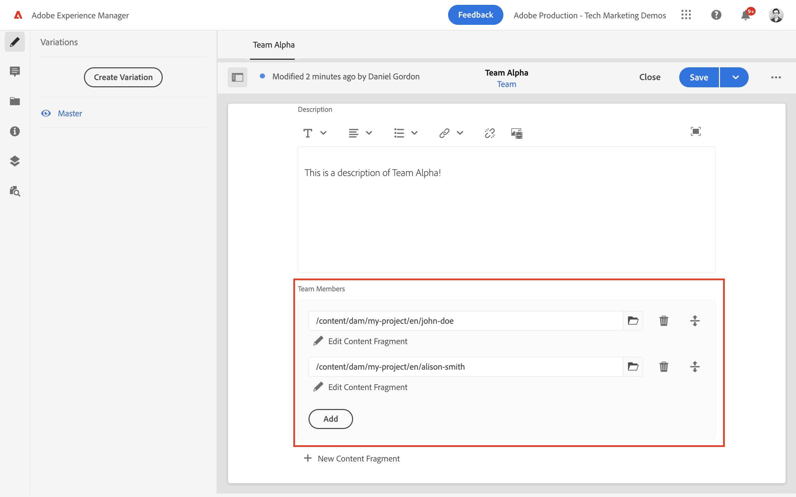

# Authoring di frammenti di contenuto {#authoring-content-fragments}

In questo capitolo viene creato e modificato un nuovo frammento di contenuto basato su [modello a frammento di contenuto appena definito](./content-fragment-models.md). Inoltre, verrà illustrato come creare varianti di frammenti di contenuto.

## Prerequisiti {#prerequisites}

Si tratta di un tutorial in più parti e si presume che i passaggi descritti in [Definizione dei modelli di frammenti di contenuto](./content-fragment-models.md) sono state completate.

## Obiettivi {#objectives}

* Creare un frammento di contenuto basato su un modello di frammento di contenuto
* Creare una variante del frammento di contenuto

## Creare una cartella di risorse

I frammenti di contenuto sono memorizzati in cartelle in AEM Assets. Per creare frammenti di contenuto dai modelli creati nel capitolo precedente, è necessario creare una cartella per memorizzarli. È necessaria una configurazione nella cartella per abilitare la creazione di frammenti da modelli specifici.

1. Dalla schermata iniziale AEM passare a **Risorse** > **File**.

   

1. Tocca **Crea** nell’angolo e tocca **Cartella**. Nella finestra di dialogo risultante inserisci:

   * Titolo*: **Progetto personale**
   * Nome: **progetto personale**

   

1. Seleziona la **Cartella personale** tocca e fai clic su **Proprietà**.

   

1. Tocca **Cloud Services** scheda . Sotto **Configurazione cloud** utilizza il cercatore di percorsi per selezionare il **Progetto personale** configurazione. Il valore deve essere `/conf/my-project`.

   

   L’impostazione di questa proprietà consente di creare frammenti di contenuto utilizzando i modelli creati nel capitolo precedente.

1. Tocca **Criteri** scheda . Sotto **Modelli di frammenti di contenuto consentiti** utilizza il cercatore di percorsi per selezionare il **Persona** e **Team** modello creato in precedenza.

   

   Questi criteri vengono ereditati automaticamente da qualsiasi sottocartella e possono essere ignorati. Puoi anche consentire modelli per tag o abilitare modelli per altre configurazioni di progetto. Questo meccanismo offre un modo efficace di gestire la gerarchia dei contenuti.

1. Tocca **Salva e chiudi** per salvare le modifiche apportate alle proprietà della cartella.

1. Passa all’interno della **Progetto personale** cartella.

1. Crea un’altra cartella con i seguenti valori:

   * Titolo*: **Inglese**
   * Nome: **en**

   Una buona pratica consiste nell&#39;istituire progetti di sostegno multilingue. Vedi [per ulteriori informazioni, consulta la seguente pagina docs](https://experienceleague.adobe.com/docs/experience-manager-cloud-service/content/assets/admin/translate-assets.html).

## Creare un frammento di contenuto {#create-content-fragment}

Successivamente, vengono creati diversi frammenti di contenuto in base **Team** e **Persona** modelli.

1. Dalla schermata iniziale AEM **Frammenti di contenuto** per aprire l’interfaccia utente Frammenti di contenuto .

   

1. Nella barra a sinistra espandi **Progetto personale** e toccare **Inglese**.
1. Tocca **Crea** per richiamare **Nuovo frammento di contenuto** e immetti i seguenti valori:

   * Dove si trova: `/content/dam/my-project/en`
   * Modello per frammento di contenuto: **Persona**
   * Titolo: **John Doe**
   * Nome: `john-doe`

   
1. Tocca **Crea**.
1. Ripeti i passaggi precedenti per creare un nuovo frammento che rappresenta **Alison Smith**:

   * Dove si trova: `/content/dam/my-project/en`
   * Modello per frammento di contenuto: **Persona**
   * Titolo: **Alison Smith**
   * Nome: `alison-smith`

   Tocca **Crea** per creare il nuovo frammento Persona.

1. Quindi, ripeti passaggi per creare un nuovo **Team** frammento che rappresenta **Alfa team**:

   * Dove si trova: `/content/dam/my-project/en`
   * Modello per frammento di contenuto: **Team**
   * Titolo: **Alfa team**
   * Nome: `team-alpha`

   Tocca **Crea** per creare il nuovo frammento Team.

1. Sotto devono essere presenti tre frammenti di contenuto **Progetto personale** > **Inglese**:

   

## Modifica frammenti di contenuto della persona {#edit-person-content-fragments}

Successivamente, compila i frammenti appena creati con i dati.

1. Tocca la casella di controllo accanto a **John Doe** e toccare **Apri**.

   

1. L’Editor frammento di contenuto contiene un modulo basato sul modello Frammento di contenuto . Compila i vari campi per aggiungere contenuto al **John Doe** frammento. Per Immagine profilo, carica la tua immagine in AEM Assets.

   

1. Tocca **Salva e chiudi** per salvare le modifiche apportate al frammento John Doe.
1. Torna all’interfaccia utente dei frammenti di contenuto e apri le **Alison Smith** file da modificare.
1. Ripeti i passaggi precedenti per compilare il **Alison Smith** frammento con contenuto.

## Modifica frammento di contenuto del team {#edit-team-content-fragment}

1. Apri **Alfa team** Frammento di contenuto tramite l’interfaccia utente Frammento di contenuto .
1. Compila i campi per **Titolo**, **Nome breve** e **Descrizione**.
1. Seleziona la **John Doe** e **Alison Smith** Frammenti di contenuto per compilare i **Membri del team** campo:

   

   >[!NOTE]
   >
   >Puoi anche creare nuovi frammenti di contenuto in linea utilizzando la **Nuovo frammento di contenuto** pulsante .

1. Tocca **Salva e chiudi** per salvare le modifiche al frammento Alfa team.

## Pubblicare frammenti di contenuto

Dopo la revisione e la verifica, pubblica l’autore `Content Fragments`

1. Dalla schermata iniziale AEM **Frammenti di contenuto** per aprire l’interfaccia utente Frammenti di contenuto .

1. Nella barra a sinistra espandi **Progetto personale** e toccare **Inglese**.

1. Tocca la casella di controllo accanto ai frammenti di contenuto e tocca **Pubblica**

   

## Congratulazioni! {#congratulations}

Congratulazioni, hai appena creato più frammenti di contenuto e creato una variante.

## Passaggi successivi {#next-steps}

Nel capitolo successivo, [Esplorare le API GraphQL](explore-graphql-api.md), esplorerai AEM API GraphQL utilizzando lo strumento GrapiQL integrato. Scopri come AEM automaticamente uno schema GraphQL basato su un modello di frammento di contenuto. È possibile sperimentare la costruzione di query di base utilizzando la sintassi GraphQL.

## Documentazione correlata

* [Gestione dei frammenti di contenuto](https://experienceleague.adobe.com/docs/experience-manager-cloud-service/content/assets/content-fragments/content-fragments-managing.html)
* [Varianti - Authoring dei contenuti di frammenti](https://experienceleague.adobe.com/docs/experience-manager-cloud-service/content/assets/content-fragments/content-fragments-variations.html)
