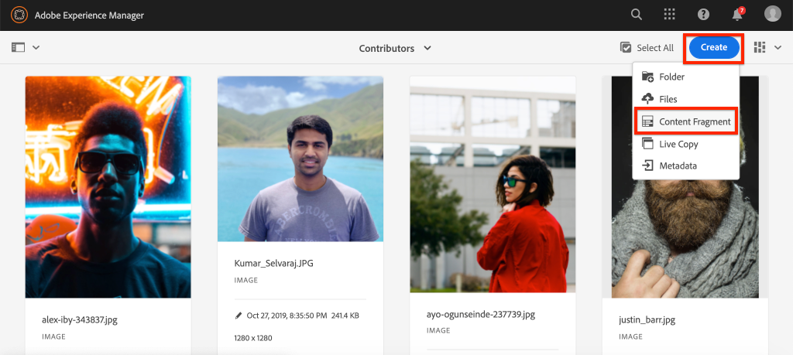
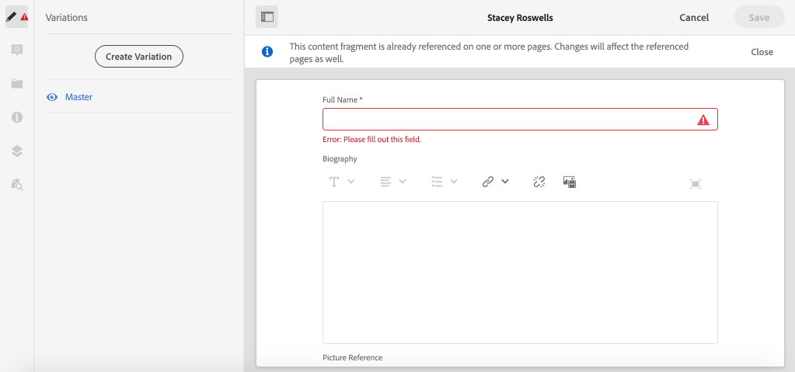

# Authoring di frammenti di contenuto {#authoring-content-fragments}

In questo capitolo viene creato e modificato un nuovo frammento di contenuto basato sul [modello di frammento di contenuto da collaboratore appena definito](./content-fragment-models.md). Inoltre, verrà illustrato come creare varianti di frammenti di contenuto.

## Prerequisiti {#prerequisites}

Si tratta di un tutorial in più parti e si presume che i passaggi descritti in [Definizione di modelli di frammento di contenuto](./content-fragment-models.md) siano stati completati.

## Obiettivi {#objectives}

* Creare un frammento di contenuto basato su un modello di frammento di contenuto
* Creare una variante del frammento di contenuto

## Panoramica sull’authoring dei frammenti di contenuto {#overview}

>[!VIDEO](https://video.tv.adobe.com/v/22451/?quality=12&learn=on)

Il video precedente offre una panoramica di alto livello sull’authoring dei frammenti di contenuto.

## Creare un frammento di contenuto {#create-content-fragment}

Nel capitolo precedente, [Definizione dei modelli di frammento di contenuto](./content-fragment-models.md), è stato creato un modello **Collaboratore**. Crea un nuovo frammento di contenuto utilizzando questo modello.

1. Dal menu **AEM Start** vai a **Risorse** > **File**.
1. Fai clic tra le cartelle per passare a **Sito WKND** > **Inglese** > **Collaboratori**. Questa cartella contiene un elenco di foto principali per i collaboratori del marchio WKND.

1. Fai clic su **Crea** in alto a destra e seleziona **Frammento di contenuto**:

   

1. Seleziona il modello **Collaboratore** e fai clic su **Avanti**.

   

   Si tratta dello stesso modello **Collaboratore** creato nel capitolo precedente.

1. Inserisci **Stacey Roswells** per il titolo e fai clic su **Crea**.
1. Fai clic su **Apri** nella finestra di dialogo **Success** per aprire il frammento appena creato.

   

   Tieni presente che i campi definiti dal modello sono ora disponibili per creare questa istanza del frammento di contenuto.

1. Per **Nome completo** immettere: **Stacey Roswells**.
1. Per **Biografia** inserire una breve biografia. Hai bisogno di ispirazione? Riutilizzare il [file di testo](assets/author-content-fragments/stacey-roswells-bio.txt).
1. Per **Picture Reference** fare clic sull&#39;icona **Cartella** e passare a **Sito WKND** > **Inglese** > **Collaboratori** > **stack-roswells.jpg**. Questo verrà valutato in base al percorso: `/content/dam/wknd/en/contributors/stacey-roswells.jpg`.
1. Per **Occupazione** scegli **Fotografo**.

   

1. Fai clic su **Salva** per salvare le modifiche.

## Creare una variante del frammento di contenuto

Tutti i frammenti di contenuto iniziano con una variante **Master**. La variante **Master** può essere considerata il contenuto *predefinito* del frammento e viene utilizzata automaticamente quando il contenuto viene esposto tramite le API GraphQL. È inoltre possibile creare varianti di un frammento di contenuto. Questa funzione offre ulteriore flessibilità per la progettazione di un’implementazione.

Le varianti possono essere utilizzate per indirizzare canali specifici. Ad esempio, è possibile creare una variante **mobile** che contiene una quantità minore di testo o fa riferimento a un&#39;immagine specifica per il canale. L’utilizzo delle varianti dipende in realtà dall’implementazione. Come qualsiasi funzione, prima di utilizzare è necessario effettuare un&#39;attenta pianificazione.

Quindi, crea una nuova variante per ottenere un&#39;idea delle funzionalità disponibili.

1. Riapri il frammento di contenuto **Stacey Roswells**.
1. Nella barra a sinistra fai clic su **Crea variante**.
1. Nella finestra modale **Nuova variante** immetti un titolo di **Riepilogo**.

   

1. Fai clic sul campo multiriga **Biografia** e fai clic sul pulsante **Espandi** per accedere alla visualizzazione a schermo intero del campo multivalore.

   

1. Fai clic su **Riepiloga testo** nel menu in alto a destra.

1. Immetti una **destinazione** di **50** parole e fai clic su **Start**.

   

   Viene visualizzata un’anteprima di riepilogo. AEM processore del linguaggio del computer tenterà di riepilogare il testo in base al numero di parole di destinazione. È inoltre possibile selezionare frasi diverse da rimuovere.

1. Fai clic su **Riepilogo** quando sei soddisfatto del riepilogo. Fai clic nel campo di testo su più righe e attiva il pulsante **Espandi** per tornare alla visualizzazione principale.

1. Fai clic su **Salva** per salvare le modifiche.

## Creare un ulteriore frammento di contenuto

Ripeti i passaggi descritti in [Creare un frammento di contenuto](#create-content-fragment) per creare un altro **Collaboratore**. Questo verrà utilizzato nel capitolo successivo come esempio di query per più frammenti.

1. Nella cartella **Collaboratori** fai clic su **Crea** in alto a destra e seleziona **Frammento di contenuto**:
1. Seleziona il modello **Collaboratore** e fai clic su **Avanti**.
1. Inserisci **Jacob Wester** per il titolo e fai clic su **Crea**.
1. Fai clic su **Apri** nella finestra di dialogo **Success** per aprire il frammento appena creato.
1. Per **Nome completo** immettere: **Jacob Wester**.
1. Per **Biografia** inserire una breve biografia. Hai bisogno di ispirazione? Riutilizzare il [file di testo](assets/author-content-fragments/jacob-wester.txt).
1. Per **Picture Reference** fare clic sull&#39;icona **Cartella** e passare a **Sito WKND** > **Inglese** > **Collaboratori** > **jacob_wester.jpg**. Questo verrà valutato in base al percorso: `/content/dam/wknd/en/contributors/jacob_wester.jpg`.
1. Per **Occupazione** scegli **Scrittore**.
1. Fai clic su **Salva** per salvare le modifiche. Non è necessario creare una variante, a meno che tu non desideri!

   

   A questo punto sono disponibili due frammenti **Collaboratori**.

## Congratulazioni! {#congratulations}

Congratulazioni, hai appena creato più frammenti di contenuto e creato una variante.

## Passaggi successivi {#next-steps}

Nel capitolo successivo, [Esplora API GraphQL](explore-graphql-api.md), esplorerai AEM API GraphQL utilizzando lo strumento GrapiQL incorporato. Scopri come AEM automaticamente uno schema GraphQL basato su un modello di frammento di contenuto. È possibile sperimentare la costruzione di query di base utilizzando la sintassi GraphQL.
