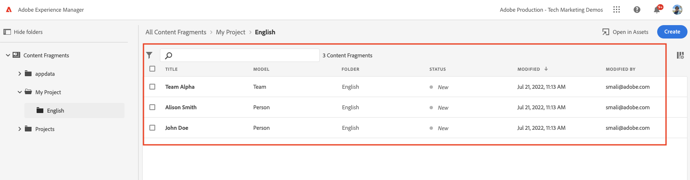

# Creazione di frammenti di contenuto {#authoring-content-fragments}

In questo capitolo viene creato e modificato un nuovo frammento di contenuto basato sul [modello per frammenti di contenuto](./content-fragment-models.md) appena definito. Scopri anche come creare varianti di Frammenti di contenuto.

## Prerequisiti {#prerequisites}

Questo è un tutorial in più parti e si presume che i passaggi descritti in [Definizione dei modelli per frammenti di contenuto](./content-fragment-models.md) siano stati completati.

## Obiettivi {#objectives}

* Creare un frammento di contenuto basato su un modello per frammenti di contenuto
* Creare una variante del frammento di contenuto

## Creare una cartella di risorse

I frammenti di contenuto sono memorizzati in cartelle in AEM Assets. Per creare frammenti di contenuto dai modelli creati nel capitolo precedente, è necessario creare una cartella per memorizzarli. È necessaria una configurazione della cartella per abilitare la creazione di frammenti da modelli specifici.

1. Dalla schermata iniziale di AEM, passa a **Assets** > **File**.

   

1. Tocca **Crea** nell&#39;angolo in alto a destra e tocca **Cartella**. Nella finestra di dialogo risultante, immetti:

   * Titolo*: **Progetto personale**
   * Nome: **progetto personale**

   

1. Seleziona la cartella **Cartella personale** e tocca **Proprietà**.

   

1. Tocca la scheda **Servizi cloud**. Nella scheda Configurazione cloud, utilizza Trova percorso per selezionare la configurazione **Il mio progetto**. Il valore deve essere `/conf/my-project`.

   

   L’impostazione di questa proprietà consente la creazione di frammenti di contenuto utilizzando i modelli creati nel capitolo precedente.

1. Toccare la scheda **Criteri**, nel campo **Modelli per frammenti di contenuto consentiti** utilizzare Trova percorso per selezionare il modello **Persona** e **Team** creato in precedenza.

   

   Questi criteri vengono ereditati automaticamente da qualsiasi sottocartella e possono essere ignorati. Puoi anche consentire i modelli per tag o abilitare i modelli da altre configurazioni di progetto. Questo meccanismo offre un modo efficace per gestire la gerarchia dei contenuti.

1. Tocca **Salva e chiudi** per salvare le modifiche alle proprietà della cartella.

1. Spostati all&#39;interno della cartella **Progetto**.

1. Crea un’altra cartella con i seguenti valori:

   * Titolo*: **Inglese**
   * Nome: **en**

   Una buona pratica è quella di impostare progetti per il supporto multilingue. Per ulteriori informazioni, consulta [la seguente pagina della documentazione](https://experienceleague.adobe.com/docs/experience-manager-cloud-service/content/assets/admin/translate-assets.html).

## Creare un frammento di contenuto {#create-content-fragment}

>[!TIP]
>
>Per gli utenti AEM SDK locali: utilizza l’interfaccia utente di AEM Assets per creare e creare frammenti di contenuto, invece dell’interfaccia utente Frammenti di contenuto descritta di seguito. Per istruzioni dettagliate, consulta la [documentazione di AEM](https://experienceleague.adobe.com/docs/experience-manager-cloud-service/content/assets/content-fragments/content-fragments-managing.html).

Successivamente vengono creati diversi frammenti di contenuto in base ai modelli **Team** e **Persona**.

1. Dalla schermata iniziale di AEM, tocca **Frammenti di contenuto** per aprire l&#39;interfaccia utente Frammenti di contenuto.

   

1. Nella barra a sinistra, espandi **Il mio progetto** e tocca **Inglese**.
1. Tocca **Crea** per visualizzare la finestra di dialogo **Nuovo frammento di contenuto** e immetti i seguenti valori:

   * Percorso: `/content/dam/my-project/en`
   * Modello per frammenti di contenuto: **Persona**
   * Titolo: **John Doe**
   * Nome: `john-doe`

   
1. Tocca **Crea**.
1. Ripeti i passaggi precedenti per creare un frammento che rappresenti **Alison Smith**:

   * Percorso: `/content/dam/my-project/en`
   * Modello per frammenti di contenuto: **Persona**
   * Titolo: **Alison Smith**
   * Nome: `alison-smith`

   Tocca **Crea** per creare il frammento Persona.

1. Ripeti quindi i passaggi per creare un frammento **Team** che rappresenta **Team Alpha**:

   * Percorso: `/content/dam/my-project/en`
   * Modello per frammenti di contenuto: **Team**
   * Titolo: **Team Alpha**
   * Nome: `team-alpha`

   Tocca **Crea** per creare il frammento Team.

1. Sotto **Il mio progetto** > **Inglese** dovrebbero essere presenti tre frammenti di contenuto:

   

## Modifica frammenti di contenuto persona {#edit-person-content-fragments}

Quindi popola i frammenti appena creati con i dati.

1. Tocca la casella di controllo accanto a **John Doe** e tocca **Apri**.

   

1. L’Editor frammento di contenuto contiene un modulo basato sul modello Frammento di contenuto. Compila i vari campi per aggiungere contenuto al frammento **John Doe**. Per Immagine profilo, carica la tua immagine in AEM Assets.

   

1. Tocca **Salva e chiudi** per salvare le modifiche apportate al frammento John Doe.
1. Torna all&#39;interfaccia utente Frammento di contenuto e apri il file **Alison Smith** per la modifica.
1. Ripeti i passaggi precedenti per popolare il frammento **Alison Smith** con il contenuto.

## Modifica frammento di contenuto team {#edit-team-content-fragment}

1. Apri il frammento di contenuto **Team Alpha** tramite l&#39;interfaccia utente Frammento di contenuto.
1. Compila i campi per **Titolo**, **Nome breve** e **Descrizione**.
1. Seleziona i **Frammenti di contenuto John Doe** e **Alison Smith** per popolare il campo **Membri team**:

   

   >[!NOTE]
   >
   >Puoi anche creare frammenti di contenuto in linea utilizzando il pulsante **Nuovo frammento di contenuto**.

1. Tocca **Salva e chiudi** per salvare le modifiche apportate al frammento Team Alpha.

## Pubblicare frammenti di contenuto

>[!TIP]
>
>Per gli utenti AEM SDK locali: utilizza l’interfaccia utente di AEM Assets per pubblicare frammenti di contenuto, invece dell’interfaccia utente Frammenti di contenuto descritta di seguito. Per istruzioni dettagliate, consulta la [documentazione di AEM](https://experienceleague.adobe.com/docs/experience-manager-cloud-service/content/assets/content-fragments/content-fragments-managing.html#publishing-and-referencing-a-fragment).

Al momento della revisione e della verifica, pubblica `Content Fragments` creato

1. Dalla schermata iniziale di AEM, tocca **Frammenti di contenuto** per aprire l&#39;interfaccia utente Frammenti di contenuto.

1. Nella barra a sinistra, espandi **Il mio progetto** e tocca **Inglese**.

1. Tocca la casella di controllo accanto ai frammenti di contenuto e tocca **Pubblica**.
   

## Congratulazioni. {#congratulations}

Congratulazioni, hai creato più frammenti di contenuto e creato una variante.

## Passaggi successivi {#next-steps}

Nel prossimo capitolo, [Esplora le API di GraphQL](explore-graphql-api.md), esplorerai le API di AEM GraphQL utilizzando lo strumento GrapiQL integrato. Scopri come AEM genera automaticamente uno schema GraphQL basato su un modello di Frammento di contenuto. Sperimenterai la costruzione di query di base utilizzando la sintassi GraphQL.

## Documentazione correlata

* [Gestione dei frammenti di contenuto](https://experienceleague.adobe.com/docs/experience-manager-cloud-service/content/assets/content-fragments/content-fragments-managing.html)
* [Varianti - Authoring dei contenuti di frammenti](https://experienceleague.adobe.com/docs/experience-manager-cloud-service/content/assets/content-fragments/content-fragments-variations.html?lang=it)
