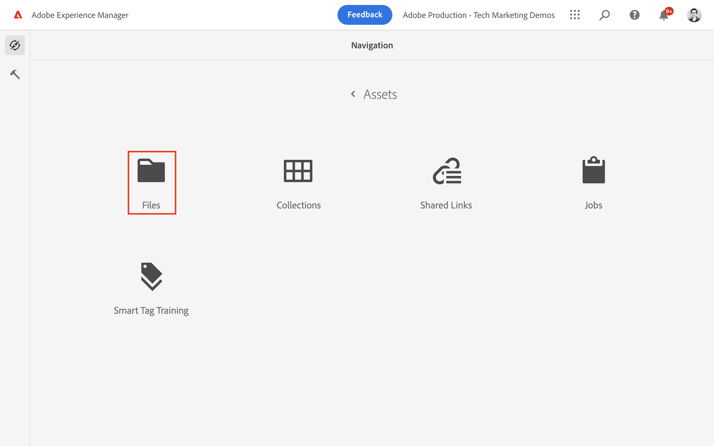

# Creazione di frammenti di contenuto {#authoring-content-fragments}

In questo capitolo, puoi creare e modificare un nuovo Frammento di contenuto basato su [modello per frammenti di contenuto appena definito](./content-fragment-models.md). Scopri anche come creare varianti di Frammenti di contenuto.

## Prerequisiti {#prerequisites}

Si tratta di un tutorial in più parti in cui si presume che i passaggi descritti in [Definizione dei modelli per frammenti di contenuto](./content-fragment-models.md) sono state completate.

## Obiettivi {#objectives}

* Creare un frammento di contenuto basato su un modello per frammenti di contenuto
* Creare una variante del frammento di contenuto

## Creare una cartella di risorse

I frammenti di contenuto sono memorizzati in cartelle in AEM Assets. Per creare frammenti di contenuto dai modelli creati nel capitolo precedente, è necessario creare una cartella per memorizzarli. È necessaria una configurazione della cartella per abilitare la creazione di frammenti da modelli specifici.

1. Dalla schermata iniziale dell’AEM, passa a **Risorse** > **File**.

   

1. Tocca **Crea** nell’angolo in alto a destra e tocca **Cartella**. Nella finestra di dialogo risultante, immetti:

   * Titolo*: **Il mio progetto**
   * Nome: **my-project**

   

1. Seleziona la **La mia cartella** cartella e tocca **Proprietà**.

   

1. Tocca il **Cloud Services** scheda. Nella scheda Configurazione cloud, utilizza Trova percorso per selezionare **Il mio progetto** configurazione. Il valore deve essere `/conf/my-project`.

   

   L’impostazione di questa proprietà consente la creazione di frammenti di contenuto utilizzando i modelli creati nel capitolo precedente.

1. Tocca il **Criteri** , sotto il **Modelli per frammenti di contenuto consentiti** utilizzare il Trova percorso per selezionare il campo **Persona** e **Team** modello creato in precedenza.

   

   Questi criteri vengono ereditati automaticamente da qualsiasi sottocartella e possono essere ignorati. Puoi anche consentire i modelli per tag o abilitare i modelli da altre configurazioni di progetto. Questo meccanismo offre un modo efficace per gestire la gerarchia dei contenuti.

1. Tocca **Salva e chiudi** per salvare le modifiche apportate alle proprietà della cartella.

1. Naviga all&#39;interno del **Il mio progetto** cartella.

1. Crea un’altra cartella con i seguenti valori:

   * Titolo*: **Inglese**
   * Nome: **it**

   Una buona pratica è quella di impostare progetti per il supporto multilingue. Consulta [per ulteriori informazioni, consulta la pagina della documentazione seguente](https://experienceleague.adobe.com/docs/experience-manager-cloud-service/content/assets/admin/translate-assets.html).

## Creare un frammento di contenuto {#create-content-fragment}

Successivamente vengono creati diversi frammenti di contenuto in base al **Team** e **Persona** modelli.

1. Dalla schermata iniziale dell’AEM, tocca **Frammenti di contenuto** per aprire l’interfaccia utente Frammenti di contenuto.

   

1. Nella barra a sinistra, espandi **Il mio progetto** e tocca **Inglese**.
1. Tocca **Crea** per visualizzare **Nuovo frammento di contenuto** e immettere i seguenti valori:

   * Dove si trova: `/content/dam/my-project/en`
   * Modello per frammenti di contenuto: **Persona**
   * Titolo: **John Doe**
   * Nome: `john-doe`

   
1. Tocca **Crea**.
1. Ripeti i passaggi precedenti per creare un frammento che rappresenta **Alison Smith**:

   * Dove si trova: `/content/dam/my-project/en`
   * Modello per frammenti di contenuto: **Persona**
   * Titolo: **Alison Smith**
   * Nome: `alison-smith`

   Tocca **Crea** per creare il frammento Persona.

1. Quindi, ripeti i passaggi per creare un **Team** frammento che rappresenta **Alfa team**:

   * Dove si trova: `/content/dam/my-project/en`
   * Modello per frammenti di contenuto: **Team**
   * Titolo: **Alfa team**
   * Nome: `team-alpha`

   Tocca **Crea** per creare il frammento Team.

1. Sotto dovrebbero essere presenti tre frammenti di contenuto **Il mio progetto** > **Inglese**:

   

## Modifica frammenti di contenuto persona {#edit-person-content-fragments}

Quindi popola i frammenti appena creati con i dati.

1. Tocca la casella di controllo accanto a **John Doe** e tocca **Apri**.

   

1. L’Editor frammento di contenuto contiene un modulo basato sul modello Frammento di contenuto. Compila i vari campi per aggiungere contenuto al **John Doe** frammento. Per Immagine profilo, carica la tua immagine in AEM Assets.

   

1. Tocca **Salva e chiudi** per salvare le modifiche apportate al frammento John Doe.
1. Torna all’interfaccia utente Frammento di contenuto e apri la **Alison Smith** file per la modifica.
1. Ripeti i passaggi precedenti per compilare **Alison Smith** frammento con contenuto.

## Modifica frammento di contenuto team {#edit-team-content-fragment}

1. Apri **Alfa team** Frammento di contenuto utilizzando l’interfaccia utente Frammento di contenuto.
1. Compila i campi per **Titolo**, **Nome breve**, e **Descrizione**.
1. Seleziona la **John Doe** e **Alison Smith** Frammenti di contenuto per compilare **Membri team** campo:

   

   >[!NOTE]
   >
   >Puoi anche creare frammenti di contenuto in linea utilizzando **Nuovo frammento di contenuto** pulsante.

1. Tocca **Salva e chiudi** per salvare le modifiche apportate al frammento Alfa team.

## Pubblicare frammenti di contenuto

In seguito a revisione e verifica, pubblica il `Content Fragments`

1. Dalla schermata iniziale dell’AEM, tocca **Frammenti di contenuto** per aprire l’interfaccia utente Frammenti di contenuto.

1. Nella barra a sinistra, espandi **Il mio progetto** e tocca **Inglese**.

1. Tocca la casella di controllo accanto ai frammenti di contenuto e tocca **Pubblica**.
   

## Congratulazioni.  {#congratulations}

Congratulazioni, hai creato più frammenti di contenuto e creato una variante.

## Passaggi successivi {#next-steps}

Nel prossimo capitolo, [Esplora le API di GraphQL](explore-graphql-api.md), esplorerai le API GraphQL dell’AEM utilizzando lo strumento GraphiQL integrato. Scopri come l’AEM genera automaticamente uno schema GraphQL basato su un modello di Frammento di contenuto. Sperimenterai la costruzione di query di base utilizzando la sintassi GraphQL.

## Documentazione correlata

* [Gestione dei frammenti di contenuto](https://experienceleague.adobe.com/docs/experience-manager-cloud-service/content/assets/content-fragments/content-fragments-managing.html)
* [Varianti - Authoring dei contenuti di frammenti](https://experienceleague.adobe.com/docs/experience-manager-cloud-service/content/assets/content-fragments/content-fragments-variations.html?lang=it)
