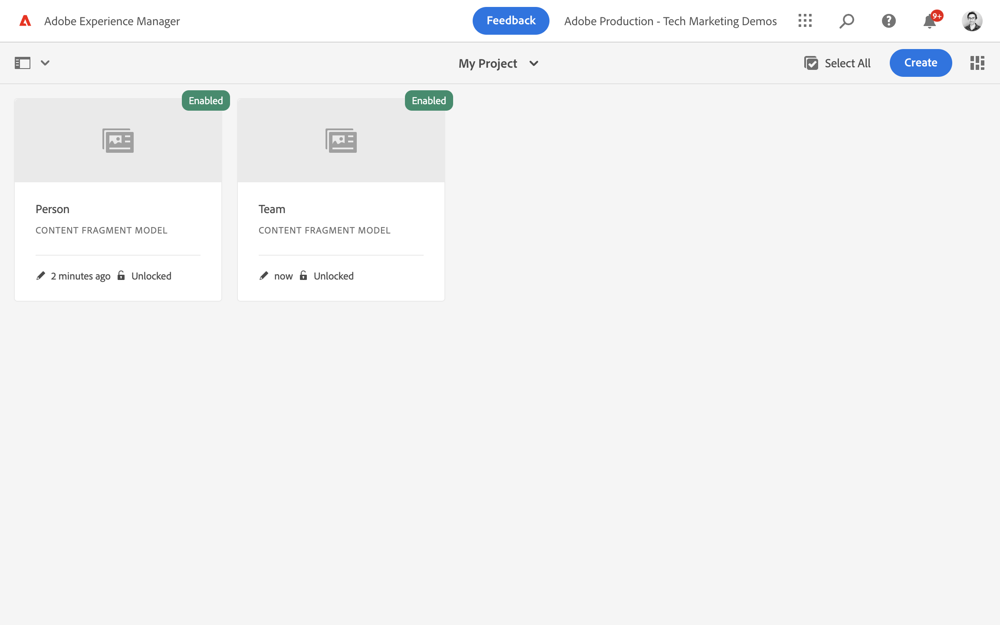

# Definizione dei modelli per frammenti di contenuto {#content-fragment-models}

In questo capitolo, scopri come modellare il contenuto e creare uno schema con **Modelli per frammenti di contenuto**. Scopri i diversi tipi di dati che possono essere utilizzati per definire uno schema come parte del modello.

Creiamo due semplici modelli: **Team** e **Persona**. Il **Team** il modello dati ha nome, nome breve e descrizione e fa riferimento al **Persona** modello dati, con nome completo, dettagli biologici, immagine del profilo e elenco occupazioni.

Puoi anche creare un modello personalizzato seguendo i passaggi di base e regolare i rispettivi passaggi, come le query GraphQL e il codice dell’app React, oppure semplicemente seguire i passaggi descritti in questi capitoli.

## Prerequisiti {#prerequisites}

Questo è un tutorial in più parti e si presume che un [È disponibile l’ambiente di authoring AEM](./overview.md#prerequisites).

## Obiettivi {#objectives}

* Creare un modello per frammenti di contenuto.
* Identifica i tipi di dati disponibili e le opzioni di convalida per la creazione di modelli.
* Comprendere come il modello per frammenti di contenuto definisce **entrambi** lo schema dati e il modello di authoring per un frammento di contenuto.

## Creare una configurazione di progetto

Una configurazione di progetto contiene tutti i modelli di Frammento di contenuto associati a un particolare progetto e fornisce un mezzo per organizzare i modelli. È necessario creare almeno un progetto **prima di** creazione di un modello per frammenti di contenuto.

1. Accesso all’AEM **Autore** ambiente (es. `https://author-pYYYY-eXXXX.adobeaemcloud.com/`)
1. Dalla schermata iniziale dell’AEM, passa a **Strumenti** > **Generale** > **Browser configurazioni**.

   
1. Clic **Crea**, nell’angolo in alto a destra
1. Nella finestra di dialogo risultante, immetti:

   * Titolo*: **Il mio progetto**
   * Nome*: **my-project** (preferisci usare tutte le lettere minuscole utilizzando i trattini per separare le parole. Questa stringa influenza l&#39;endpoint GraphQL univoco per il quale le applicazioni client eseguono le richieste.)
   * Verifica **Modelli per frammenti di contenuto**
   * Verifica **Query persistenti GraphQL**

   

## Creare modelli di frammenti di contenuto

Quindi, crea due modelli per un **Team** e un **Persona**.

### Creare il modello della persona

Creare un modello per un **Persona**, che è il modello dati che rappresenta una persona che fa parte di un team.

1. Dalla schermata iniziale dell’AEM, passa a **Strumenti** > **Generale** > **Modelli per frammenti di contenuto**.

   

1. Accedi a **Il mio progetto** cartella.
1. Tocca **Crea** nell&#39;angolo superiore destro per visualizzare **Crea modello** procedura guidata.
1. In entrata **Titolo modello** campo, immetti **Persona** e tocca **Crea**. Nella finestra di dialogo risultante, tocca **Apri**, per generare il modello.

1. Trascina una **Testo su riga singola** sul pannello principale. Immetti le seguenti proprietà su **Proprietà** scheda:

   * **Etichetta campo**: **Nome e cognome**
   * **Nome proprietà**: `fullName`
   * Verifica **Obbligatorio**

   

   Il **Nome proprietà** definisce il nome della proprietà che viene salvata in modo permanente in AEM. Il **Nome proprietà** definisce anche **chiave** nome della proprietà come parte dello schema dati. Questo **chiave** viene utilizzato quando i dati dei frammenti di contenuto vengono esposti tramite API GraphQL.

1. Tocca il **Tipi di dati** e trascinare una **Testo su più righe** campo sotto **Nome e cognome** campo. Immetti le seguenti proprietà:

   * **Etichetta campo**: **Biografia**
   * **Nome proprietà**: `biographyText`
   * **Tipo predefinito**: **Rich Text**

1. Fai clic su **Tipi di dati** e trascinare una **Riferimento contenuto** campo. Immetti le seguenti proprietà:

   * **Etichetta campo**: **Immagine profilo**
   * **Nome proprietà**: `profilePicture`
   * **Percorso directory principale**: `/content/dam`

   Durante la configurazione di **Percorso directory principale**, è possibile fare clic su **cartella** per visualizzare un modale per selezionare il percorso. Questo limita le cartelle che gli autori possono utilizzare per compilare il percorso. `/content/dam` è la directory principale in cui sono archiviati tutti gli AEM Assets (immagini, video e altri frammenti di contenuto).

1. Aggiungi una convalida al **Immagine di riferimento** affinché solo i tipi di contenuto di **Immagini** può essere utilizzato per compilare il campo.

   

1. Fai clic su **Tipi di dati** e trascinare e rilasciare una **Enumerazione**  tipo di dati sotto **Immagine di riferimento** campo. Immetti le seguenti proprietà:

   * **Rendering come**: **Caselle di controllo**
   * **Etichetta campo**: **Occupazione**
   * **Nome proprietà**: `occupation`

1. Aggiungi diversi **Opzioni** utilizzando **Aggiungi un’opzione** pulsante. Usa lo stesso valore per **Etichetta opzione** e **Valore opzione**:

   **Artista**, **Influencer**, **Fotografo**, **Viaggiatore**, **Autore**, **YouTuber**

1. La versione finale **Persona** Il modello deve essere simile al seguente:

   

1. Clic **Salva** per salvare le modifiche.

### Creare il modello di team

Creare un modello per un **Team**, che è il modello dati per un team di persone. Il modello Team fa riferimento al modello Persona per rappresentare i membri del team.

1. In **Il mio progetto** cartella, tocca **Crea** nell&#39;angolo superiore destro per visualizzare **Crea modello** procedura guidata.
1. In entrata **Titolo modello** campo, immetti **Team** e tocca **Crea**.

   Tocca **Apri** nella finestra di dialogo risultante, per aprire il modello appena creato.

1. Trascina una **Testo su riga singola** sul pannello principale. Immetti le seguenti proprietà su **Proprietà** scheda:

   * **Etichetta campo**: **Titolo**
   * **Nome proprietà**: `title`
   * Verifica **Obbligatorio**

1. Tocca il **Tipi di dati** e trascinare una **Testo su riga singola** sul pannello principale. Immetti le seguenti proprietà su **Proprietà** scheda:

   * **Etichetta campo**: **Nome breve**
   * **Nome proprietà**: `shortName`
   * Verifica **Obbligatorio**
   * Verifica **Univoco**
   * Sotto, **Tipo di convalida** > scegli **Personalizzato**
   * Sotto, **Regex convalida personalizzata** > Invio `^[a-z0-9\-_]{5,40}$` - in questo modo è possibile inserire solo valori alfanumerici minuscoli e trattini da 5 a 40 caratteri.

   Il `shortName` La proprietà consente di eseguire query su un singolo team in base a un percorso abbreviato. Il **Univoco** Questa impostazione assicura che il valore sia sempre univoco per ogni frammento di contenuto di questo modello.

1. Tocca il **Tipi di dati** e trascinare una **Testo su più righe** campo sotto **Nome breve** campo. Immetti le seguenti proprietà:

   * **Etichetta campo**: **Descrizione**
   * **Nome proprietà**: `description`
   * **Tipo predefinito**: **Rich Text**

1. Fai clic su **Tipi di dati** e trascinare una **Riferimento frammento** campo. Immetti le seguenti proprietà:

   * **Rendering come**: **Campo multiplo**
   * **Etichetta campo**: **Membri team**
   * **Nome proprietà**: `teamMembers`
   * **Modelli per frammenti di contenuto consentiti**: utilizza l’icona della cartella per selezionare **Persona** modello.

1. La versione finale **Team** Il modello deve essere simile al seguente:

   

1. Clic **Salva** per salvare le modifiche.

1. Ora è necessario disporre di due modelli da utilizzare:

   

## Pubblica configurazione progetto e modelli per frammenti di contenuto

In seguito a revisione e verifica, pubblica `Project Configuration` E `Content Fragment Model`

1. Dalla schermata iniziale dell’AEM, passa a **Strumenti** > **Generale** > **Browser configurazioni**.

1. Tocca la casella di controllo accanto a **Il mio progetto** e tocca **Pubblica**

   

1. Dalla schermata iniziale dell’AEM, passa a **Strumenti** > **Generale** > **Modelli per frammenti di contenuto**.

1. Accedi a **Il mio progetto** cartella.

1. Tocca **Persona** e **Team** modelli e tocco **Pubblica**

   

## Congratulazioni. {#congratulations}

Congratulazioni, hai appena creato i tuoi primi modelli per frammenti di contenuto.

## Passaggi successivi {#next-steps}

Nel prossimo capitolo, [Creazione di modelli per frammenti di contenuto](author-content-fragments.md), puoi creare e modificare un nuovo Frammento di contenuto basato su un Modello di Frammento di contenuto. Scopri anche come creare varianti di Frammenti di contenuto.

## Documentazione correlata

* [Modelli per frammenti di contenuto](https://experienceleague.adobe.com/docs/experience-manager-cloud-service/content/assets/content-fragments/content-fragments-models.html)

