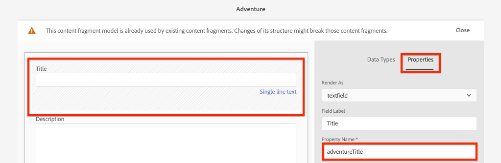
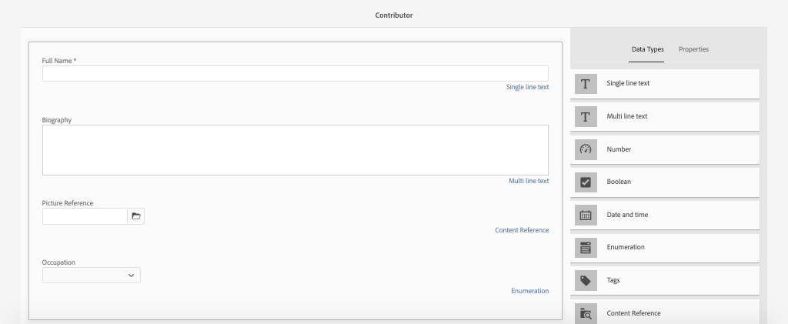

# Definizione dei modelli di frammenti di contenuto {#content-fragment-models}

In questo capitolo scopri come modellare il contenuto e creare uno schema con **Modelli di frammento di contenuto**. Esaminerete i modelli esistenti e creerete un nuovo modello. Inoltre, verranno illustrati i diversi tipi di dati che possono essere utilizzati per definire uno schema come parte del modello.

In questo capitolo verrà creato un nuovo modello per un **Collaboratore**, che è il modello dati per gli utenti che creano contenuti per la rivista e l’avventura come parte del marchio WKND.

## Prerequisiti {#prerequisites}

Si tratta di un tutorial in più parti e si presume che i passaggi descritti in [Configurazione rapida](./setup.md) siano stati completati.

## Obiettivi {#objectives}

* Crea un nuovo modello di frammento di contenuto.
* Identifica i tipi di dati disponibili e le opzioni di convalida per la creazione di modelli.
* Comprendere in che modo il modello per frammenti di contenuto definisce **sia** lo schema dei dati che il modello di creazione per un frammento di contenuto.

## Panoramica modello frammento di contenuto {#overview}

>[!VIDEO](https://video.tv.adobe.com/v/22452/?quality=12&learn=on)

Il video precedente offre una panoramica di alto livello sull’utilizzo dei modelli di frammenti di contenuto.

>[!CAUTION]
>
> Il video precedente mostra la creazione del modello **Collaboratore** con il nome `Contributors`. Quando esegui i passaggi nel tuo ambiente, accertati che il titolo utilizzi il singolo modulo: `Contributor` senza **s**. La denominazione del modello per frammenti di contenuto determina le chiamate API GraphQL che verranno eseguite in seguito nell’esercitazione.

## Inspect, il modello di frammento di contenuto avventuroso

Nel capitolo precedente sono stati modificati e visualizzati su un’applicazione esterna diversi frammenti di contenuto Avventures. Esaminiamo il modello per frammenti di contenuto di avventura per comprendere lo schema dei dati sottostanti di questi frammenti.

1. Dal menu **AEM Avvio** vai a **Strumenti** > **Risorse** > **Modelli di frammento di contenuto**.

   

1. Passa la cartella **Sito WKND** e passa il puntatore del mouse sul modello **Avventura** Frammento di contenuto e fai clic sull&#39;icona **Modifica** (matita) per aprire il modello.

   

1. Viene aperto l’ **Editor modello frammento di contenuto**. Osserva che i campi che definiscono il modello Avventura includono diversi **Tipi di dati** come **Testo a riga singola**, **Testo a riga multipla**, **Enumerazione** e **Riferimento contenuto**.

1. La colonna a destra dell’editor elenca i **Tipi di dati** disponibili, che definiscono i campi del modulo utilizzati per la creazione di frammenti di contenuto.

1. Seleziona il campo **Titolo** nel pannello principale. Nella colonna di destra fai clic sulla scheda **Proprietà** :

   

   Osserva il campo **Nome proprietà** impostato su `adventureTitle`. Definisce il nome della proprietà persistente da AEM. Il **Nome proprietà** definisce anche il nome **chiave** per questa proprietà come parte dello schema dati. Questa **chiave** verrà utilizzata quando i dati dei frammenti di contenuto vengono esposti tramite API GraphQL.

   >[!CAUTION]
   >
   > La modifica del **Nome proprietà** di un campo **dopo che** i frammenti di contenuto sono derivati dal modello ha effetti a valle. I valori dei campi nei frammenti esistenti non saranno più referenziati e lo schema dei dati esposto da GraphQL cambierà, influendo sulle applicazioni esistenti.

1. Scorri verso il basso nella scheda **Proprietà** e visualizza il menu a discesa **Tipo di convalida**.

   

   Le convalide predefinite del modulo sono disponibili per **E-mail** e **URL**. È inoltre possibile definire una convalida **Personalizzata** utilizzando un&#39;espressione regolare.

1. Fai clic su **Annulla** per chiudere l’Editor modello frammento di contenuto.

## Creare un modello per collaboratori

Quindi, crea un nuovo modello per un **Collaboratore**, che è il modello di dati per gli utenti che creano contenuti per la rivista e l’avventura come parte del marchio WKND.

1. Fai clic su **Crea** nell&#39;angolo superiore destro per visualizzare la procedura guidata **Crea modello**.
1. Per **Titolo modello** immetti: **Collaboratore** e fai clic su **Crea**

   

   Fai clic su **Apri** per aprire il modello appena creato.

1. Trascina un elemento **Testo a riga singola** nel pannello principale. Immetti le seguenti proprietà nella scheda **Proprietà** :

   * **Etichetta** campo:  **Nome completo**
   * **Nome proprietà**: `fullName`
   * Controlla **Obbligatorio**

   

1. Fai clic sulla scheda **Tipi di dati** e trascina e rilascia un campo **Testo su più righe** sotto il campo **Nome completo** . Immetti le seguenti proprietà:

   * **Etichetta** campo:  **Biografia**
   * **Nome proprietà**: `biographyText`
   * **Tipo** predefinito:  **Rich Text**

1. Fai clic sulla scheda **Tipi di dati** e trascina e rilascia un campo **Riferimento contenuto** . Immetti le seguenti proprietà:

   * **Etichetta** campo:  **Riferimento immagine**
   * **Nome proprietà**: `pictureReference`
   * **Percorso directory principale**: `/content/dam/wknd`

   Durante la configurazione del **Percorso principale** è possibile fare clic sull&#39;icona **cartella** per visualizzare un modale per selezionare il percorso. Questo limiterà le cartelle che gli autori possono utilizzare per compilare il percorso.

   

1. Aggiungi una convalida al **Picture Reference** in modo che possano essere utilizzati solo i tipi di contenuto di **Images** per compilare il campo.

   

1. Fai clic sulla scheda **Tipi di dati** e trascina e rilascia un tipo di dati **Enumerazione** sotto il campo **Picture Reference** . Immetti le seguenti proprietà:

   * **Etichetta** campo:  **Occupazione**
   * **Nome proprietà**: `occupation`

1. Aggiungi diversi **Opzioni** utilizzando il pulsante **Aggiungi un&#39;opzione** . Utilizza lo stesso valore per **Etichetta opzione** e **Valore opzione**:

   **Artista**,  **Influencer**,  **Fotografo**,  **Viaggiatore**,  **Scrittore**,  **YouTuber**

   

1. Il modello finale **Collaboratore** deve essere simile al seguente:

   

1. Fai clic su **Salva** per salvare le modifiche.

## Attiva il modello per collaboratori

I modelli di frammento di contenuto devono essere **abilitati** prima che gli autori di contenuti possano utilizzarli. È possibile **Disattivare** un modello di frammento di contenuto, vietando così agli autori di utilizzarlo. Ricorda che la modifica di **Nome proprietà** di un campo nel modello modifica lo schema dei dati sottostanti e può avere effetti significativi a valle sui frammenti esistenti e sulle applicazioni esterne. È consigliabile pianificare con attenzione la convenzione di denominazione utilizzata per i campi **Nome proprietà** prima di abilitare il modello di frammento di contenuto per gli utenti.

1. Assicurati che il modello **Collaboratore** sia attualmente in uno stato **Abilitato**.

   

   È possibile attivare o disattivare lo stato di un modello di frammento di contenuto passando con il mouse sulla scheda e facendo clic sull&#39;icona **Disattiva** / **Abilita** .

## Congratulazioni! {#congratulations}

Congratulazioni, hai appena creato il tuo primo modello di frammento di contenuto!

## Passaggi successivi {#next-steps}

Nel capitolo successivo, [Creazione di modelli di frammento di contenuto](author-content-fragments.md), verrà creato e modificato un nuovo frammento di contenuto basato su un modello di frammento di contenuto. Inoltre, verrà illustrato come creare varianti di frammenti di contenuto.