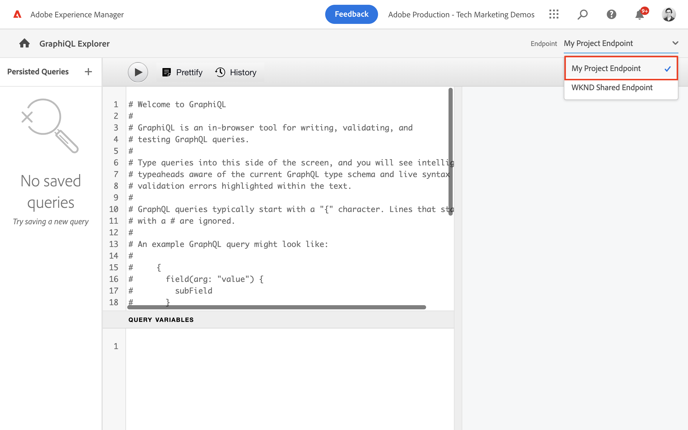

# Esplorare le API GraphQL {#explore-graphql-apis}

L’API GraphQL di AEM fornisce un potente linguaggio di query per esporre i dati dei frammenti di contenuto alle applicazioni a valle. I modelli di frammenti di contenuto definiscono lo schema di dati utilizzato dai frammenti di contenuto. Ogni volta che viene creato o aggiornato un modello di frammento di contenuto, lo schema viene tradotto e aggiunto al &quot;grafico&quot; che costituisce l’API GraphQL.

In questo capitolo verranno esplorate alcune query GraphQL comuni per raccogliere contenuti utilizzando un IDE chiamato [GraphiQL](https://github.com/graphql/graphiql). L&#39;IDE GraphiQL ti consente di testare e perfezionare rapidamente le query e i dati restituiti. GraphiQL offre inoltre un facile accesso alla documentazione, semplificando l’apprendimento e la comprensione dei metodi disponibili.

## Prerequisiti {#prerequisites}

Si tratta di un tutorial in più parti e si presume che i passaggi descritti in [Authoring di frammenti di contenuto](./author-content-fragments.md) sono state completate.

## Obiettivi {#objectives}

* Scopri come utilizzare lo strumento GraphiQL per creare una query utilizzando la sintassi GraphQL.
* Scopri come eseguire una query su un elenco di frammenti di contenuto e un singolo frammento di contenuto.
* Scopri come filtrare e richiedere attributi di dati specifici.
* Scopri come unire una query di più modelli di frammenti di contenuto
* Scopri come mantenere la query GraphQL.

## Abilitare endpoint GraphQL {#enable-graphql-endpoint}

È necessario configurare un endpoint GraphQL per abilitare le query API GraphQL per i frammenti di contenuto.

1. Dalla schermata iniziale AEM passare a **Strumenti** > **Generale** > **GraphQL**.

   

1. Tocca **Crea** nell&#39;angolo in alto a destra. Nella finestra di dialogo immetti i seguenti valori:

   * Nome*: **Endpoint progetto personale**.
   * Utilizza lo schema GraphQL fornito da ... *: **Progetto personale**

   

   Tocca **Crea** per salvare l’endpoint.

   Gli endpoint GraphQL creati in base a una configurazione di progetto abiliteranno solo le query per i modelli appartenenti a tale progetto. In questo caso, le uniche query contro **Persona** e **Team** è possibile utilizzare modelli.

   >[!NOTE]
   >
   > È inoltre possibile creare un endpoint globale per abilitare le query sui modelli in più configurazioni. Questo dovrebbe essere utilizzato con cautela in quanto potrebbe aprire l’ambiente a ulteriori vulnerabilità di sicurezza e aggiungere alla complessità complessiva nella gestione dei AEM.

1. Ora dovresti vedere un endpoint GraphQL abilitato nel tuo ambiente.

   

## Utilizzo dell’IDE GraphiQL

La [Strumento GraphiQL](https://experienceleague.adobe.com/docs/experience-manager-cloud-service/content/headless/graphql-api/graphiql-ide.html) consente agli sviluppatori di creare e testare query rispetto al contenuto nell’ambiente AEM corrente. Lo strumento GraphiQL consente inoltre agli utenti di **persistere** oppure salvare le query da utilizzare nelle applicazioni client in un&#39;impostazione di produzione.

Quindi, scopri la potenza dell’API GraphQL AEM utilizzando l’IDE GraphiQL integrato.

1. Dalla schermata iniziale AEM passare a **Strumenti** > **Generale** > **Editor query GraphQL**.

   

   >[!NOTE]
   >
   > Per le versioni precedenti di AEM l&#39;IDE GraphiQL potrebbe non essere incorporato. Può essere installato manualmente seguendo questi [istruzioni](#install-graphiql).

1. Nell&#39;angolo in alto a destra assicurati che il **Endpoint** è impostato su **Endpoint progetto personale**.

   

In questo modo tutte le query verranno estese ai modelli creati nella **Progetto personale** progetto.

### Query di un elenco di frammenti di contenuto {#query-list-cf}

Un requisito comune consiste nell’eseguire query per più frammenti di contenuto.

1. Incolla la seguente query nel pannello principale (sostituendo l’elenco dei commenti):

   ```graphql
   query allTeams {
     teamList {
       items {
         _path
         title
       }
     }
   } 
   ```

1. Premere **Play** nel menu principale per eseguire la query. Dovresti visualizzare i risultati dei frammenti di contenuto del capitolo precedente:

   

1. Posizionare il cursore sotto il `title` testo e immetti **CTRL+Spazio** per attivare i suggerimenti sul codice. Aggiungi `shortname` e `description` alla query.

   

1. Esegui nuovamente la query premendo il pulsante **Play** e dovresti vedere i risultati che includono le proprietà aggiuntive di `shortname` e `description`.

   

   La `shortname` è una proprietà semplice e `description` è un campo di testo su più righe e l’API GraphQL ci consente di scegliere una varietà di formati per i risultati, come `html`, `markdown`, `json` o `plaintext`.

### Query per frammenti nidificati

Successivamente, l&#39;esperimento con l&#39;esecuzione di query consiste nel recupero dei frammenti nidificati, ricorda che l&#39; **Team** il modello fa riferimento a **Persona** modello.

1. Aggiorna la query per includere la `teamMembers` proprietà. Ricorda che si tratta di un **Riferimento frammento** al modello persona. È possibile restituire le proprietà del modello Persona:

   ```graphql
   query allTeams {
       teamList {
           items {
               _path
               title
               shortName
               description {
                   plaintext
               }
               teamMembers {
                   fullName
                   occupation
               }
           }
       }
   }
   ```

   Risposta JSON:

   ```json
   {
       "data": {
           "teamList": {
           "items": [
               {
               "_path": "/content/dam/my-project/en/team-alpha",
               "title": "Team Alpha",
               "shortName": "team-alpha",
               "description": {
                   "plaintext": "This is a description of Team Alpha!"
               },
               "teamMembers": [
                   {
                   "fullName": "John Doe",
                   "occupation": [
                       "Artist",
                       "Influencer"
                   ]
                   },
                   {
                   "fullName": "Alison Smith",
                   "occupation": [
                       "Photographer"
                   ]
                   }
                 ]
           }
           ]
           }
       }
   }
   ```

   La capacità di eseguire query sui frammenti nidificati è un potente dell’API GraphQL di AEM. In questo semplice esempio la nidificazione è profonda solo due livelli. Tuttavia, è possibile nidificare ulteriormente i frammenti. Ad esempio, se è presente un **Indirizzo** modello associato a un **Persona** sarebbe possibile restituire i dati di tutti e tre i modelli in un’unica query.

### Filtrare un elenco di frammenti di contenuto {#filter-list-cf}

Ora, vediamo come è possibile filtrare i risultati in un sottoinsieme di frammenti di contenuto in base a un valore di proprietà.

1. Immetti la seguente query nell’interfaccia utente GraphiQL:

   ```graphql
   query personByName($name:String!){
     personList(
       filter:{
         fullName:{
           _expressions:[{
             value:$name
             _operator:EQUALS
           }]
         }
       }
     ){
       items{
         _path
         fullName
         occupation
       }
     }
   }  
   ```

   La query di cui sopra esegue una ricerca per tutti i frammenti Persona nel sistema. Il filtro aggiunto all’inizio della query eseguirà un confronto tra `name` e la stringa della variabile `$name`.

1. In **Variabili di query** inserisci quanto segue:

   ```json
   {"name": "John Doe"}
   ```

1. Esegui la query, è previsto che solo **Persone** viene restituito con un valore di &quot;John Doe&quot;.

   

   Esistono molte altre opzioni per filtrare e creare query complesse, vedi [Imparare a utilizzare GraphQL con AEM - Contenuto di esempio e query](https://experienceleague.adobe.com/docs/experience-manager-cloud-service/assets/admin/content-fragments-graphql-samples.html?lang=it).

1. Ottimizza la query di cui sopra per recuperare l’immagine del profilo

   ```graphql
   query personByName($name:String!){
     personList(
       filter:{
         fullName:{
           _expressions:[{
             value:$name
             _operator:EQUALS
           }]
         }
       }
     ){
       items{  
         _path
         fullName
         occupation
         profilePicture{
           ... on ImageRef{
             _path
             _authorUrl
             _publishUrl
             height
             width
   
           }
         }
       }
     }
   } 
   ```

   La `profilePicture` è un riferimento al contenuto e si prevede che sia un&#39;immagine, quindi incorporato `ImageRef` viene utilizzato l&#39;oggetto . Questo ci consente di richiedere dati aggiuntivi sull&#39;immagine a cui fare riferimento, come il `width` e `height`.

### Eseguire una query su un singolo frammento di contenuto {#query-single-cf}

È inoltre possibile eseguire query dirette su un singolo frammento di contenuto. Il contenuto in AEM viene memorizzato in modo gerarchico e l’identificatore univoco di un frammento è basato sul percorso del frammento.

1. Immetti la seguente query nell&#39;editor GraphiQL:

   ```graphql
   query personByPath($path: String!) {
       personByPath(_path: $path) {
           item {
           fullName
           occupation
           }
       }
   }
   ```

1. Immetti quanto segue per il **Variabili di query**:

   ```json
   {"path": "/content/dam/my-project/en/alison-smith"}
   ```

1. Esegui la query e osserva che viene restituito il singolo risultato.

## Query permanenti {#persist-queries}

Una volta che uno sviluppatore è soddisfatto della query e dei dati restituiti, il passaggio successivo consiste nell’memorizzare o mantenere la query in AEM. [Query persistenti](https://experienceleague.adobe.com/docs/experience-manager-cloud-service/content/headless/graphql-api/persisted-queries.html) è il meccanismo preferito per l’esposizione dell’API GraphQL alle applicazioni client. Una volta che una query è persistente, può essere richiesta utilizzando una richiesta GET e memorizzata nella cache ai livelli Dispatcher e CDN. Le prestazioni delle query persistenti sono molto migliori. Oltre ai vantaggi in termini di prestazioni, le query persistenti garantiscono che i dati aggiuntivi non siano accidentalmente esposti alle applicazioni client. Maggiori dettagli [Le query persistenti si trovano qui](https://experienceleague.adobe.com/docs/experience-manager-cloud-service/content/headless/graphql-api/persisted-queries.html).

Successivamente, persistono due semplici query, che vengono utilizzate nel capitolo successivo.

1. Nell&#39;IDE GraphiQL immetti la seguente query:

   ```graphql
   query allTeams {
       teamList {
           items {
               _path
               title
               shortName
               description {
                   plaintext
               }
               teamMembers {
                   fullName
                   occupation
               }
           }
       }
   }
   ```

   Verifica che la query funzioni.

1. Tocca successivo **Salva con nome** e immetti `all-teams` come **Nome query**.

   La query deve ora essere visualizzata in **Query persistenti** nella barra a sinistra.

   
1. Tocca quindi le eliche **...** accanto alla query persistente e toccare **Copia URL** per copiare il percorso negli Appunti.

   

1. Apri una nuova scheda e incolla il percorso copiato nel browser:

   ```plain
   https://$YOUR-AEMasCS-INSTANCEID$.adobeaemcloud.com/graphql/execute.json/my-project/all-teams
   ```

   Dovrebbe essere simile al percorso indicato sopra. Dovresti visualizzare i risultati JSON della query restituita.

   Scomposizione dell’URL:

   | Nome | Descrizione |
   | ---------|---------- |
   | `/graphql/execute.json` | Endpoint di query persistente |
   | `/my-project` | Configurazione del progetto per `/conf/my-project` |
   | `/all-teams` | Nome della query permanente |

1. Torna all&#39;IDE GraphiQL e utilizza il pulsante più **+** per mantenere la query NEW

   ```graphql
   query personByName($name: String!) {
     personList(
       filter: {
         fullName:{
           _expressions: [{
             value: $name
             _operator:EQUALS
           }]
         }
       }){
       items {
         _path
         fullName
         occupation
         biographyText {
           json
         }
         profilePicture {
           ... on ImageRef {
             _path
             _authorUrl
             _publishUrl
             width
             height
           }
         }
       }
     }
   }
   ```

1. Salva la query come: **persona per nome**.
1. È necessario salvare 2 query persistenti:

   


## Pubblica endpoint GraphQL e query persistenti

Al momento della revisione e della verifica, pubblica il `GraphQL Endpoint` &amp; `Persisted Queries`

1. Dalla schermata iniziale AEM passare a **Strumenti** > **Generale** > **GraphQL**.

1. Tocca la casella di controllo accanto a **Endpoint progetto personale** e toccare **Pubblica**

   

1. Dalla schermata iniziale AEM passare a **Strumenti** > **Generale** > **Editor query GraphQL**

1. Tocca *all-team* dal pannello Query persistenti e tocca **Pubblica**

   

1. Ripeti il passaggio precedente per `person-by-name` query

## File della soluzione {#solution-files}

Scarica il contenuto, i modelli e le query permanenti create negli ultimi tre capitoli: [tutorial-solution-content.zip](assets/explore-graphql-api/tutorial-solution-content.zip)

## Risorse aggiuntive

Per molti altri esempi di query GraphQL vedi: [Imparare a utilizzare GraphQL con AEM - Contenuto di esempio e query](https://experienceleague.adobe.com/docs/experience-manager-cloud-service/assets/admin/content-fragments-graphql-samples.html).

## Congratulazioni! {#congratulations}

Congratulazioni, hai appena creato ed eseguito diverse query GraphQL!

## Passaggi successivi {#next-steps}

Nel capitolo successivo, [Creare un’app React](./graphql-and-react-app.md), scoprirai come un’applicazione esterna può eseguire query AEM endpoint GraphQL e sfruttare queste due query persistenti. Verrà inoltre introdotta una procedura di base per la gestione degli errori.

## Installare lo strumento GraphiQL (facoltativo) {#install-graphiql}

Per alcune versioni di AEM lo strumento IDE GraphiQL deve essere installato manualmente. Segui le istruzioni riportate di seguito per installare manualmente:

1. Vai a **[Portale di distribuzione software](https://experience.adobe.com/#/downloads/content/software-distribution/it/aemcloud.html)** > **AEM as a Cloud Service**.
1. Cerca “GraphiQL” (assicurati di includere **i** in **GraphiQL**.
1. Scarica la versione più recente del **pacchetto di contenuti GraphiQL v.x.x.x**

   

   Il file zip è un pacchetto AEM che può essere installato direttamente.

1. Dal menu **Start di AEM**, vai a **Strumenti** > **Distribuzione** > **Pacchetti**.
1. Fai clic su **Carica pacchetto**, quindi seleziona il pacchetto scaricato nel passaggio precedente. Per installare il pacchetto, fai clic su **Installa**.

   
