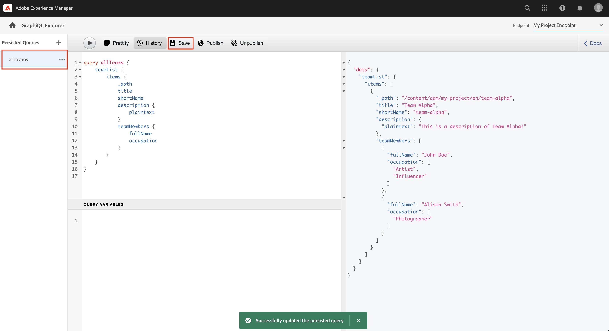

# Esplora le API di GraphQL {#explore-graphql-apis}

L’API GraphQL dell’AEM fornisce un potente linguaggio di query per esporre i dati dei frammenti di contenuto alle applicazioni a valle. I modelli per frammenti di contenuto definiscono lo schema di dati utilizzato dai frammenti di contenuto. Ogni volta che un modello per frammenti di contenuto viene creato o aggiornato, lo schema viene tradotto e aggiunto al &quot;grafico&quot; che costituisce l’API di GraphQL.

In questo capitolo, esploreremo alcune query GraphQL comuni per raccogliere contenuti utilizzando un IDE denominato [GraphiQL](https://github.com/graphql/graphiql). L’IDE GraphiQL consente di testare e perfezionare rapidamente le query e i dati restituiti. Consente inoltre di accedere facilmente alla documentazione, per scoprire e comprendere facilmente i metodi disponibili.

## Prerequisiti {#prerequisites}

Si tratta di un tutorial in più parti in cui si presume che i passaggi descritti in [Creazione di frammenti di contenuto](./author-content-fragments.md) sono state completate.

## Obiettivi {#objectives}

* Scopri come utilizzare lo strumento GraphiQL per creare una query utilizzando la sintassi GraphQL.
* Scopri come eseguire query su un elenco di frammenti di contenuto e un singolo frammento di contenuto.
* Scopri come filtrare e richiedere attributi di dati specifici.
* Scopri come unire una query di più modelli per frammenti di contenuto
* Scopri come rendere persistente la query GraphQL.

## Abilitare endpoint GraphQL {#enable-graphql-endpoint}

È necessario configurare un endpoint GraphQL per abilitare le query API GraphQL per i frammenti di contenuto.

1. Dalla schermata iniziale dell’AEM, passa a **Strumenti** > **Generale** > **GraphQL**.

   

1. Tocca **Crea** nell’angolo in alto a destra, nella finestra di dialogo risultante inserisci i seguenti valori:

   * Nome*: **Endpoint progetto personale**.
   * Utilizza lo schema GraphQL fornito da ... *: **Il mio progetto**

   

   Tocca **Crea** per salvare l’endpoint.

   Gli endpoint di GraphQL creati in base alla configurazione di un progetto abilitano solo le query sui modelli appartenenti a tale progetto. In questo caso, le uniche query per **Persona** e **Team** possono essere utilizzati.

   >[!NOTE]
   >
   > È inoltre possibile creare un endpoint globale per abilitare le query sui modelli in più configurazioni. Questo deve essere utilizzato con cautela in quanto può aprire l’ambiente a ulteriori vulnerabilità di sicurezza e aumentare la complessità complessiva nella gestione dell’AEM.

1. Ora dovrebbe essere abilitato un endpoint GraphQL nel tuo ambiente.

   

## Utilizzo dell’IDE GraphiQL

Il [GraphiQL](https://experienceleague.adobe.com/docs/experience-manager-cloud-service/content/headless/graphql-api/graphiql-ide.html) consente agli sviluppatori di creare e testare query sui contenuti nell’ambiente AEM corrente. Lo strumento GraphiQL consente inoltre agli utenti di: **persistere o salvare** query che devono essere utilizzate dalle applicazioni client in un&#39;impostazione di produzione.

Quindi, esplora la potenza dell’API GraphQL dell’AEM utilizzando l’IDE GraphiQL integrato.

1. Dalla schermata iniziale dell’AEM, passa a **Strumenti** > **Generale** > **Editor query di GraphQL**.

   

   >[!NOTE]
   >
   > In, le versioni precedenti di AEM e IDE GraphiQL potrebbero non essere integrate. Può essere installato manualmente seguendo queste istruzioni [istruzioni](#install-graphiql).

1. Nell’angolo in alto a destra, accertati che Endpoint sia impostato su **Endpoint progetto personale**.

   

In questo modo tutte le query verranno estese ai modelli creati nel **Il mio progetto** progetto.

### Eseguire una query su un elenco di frammenti di contenuto {#query-list-cf}

Un requisito comune consiste nell’eseguire query per più frammenti di contenuto.

1. Incolla la seguente query nel pannello principale (sostituendo l’elenco dei commenti):

   ```graphql
   query allTeams {
     teamList {
       items {
         _path
         title
       }
     }
   } 
   ```

1. Premere il tasto **Play** nel menu principale per eseguire la query. Dovresti visualizzare i risultati dei frammenti di contenuto del capitolo precedente:

   

1. Posiziona il cursore sotto il `title` testo e immetti **CTRL+spazio** per attivare suggerimenti sul codice. Aggiungi `shortname` e `description` alla query.

   

1. Eseguire nuovamente la query premendo il tasto **Play** e dovresti vedere che i risultati includono le proprietà aggiuntive di `shortname` e `description`.

   

   Il `shortname` è una proprietà semplice e `description` è un campo di testo su più righe e l’API GraphQL consente di scegliere vari formati per i risultati, come `html`, `markdown`, `json`, o `plaintext`.

### Query per frammenti nidificati

Successivamente, esperimento con query è il recupero di frammenti nidificati, ricorda che il **Team** il modello fa riferimento al **Persona** modello.

1. Aggiorna la query per includere `teamMembers` proprietà. Ricorda che si tratta di un **Riferimento frammento** al modello della persona. È possibile restituire le proprietà del modello Persona:

   ```graphql
   query allTeams {
       teamList {
           items {
               _path
               title
               shortName
               description {
                   plaintext
               }
               teamMembers {
                   fullName
                   occupation
               }
           }
       }
   }
   ```

   Risposta JSON:

   ```json
   {
       "data": {
           "teamList": {
           "items": [
               {
               "_path": "/content/dam/my-project/en/team-alpha",
               "title": "Team Alpha",
               "shortName": "team-alpha",
               "description": {
                   "plaintext": "This is a description of Team Alpha!"
               },
               "teamMembers": [
                   {
                   "fullName": "John Doe",
                   "occupation": [
                       "Artist",
                       "Influencer"
                   ]
                   },
                   {
                   "fullName": "Alison Smith",
                   "occupation": [
                       "Photographer"
                   ]
                   }
                 ]
           }
           ]
           }
       }
   }
   ```

   La possibilità di eseguire query sui frammenti nidificati è una potente funzione dell’API GraphQL dell’AEM. In questo semplice esempio, la nidificazione è profonda solo due livelli. Tuttavia, è possibile nidificare ulteriormente i frammenti. Ad esempio, se è stato **Indirizzo** modello associato a un **Persona** sarebbe possibile restituire dati da tutti e tre i modelli in una singola query.

### Filtrare un elenco di frammenti di contenuto {#filter-list-cf}

Vediamo ora come è possibile filtrare i risultati in un sottoinsieme di frammenti di contenuto in base a un valore di proprietà.

1. Immetti la seguente query nell’interfaccia utente GraphiQL:

   ```graphql
   query personByName($name:String!){
     personList(
       filter:{
         fullName:{
           _expressions:[{
             value:$name
             _operator:EQUALS
           }]
         }
       }
     ){
       items{
         _path
         fullName
         occupation
       }
     }
   }  
   ```

   La query precedente esegue una ricerca in tutti i frammenti Persona nel sistema. Il filtro aggiunto all’inizio della query esegue un confronto sulla `name` e la stringa della variabile `$name`.

1. In **Variabili di query** immetti quanto segue:

   ```json
   {"name": "John Doe"}
   ```

1. Esegui la query. È previsto che solo **Persone** Il frammento di contenuto viene restituito con il valore `John Doe`.

   

   Esistono molte altre opzioni per filtrare e creare query complesse. Consulta [Imparare a utilizzare GraphQL con AEM: contenuto di esempio e query](https://experienceleague.adobe.com/docs/experience-manager-cloud-service/content/headless/graphql-api/sample-queries.html).

1. Migliora la query precedente per recuperare l’immagine del profilo

   ```graphql
   query personByName($name:String!){
     personList(
       filter:{
         fullName:{
           _expressions:[{
             value:$name
             _operator:EQUALS
           }]
         }
       }
     ){
       items{  
         _path
         fullName
         occupation
         profilePicture{
           ... on ImageRef{
             _path
             _authorUrl
             _publishUrl
             height
             width
   
           }
         }
       }
     }
   } 
   ```

   Il `profilePicture` è un riferimento di contenuto e deve essere un’immagine, pertanto è incorporato `ImageRef` viene utilizzato l&#39;oggetto. Questo ci consente di richiedere dati aggiuntivi sull’immagine da usare come riferimento, come `width` e `height`.

### Eseguire una query su un singolo frammento di contenuto {#query-single-cf}

È inoltre possibile eseguire query dirette su un singolo frammento di contenuto. Il contenuto dell’AEM viene archiviato in modo gerarchico e l’identificatore univoco di un frammento si basa sul percorso del frammento.

1. Immetti la seguente query nell’editor GraphiQL:

   ```graphql
   query personByPath($path: String!) {
       personByPath(_path: $path) {
           item {
           fullName
           occupation
           }
       }
   }
   ```

1. Immetti quanto segue per **Variabili di query**:

   ```json
   {"path": "/content/dam/my-project/en/alison-smith"}
   ```

1. Esegui la query e osserva che viene restituito il singolo risultato.

## Query persistenti {#persist-queries}

Quando uno sviluppatore è soddisfatto della query e dei dati dei risultati restituiti dalla query, il passaggio successivo consiste nel memorizzare o mantenere la query nell’AEM. Il [Query persistenti](https://experienceleague.adobe.com/docs/experience-manager-cloud-service/content/headless/graphql-api/persisted-queries.html) sono il meccanismo preferito per esporre l’API GraphQL alle applicazioni client. Una volta che una query è stata resa persistente, può essere richiesta utilizzando una richiesta GET e memorizzata nella cache ai livelli Dispatcher e CDN. Le prestazioni delle query persistenti sono molto migliori. Oltre ai vantaggi in termini di prestazioni, le query persistenti garantiscono che i dati aggiuntivi non vengano accidentalmente esposti alle applicazioni client. Ulteriori dettagli su [Le query persistenti si trovano qui](https://experienceleague.adobe.com/docs/experience-manager-cloud-service/content/headless/graphql-api/persisted-queries.html).

Quindi, affinché persistano due query semplici, queste vengono utilizzate nel capitolo successivo.

1. Immetti la seguente query nell’IDE GraphiQL:

   ```graphql
   query allTeams {
       teamList {
           items {
               _path
               title
               shortName
               description {
                   plaintext
               }
               teamMembers {
                   fullName
                   occupation
               }
           }
       }
   }
   ```

   Verifica che la query funzioni.

1. Tocco successivo **Salva con nome** e immetti `all-teams` come **Nome query**.

   La query deve essere visualizzata in **Query persistenti** nella barra a sinistra.

   
1. Tocca quindi i puntini di sospensione **...** accanto alla query persistente e tocca **Copia URL** per copiare il percorso negli Appunti.

   

1. Apri una nuova scheda e incolla il percorso copiato nel browser:

   ```plain
   https://$YOUR-AEMasCS-INSTANCEID$.adobeaemcloud.com/graphql/execute.json/my-project/all-teams
   ```

   Deve essere simile al percorso precedente. Dovresti vedere che sono stati restituiti i risultati JSON della query.

   Suddivisione dell’URL precedente:

   | Nome | Descrizione |
   | ---------|---------- |
   | `/graphql/execute.json` | Endpoint di query persistente |
   | `/my-project` | Configurazione del progetto per `/conf/my-project` |
   | `/all-teams` | Nome della query persistente |

1. Torna all’IDE GraphiQL e utilizza il pulsante più **+** per rendere persistente la query NEW

   ```graphql
   query personByName($name: String!) {
     personList(
       filter: {
         fullName:{
           _expressions: [{
             value: $name
             _operator:EQUALS
           }]
         }
       }){
       items {
         _path
         fullName
         occupation
         biographyText {
           json
         }
         profilePicture {
           ... on ImageRef {
             _path
             _authorUrl
             _publishUrl
             width
             height
           }
         }
       }
     }
   }
   ```

1. Salva la query con nome: `person-by-name`.
1. Dovresti salvare due query persistenti:

   


## Pubblicare endpoint GraphQL e query persistenti

In seguito a revisione e verifica, pubblica `GraphQL Endpoint` E `Persisted Queries`

1. Dalla schermata iniziale dell’AEM, passa a **Strumenti** > **Generale** > **GraphQL**.

1. Tocca la casella di controllo accanto a **Endpoint progetto personale** e tocca **Pubblica**

   

1. Dalla schermata iniziale dell’AEM, passa a **Strumenti** > **Generale** > **Editor query di GraphQL**

1. Tocca il **all-teams** query dal pannello Query persistenti e tocca **Pubblica**

   

1. Ripeti il passaggio precedente per `person-by-name` query

## File di soluzione {#solution-files}

Scarica i contenuti, i modelli e le query persistenti creati negli ultimi tre capitoli: [basic-tutorial-solution.content.zip](assets/explore-graphql-api/basic-tutorial-solution.content.zip)

## Risorse aggiuntive

Ulteriori informazioni sulle query GraphQL sono disponibili all’indirizzo [Imparare a utilizzare GraphQL con AEM: contenuto di esempio e query](https://experienceleague.adobe.com/docs/experience-manager-cloud-service/content/headless/graphql-api/sample-queries.html).

## Congratulazioni. {#congratulations}

Congratulazioni, hai creato ed eseguito diverse query GraphQL.

## Passaggi successivi {#next-steps}

Nel prossimo capitolo, [Creare un’app React](./graphql-and-react-app.md), scopri come un’applicazione esterna può eseguire query sugli endpoint AEM GraphQL e utilizzare queste due query persistenti. Vengono inoltre presentate alcune informazioni di base sulla gestione degli errori durante l’esecuzione di query GraphQL.

## Installare lo strumento GraphiQL (facoltativo) {#install-graphiql}

In, alcune versioni di AEM (6.X.X) lo strumento IDE GraphiQL deve essere installato manualmente, utilizza [istruzioni da qui](../how-to/install-graphiql-aem-6-5.md).

