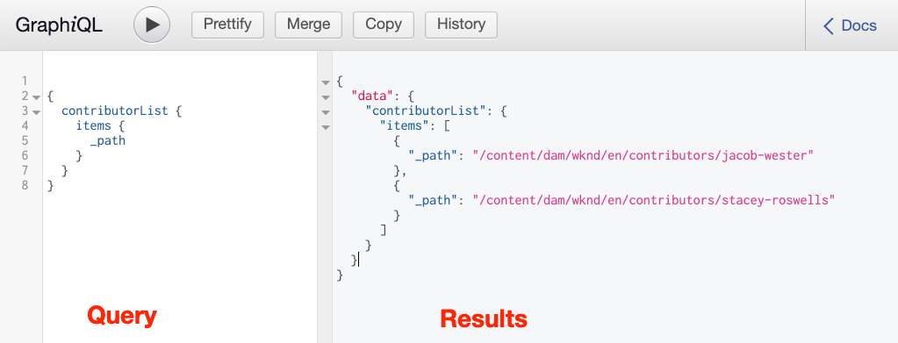
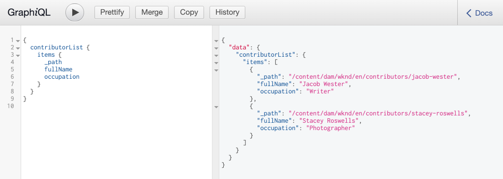

# Esplorare le API GraphQL {#explore-graphql-apis}

L’API GraphQL di AEM fornisce un potente linguaggio di query per esporre i dati dei frammenti di contenuto alle applicazioni a valle. I modelli di frammenti di contenuto definiscono lo schema di dati utilizzato dai frammenti di contenuto. Ogni volta che viene creato o aggiornato un modello di frammento di contenuto, lo schema viene tradotto e aggiunto al &quot;grafico&quot; che costituisce l’API GraphQL.

In questo capitolo, esploreremo alcune query GraphQL comuni per raccogliere contenuti utilizzando un IDE chiamato [GraphiQL](https://github.com/graphql/graphiql). L&#39;IDE GraphiQL ti consente di testare e perfezionare rapidamente le query e i dati restituiti. GraphiQL fornisce inoltre un facile accesso alla documentazione, facilitando l&#39;apprendimento e la comprensione dei metodi disponibili.

## Prerequisiti {#prerequisites}

Si tratta di un tutorial in più parti e si presume che i passaggi descritti in [Creazione di frammenti di contenuto](./author-content-fragments.md) siano stati completati.

## Obiettivi {#objectives}

* Scopri come utilizzare lo strumento GraphiQL per creare una query utilizzando la sintassi GraphQL.
* Scopri come eseguire una query su un elenco di frammenti di contenuto e un singolo frammento di contenuto.
* Scopri come filtrare e richiedere attributi di dati specifici.
* Scopri come eseguire una query su una variante di un frammento di contenuto.
* Scopri come unire una query di più modelli di frammenti di contenuto

## Installare lo strumento GraphiQL {#install-graphiql}

L&#39;IDE GraphiQL è uno strumento di sviluppo e necessario solo in ambienti di livello inferiore come uno sviluppo o un&#39;istanza locale. Pertanto non è incluso nel progetto AEM, ma viene fornito come pacchetto separato che può essere installato su base ad hoc.

1. Passa al **[portale di distribuzione software](https://experience.adobe.com/#/downloads/content/software-distribution/it/aemcloud.html)** > **AEM come Cloud Service**.
1. Cerca &quot;GraphiQL&quot; (assicurati di includere **i** in **GraphiQL**.
1. Scarica l&#39;ultimo **pacchetto di contenuti GraphiQL v.x.x.x**

   

   Il file zip è un pacchetto AEM che può essere installato direttamente.

1. Dal menu **AEM Avvio** vai a **Strumenti** > **Implementazione** > **Pacchetti**.
1. Fai clic su **Carica pacchetto** e scegli il pacchetto scaricato nel passaggio precedente. Fai clic su **Installa** per installare il pacchetto.

   

## Query di un elenco di frammenti di contenuto {#query-list-cf}

Un requisito comune consiste nell’eseguire query per più frammenti di contenuto.

1. Passa all&#39;IDE GraphiQL in [http://localhost:4502/content/graphiql.html](http://localhost:4502/content/graphiql.html).
1. Incolla la seguente query nel pannello a sinistra (sotto l’elenco dei commenti):

   ```graphql
   {
     contributorList {
       items {
           _path
         }
     }
   }
   ```

1. Premere il pulsante **Play** nel menu principale per eseguire la query. Dovresti visualizzare i risultati dei frammenti di contenuto dei collaboratori del capitolo precedente:

   

1. Posiziona il cursore sotto il testo `_path` e immetti **CTRL+Spazio** per attivare la creazione di suggerimenti sul codice. Aggiungi `fullName` e `occupation` alla query.

   

1. Esegui nuovamente la query premendo il pulsante **Play** e dovresti vedere i risultati che includono le proprietà aggiuntive di `fullName` e `occupation`.

   

   `fullName` e  `occupation` sono proprietà semplici. Ricorda dal capitolo [Definizione dei modelli di frammento di contenuto](./content-fragment-models.md) che `fullName` e `occupation` sono i valori utilizzati per definire il **Nome proprietà** dei rispettivi campi.

1. `pictureReference` e  `biographyText` rappresentano campi più complessi. Aggiorna la query con quanto segue per restituire i dati sui campi `pictureReference` e `biographyText` .

   ```graphql
   {
   contributorList {
       items {
         _path
         fullName
         occupation
         biographyText {
           html
         }
         pictureReference {
           ... on ImageRef {
               _path
               width
               height
               }
           }
       }
     }
   }
   ```

   `biographyText` è un campo di testo su più righe e l’API GraphQL ci consente di scegliere una varietà di formati per i risultati come  `html`,  `markdown`,  `json` o  `plaintext`.

   `pictureReference` è un riferimento al contenuto e si prevede che sia un&#39;immagine, quindi viene utilizzato  `ImageRef` l&#39;oggetto incorporato. Questo ci consente di richiedere dati aggiuntivi sull&#39;immagine come riferimento, come i `width` e `height`.

1. Quindi, prova a eseguire una query per ottenere un elenco di **Avventure**. Esegui la seguente query:

   ```graphql
   {
     adventureList {
       items {
         adventureTitle
         adventureType
         adventurePrimaryImage {
           ...on ImageRef {
             _path
             mimeType
           }
         }
       }
     }
   }
   ```

   Dovresti trovare un elenco di **Avventure** restituite. Puoi provare l’aggiunta di campi aggiuntivi alla query.

## Filtrare un elenco di frammenti di contenuto {#filter-list-cf}

Ora, vediamo come è possibile filtrare i risultati in un sottoinsieme di frammenti di contenuto in base a un valore di proprietà.

1. Immetti la seguente query nell’interfaccia utente GraphiQL:

   ```graphql
   {
   contributorList(filter: {
     occupation: {
       _expressions: {
         value: "Photographer"
         }
       }
     }) {
       items {
         _path
         fullName
         occupation
       }
     }
   }
   ```

   La query di cui sopra esegue una ricerca contro tutti i collaboratori del sistema. Il filtro aggiunto all&#39;inizio della query eseguirà un confronto sul campo `occupation` e sulla stringa &quot;**Fotografo**&quot;.

1. Esegui la query. È previsto che venga restituito un solo **Collaboratore**.
1. Immetti la seguente query per eseguire una query su un elenco di **Avventure** in cui `adventureActivity` è **non** uguale a **&quot;Surfing&quot;**:

   ```graphql
   {
     adventureList(filter: {
       adventureActivity: {
           _expressions: {
               _operator: EQUALS_NOT
               value: "Surfing"
           }
       }
   }) {
       items {
       _path
       adventureTitle
       adventureActivity
       }
     }
   }
   ```

1. Esegui la query ed esamina i risultati. Osserva che nessuno dei risultati include un `adventureType` uguale a **&quot;Surfing&quot;**.

Ci sono molte altre opzioni per filtrare e creare query complesse, sopra sono solo alcuni esempi.

## Eseguire una query su un singolo frammento di contenuto {#query-single-cf}

È inoltre possibile eseguire query dirette su un singolo frammento di contenuto. Il contenuto in AEM viene memorizzato in modo gerarchico e l’identificatore univoco di un frammento è basato sul percorso del frammento. Se l’obiettivo è quello di restituire i dati su un singolo frammento, è preferibile utilizzare il percorso ed eseguire direttamente una query sul modello. Utilizzando questa sintassi, la complessità della query sarà molto bassa e genererà un risultato più rapido.

1. Immetti la seguente query nell&#39;editor GraphiQL:

   ```graphql
   {
    contributorByPath(_path: "/content/dam/wknd/en/contributors/stacey-roswells") {
       item {
         _path
         fullName
         biographyText {
           html
         }
       }
     }
   }
   ```

1. Esegui la query e osserva che viene restituito il singolo risultato per il frammento **Stacey Roswells** .

   Nell’esercizio precedente, hai utilizzato un filtro per limitare un elenco di risultati. Puoi utilizzare una sintassi simile per filtrare in base al percorso, tuttavia la sintassi di cui sopra è preferita per motivi di prestazioni.

1. Nel capitolo [Authoring Content Fragments](./author-content-fragments.md) si ricorda che è stata creata una variante **Summary** per **Stacey Roswells**. Aggiorna la query per restituire la variante **Summary** :

   ```graphql
   {
   contributorByPath
   (
       _path: "/content/dam/wknd/en/contributors/stacey-roswells"
       variation: "summary"
   ) {
       item {
         _path
         fullName
         biographyText {
           html
         }
       }
     }
   }
   ```

   Anche se la variante è stata denominata **Summary**, le varianti vengono mantenute in lettere minuscole e quindi viene utilizzato `summary`.

1. Esegui la query e osserva che il campo `biography` contiene un risultato molto più breve `html`.

## Query per più modelli di frammenti di contenuto {#query-multiple-models}

È inoltre possibile combinare query separate in una singola query. Questa funzione è utile per ridurre al minimo il numero di richieste HTTP necessarie per alimentare l’applicazione. Ad esempio, la visualizzazione *Home* di un&#39;applicazione può visualizzare contenuti basati su **due** modelli di frammenti di contenuto diversi. Invece di eseguire **due** query separate, possiamo combinare le query in una singola richiesta.

1. Immetti la seguente query nell&#39;editor GraphiQL:

   ```graphql
   {
     adventureList {
       items {
         _path
         adventureTitle
       }
     }
     contributorList {
       items {
         _path
         fullName
       }
     }
   }
   ```

1. Esegui la query e osserva che il set di risultati contiene i dati di **Avventure** e **Collaboratori**:

```json
{
  "data": {
    "adventureList": {
      "items": [
        {
          "_path": "/content/dam/wknd/en/adventures/bali-surf-camp/bali-surf-camp",
          "adventureTitle": "Bali Surf Camp"
        },
        {
          "_path": "/content/dam/wknd/en/adventures/beervana-portland/beervana-in-portland",
          "adventureTitle": "Beervana in Portland"
        },
        ...
      ]
    },
    "contributorList": {
      "items": [
        {
          "_path": "/content/dam/wknd/en/contributors/jacob-wester",
          "fullName": "Jacob Wester"
        },
        {
          "_path": "/content/dam/wknd/en/contributors/stacey-roswells",
          "fullName": "Stacey Roswells"
        }
      ]
    }
  }
}
```

## Risorse aggiuntive

Per molti altri esempi di query GraphQL vedi: [Imparare a utilizzare GraphQL con AEM - Contenuto di esempio e query](https://experienceleague.adobe.com/docs/experience-manager-cloud-service/assets/admin/content-fragments-graphql-samples.html).

## Congratulazioni! {#congratulations}

Congratulazioni, hai appena creato ed eseguito diverse query GraphQL!

## Passaggi successivi {#next-steps}

Nel capitolo successivo, [Query AEM da un&#39;app React](./graphql-and-external-app.md), verrà illustrato come un&#39;applicazione esterna può eseguire query AEM endpoint GraphQL. L’app esterna che modifica l’app WKND GraphQL React di esempio per aggiungere filtri alle query GraphQL, consentendo all’utente dell’app di filtrare le avventure in base all’attività. Verrà inoltre introdotta una procedura di base per la gestione degli errori.
