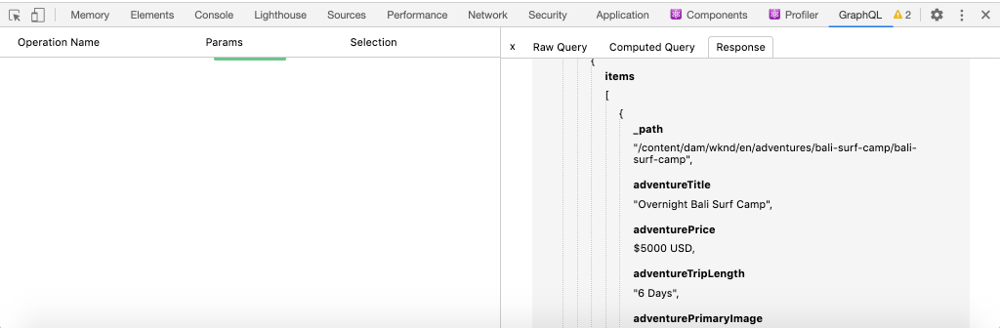

# Query AEM utilizzando GraphQL da un’app esterna

In questo capitolo viene illustrato come AEM le API GraphQL possono essere utilizzate per gestire l’esperienza in un’applicazione esterna.

Questa esercitazione utilizza una semplice app React per eseguire query e visualizzare il contenuto avventura esposto dalle API GraphQL di AEM. L&#39;utilizzo di React è in gran parte poco importante e l&#39;applicazione esterna consueta potrebbe essere scritta in qualsiasi struttura per qualsiasi piattaforma.

## Prerequisiti

Si tratta di un tutorial in più parti e si presume che i passaggi descritti nelle parti precedenti siano stati completati.

_Le schermate IDE in questo capitolo provengono da [Codice di Visual Studio](https://code.visualstudio.com/)_

Facoltativamente, installa un&#39;estensione del browser come [Ispettore di rete GraphQL](https://chrome.google.com/webstore/detail/graphql-network-inspector/ndlbedplllcgconngcnfmkadhokfaaln) per visualizzare ulteriori dettagli su una query GraphQL.

## Obiettivi

In questo capitolo impareremo come:

* Avviare e comprendere le funzionalità dell’app React di esempio
* Scopri come vengono effettuate le chiamate dall’app esterna per AEM i punti finali di GraphQL
* Definire una query GraphQL per filtrare un elenco di frammenti di contenuto di avventure per attività
* Aggiorna l’app React per fornire controlli per filtrare tramite GraphQL, l’elenco delle avventure per attività

## Avvia l&#39;app React

Poiché questo capitolo si concentra sullo sviluppo di un client per utilizzare frammenti di contenuto su GraphQL, l’esempio [WKND GraphQL React codice sorgente app deve essere scaricato e configurato](../quick-setup/local-sdk.md) sulla macchina locale.

L’avvio dell’app React è descritto più dettagliatamente nella sezione [Configurazione rapida](../quick-setup/local-sdk.md) capitolo, tuttavia le istruzioni abbreviate possono essere seguite:

1. Se non lo hai già fatto, clona l’app WKND GraphQL React di esempio da [Github.com](https://github.com/adobe/aem-guides-wknd-graphql)

   ```shell
   $ git clone --branch tutorial/react git@github.com:adobe/aem-guides-wknd-graphql.git
   ```

1. Apri l’app React GraphQL WKND nell’IDE

   

1. Dalla riga di comando, passa alla `react-app` cartella
1. Avvia l&#39;app React GraphQL WKND, eseguendo il seguente comando dalla directory principale del progetto (il `react-app` cartella)

   ```shell
   $ cd aem-guides-wknd-graphql/react-app
   $ npm start
   ```

1. Esamina l’app all’indirizzo [http://localhost:3000/](Http://localhost:3000/). L’app React di esempio ha due parti principali:

   * L&#39;esperienza domestica agisce come un indice di WKND Adventures, eseguendo una query __Avventura__ Frammenti di contenuto in AEM utilizzando GraphQL. In questo capitolo, modificheremo questa visualizzazione per supportare il filtraggio delle avventure per attività.

      

   * L&#39;esperienza dei dettagli dell&#39;avventura utilizza GraphQL per eseguire query su __Avventura__ Frammento di contenuto e visualizza più punti dati.

      

1. Utilizza gli strumenti di sviluppo del browser e un&#39;estensione del browser come [Ispettore di rete GraphQL](https://chrome.google.com/webstore/detail/graphql-network-inspector/ndlbedplllcgconngcnfmkadhokfaaln) per esaminare le query GraphQL inviate a AEM e le relative risposte JSON. Questo approccio può essere utilizzato per monitorare le richieste e le risposte GraphQL in modo che siano formulate correttamente e le risposte siano come previsto.

   

   *Query GraphQL inviata a AEM dall’app React*

   

   *Risposta JSON da AEM all’app React*

   Le query e la risposta devono corrispondere a quanto visualizzato nell&#39;IDE GraphiQL.

   >[!NOTE]
   >
   > Durante lo sviluppo, l’app React è configurata per AEM le richieste HTTP proxy tramite il server di sviluppo del webpack. L’app React sta effettuando richieste a  `http://localhost:3000` che li proxy al servizio Author di AEM in esecuzione su `http://localhost:4502`. Esamina il file `src/setupProxy.js` e `env.development` per i dettagli.
   >
   > In scenari non di sviluppo, l’app React verrebbe configurata direttamente per effettuare richieste a AEM.

## Esplora il codice GraphQL dell&#39;app

1. Nell’IDE, apri il file . `src/api/useGraphQL.js`.

   Questa è una [Aggancio a effetto reattivo](https://reactjs.org/docs/hooks-overview.html#effect-hook) che ascolta le modifiche apportate alle `query`e al momento della modifica invia una richiesta HTTP POST al punto finale AEM GraphQL e restituisce la risposta JSON all&#39;app.

   Ogni volta che l’app React deve creare una query GraphQL, richiama questa personalizzata `useGraphQL(query)` hook, passando GraphQL da inviare a AEM.

   Questo gancio utilizza il semplice `fetch` modulo per effettuare la richiesta HTTP POST GraphQL, ma altri moduli come [Client Apollo GraphQL](https://www.apollographql.com/docs/react/) può essere utilizzato in modo simile.

1. Apri `src/components/Adventures.js` nell’IDE, responsabile dell’elenco delle avventure della vista home, e controlla l’invocazione della `useGraphQL` aggancio.

   Questo codice imposta il valore predefinito `query` essere `allAdventuresQuery` come definito in basso in questo file.

   ```javascript
   const [query, setQuery] = useState(allAdventuresQuery);
   ```

   ... e in qualsiasi momento `query` modifiche variabili, `useGraphQL` viene richiamato l’hook, che a sua volta esegue la query GraphQL rispetto a AEM, restituendo il JSON al `data` , che viene quindi utilizzato per rappresentare l’elenco delle avventure.

   ```javascript
   const { data, errorMessage } = useGraphQL(query);
   ```

   La `allAdventuresQuery` è una query GraphQL costante definita nel file, che esegue query su tutti i frammenti di contenuto avventura, senza alcun filtro, e restituisce solo i punti dati necessari per eseguire il rendering della visualizzazione a casa.

   ```javascript
   const allAdventuresQuery = `
   {
       adventureList {
         items {
           _path
           adventureTitle
           adventurePrice
           adventureTripLength
           adventurePrimaryImage {
           ... on ImageRef {
               _path
               mimeType
               width
               height
             }
           }
         }
     }
   }
   `;
   ```

1. Apri `src/components/AdventureDetail.js`, il componente React responsabile della visualizzazione dell’esperienza dei dettagli dell’avventura. Questa visualizzazione richiede un frammento di contenuto specifico, utilizzando il suo percorso JCR come ID univoco, ed esegue il rendering dei dettagli forniti.

   Analogamente a `Adventures.js`, la `useGraphQL` React Hook viene riutilizzato per eseguire la query GraphQL rispetto a AEM.

   Il percorso del frammento di contenuto viene raccolto dal `props` top per specificare il frammento di contenuto per il quale eseguire la query.

   ```javascript
   const contentFragmentPath = props.location.pathname.substring(props.match.url.length);
   ```

   ... e la query con parametri GraphQL viene costruita utilizzando `adventureDetailQuery(..)` e passato a `useGraphQL(query)` che esegue la query GraphQL rispetto a AEM e restituisce i risultati al `data` variabile.

   ```javascript
   const { data, errorMessage } = useGraphQL(adventureDetailQuery(contentFragmentPath));
   ```

   La `adventureDetailQuery(..)` funzione racchiude semplicemente una query GraphQL di filtro, che utilizza AEM `<modelName>ByPath` per eseguire query su un singolo frammento di contenuto identificato dal relativo percorso JCR e restituisce tutti i punti di dati specificati necessari per eseguire il rendering dei dettagli dell’avventura.

   ```javascript
   function adventureDetailQuery(_path) {
   return `{
       adventureByPath (_path: "${_path}") {
         item {
           _path
           adventureTitle
           adventureActivity
           adventureType
           adventurePrice
           adventureTripLength
           adventureGroupSize
           adventureDifficulty
           adventurePrice
           adventurePrimaryImage {
               ... on ImageRef {
               _path
               mimeType
               width
               height
               }
           }
           adventureDescription {
               html
           }
           adventureItinerary {
               html
           }
         }
       }
   }
   `;
   }
   ```

## Creare una query GraphQL con parametri

Quindi, modifichiamo l’app React per eseguire query GraphQL con parametri che filtrano la visualizzazione a casa in base all’attività delle avventure.

1. Nell’IDE, apri il file : `src/components/Adventures.js`. Questo file rappresenta il componente Avventure dell&#39;esperienza domestica, che richiede e visualizza le schede Avventures.
1. Inspect la funzione `filterQuery(activity)`, che non è utilizzato, ma è stato preparato per formulare una query GraphQL che filtra le avventure di `activity`.

   Nota che il parametro `activity` viene inserito nella query GraphQL come parte di un `filter` sulla `adventureActivity` campo, che richiede che il valore di quel campo corrisponda al valore del parametro.

   ```javascript
   function filterQuery(activity) {
       return `
           {
           adventures (filter: {
               adventureActivity: {
               _expressions: [
                   {
                   value: "${activity}"
                   }
                 ]
               }
           }){
               items {
               _path
               adventureTitle
               adventurePrice
               adventureTripLength
               adventurePrimaryImage {
               ... on ImageRef {
                   _path
                   mimeType
                   width
                   height
               }
               }
             }
         }
       }
       `;
   }
   ```

1. Aggiornare il componente React Adventures `return` per aggiungere pulsanti che richiamano il nuovo parametro `filterQuery(activity)` fornire le avventure da elencare.

   ```javascript
   function Adventures() {
       ...
       return (
           <div className="adventures">
   
           {/* Add these three new buttons that set the GraphQL query accordingly */}
   
           {/* The first button uses the default `allAdventuresQuery` */}
           <button onClick={() => setQuery(allAdventuresQuery)}>All</button>
   
           {/* The 2nd and 3rd button use the `filterQuery(..)` to filter by activity */}
           <button onClick={() => setQuery(filterQuery('Camping'))}>Camping</button>
           <button onClick={() => setQuery(filterQuery('Surfing'))}>Surfing</button>
   
           <ul className="adventure-items">
           ...
       )
   }
   ```

1. Salva le modifiche e ricarica l’app React nel browser web. I tre nuovi pulsanti vengono visualizzati nella parte superiore e facendo clic su di essi si esegue automaticamente una nuova query AEM per i frammenti di contenuto avventura con l’attività corrispondente.

   

1. Prova ad aggiungere altri pulsanti di filtro per le attività: `Rock Climbing`, `Cycling` e `Skiing`

## Gestire gli errori GraphQL

GraphQL è fortemente tipizzato e può quindi restituire utili messaggi di errore se la query non è valida. Quindi, simuliamo una query errata per visualizzare il messaggio di errore restituito.

1. Riaprire il file `src/api/useGraphQL.js`. Per visualizzare la gestione dell’errore, utilizza il seguente frammento di codice Inspect:

   ```javascript
   //useGraphQL.js
   .then(({data, errors}) => {
           //If there are errors in the response set the error message
           if(errors) {
               setErrors(mapErrors(errors));
           }
           //Otherwise if data in the response set the data as the results
           if(data) {
               setData(data);
           }
       })
       .catch((error) => {
           setErrors(error);
       });
   ```

   La risposta viene controllata per vedere se include un `errors` oggetto. La `errors` L&#39;oggetto viene inviato da AEM in caso di problemi con la query GraphQL, ad esempio un campo non definito basato sullo schema. Se non esiste `errors` oggetto `data` viene impostato e restituito.

   La `window.fetch` include `.catch` dichiarazione a *cattura* eventuali errori comuni, come una richiesta HTTP non valida o se non è possibile effettuare la connessione al server.

1. Aprire il file `src/components/Adventures.js`.
1. Modifica la `allAdventuresQuery` per includere una proprietà non valida `adventurePetPolicy`:

   ```javascript
   /**
    * Query for all Adventures
    * adventurePetPolicy has been added beneath items
   */
   const allAdventuresQuery = `
   {
       adventureList {
         items {
           adventurePetPolicy
           _path
           adventureTitle
           adventurePrice
           adventureTripLength
           adventurePrimaryImage {
           ... on ImageRef {
               _path
               mimeType
               width
               height
           }
           }
         }
       }
   }
   `;
   ```

   Lo sappiamo `adventurePetPolicy` non fa parte del modello Avventura, quindi questo dovrebbe attivare un errore.

1. Salva le modifiche e torna al browser. Dovresti visualizzare un messaggio di errore simile al seguente:

   

   L’API GraphQL rileva che `adventurePetPolicy` non è definito in `AdventureModel` e restituisce un messaggio di errore appropriato.

1. Inspect la risposta di AEM utilizzando gli strumenti di sviluppo del browser per visualizzare la `errors` Oggetto JSON:

   

   La `errors` oggetto è dettagliato e include informazioni sulla posizione della query non valida e sulla classificazione dell&#39;errore.

1. Torna a `Adventures.js` e ripristina la modifica della query per ripristinare lo stato corretto dell’app.

## Congratulazioni!{#congratulations}

Congratulazioni! Hai esplorato con successo il codice dell’app WKND GraphQL React di esempio e l’hai aggiornato con l’utilizzo di query GraphQL con parametri che filtrano per elencare le avventure per attività! Hai anche la possibilità di esplorare alcune funzioni di base per la gestione degli errori.

## Passaggi successivi {#next-steps}

Nel capitolo successivo, [Modellazione dati avanzata con riferimenti a frammenti](./fragment-references.md) scoprirai come utilizzare la funzione Riferimento frammento per creare una relazione tra due diversi frammenti di contenuto. Inoltre verrà illustrato come modificare una query GraphQL per includere un campo da un modello di riferimento.
