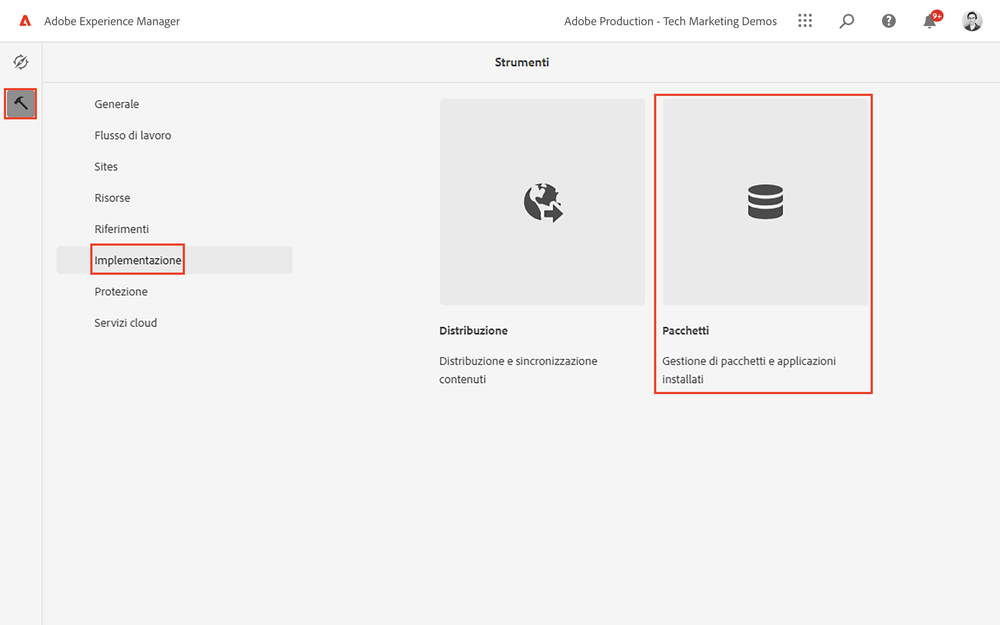
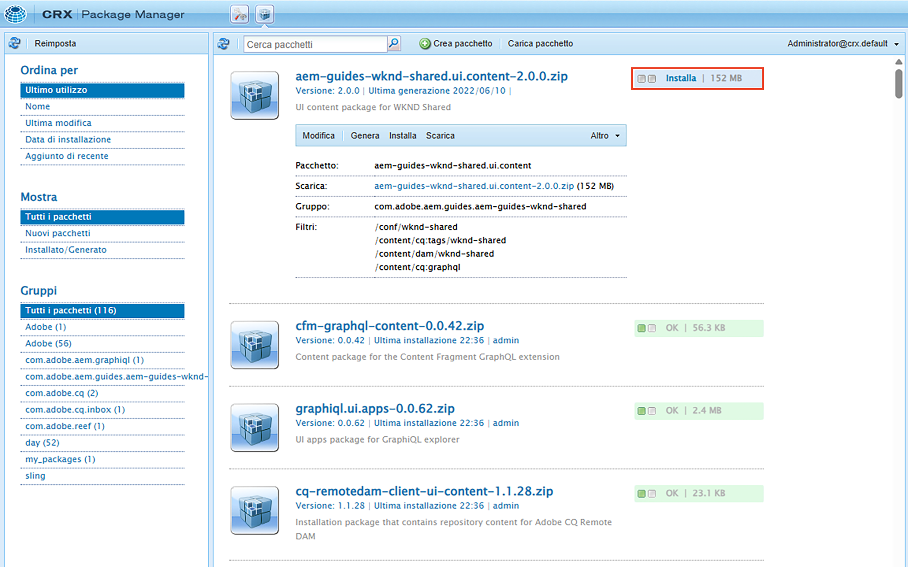

# Guida introduttiva a AEM Headless - GraphQL

Un tutorial end-to-end che illustra come creare ed esporre contenuti utilizzando AEM API GraphQL e utilizzati da un’app esterna, in uno scenario CMS headless.

Questa esercitazione esplora come AEM le API GraphQL e le funzionalità headless possono essere utilizzate per sviluppare le esperienze emerse in un’app esterna.

Questa esercitazione tratterà i seguenti argomenti:

* Creare una nuova configurazione di progetto
* Creare nuovi modelli di frammenti di contenuto per modellare i dati
* Crea nuovi frammenti di contenuto in base ai modelli creati in precedenza.
* Scopri come è possibile eseguire query sui frammenti di contenuto in AEM utilizzando lo strumento di sviluppo GraphiQL integrato.
* Memorizzazione o persistenza delle query GraphQL in AEM
* Utilizzare query GraphQL persistenti da un&#39;app React di esempio

## Prerequisiti {#prerequisites}

Per seguire questa esercitazione, è necessario quanto segue:

* Competenze di base in HTML e JavaScript
* È necessario installare localmente i seguenti strumenti:
   * [Node.js v10+](https://nodejs.org/it/)
   * [npm 6+](https://www.npmjs.com/)
   * [Git](https://git-scm.com/)
   * Un IDE (ad esempio, [Codice Microsoft® Visual Studio](https://code.visualstudio.com/))

### Ambiente AEM

Per completare questa esercitazione è necessario un ambiente Adobe Experience Manager. È possibile utilizzare una delle seguenti opzioni (le schermate vengono registrate da un ambiente AEM as a Cloud Service):

* AEM ambiente as a Cloud Service con:
   * [Accesso a AEM as a Cloud Service e Cloud Manager](/help/cloud-service/accessing/overview.md)
      * **Amministratore AEM** accesso a AEM as a Cloud Service
      * **Cloud Manager - Sviluppatore** accesso a Cloud Manager
* [SDK Quickstart AEM locale as a Cloud Service](/help/cloud-service/local-development-environment/aem-runtime.md).
* [AEM 6.5.13+](https://experienceleague.adobe.com/docs/experience-manager-65/release-notes/release-notes.html?lang=it)

### Installare il contenuto di esempio {#install-sample-content}

Può essere utile che il contenuto di esempio sia già disponibile nell’ambiente AEM da utilizzare come riferimento.

1. Passa a [Progetto condiviso WKND AEM](https://github.com/adobe/aem-guides-wknd-shared/releases).
1. Scarica la risorsa più recente rilasciata: `aem-guides-wknd-shared.ui.content-x.x.x.zip`.
1. Accedi all’ambiente di authoring AEM da utilizzare per l’esercitazione.
1. Dalla schermata iniziale AEM, passa a **Strumenti** > **Distribuzione** > **Pacchetti**:

   
1. Tocca **Carica pacchetto** e scegli la `aem-guides-wknd-shared.ui.content-x.x.x.zip` precedentemente scaricato. Tocca **Ok** da caricare.
1. Al termine del caricamento del pacchetto, tocca **Installa** per installare il contenuto.

   

1. I frammenti di contenuto di esempio, i modelli di frammento di contenuto, le immagini e altro ancora verranno installati per il fittizio [marchio WKND](https://wknd.site/). In seguito, nell’esercitazione verrà fatto riferimento al contenuto di esempio.

## Cominciamo!

1. Avvia l&#39;esercitazione con [Definizione dei modelli di frammenti di contenuto](content-fragment-models.md).

## Progetto GitHub

Il codice sorgente e i pacchetti di contenuto sono disponibili nel [Guide AEM - Progetto GitHub WKND GraphQL](https://github.com/adobe/aem-guides-wknd-graphql).

Se trovi un problema con l&#39;esercitazione o il codice, lascia un [Problema GitHub](https://github.com/adobe/aem-guides-wknd-graphql/issues).

Frammenti di contenuto di esempio, modelli e query sono disponibili nella sezione [Progetto condiviso WKND AEM](https://github.com/adobe/aem-guides-wknd-shared)
