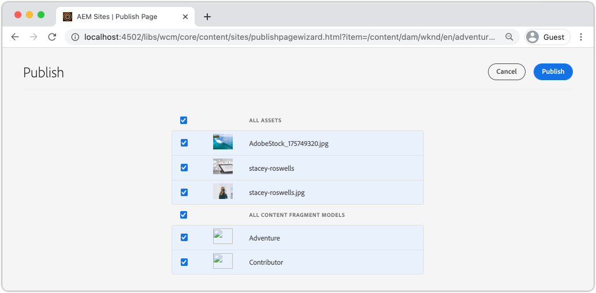

# Implementazione di produzione con un servizio di pubblicazione AEM

In questo tutorial, configurerai un ambiente locale per simulare la distribuzione di contenuti da un’istanza Author a un’istanza Publish. Genererai inoltre la build di produzione di un’app React configurata per utilizzare contenuti dall’ambiente AEM Publish utilizzando le API GraphQL. Imparerai a utilizzare in modo efficace le variabili di ambiente e ad aggiornare le configurazioni AEM CORS.

## Prerequisiti

Questo tutorial fa parte di un tutorial in più parti. Si presume che i passaggi descritti nelle parti precedenti siano stati completati.

## Obiettivi

Scopri come:

* Scopri l’architettura AEM Author e Publish.
* Scopri le best practice per la gestione delle variabili di ambiente.
* Scopri come configurare correttamente AEM per la condivisione CORS (Cross-Origin Resource Share).

## Pattern di distribuzione pubblicazione autore {#deployment-pattern}

Un ambiente AEM completo è costituito da authoring, pubblicazione e Dispatcher. Il servizio di authoring è il luogo in cui gli utenti interni creano, gestiscono e visualizzano in anteprima i contenuti. Il servizio di pubblicazione è considerato l’ambiente &quot;live&quot; ed è normalmente ciò con cui gli utenti finali interagiscono. I contenuti, dopo essere stati modificati e approvati nel servizio di authoring, vengono distribuiti al servizio di pubblicazione.

Il modello di implementazione più comune per le applicazioni headless AEM consiste nella connessione della versione di produzione dell’applicazione a un servizio di pubblicazione AEM.


Il diagramma riportato sopra mostra questo diffuso pattern di distribuzione.

1. Un **autore del contenuto** utilizza il servizio di authoring di AEM per creare, modificare e gestire i contenuti.
2. L’**autore del contenuto** e altri utenti interni possono visualizzare in anteprima il contenuto direttamente sul servizio di authoring. È possibile impostare una versione di anteprima dell’applicazione che si connette al servizio di authoring.
3. Una volta approvato, il contenuto può essere **pubblicato** nel servizio di pubblicazione AEM.
4. **Gli utenti finali** interagiscono con la versione di produzione dell&#39;applicazione. L’applicazione di produzione si connette al servizio di pubblicazione e utilizza le API GraphQL per richiedere e utilizzare i contenuti.

L&#39;esercitazione simula la distribuzione precedente aggiungendo un&#39;istanza AEM Publish alla configurazione corrente. Nei capitoli precedenti, l’app React fungeva da anteprima collegandosi direttamente all’istanza di authoring. Una build di produzione dell’app React viene distribuita a un server Node.js statico che si connette alla nuova istanza Publish.

Alla fine, sono in esecuzione tre server locali:

* http://localhost:4502 - Istanza Autore
* http://localhost:4503 - Pubblica istanza
* http://localhost:5000 - App di reazione in modalità di produzione, con connessione all’istanza Publish.

## Installare AEM SDK - Modalità di pubblicazione {#aem-sdk-publish}

Attualmente è in esecuzione un&#39;istanza di SDK in modalità **Autore**. È inoltre possibile avviare SDK in modalità **Pubblica** per simulare un ambiente di pubblicazione AEM.

Una guida più dettagliata per la configurazione di un ambiente di sviluppo locale [è disponibile qui](https://experienceleague.adobe.com/docs/experience-manager-learn/cloud-service/local-development-environment-set-up/overview.html?lang=en#local-development-environment-set-up).

1. Nel file system locale creare una cartella dedicata per installare l&#39;istanza Publish, ovvero `~/aem-sdk/publish`.
1. Copiare il file jar Quickstart utilizzato per l&#39;istanza di authoring nei capitoli precedenti e incollarlo nella directory `publish`. In alternativa, accedi al [portale di distribuzione software](https://experience.adobe.com/#/downloads/content/software-distribution/it/aemcloud.html), scarica l&#39;ultima versione di SDK ed estrai il file jar Quickstart.
1. Rinomina il file jar in `aem-publish-p4503.jar`.

   La stringa `publish` specifica che il file jar Quickstart viene avviato in modalità di pubblicazione. `p4503` specifica che il server Quickstart viene eseguito sulla porta 4503.

1. Apri una nuova finestra del terminale e passa alla cartella che contiene il file jar. Installa e avvia l’istanza di AEM:

   ```shell
   $ cd ~/aem-sdk/publish
   $ java -jar aem-publish-p4503.jar
   ```

1. Specificare una password amministratore come `admin`. Qualsiasi password amministratore è accettabile, tuttavia si consiglia di utilizzare l’impostazione predefinita per lo sviluppo locale per evitare configurazioni aggiuntive.
1. Al termine dell&#39;installazione dell&#39;istanza di AEM, verrà aperta una nuova finestra del browser all&#39;indirizzo [http://localhost:4503/content.html](http://localhost:4503/content.html)

   Dovrebbe restituire una pagina 404 Non trovato. Questa è una nuova istanza di AEM e non è stato installato alcun contenuto.

## Installare contenuti di esempio ed endpoint GraphQL {#wknd-site-content-endpoints}

Proprio come nell’istanza Autore, l’istanza Pubblica deve avere gli endpoint GraphQL abilitati e deve avere contenuti di esempio. Quindi, installa il sito di riferimento WKND sull’istanza Publish.

1. Scarica il pacchetto AEM più recente compilato per il sito WKND: [aem-guides-wknd.all-x.x.x.zip](https://github.com/adobe/aem-guides-wknd/releases/latest).

   >[!NOTE]
   >
   > Assicurati di scaricare la versione standard compatibile con AEM as a Cloud Service e **non** la versione `classic`.

1. Accedere all&#39;istanza Publish passando direttamente a: [http://localhost:4503/libs/granite/core/content/login.html](http://localhost:4503/libs/granite/core/content/login.html) con il nome utente `admin` e la password `admin`.
1. Passare quindi a Gestione pacchetti in [http://localhost:4503/crx/packmgr/index.jsp](http://localhost:4503/crx/packmgr/index.jsp).
1. Fare clic su **Carica pacchetto** e scegliere il pacchetto WKND scaricato nel passaggio precedente. Per installare il pacchetto, fai clic su **Installa**.
1. Dopo aver installato il pacchetto, il sito di riferimento WKND è ora disponibile all&#39;indirizzo [http://localhost:4503/content/wknd/us/en.html](http://localhost:4503/content/wknd/us/en.html).
1. Disconnettersi come utente `admin` facendo clic sul pulsante &quot;Disconnetti&quot; nella barra dei menu.

   

   A differenza dell’istanza Autore AEM, per impostazione predefinita le istanze Pubblicazione AEM dispongono di accesso anonimo in sola lettura. Vogliamo simulare l’esperienza di un utente anonimo durante l’esecuzione dell’applicazione React.

## Aggiornare le variabili di ambiente per puntare all’istanza Publish {#react-app-publish}

Quindi, aggiorna le variabili di ambiente utilizzate dall’applicazione React in modo che puntino all’istanza Publish. L&#39;app React deve **connettersi solo** all&#39;istanza Publish in modalità di produzione.

Aggiungere quindi un nuovo file `.env.production.local` per simulare l&#39;esperienza di produzione.

1. Apri l’app WKND GraphQL React nell’IDE.

1. Sotto `aem-guides-wknd-graphql/react-app`, aggiungere un file denominato `.env.production.local`.
1. Popolare `.env.production.local` con quanto segue:

   ```plain
   REACT_APP_HOST_URI=http://localhost:4503
   REACT_APP_GRAPHQL_ENDPOINT=/content/graphql/global/endpoint.json
   ```

   

   L’utilizzo delle variabili di ambiente consente di alternare facilmente l’endpoint GraphQL tra un ambiente Author o Publish senza aggiungere ulteriore logica all’interno del codice dell’applicazione. Ulteriori informazioni sulle [variabili di ambiente personalizzate per React sono disponibili qui](https://create-react-app.dev/docs/adding-custom-environment-variables).

   >[!NOTE]
   >
   > Tieni presente che non sono incluse informazioni di autenticazione, in quanto per impostazione predefinita gli ambienti di pubblicazione forniscono accesso anonimo al contenuto.

## Distribuire un server Nodo statico {#static-server}

L’app React può essere avviata utilizzando il server Webpack, ma solo per lo sviluppo. Quindi, simula una distribuzione di produzione utilizzando [serve](https://github.com/vercel/serve) per ospitare una build di produzione dell&#39;app React utilizzando Node.js.

1. Aprire una nuova finestra del terminale e passare alla directory `aem-guides-wknd-graphql/react-app`

   ```shell
   $ cd aem-guides-wknd-graphql/react-app
   ```

1. Installa [serve](https://github.com/vercel/serve) con il seguente comando:

   ```shell
   $ npm install serve --save-dev
   ```

1. Aprire il file `package.json` in `react-app/package.json`. Aggiungi uno script denominato `serve`:

   ```diff
    "scripts": {
       "start": "react-scripts start",
       "build": "react-scripts build",
       "test": "react-scripts test",
       "eject": "react-scripts eject",
   +   "serve": "npm run build && serve -s build"
   },
   ```

   Lo script `serve` esegue due azioni. Innanzitutto, viene generata una build di produzione dell’app React. In secondo luogo, il server Node.js viene avviato e utilizza la build di produzione.

1. Torna al terminale e immetti il comando per avviare il server statico:

   ```shell
   $ npm run serve
   
   ┌────────────────────────────────────────────────────┐
   │                                                    │
   │   Serving!                                         │
   │                                                    │
   │   - Local:            http://localhost:5000        │
   │   - On Your Network:  http://192.168.86.111:5000   │
   │                                                    │
   │   Copied local address to clipboard!               │
   │                                                    │
   └────────────────────────────────────────────────────┘
   ```

1. Apri un nuovo browser e passa a [http://localhost:5000/](http://localhost:5000/). Dovresti vedere l’app React distribuita.

   

   La query GraphQL funziona sulla home page. Ispeziona la richiesta **XHR** utilizzando gli strumenti per sviluppatori. Osservare che il POST di GraphQL si trova nell&#39;istanza Publish in `http://localhost:4503/content/graphql/global/endpoint.json`.

   Tuttavia, tutte le immagini sono rotte nella home page.

1. Fai clic su una delle pagine Dettagli avventura.

   

   Si noti che viene generato un errore GraphQL per `adventureContributor`. Negli esercizi successivi, le immagini interrotte e i problemi `adventureContributor` vengono risolti.

## Riferimenti immagine assoluti {#absolute-image-references}

Le immagini appaiono interrotte perché l&#39;attributo ``:

   ```diff
   - 
   + 
   ```

1. Aprire il file `AdventureDetail.js` in `react-app/src/components/AdventureDetail.js`.
1. Ripeti gli stessi passaggi per modificare la query GraphQL e aggiungere la proprietà `_publishUrl` per Adventure

   ```diff
    adventureByPath (_path: "${_path}") {
       item {
           _path
           adventureTitle
           adventureActivity
           adventureType
           adventurePrice
           adventureTripLength
           adventureGroupSize
           adventureDifficulty
           adventurePrice
           adventurePrimaryImage {
               ... on ImageRef {
               _path
   +           _publishUrl
               mimeType
               width
               height
               }
           }
           adventureDescription {
               html
           }
           adventureItinerary {
               html
           }
           adventureContributor {
               fullName
               occupation
               pictureReference {
                   ...on ImageRef {
                       _path
   +                   _publishUrl
                   }
               }
           }
       }
       }
   } 
   ```

1. Modificare i due tag `` per Adventure Primary Image e Contributor Picture reference in `AdventureDetail.js`:

   ```diff
   /* AdventureDetail.js */
   ...
   
   ...
   pictureReference =  
   ```

1. Tornare al terminale e avviare il server statico:

   ```shell
   $ npm run serve
   ```

1. Passa a [http://localhost:5000/](http://localhost:5000/) e osserva che vengono visualizzate le immagini e che l&#39;attributo `` punta a `http://localhost:4503`.

   

## Simula pubblicazione di contenuti {#content-publish}

Ricorda che viene generato un errore GraphQL per `adventureContributor` quando viene richiesta una pagina Dettagli avventura. Il modello per frammenti di contenuto **Collaboratore** non esiste ancora nell&#39;istanza di pubblicazione. Gli aggiornamenti apportati al modello per frammenti di contenuto **Adventure** non sono disponibili nell&#39;istanza Publish. Queste modifiche sono state apportate direttamente all’istanza Author e devono essere distribuite all’istanza Publish.

È un aspetto da considerare quando si implementano nuovi aggiornamenti a un’applicazione che si basa sugli aggiornamenti a un frammento di contenuto o a un modello per frammenti di contenuto.

Quindi, simula la pubblicazione di contenuti tra le istanze Autore locale e Pubblica.

1. Avvia l&#39;istanza di authoring (se non è già stata avviata) e passa a Gestione pacchetti all&#39;indirizzo [http://localhost:4502/crx/packmgr/index.jsp](http://localhost:4502/crx/packmgr/index.jsp)
1. Scaricare il pacchetto [EnableReplicationAgent.zip](./assets/publish-deployment/EnableReplicationAgent.zip) e installarlo tramite Gestione pacchetti.

   Questo pacchetto installa una configurazione che consente all’istanza di authoring di pubblicare i contenuti nell’istanza di pubblicazione. I passaggi manuali per [questa configurazione sono disponibili qui](https://experienceleague.adobe.com/docs/experience-manager-learn/cloud-service/local-development-environment-set-up/aem-runtime.html?lang=en#content-distribution).

   >[!NOTE]
   >
   > In un ambiente AEM as a Cloud Service, il livello di authoring viene impostato automaticamente per distribuire i contenuti al livello di pubblicazione.

1. Dal menu **AEM Start**, passa a **Strumenti** > **Assets** > **Modelli per frammenti di contenuto**.

1. Fare clic nella cartella **Sito WKND**.

1. Seleziona tutti e tre i modelli e fai clic su **Pubblica**:

   

   Viene visualizzata una finestra di dialogo di conferma. Fare clic su **Pubblica**.

1. Passa al frammento di contenuto del campo di surf di Bali all&#39;indirizzo [http://localhost:4502/editor.html/content/dam/wknd/en/adventures/bali-surf-camp/bali-surf-camp](http://localhost:4502/editor.html/content/dam/wknd/en/adventures/bali-surf-camp/bali-surf-camp).

1. Fai clic sul pulsante **Pubblica** nella barra dei menu superiore.

   

1. La Pubblicazione guidata mostra tutte le risorse dipendenti da pubblicare. In questo caso, è elencato il frammento **stacey-roswells** a cui si fa riferimento e sono presenti anche diverse immagini. Le risorse a cui si fa riferimento vengono pubblicate insieme al frammento.

   

   Fai di nuovo clic sul pulsante **Pubblica** per pubblicare il frammento di contenuto e le risorse dipendenti.

1. Torna all&#39;app React in esecuzione all&#39;indirizzo [http://localhost:5000/](http://localhost:5000/). Ora puoi fare clic sul Bali Surf Camp per visualizzare i dettagli dell’avventura.

1. Torna all&#39;istanza Autore AEM all&#39;indirizzo [http://localhost:4502/editor.html/content/dam/wknd/en/adventures/bali-surf-camp/bali-surf-camp](http://localhost:4502/editor.html/content/dam/wknd/en/adventures/bali-surf-camp/bali-surf-camp) e aggiorna il **Titolo** del frammento. **Salva e chiudi** il frammento. Quindi **pubblica** il frammento.
1. Torna a [http://localhost:5000/adventure:/content/dam/wknd/en/adventures/bali-surf-camp/bali-surf-camp](http://localhost:5000/adventure:/content/dam/wknd/en/adventures/bali-surf-camp/bali-surf-camp) e osserva le modifiche pubblicate.

   

## Aggiorna configurazione COR

AEM è protetto per impostazione predefinita e non consente alle proprietà web non AEM di effettuare chiamate lato client. La configurazione CORS (Cross-Origin Resource Sharing) di AEM può consentire a domini specifici di effettuare chiamate ad AEM.

Quindi, prova la configurazione CORS dell’istanza AEM Publish.

1. Tornare alla finestra del terminale in cui l&#39;app React è in esecuzione con il comando `npm run serve`:

   ```shell
   ┌────────────────────────────────────────────────────┐
   │                                                    │
   │   Serving!                                         │
   │                                                    │
   │   - Local:            http://localhost:5000        │
   │   - On Your Network:  http://192.168.86.205:5000   │
   │                                                    │
   │   Copied local address to clipboard!               │
   │                                                    │
   └────────────────────────────────────────────────────┘
   ```

   Tieni presente che vengono forniti due URL. Uno utilizza `localhost` e l&#39;altro utilizza l&#39;indirizzo IP della rete locale.

1. Passa all&#39;indirizzo che inizia con [http://192.168.86.XXX:5000](http://192.168.86.XXX:5000). L&#39;indirizzo è leggermente diverso per ogni computer locale. Osserva che si è verificato un errore CORS durante il recupero dei dati. La configurazione CORS corrente consente infatti solo richieste provenienti da `localhost`.

   

   Quindi, aggiorna la configurazione AEM Publish CORS per consentire le richieste dall’indirizzo IP della rete.

1. Passare a [http://localhost:4503/content/wknd/us/en/errors/sign-in.html](http://localhost:4503/content/wknd/us/en/errors/sign-in.html) e accedere con il nome utente `admin` e la password `admin`.

1. Passa a [http://localhost:4503/system/console/configMgr](http://localhost:4503/system/console/configMgr) e trova la configurazione WKND GraphQL in `com.adobe.granite.cors.impl.CORSPolicyImpl~wknd-graphql`.

1. Aggiorna il campo **Origini consentite** per includere l&#39;indirizzo IP di rete:

   

   È inoltre possibile includere un’espressione regolare per consentire tutte le richieste da un sottodominio specifico. Salva le modifiche.

1. Cerca **Apache Sling Referrer Filter** e controlla la configurazione. La configurazione **Consenti vuoto** è necessaria anche per abilitare le richieste di GraphQL da un dominio esterno.

   

   Questi sono stati configurati come parte del sito di riferimento WKND. Puoi visualizzare il set completo di configurazioni OSGi tramite [l&#39;archivio GitHub](https://github.com/adobe/aem-guides-wknd/tree/master/ui.config/src/main/content/jcr_root/apps/wknd/osgiconfig).

   >[!NOTE]
   >
   > Le configurazioni OSGi vengono gestite in un progetto AEM confermato nel controllo del codice sorgente. Un progetto AEM può essere implementato in ambienti AEM as Cloud Service utilizzando Cloud Manager. L&#39;[Archetipo progetto AEM](https://github.com/adobe/aem-project-archetype) può aiutare a generare un progetto per un&#39;implementazione specifica.

1. Torna all&#39;app React che inizia con [http://192.168.86.XXX:5000](http://192.168.86.XXX:5000) e osserva che l&#39;applicazione non genera più un errore CORS.

   

## Congratulazioni. {#congratulations}

Congratulazioni Ora hai simulato una distribuzione di produzione completa utilizzando un ambiente AEM Publish. Hai anche imparato a utilizzare la configurazione CORS in AEM.

## Altre risorse

Per ulteriori dettagli su Frammenti di contenuto e GraphQL, consulta le risorse seguenti:

* [Distribuzione di contenuti headless tramite frammenti di contenuto con GraphQL](https://experienceleague.adobe.com/docs/experience-manager-cloud-service/assets/content-fragments/content-fragments-graphql.html?lang=it)
* [API GraphQL di AEM per l’utilizzo con Frammenti di contenuto](https://experienceleague.adobe.com/docs/experience-manager-cloud-service/assets/admin/graphql-api-content-fragments.html?lang=it)
* [Autenticazione basata su token](https://experienceleague.adobe.com/docs/experience-manager-learn/getting-started-with-aem-headless/authentication/overview.html?lang=en#authentication)
* [Distribuzione del codice in AEM as a Cloud Service](https://experienceleague.adobe.com/docs/experience-manager-learn/cloud-service/cloud-manager/devops/deploy-code.html?lang=en#cloud-manager)
