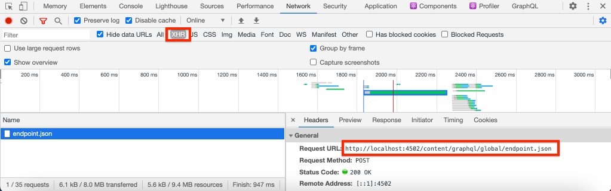

# Configurazione rapida {#setup}

Questo capitolo offre una configurazione rapida di un ambiente locale per visualizzare un’applicazione esterna che consuma contenuti da AEM utilizzando AEM API GraphQL. I capitoli successivi dell’esercitazione si basano su questa configurazione.

## Prerequisiti {#prerequisites}

È necessario installare localmente i seguenti strumenti:

* [JDK 11](https://experience.adobe.com/#/downloads/content/software-distribution/en/general.html?1_group.propertyvalues.property=.%2Fjcr%3Acontent%2Fmetadata%2Fdc%3AsoftwareType&amp;1_group.property.operation=equals&amp;1_group.property.values.0_values=software-type%3Atooling&amp;fulltext=Oracle%7E+JDK%7E+11%7E&amp;orderby=%40jcr%3Acontent%2Fjcr%3AlastModified&amp;orderby.sort=desc&amp;layout=list&amp;p.offset=0&amp;p.limit=14)
* [Node.js v10+](https://nodejs.org/it/)
* [npm 6+](https://www.npmjs.com/)
* [Git](https://git-scm.com/)

## Obiettivi {#objectives}

1. Scarica e installa l&#39;SDK AEM.
1. Scarica e installa il contenuto di esempio dal sito WKND Reference.
1. Scarica e installa un’app di esempio per utilizzare contenuti utilizzando le API GraphQL.

## Installare l’SDK AEM {#aem-sdk}

Questa esercitazione utilizza la funzione [AEM SDK as a Cloud Service](https://experienceleague.adobe.com/docs/experience-manager-cloud-service/implementing/developing/aem-as-a-cloud-service-sdk.html?lang=en#aem-as-a-cloud-service-sdk) per esplorare AEM API GraphQL. Questa sezione fornisce una guida rapida all’installazione e all’esecuzione dell’SDK AEM in modalità Autore. Una guida più dettagliata per la creazione di un ambiente di sviluppo locale [si trova qui](https://experienceleague.adobe.com/docs/experience-manager-learn/cloud-service/local-development-environment-set-up/overview.html?lang=en#local-development-environment-set-up).

>[!NOTE]
>
> È inoltre possibile seguire l’esercitazione con un ambiente AEM as a Cloud Service. Durante l’esercitazione sono incluse ulteriori note sull’utilizzo di un ambiente Cloud.

1. Passa a **[Portale di distribuzione software](https://experience.adobe.com/#/downloads/content/software-distribution/it/aemcloud.html)** > **AEM as a Cloud Service** e scarica la versione più recente del **SDK AEM**.

   

   >[!CAUTION]
   >
   > La funzione GraphQL è abilitata per impostazione predefinita solo sull&#39;SDK AEM dal 2021-02-04 o successivo.

1. Decomprimi il download e copia il jar Quickstart (`aem-sdk-quickstart-XXX.jar`) in una cartella dedicata, ovvero `~/aem-sdk/author`.
1. Rinomina il file jar in `aem-author-p4502.jar`.

   La `author` name specifica che il jar Quickstart verrà avviato in modalità Autore. La `p4502` specifica che il server Quickstart verrà eseguito sulla porta 4502.

1. Apri una nuova finestra terminale e passa alla cartella che contiene il file jar. Esegui il seguente comando per installare e avviare l&#39;istanza AEM:

   ```shell
   $ cd ~/aem-sdk/author
   $ java -jar aem-author-p4502.jar
   ```

1. Fornisci una password amministratore come `admin`. Qualsiasi password amministratore è accettabile, tuttavia si consiglia di utilizzare l&#39;impostazione predefinita per lo sviluppo locale per ridurre la necessità di riconfigurare.
1. Dopo alcuni minuti l&#39;istanza AEM terminerà l&#39;installazione e dovrebbe aprire una nuova finestra del browser in [http://localhost:4502](Http://localhost:4502).
1. Accedi con il nome utente `admin` e password `admin`.

## Installare il contenuto di esempio e gli endpoint GraphQL {#wknd-site-content-endpoints}

Contenuto di esempio dal **Sito di riferimento WKND** verrà installato per accelerare l&#39;esercitazione. Il WKND è un marchio fittizio in stile di vita, spesso utilizzato in combinazione con AEM formazione.

Il sito WKND Reference include configurazioni necessarie per esporre un [Endpoint GraphQL](https://experienceleague.adobe.com/docs/experience-manager-cloud-service/assets/admin/graphql-api-content-fragments.html?lang=en#graphql-aem-endpoint). In un’implementazione nel mondo reale, segui i passaggi documentati per [includere gli endpoint GraphQL](https://experienceleague.adobe.com/docs/experience-manager-cloud-service/assets/admin/graphql-api-content-fragments.html?lang=en#graphql-aem-endpoint) nel progetto del cliente. A [CORS](#cors-config) è stato anche confezionato come parte del sito WKND. È necessaria una configurazione CORS per concedere l’accesso a un’applicazione esterna, ulteriori informazioni su [CORS](#cors-config) di seguito.

1. Scarica l&#39;ultimo pacchetto di AEM compilato per il sito WKND: [aem-guides-wknd.all-x.x.x.zip](https://github.com/adobe/aem-guides-wknd/releases/latest).

   >[!NOTE]
   >
   > Assicurati di scaricare la versione standard compatibile con AEM as a Cloud Service e **not** la `classic` versione.

1. Da **Inizio AEM** menu vai a **Strumenti** > **Distribuzione** > **Pacchetti**.

   

1. Fai clic su **Carica pacchetto** e scegli il pacchetto WKND scaricato nel passaggio precedente. Fai clic su **Installa** per installare il pacchetto.

1. Da **Inizio AEM** menu vai a **Risorse** > **File**.
1. Fai clic sulle cartelle per passare a **Sito WKND** > **Inglese** > **Avventure**.

   

   Questa è una cartella di tutte le risorse che comprendono le varie Avventure promosse dal marchio WKND. Ciò include i tipi di media tradizionali come immagini e video, nonché i supporti specifici per AEM come **Frammenti di contenuto**.

1. Fai clic su **Sci in discesa Wyoming** e fai clic su **Frammento di contenuto per lo sci in discesa** scheda:

   

1. L’interfaccia utente dell’editor dei frammenti di contenuto si aprirà per l’avventura di sci in discesa nel Wyoming.

   

   Osserva che vari campi, come **Titolo**, **Descrizione** e **Attività** definire il frammento.

   **Frammenti di contenuto** sono uno dei modi in cui il contenuto può essere gestito in AEM. I frammenti di contenuto sono contenuti riutilizzabili e non soggetti a presentazione composti da elementi di dati strutturati quali testo, testo RTF, date o riferimenti ad altri frammenti di contenuto. I frammenti di contenuto verranno esplorati più dettagliatamente più avanti nell’esercitazione.

1. Fai clic su **Annulla** per chiudere il frammento. Sentitevi liberi di navigare in alcune delle altre cartelle ed esplorare l&#39;altro contenuto Avventura.

>[!NOTE]
>
> Se utilizzi un ambiente di Cloud Service, consulta la documentazione su come [distribuire una base di codice come il sito WKND Reference in un ambiente di Cloud Service](https://experienceleague.adobe.com/docs/experience-manager-cloud-service/implementing/deploying/overview.html?lang=en#coding-against-the-right-aem-version).

## Installare l’app di esempio{#sample-app}

Uno degli obiettivi di questa esercitazione è quello di mostrare come utilizzare AEM contenuto da un’applicazione esterna utilizzando le API GraphQL. Questa esercitazione utilizza un&#39;app React di esempio che è stata parzialmente completata per accelerare l&#39;esercitazione. Le stesse lezioni e concetti si applicano alle app create con iOS, Android o qualsiasi altra piattaforma. L&#39;app React è intenzionalmente semplice, per evitare inutili complessità; non si tratta di un’implementazione di riferimento.

1. Apri una nuova finestra del terminale e duplica il ramo iniziale dell’esercitazione utilizzando Git:

   ```shell
   $ git clone --branch tutorial/react git@github.com:adobe/aem-guides-wknd-graphql.git
   ```

1. Nell’IDE che preferisci, apri il file . `.env.development` a `aem-guides-wknd-graphql/react-app/.env.development`. Verifica che `REACT_APP_AUTHORIZATION` La riga non viene commentata e il file ha un aspetto simile al seguente:

   ```plain
   REACT_APP_HOST_URI=http://localhost:4502
   REACT_APP_GRAPHQL_ENDPOINT=/content/graphql/global/endpoint.json
   # Use Authorization when connecting to an AEM Author environment
   REACT_APP_AUTHORIZATION=admin:admin
   ```

   Assicurati che `React_APP_HOST_URI` corrisponde alla tua istanza AEM locale. In questo capitolo, collegheremo l’app React direttamente al AEM **Autore** ambiente. **Autore** gli ambienti per impostazione predefinita richiedono l’autenticazione, in modo che la nostra app si connetta come `admin` utente. Si tratta di una pratica comune durante lo sviluppo, in quanto ci consente di apportare rapidamente modifiche all’ambiente AEM e di visualizzarle immediatamente nell’app.

   >[!NOTE]
   >
   > In uno scenario di produzione, l’app si connetterà a un AEM **Pubblica** ambiente. Questo viene trattato più dettagliatamente nella [Distribuzione di produzione](production-deployment.md) capitolo.

1. Passa a `aem-guides-wknd-graphql/react-app` cartella. Installa e avvia l&#39;app:

   ```shell
   $ cd aem-guides-wknd-graphql/react-app
   $ npm install
   $ npm start
   ```

1. Una nuova finestra del browser dovrebbe avviare automaticamente l’app in [http://localhost:3000](Http://localhost:3000).

   

   Deve essere visualizzato un elenco del contenuto Avventura corrente da AEM.

1. Fai clic su una delle immagini dell&#39;avventura per visualizzare i dettagli dell&#39;avventura. Viene AEM una richiesta per restituire i dettagli di un&#39;avventura.

   

1. Utilizza gli strumenti di sviluppo del browser per ispezionare il **Rete** richieste. Visualizza la **XHR** richiede e osserva più richieste POST a `/content/graphql/global/endpoint.json`, l’endpoint GraphQL configurato per AEM.

   

1. Puoi anche visualizzare i parametri e la risposta JSON controllando la richiesta di rete. Può essere utile installare un’estensione del browser come [Ispettore di rete GraphQL](https://chrome.google.com/webstore/detail/graphql-network-inspector/ndlbedplllcgconngcnfmkadhokfaaln) per Chrome per comprendere meglio la query e la risposta.

## Modificare un frammento di contenuto

Ora che l’app React è in esecuzione, effettua un aggiornamento al contenuto in AEM e visualizza la modifica riflessa nell’app.

1. Passa a AEM [http://localhost:4502](Http://localhost:4502).
1. Passa a **Risorse** > **File** > **Sito WKND** > **Inglese** > **Avventure** > **[Bali Surf Camp](http://localhost:4502/assets.html/content/dam/wknd/en/adventures/bali-surf-camp)**.

   

1. Fai clic su **Bali Surf Camp** frammento di contenuto per aprire l’Editor frammento di contenuto.
1. Modifica la **Titolo** e **Descrizione** dell&#39;avventura

   

1. Fai clic su **Salva** per salvare le modifiche.
1. Torna all’app React in [http://localhost:3000](Http://localhost:3000) e aggiorna per visualizzare le modifiche:

   

## Installare lo strumento GraphiQL {#install-graphiql}

[GraphiQL](https://github.com/graphql/graphiql) è uno strumento di sviluppo e necessario solo in ambienti di livello inferiore come uno sviluppo o un’istanza locale. L&#39;IDE GraphiQL ti consente di testare e perfezionare rapidamente le query e i dati restituiti. GraphiQL fornisce inoltre un facile accesso alla documentazione, facilitando l&#39;apprendimento e la comprensione dei metodi disponibili.

1. Passa a **[Portale di distribuzione software](https://experience.adobe.com/#/downloads/content/software-distribution/en/aemcloud.html)** > **AEM as a Cloud Service**.
1. Cerca &quot;GraphiQL&quot; (assicurati di includere **i** in **GraphiQL**.
1. Scarica la versione più recente **Pacchetto di contenuti GraphiQL v.x.x.x**

   

   Il file zip è un pacchetto AEM che può essere installato direttamente.

1. Da **Inizio AEM** menu vai a **Strumenti** > **Distribuzione** > **Pacchetti**.
1. Fai clic su **Carica pacchetto** e scegli il pacchetto scaricato nel passaggio precedente. Fai clic su **Installa** per installare il pacchetto.

   
1. Passa all&#39;IDE GraphiQL in [http://localhost:4502/content/graphiql.html](http://localhost:4502/content/graphiql.html) e inizia a esplorare le API GraphQL.

   >[!NOTE]
   >
   > Lo strumento GraphiQL e l&#39;API GraphQL è [più avanti nell’esercitazione è stato esplorato più dettagliatamente](./explore-graphql-api.md).

## Congratulazioni! {#congratulations}

Congratulazioni, ora disponi di un’applicazione esterna che consuma AEM contenuti con GraphQL. Puoi controllare il codice nell’app React e continuare a provare a modificare i frammenti di contenuto esistenti.

## Passaggi successivi {#next-steps}

Nel capitolo successivo, [Definizione dei modelli di frammenti di contenuto](content-fragment-models.md), scopri come modellare il contenuto e creare uno schema con **Modelli per frammenti di contenuto**. Esaminerete i modelli esistenti e creerete un nuovo modello. Inoltre, verranno illustrati i diversi tipi di dati che possono essere utilizzati per definire uno schema come parte del modello.

## Configurazione CORS (Bonus) {#cors-config}

AEM, essendo sicura per impostazione predefinita, blocca le richieste di origini diverse, impedendo alle applicazioni non autorizzate di connettersi e visualizzare il contenuto.

Per consentire all’app React di questa esercitazione di interagire con AEM endpoint API GraphQL, nel progetto di riferimento del sito WKND è stata definita una configurazione di condivisione delle risorse tra origini diverse.


Per visualizzare la configurazione distribuita:

1. Passa alla console Web AEM SDK all&#39;indirizzo [http://localhost:4502/system/console](http://localhost:4502/system/console).

   >[!NOTE]
   >
   > La console Web è disponibile solo nell’SDK. In un ambiente AEM as a Cloud Service queste informazioni possono essere visualizzate tramite [Console per sviluppatori](https://experienceleague.adobe.com/docs/experience-manager-learn/cloud-service/debugging/debugging-aem-as-a-cloud-service/developer-console.html).

1. Nel menu principale fai clic su **OSGI** > **Configurazione** per richiamare [Configurazioni OSGi](http://localhost:4502/system/console/configMgr).
1. Scorri verso il basso nella pagina **Condivisione risorse tra le origini di Adobe Granite**.
1. Fai clic sulla configurazione per `com.adobe.granite.cors.impl.CORSPolicyImpl~wknd-graphql`.
1. I campi seguenti sono stati aggiornati:
   * Origini ammesse (Regex): `http://localhost:.*`
      * Consente tutte le connessioni host locali.
   * Percorsi consentiti: `/content/graphql/global/endpoint.json`
      * Questo è l&#39;unico endpoint GraphQL attualmente configurato. Come best practice, le configurazioni del CdR dovrebbero essere il più restrittive possibile.
   * Metodi consentiti: `GET`, `HEAD`, `POST`
      * Solo `POST` è necessario per GraphQL ma gli altri metodi possono essere utili quando si interagisce con AEM in modo headless.
   * Intestazioni supportate: **autorizzazione** è stato aggiunto per passare l’autenticazione di base nell’ambiente di authoring.
   * Supporta le credenziali: `Yes`
      * Questo è necessario in quanto la nostra app React comunicherà con gli endpoint GraphQL protetti sul servizio AEM Author.

Questa configurazione e gli endpoint GraphQL fanno parte del progetto WKND AEM. È possibile visualizzare tutte le [Configurazioni OSGi qui](https://github.com/adobe/aem-guides-wknd/tree/master/ui.config/src/main/content/jcr_root/apps/wknd/osgiconfig).
