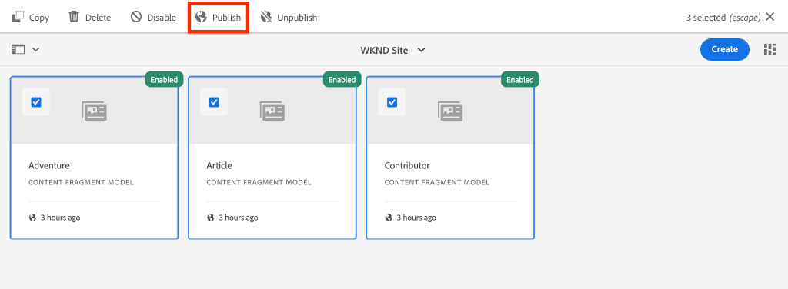

# Implementazione della produzione con un servizio AEM Publish

Questa esercitazione consente di configurare un ambiente locale per simulare il contenuto distribuito da un’istanza Author a un’istanza Publish. È inoltre possibile generare una build di produzione di un&#39;app React configurata per utilizzare il contenuto dall&#39;ambiente AEM Publish utilizzando le API GraphQL. Nel frattempo imparerai come utilizzare efficacemente le variabili di ambiente e come aggiornare le configurazioni AEM CORS.

## Prerequisiti

Questa esercitazione fa parte di un’esercitazione con più parti. Si presume che i passi descritti nelle parti precedenti siano stati completati.

## Obiettivi

Scopri come:

* Scopri l’architettura di AEM Author e Publish.
* Scopri le best practice per la gestione delle variabili di ambiente.
* Scoprite come configurare AEM per la condivisione delle risorse tra le origini (CORS).

## Pattern di distribuzione Author Publish {#deployment-pattern}

Un ambiente AEM completo è composto da Autore, Pubblica e Dispatcher. Il servizio Autore è il luogo in cui gli utenti interni creano, gestiscono e visualizzano in anteprima i contenuti. Il servizio Publish è considerato l’ambiente &quot;Live&quot; ed è in genere quello con cui gli utenti finali interagiscono. Il contenuto, dopo essere stato modificato e approvato nel servizio Autore, viene distribuito al servizio Pubblica.

Il pattern di distribuzione più comune con AEM applicazioni headless consiste nel far sì che la versione di produzione dell&#39;applicazione si connetta a un servizio AEM Publish.


Il diagramma riportato sopra rappresenta questo pattern di distribuzione comune.

1. Un **autore di contenuti** utilizza il servizio di creazione AEM per creare, modificare e gestire i contenuti.
2. Gli **autori di contenuti** e altri utenti interni possono visualizzare l&#39;anteprima del contenuto direttamente sul servizio Autore. È possibile impostare una versione di anteprima dell&#39;applicazione che si connetta al servizio Autore.
3. Una volta approvato, il contenuto può essere **pubblicato** nel servizio AEM Publish.
4. **Gli** utenti finali interagiscono con la versione Produzione dell&#39;applicazione. L’applicazione Produzione si collega al servizio Publish e utilizza le API GraphQL per richiedere e utilizzare il contenuto.

L&#39;esercitazione simula la distribuzione di cui sopra aggiungendo un&#39;istanza AEM Publish alla configurazione corrente. Nei capitoli precedenti, React App fungeva da anteprima collegandosi direttamente all’istanza Author. Una build di produzione dell&#39;app React verrà distribuita a un server Node.js statico che si connette alla nuova istanza Publish.

Alla fine verranno eseguiti tre server locali:

* http://localhost:4502 - Istanza autore
* http://localhost:4503 - Istanza di pubblicazione
* http://localhost:5000 - Reagisce all&#39;app in modalità di produzione, collegandosi all&#39;istanza Pubblica.

## Installa AEM SDK - Modalità di pubblicazione {#aem-sdk-publish}

Attualmente è in esecuzione un&#39;istanza dell&#39;SDK in modalità **Autore**. L&#39;SDK può essere avviato anche in modalità **Pubblica** per simulare un ambiente AEM Publish.

Una guida più dettagliata per la configurazione di un ambiente di sviluppo locale [è disponibile qui](https://experienceleague.adobe.com/docs/experience-manager-learn/cloud-service/local-development-environment-set-up/overview.html?lang=en#local-development-environment-set-up).

1. Nel file system locale, create una cartella dedicata per installare l&#39;istanza Pubblica, denominata `~/aem-sdk/publish`.
1. Copiate il file Jar Quickstart utilizzato per l&#39;istanza Author nei capitoli precedenti e incollatelo nella directory `publish`. In alternativa, andate al [portale di distribuzione del software](https://experience.adobe.com/#/downloads/content/software-distribution/it/aemcloud.html) e scaricate l&#39;SDK più recente, quindi estraete il file JAR di Quickstart.
1. Rinominare il file jar in `aem-publish-p4503.jar`.

   La stringa `publish` specifica che l&#39;avvio rapido viene avviato in modalità Pubblica. Il `p4503` specifica che il server Quickstart viene eseguito sulla porta 4503.

1. Aprite una nuova finestra del terminale e individuate la cartella che contiene il file JAR. Installate e avviate l&#39;istanza AEM:

   ```shell
   $ cd ~/aem-sdk/publish
   $ java -jar aem-publish-p4503.jar
   ```

1. Immettete una password amministratore come `admin`. Qualsiasi password di amministrazione è accettabile, tuttavia è consigliabile utilizzare quella predefinita per lo sviluppo locale per evitare configurazioni aggiuntive.
1. Al termine dell&#39;installazione dell&#39;istanza AEM, verrà aperta una nuova finestra del browser in [http://localhost:4503/content.html](http://localhost:4503/content.html)

   È previsto che venga restituita una pagina 404 non trovata. Si tratta di una nuova istanza AEM e non è stato installato alcun contenuto.

## Installazione di contenuti di esempio e endpoint GraphQL {#wknd-site-content-endpoints}

Come per l’istanza Author, l’istanza Publish deve avere gli endpoint GraphQL abilitati e richiede contenuti di esempio. Quindi, installate il sito di riferimento WKND nell’istanza Pubblica.

1. Scarica l&#39;ultimo pacchetto AEM compilato per il sito WKND: [aem-guide-wknd.all-x.x.zip](https://github.com/adobe/aem-guides-wknd/releases/latest).

   >[!NOTE]
   >
   > Accertatevi di scaricare la versione standard compatibile con AEM come Cloud Service e **not** la versione `classic`.

1. Accedete all’istanza Pubblica, spostandovi direttamente su: [http://localhost:4503/libs/granite/core/content/login.html](http://localhost:4503/libs/granite/core/content/login.html) con nome utente `admin` e password `admin`.
1. Passate quindi a Gestione pacchetti all&#39;indirizzo [http://localhost:4503/crx/packmgr/index.jsp](http://localhost:4503/crx/packmgr/index.jsp).
1. Fate clic su **Carica pacchetto** e scegliete il pacchetto WKND scaricato nel passaggio precedente. Fate clic su **Installa** per installare il pacchetto.
1. Dopo aver installato il pacchetto, il sito di riferimento WKND è ora disponibile all&#39;indirizzo [http://localhost:4503/content/wknd/us/en.html](http://localhost:4503/content/wknd/us/en.html).
1. Disconnettetevi come utente `admin` facendo clic sul pulsante &quot;Disconnetti&quot; nella barra dei menu.

   

   A differenza dell’istanza AEM Author, le istanze AEM Publish consentono l’accesso in sola lettura per impostazione predefinita. Vogliamo simulare l&#39;esperienza di un utente anonimo quando si esegue l&#39;applicazione React.

## Aggiorna variabili di ambiente per indicare l&#39;istanza Pubblica {#react-app-publish}

Quindi, aggiornate le variabili di ambiente utilizzate dall’applicazione React in modo che puntino all’istanza Publish. L&#39;app React deve **connettersi all&#39;istanza Publish in modalità di produzione solo**.

Quindi, aggiungete un nuovo file `.env.production.local` per simulare l&#39;esperienza di produzione.

1. Aprite l’app WKND GraphQL React nell’IDE.

1. Sotto `aem-guides-wknd-graphql/react-app`, aggiungete un file denominato `.env.production.local`.
1. Compilare `.env.production.local` con i seguenti elementi:

   ```plain
   REACT_APP_HOST_URI=http://localhost:4503
   REACT_APP_GRAPHQL_ENDPOINT=/content/graphql/global/endpoint.json
   ```

   

   L&#39;utilizzo di variabili di ambiente facilita l&#39;attivazione dell&#39;endpoint GraphQL tra un ambiente Authoring o Publish senza aggiungere logica al codice dell&#39;applicazione. Ulteriori informazioni sulle [variabili di ambiente personalizzate per React sono disponibili qui](https://create-react-app.dev/docs/adding-custom-environment-variables).

   >[!NOTE]
   >
   > Osservate che non sono incluse informazioni di autenticazione perché gli ambienti di pubblicazione forniscono l&#39;accesso anonimo al contenuto per impostazione predefinita.

## Implementare un server nodo statico {#static-server}

L&#39;app React può essere avviata utilizzando il server webpack, ma solo per lo sviluppo. Quindi, simulare una distribuzione di produzione utilizzando [serve](https://github.com/vercel/serve) per ospitare una build di produzione dell&#39;app React utilizzando Node.js.

1. Aprite una nuova finestra del terminale e andate alla directory `aem-guides-wknd-graphql/react-app`

   ```shell
   $ cd aem-guides-wknd-graphql/react-app
   ```

1. Installare [server](https://github.com/vercel/serve) con il seguente comando:

   ```shell
   $ npm install serve --save-dev
   ```

1. Aprire il file `package.json` in `react-app/package.json`. Aggiungete uno script denominato `serve`:

   ```diff
    "scripts": {
       "start": "react-scripts start",
       "build": "react-scripts build",
       "test": "react-scripts test",
       "eject": "react-scripts eject",
   +   "serve": "npm run build && serve -s build"
   },
   ```

   Lo script `serve` esegue due azioni. Innanzitutto, viene generata una build di produzione dell&#39;app React. In secondo luogo, il server Node.js viene avviato e utilizza la build di produzione.

1. Tornate al terminale e immettete il comando per avviare il server statico:

   ```shell
   $ npm run serve
   
   ┌────────────────────────────────────────────────────┐
   │                                                    │
   │   Serving!                                         │
   │                                                    │
   │   - Local:            http://localhost:5000        │
   │   - On Your Network:  http://192.168.86.111:5000   │
   │                                                    │
   │   Copied local address to clipboard!               │
   │                                                    │
   └────────────────────────────────────────────────────┘
   ```

1. Apri un nuovo browser e passa a [http://localhost:5000/](Http://localhost:5000/). Dovresti vedere l&#39;app React in circolazione.

   

   La query GraphQL funziona sulla pagina principale.  Inspect la richiesta **XHR** utilizzando gli strumenti di sviluppo. Osservate che il POST GraphQL si trova sull&#39;istanza Pubblica in `http://localhost:4503/content/graphql/global/endpoint.json`.

   Tuttavia, tutte le immagini sono interrotte sulla home page!

1. Fate clic su una delle pagine Dettagli avventura.

   

   Tenere presente che per `adventureContributor` viene generato un errore GraphQL. Negli esercizi successivi, le immagini interrotte e i problemi `adventureContributor` sono risolti.

## Riferimenti immagine assoluti {#absolute-image-references}

Le immagini appaiono interrotte perché l&#39;attributo ``:

   ```diff
   - 
   + 
   ```

1. Aprire il file `AdventureDetail.js` in `react-app/src/components/AdventureDetail.js`.
1. Ripetere gli stessi passaggi per modificare la query GraphQL e aggiungere la proprietà `_publishUrl` per Adventure

   ```diff
    adventureByPath (_path: "${_path}") {
       item {
           _path
           adventureTitle
           adventureActivity
           adventureType
           adventurePrice
           adventureTripLength
           adventureGroupSize
           adventureDifficulty
           adventurePrice
           adventurePrimaryImage {
               ... on ImageRef {
               _path
   +           _publishUrl
               mimeType
               width
               height
               }
           }
           adventureDescription {
               html
           }
           adventureItinerary {
               html
           }
           adventureContributor {
               fullName
               occupation
               pictureReference {
                   ...on ImageRef {
                       _path
   +                   _publishUrl
                   }
               }
           }
       }
       }
   } 
   ```

1. Modificate i due tag `` per l&#39;immagine principale di Adventure e il riferimento all&#39;immagine del collaboratore in `AdventureDetail.js`:

   ```diff
   /* AdventureDetail.js */
   ...
   
   ...
   pictureReference =  
   ```

1. Tornate al terminale e avviate il server statico:

   ```shell
   $ npm run serve
   ```

1. Andate a [http://localhost:5000/](Http://localhost:5000/) e osservate che le immagini vengono visualizzate e che l&#39;attributo `` punta a `http://localhost:4503`.

   

## Simulare la pubblicazione dei contenuti {#content-publish}

Ricorda che viene generato un errore GraphQL per `adventureContributor` quando viene richiesta una pagina Dettagli avventura. Il modello di frammento di contenuto **Collaboratore** non esiste ancora nell&#39;istanza Pubblica. Anche gli aggiornamenti apportati al modello di frammento di contenuto **Adventure** non sono disponibili nell&#39;istanza Pubblica. Queste modifiche sono state apportate direttamente all’istanza Author e devono essere distribuite nell’istanza Publish.

Questo è un aspetto da tenere in considerazione quando si distribuiscono nuovi aggiornamenti a un&#39;applicazione che si basa sugli aggiornamenti a un frammento di contenuto o a un modello di frammento di contenuto.

In seguito è possibile simulare la pubblicazione di contenuto tra le istanze locale Author e Publish.

1. Avviate l&#39;istanza Author (se non è già stata avviata) e passate a Gestione pacchetti all&#39;indirizzo [http://localhost:4502/crx/packmgr/index.jsp](http://localhost:4502/crx/packmgr/index.jsp)
1. Scaricate il pacchetto [EnableReplicationAgent.zip](./assets/publish-deployment/EnableReplicationAgent.zip) e installatelo utilizzando Package Manager.

   Questo pacchetto installa una configurazione che consente all’istanza Author di pubblicare contenuto nell’istanza Pubblica. I passaggi manuali per [questa configurazione sono disponibili qui](https://experienceleague.adobe.com/docs/experience-manager-learn/cloud-service/local-development-environment-set-up/aem-runtime.html?lang=en#content-distribution).

   >[!NOTE]
   >
   > In un ambiente AEM come Cloud Service, il livello Autore viene impostato automaticamente per distribuire il contenuto al livello Pubblica.

1. Dal menu **AEM Start**, andate a **Strumenti** > **Risorse** > **Modelli di frammenti di contenuto**.

1. Fare clic sulla cartella **WKND Site**.

1. Selezionate tutti e tre i modelli e fate clic su **Pubblica**:

   

   Viene visualizzata una finestra di dialogo di conferma, fate clic su **Pubblica**.

1. Andate al frammento di contenuto del campo Surf di Bali all&#39;indirizzo [http://localhost:4502/editor.html/content/dam/wknd/en/adventures/bali-surf-camp/bali-surf-camp](http://localhost:4502/editor.html/content/dam/wknd/en/adventures/bali-surf-camp/bali-surf-camp).

1. Fate clic sul pulsante **Pubblica** nella barra dei menu superiore.

   

1. La procedura guidata Pubblica mostra tutte le risorse dipendenti da pubblicare. In questo caso, viene elencato il frammento di riferimento **stack-roswells** e viene fatto riferimento anche a diverse immagini. Le risorse di riferimento vengono pubblicate insieme al frammento.

   

   Fate di nuovo clic sul pulsante **Pubblica** per pubblicare il frammento di contenuto e le risorse dipendenti.

1. Tornate all&#39;app React in esecuzione su [http://localhost:5000/](Http://localhost:5000/). Ora potete fare clic sul Bali Surf Camp per vedere i dettagli dell&#39;avventura.

1. Tornate all&#39;istanza di AEM Author su [http://localhost:4502/editor.html/content/dam/wknd/en/adventures/bali-surf-camp/bali-surf-camp](http://localhost:4502/editor.html/content/dam/wknd/en/adventures/bali-surf-camp/bali-surf-camp) e aggiornate il **Titolo** del frammento. **Salvare e** chiudere il frammento. Quindi **pubblicare** il frammento.
1. Tornate a http://localhost:5000/adventure:/content/dam/wknd/en/adventures/bali-surf-camp/bali-surf-camp[](http://localhost:5000/adventure:/content/dam/wknd/en/adventures/bali-surf-camp/bali-surf-camp) e osservate le modifiche pubblicate.

   

## Aggiorna configurazione COR

AEM è sicuro per impostazione predefinita e non consente alle proprietà Web non AEM di effettuare chiamate lato client. AEM configurazione CORS (Cross-Origin Resource Sharing) può consentire a domini specifici di effettuare chiamate a AEM.

Quindi, provate con la configurazione CORS dell&#39;istanza AEM Publish.

1. Tornate nella finestra del terminale in cui è in esecuzione l&#39;app React con il comando `npm run serve`:

   ```shell
   ┌────────────────────────────────────────────────────┐
   │                                                    │
   │   Serving!                                         │
   │                                                    │
   │   - Local:            http://localhost:5000        │
   │   - On Your Network:  http://192.168.86.205:5000   │
   │                                                    │
   │   Copied local address to clipboard!               │
   │                                                    │
   └────────────────────────────────────────────────────┘
   ```

   Osservate che sono stati forniti due URL. Uno che utilizza `localhost` e un altro che utilizza l&#39;indirizzo IP di rete locale.

1. Andate all&#39;indirizzo a partire da [http://192.168.86.XXX:5000](http://192.168.86.XXX:5000). L&#39;indirizzo sarà leggermente diverso per ogni computer locale. Osservare che durante il recupero dei dati si è verificato un errore CORS. Questo perché l&#39;attuale configurazione CORS consente solo richieste da `localhost`.

   

   Quindi, aggiornate la configurazione di AEM Publish CORS per consentire le richieste dall&#39;indirizzo IP di rete.

1. Andate a [http://localhost:4503/content/wknd/us/en/errors/sign-in.html](http://localhost:4503/content/wknd/us/en/errors/sign-in.html) ed effettuate l&#39;accesso con il nome utente `admin` e la password `admin`.

1. Andate a [http://localhost:4503/system/console/configMgr](http://localhost:4503/system/console/configMgr) e cercate la configurazione WKND GraphQL in `com.adobe.granite.cors.impl.CORSPolicyImpl~wknd-graphql`.

1. Aggiornare il campo **Origini consentite** in modo da includere l&#39;indirizzo IP di rete:

   

   È inoltre possibile includere un&#39;espressione regolare per consentire tutte le richieste provenienti da un sottodominio specifico. Salva le modifiche.

1. Cercate **Apache Sling Referrer Filter** e controllate la configurazione. Per abilitare le richieste GraphQL da un dominio esterno è inoltre necessaria la configurazione **Consenti vuote**.

   

   Questi sono stati configurati come parte del sito di riferimento WKND. È possibile visualizzare l&#39;intero set di configurazioni OSGi tramite [l&#39;archivio GitHub](https://github.com/adobe/aem-guides-wknd/tree/master/ui.config/src/main/content/jcr_root/apps/wknd/osgiconfig).

   >[!NOTE]
   >
   > Le configurazioni OSGi sono gestite in un progetto AEM che si impegna a controllare il codice sorgente. Un progetto AEM può essere distribuito in AEM come ambienti Cloud Service utilizzando Cloud Manager. [AEM Project Archetype](https://github.com/adobe/aem-project-archetype) può aiutare a generare un progetto per una specifica implementazione.

1. Tornate all&#39;app React a partire da [http://192.168.86.XXX:5000](http://192.168.86.XXX:5000) e osservate che l&#39;applicazione non genera più un errore CORS.

   

## Congratulazioni! {#congratulations}

Congratulazioni! Ora hai simulato una distribuzione di produzione completa utilizzando un ambiente AEM Publish. Avete anche imparato a usare la configurazione CORS in AEM.

## Altre risorse

Per ulteriori dettagli sui frammenti di contenuto e GraphQL, consulta le risorse seguenti:

* [Distribuzione di contenuti headless con frammenti di contenuto con GraphQL](https://experienceleague.adobe.com/docs/experience-manager-cloud-service/assets/content-fragments/content-fragments-graphql.html)
* [AEM GraphQL API per l&#39;utilizzo con frammenti di contenuto](https://experienceleague.adobe.com/docs/experience-manager-cloud-service/assets/admin/graphql-api-content-fragments.html)
* [Autenticazione basata su token](https://experienceleague.adobe.com/docs/experience-manager-learn/getting-started-with-aem-headless/authentication/overview.html?lang=en#authentication)
* [Distribuzione del codice AEM come Cloud Service](https://experienceleague.adobe.com/docs/experience-manager-learn/cloud-service/cloud-manager/devops/deploy-code.html?lang=en#cloud-manager)
