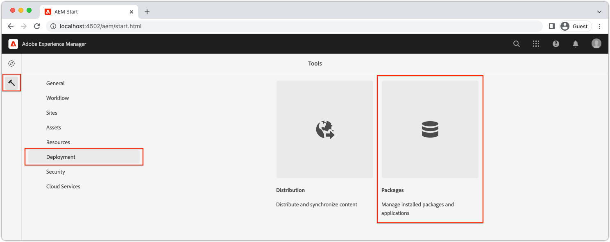

# Configurazione rapida AEM headless tramite SDK AEM locale {#setup}

La configurazione rapida AEM Headless ti consente di utilizzare AEM Headless utilizzando il contenuto del progetto di esempio del sito WKND e un esempio di app React (SPA) che consuma il contenuto rispetto alle API AEM Headless GraphQL. Questa guida utilizza [SDK AS A CLOUD SERVICE AEM](https://experienceleague.adobe.com/docs/experience-manager-cloud-service/content/implementing/developing/aem-as-a-cloud-service-sdk.html).

## Prerequisiti {#prerequisites}

I seguenti strumenti devono essere installati localmente:

* [JDK 11](https://experience.adobe.com/#/downloads/content/software-distribution/en/general.html?1_group.propertyvalues.property=.%2Fjcr%3Acontent%2Fmetadata%2Fdc%3AsoftwareType&amp;1_group.propertyvalues.operation=equals&amp;1_group.propertyvalues.0_values=tipo di software%3Atooling&amp;fulltext=Oracle%7E+JDK%7E+11%7E&amp;orderby=%40jcr%3Acontent%2Fjcr%3AlastModified&amp;orderby.sort=desc&amp;layout=list&amp;p.offset=0&amp;p.limit=14)
* [Node.js v18](https://nodejs.org/it/)
* [Git](https://git-scm.com/)

## 1. Installare l’SDK dell’AEM {#aem-sdk}

Questa configurazione utilizza [SDK AS A CLOUD SERVICE AEM](https://experienceleague.adobe.com/docs/experience-manager-cloud-service/implementing/developing/aem-as-a-cloud-service-sdk.html?#aem-as-a-cloud-service-sdk) per esplorare le API GraphQL dell’AEM. Questa sezione fornisce una guida rapida all’installazione dell’SDK per AEM e alla sua esecuzione in modalità Creazione. Una guida più dettagliata per la creazione di un ambiente di sviluppo locale [si trova qui](https://experienceleague.adobe.com/docs/experience-manager-learn/cloud-service/local-development-environment-set-up/overview.html#local-development-environment-set-up).

>[!NOTE]
>
> È inoltre possibile seguire l’esercitazione con un’ [Ambiente as a Cloud Service AEM](./cloud-service.md). Nell’esercitazione sono incluse note aggiuntive sull’utilizzo di un ambiente Cloud.

1. Accedi a **[Portale di distribuzione software](https://experience.adobe.com/#/downloads/content/software-distribution/en/aemcloud.html?fulltext=AEM*+SDK*&amp;orderby=%40jcr%3Acontent%2Fjcr%3AlastModified&amp;orderby.sort=desc&amp;layout=list&amp;p.offset=0&amp;p.limit=1)** > **AEM as a Cloud Service** e scarica la versione più recente di **SDK AEM**.

   

1. Decomprimi il download e copia il file jar Quickstart (`aem-sdk-quickstart-XXX.jar`) in una cartella dedicata, ovvero `~/aem-sdk/author`.
1. Rinomina il file jar in `aem-author-p4502.jar`.

   Il `author` name specifica che il file jar Quickstart viene avviato in modalità Creazione. Il `p4502` specifica l&#39;esecuzione di Quickstart sulla porta 4502.

1. Per installare e avviare l’istanza AEM, apri un prompt dei comandi nella cartella che contiene il file jar ed esegui il comando seguente:

   ```shell
   $ cd ~/aem-sdk/author
   $ java -jar aem-author-p4502.jar
   ```

1. Immetti una password amministratore come `admin`. Qualsiasi password amministratore è accettabile, tuttavia si consiglia di utilizzare `admin` per lo sviluppo locale per ridurre la necessità di riconfigurare.
1. Al termine dell’installazione del servizio AEM, dovrebbe aprirsi una nuova finestra del browser all’indirizzo [http://localhost:4502](Http://localhost:4502).
1. Accedi con il nome utente `admin` e la password selezionata durante l&#39;avvio iniziale dell&#39;AEM (di solito `admin`).

## 2. Installare il contenuto di esempio {#install-sample-content}

Contenuto di esempio da **Sito di riferimento WKND** viene utilizzato per accelerare l’esercitazione. Il WKND è un marchio fittizio in stile di vita, spesso utilizzato con la formazione per l’AEM.

Il sito WKND include le configurazioni necessarie per esporre un [Endpoint GraphQL](https://experienceleague.adobe.com/docs/experience-manager-cloud-service/content/headless/graphql-api/content-fragments.html). In un’implementazione reale, segui i passaggi documentati per [includere gli endpoint di GraphQL](https://experienceleague.adobe.com/docs/experience-manager-cloud-service/content/headless/graphql-api/content-fragments.html) nel progetto del cliente. A [CORS](#cors-config) è stato anche incluso nel pacchetto come parte del sito WKND. È necessaria una configurazione CORS per concedere l’accesso a un’applicazione esterna. Ulteriori informazioni su [CORS](#cors-config) sono disponibili qui sotto.

1. Scarica l’ultimo pacchetto AEM compilato per il sito WKND: [aem-guides-wknd.all-x.x.x.zip](https://github.com/adobe/aem-guides-wknd/releases/latest).

   >[!NOTE]
   >
   > Assicurati di scaricare la versione standard compatibile con AEM as a Cloud Service e **non** il `classic` versione.

1. Dalla sezione **Inizio AEM** menu, passa a **Strumenti** > **Distribuzione** > **Pacchetti**.

   

1. Clic **Carica pacchetto** e scegli il pacchetto WKND scaricato nel passaggio precedente. Per installare il pacchetto, fai clic su **Installa**.

1. Dalla sezione **Inizio AEM** menu, passa a **Risorse** > **File** > **WKND condiviso** > **Inglese** > **Avventure**.

   

   Questa è una cartella di tutte le risorse che comprendono le varie avventure promosse dal brand WKND. Sono inclusi i tipi di media tradizionali come immagini e video e quelli specifici dell’AEM come **Frammenti di contenuto**.

1. Fai clic su nella **Sci in discesa Wyoming** e fai clic sul pulsante **Frammento di contenuto per sci di discesa nel Wyoming** scheda:

   

1. Si apre l’editor frammento di contenuto per l’avventura di Downhill Skiing Wyoming.

   

   Osserva che vari campi come **Titolo**, **Descrizione**, e **Attività** definisci il frammento.

   **Frammenti di contenuto** sono uno dei modi in cui i contenuti possono essere gestiti nell’AEM. I frammenti di contenuto sono contenuti riutilizzabili, indipendenti dalla presentazione e composti da elementi dati strutturati come testo, testo RTF, date o riferimenti ad altri frammenti di contenuto. I frammenti di contenuto vengono esaminati più dettagliatamente più avanti nella configurazione rapida.

1. Clic **Annulla** per chiudere il frammento. Puoi spostarti tra le altre cartelle ed esplorare gli altri contenuti di Adventure.

>[!NOTE]
>
> Se utilizzi un ambiente di Cloud Service, consulta la documentazione su come [distribuire una base di codice come il sito di riferimento WKND in un ambiente di Cloud Service;](https://experienceleague.adobe.com/docs/experience-manager-cloud-service/implementing/deploying/overview.html#coding-against-the-right-aem-version).

## 3. Scaricare ed eseguire l’app WKND React {#sample-app}

Uno degli obiettivi di questo tutorial è mostrare come utilizzare contenuti AEM da un’applicazione esterna utilizzando le API GraphQL. Questa esercitazione utilizza un esempio di app React. L’app React è intenzionalmente semplice, per concentrarsi sull’integrazione con le API GraphQL dell’AEM.

1. Apri un nuovo prompt dei comandi e clona l’app React di esempio da GitHub:

   ```shell
   $ git clone git@github.com:adobe/aem-guides-wknd-graphql.git
   $ cd aem-guides-wknd-graphql/react-app
   ```

1. Aprire l’app React in `aem-guides-wknd-graphql/react-app` nell’IDE che preferisci.
1. Nell’IDE, apri il file `.env.development` a `/.env.development`. Verificare la `REACT_APP_AUTHORIZATION` La riga è priva di commenti e il file dichiara le seguenti variabili:

   ```plain
   REACT_APP_HOST_URI=http://localhost:4502
   REACT_APP_GRAPHQL_ENDPOINT=/content/graphql/global/endpoint.json
   # Use Authorization when connecting to an AEM Author environment
   REACT_APP_AUTHORIZATION=admin:admin
   ```

   Assicurare `REACT_APP_HOST_URI` punta all’SDK dell’AEM locale. Per comodità, questo avvio rapido collega l’app React a  **Autore AEM**. **Autore** richiedono l&#39;autenticazione, pertanto l&#39;app utilizza `admin` per stabilire la connessione. La connessione di un’app all’istanza di authoring dell’AEM è una pratica comune durante lo sviluppo, in quanto facilita la rapida iterazione dei contenuti senza la necessità di pubblicare modifiche.

   >[!NOTE]
   >
   > In uno scenario di produzione l’app si connette a un AEM **Pubblica** ambiente. Questo argomento è trattato più dettagliatamente nella _Distribuzione di produzione_ sezione.


1. Installa e avvia l’app React:

   ```shell
   $ cd aem-guides-wknd-graphql/react-app
   $ npm install
   $ npm start
   ```

1. Una nuova finestra del browser apre automaticamente l’app il [http://localhost:3000](Http://localhost:3000).

   

   Viene visualizzato un elenco dei contenuti delle avventure dell’AEM.

1. Fai clic su una delle immagini dell’avventura per visualizzarne i dettagli. Viene fatta una richiesta all&#39;AEM per restituire i dettagli di un&#39;avventura.

   

1. Utilizza gli strumenti di sviluppo del browser per verificare **Rete** richieste. Visualizza **XHR** richiede e osserva più richieste GET a `/graphql/execute.json/...`. Questo prefisso di percorso richiama l’endpoint di query persistente AEM, selezionando la query persistente da eseguire utilizzando il nome e i parametri codificati che seguono il prefisso.

   

## 4. Modificare i contenuti in AEM

Quando l’app React è in esecuzione, aggiorna i contenuti dell’AEM e osserva che la modifica si riflette nell’app.

1. Passa a AEM [http://localhost:4502](Http://localhost:4502).
1. Accedi a **Risorse** > **File** > **WKND condiviso** > **Inglese** > **Avventure** > **[Campo da surf di Bali](http://localhost:4502/assets.html/content/dam/wknd-shared/en/adventures/bali-surf-camp)**.

   

1. Fai clic su nella **Campo da surf di Bali** frammento di contenuto per aprire l’editor frammento di contenuto.
1. Modifica il **Titolo** e **Descrizione** dell&#39;avventura.

   

1. Clic **Salva** per salvare le modifiche.
1. Aggiorna l’app React in [http://localhost:3000](Http://localhost:3000) per visualizzare le modifiche:

   

## 5. Esplorare GraphiQL {#graphiql}

1. Apri [GraphiQL](http://localhost:4502/aem/graphiql.html) passando a **Strumenti** > **Generale** > **Editor query GraphQL**
1. Seleziona le query persistenti esistenti a sinistra ed eseguili per visualizzare i risultati.

   >[!NOTE]
   >
   > Lo strumento GraphiQL e l’API GraphQL sono [approfondimento più avanti nell’esercitazione](../multi-step/explore-graphql-api.md).

## Congratulazioni.{#congratulations}

Congratulazioni, ora disponi di un’applicazione esterna che utilizza contenuti AEM con GraphQL. Puoi controllare il codice nell’app React e continuare a sperimentare la modifica dei frammenti di contenuto esistenti.

### Passaggi successivi

* [Avvia l’esercitazione su AEM headless](../multi-step/overview.md)
