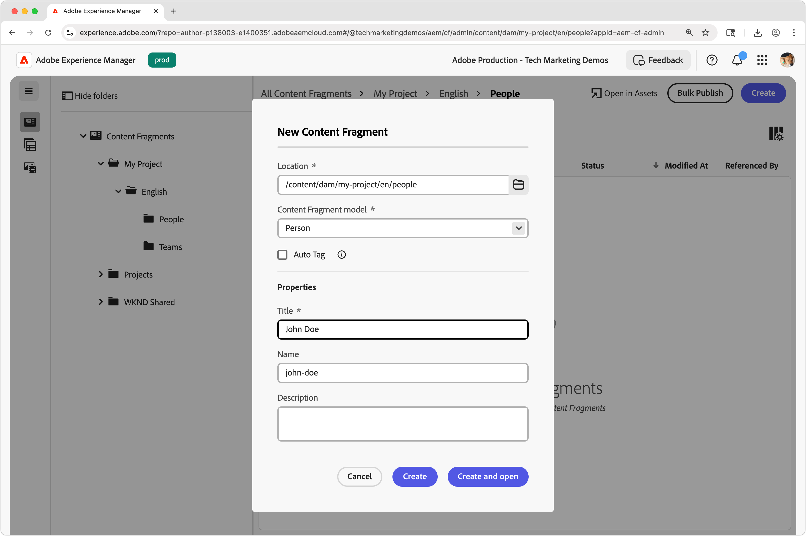
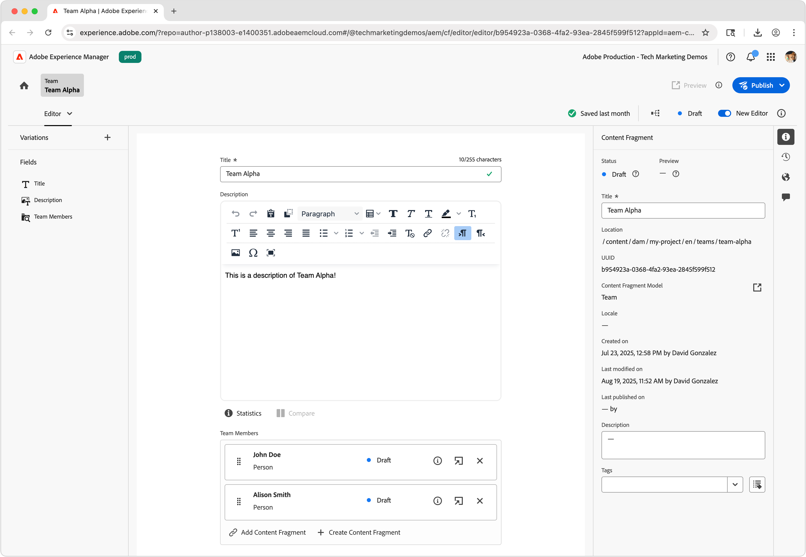

# Authoring dei frammenti di contenuto

In questo capitolo verranno creati e modificati nuovi frammenti di contenuto in base ai [modelli per frammenti di contenuto team e persona](./1-content-fragment-models.md). Questi frammenti di contenuto saranno il contenuto utilizzato dall’app React tramite la Distribuzione di frammenti di contenuto di AEM con API OpenAPI.

## Prerequisiti

Questo è un tutorial in più parti e si presume che i passaggi descritti in [Definizione dei modelli per frammenti di contenuto](./1-content-fragment-models.md) siano stati completati.

## Obiettivi

* Creare un frammento di contenuto basato su un modello per frammenti di contenuto.
* Creare un frammento di contenuto.
* Pubblicare un frammento di contenuto.

## Creare cartelle di risorse per i frammenti di contenuto

I frammenti di contenuto sono memorizzati in cartelle in AEM Assets. Per creare frammenti di contenuto dai modelli per frammenti di contenuto creati nel capitolo precedente, è necessario che esista una cartella in cui memorizzarli. È necessaria una configurazione nella cartella per abilitare la creazione di frammenti di contenuto da modelli per frammenti di contenuto specifici.

AEM supporta l’organizzazione di cartelle &quot;flat&quot;, il che significa che i frammenti di contenuto di diversi modelli per frammenti di contenuto sono combinati in un’unica cartella. Tuttavia, in questa esercitazione, viene utilizzata una struttura di cartelle che è allineata ai modelli per frammenti di contenuto, in parte, per esplorare l&#39;API **Elenca tutti i frammenti di contenuto per cartella** nel [prossimo capitolo](./3-explore-openapis.md). Quando determini l’organizzazione Frammenti di contenuto, considera sia come creare e gestire i frammenti di contenuto sia come distribuirli e utilizzarli tramite la Distribuzione di Frammenti di contenuto di AEM con API OpenAPI.

1. Dalla schermata iniziale di AEM, passa a **Assets** > **File**.
1. Seleziona **Crea** nell&#39;angolo in alto a destra e seleziona **Cartella**. Inserisci:

   * Titolo: **Progetto**
   * Nome: **progetto personale**

   Seleziona **Crea** per creare la nuova cartella.

1. Apri la nuova cartella **Progetto personale** e crea una sottocartella nella nuova cartella **Progetto personale** con i seguenti valori:

   * Titolo: **Inglese**
   * Nome: **en**

   Viene creata una cartella della lingua principale per posizionare il progetto e supportare le funzionalità di localizzazione native di AEM. Una best practice prevede la configurazione di progetti per il supporto multilingue, anche se attualmente non è necessaria la localizzazione. Per ulteriori informazioni, consulta [la seguente pagina della documentazione](https://experienceleague.adobe.com/docs/experience-manager-cloud-service/content/assets/admin/translate-assets.html?lang=it).

1. Crea due sottocartelle nella nuova cartella **Progetto personale > Inglese** con i seguenti valori:

   Cartella `teams` contenente i frammenti di contenuto **Team**

   * Titolo: **Team**
   * Nome: **team**

   ... e una cartella `people` contenente i frammenti di contenuto **Persona**.

   * Titolo: **Persone**
   * Nome: **persone**

1. Torna alla cartella **Progetto personale > Inglese** e assicurati che vengano create le due nuove cartelle.
1. Seleziona la cartella **Team** e seleziona **Proprietà** nella barra delle azioni superiore.
1. Selezionare la scheda **Criteri** e deselezionare **Ereditato da`/content/dam/my-project`**.
1. Nella scheda **Criteri**, seleziona il modello per frammenti di contenuto **Team** nel campo **Modelli per frammenti di contenuto consentiti per percorso**.

   

   Questi criteri vengono ereditati automaticamente dalle sottocartelle, ma possono essere ignorati. I modelli per frammenti di contenuto possono essere consentiti dai tag o abilitati dai modelli per frammenti di contenuto di altre configurazioni di progetto. Questo meccanismo offre un modo efficace per gestire la gerarchia dei contenuti.

1. Seleziona **Salva e chiudi** per salvare le modifiche alle proprietà della cartella.
1. Aggiorna **Criteri** per la cartella **Persone** nello stesso modo, ma seleziona il modello per frammenti di contenuto **Persona**.

## Creare un frammento di contenuto persona

Crea frammenti di contenuto in base al modello per frammenti di contenuto **Persona** nella cartella **Progetto personale > Inglese > Persone**.

1. Dalla schermata iniziale di AEM, seleziona **Frammenti di contenuto** per aprire la console Frammenti di contenuto.
1. Selezionare il pulsante **Mostra cartella** per aprire il browser cartelle.
1. Selezionare la cartella **Progetto personale > Inglese > Persone**.
1. Selezionare **Crea > Frammento di contenuto** e immettere i valori seguenti:

   * Percorso: `/content/dam/my-project/en/people`
   * Modello per frammenti di contenuto: **Persona**
   * Titolo: **John Doe**
   * Nome: `john-doe`

   I campi **Titolo**, **Nome** e **Descrizione** nella finestra di dialogo **Nuovo frammento di contenuto** sono memorizzati come metadati relativi al frammento di contenuto e non fanno parte dei dati del frammento di contenuto.

   

1. Seleziona **Crea e apri**.
1. Compila i campi per il frammento **John Doe**:

   * Nome Completo: **John Doe**
   * Biografia: **John Doe ama i social media e un appassionato di viaggi.**
   * Immagine profilo: selezionare un&#39;immagine da `/content/dam` o caricarne una nuova.
   * Occupazione: **Influencer**, **Traveller**

   Questi campi e valori definiscono il contenuto del frammento di contenuto che verrà utilizzato tramite la distribuzione di frammenti di contenuto di AEM con API OpenAPI.

   

1. Le modifiche apportate al frammento di contenuto vengono salvate automaticamente, quindi non è presente alcun pulsante **Salva**.
1. Torna alla Console Frammenti di contenuto e seleziona **Il mio progetto > Inglese > Persona** per visualizzare il nuovo frammento di contenuto.

### Crea frammenti di contenuto per altre persone

Ripeti i passaggi precedenti per creare ulteriori frammenti di **Persona**.

1. Crea un frammento di contenuto persona per **Alison Smith** con le seguenti proprietà:

   * Percorso: `/content/dam/my-project/en/people`
   * Modello per frammenti di contenuto: **Persona**
   * Titolo: **Alison Smith**
   * Nome: `alison-smith`

   Seleziona **Crea e apri** e crea i seguenti valori:

   * Nome Completo: **Alison Smith**
   * Biografia: **Alison è una fotografa e ama scrivere dei suoi viaggi.**
   * Immagine profilo: selezionare un&#39;immagine da `/content/dam` o caricarne una nuova.
   * Occupazione: **Fotografo**, **Viaggiatore**, **Autore**.

Nella cartella **Progetto personale > Inglese > Persone** ora dovrebbero essere presenti due frammenti di contenuto:

Facoltativamente, puoi creare alcuni altri frammenti di contenuto Persona per rappresentare altre persone.

## Creare un frammento di contenuto del team

Con lo stesso approccio, crea un frammento di **Team** basato sul modello per frammenti di contenuto **Team** nella cartella **Progetto personale > Inglese > Team**.

1. Crea un frammento **Team** che rappresenta **Team Alpha** con le seguenti proprietà:

   * Percorso: `/content/dam/my-project/en`
   * Modello per frammenti di contenuto: **Team**
   * Titolo: **Team Alpha**
   * Nome: `team-alpha`

   Seleziona **Crea e apri** e crea i seguenti valori:

   * Titolo: **Team Alpha**
   * Descrizione: **Il team Alpha è un team di contenuti per viaggi specializzato in fotografia e scrittura di viaggi.**
   * **Membri team**: seleziona i **Frammenti di contenuto John Doe** e **Alison Smith** per popolare il campo **Membri team**.

   

1. Seleziona **Crea e apri** per creare il frammento di contenuto del team
1. Sotto **Progetto personale > Inglese > Team** dovrebbe essere presente un frammento di contenuto:

Ora dovresti avere un frammento di contenuto di **Team Alpha** nella cartella **Progetto personale > Inglese > Team**:

Se necessario, crea un **Team Omega** con un altro gruppo di persone.

## Pubblicare frammenti di contenuto

Per rendere i frammenti di contenuto disponibili tramite OpenAPI, pubblicali. La pubblicazione consente di accedere ai frammenti di contenuto tramite:

* **Servizio di pubblicazione** - fornisce contenuto alle applicazioni di produzione
* **Servizio di anteprima**: fornisce contenuto per l&#39;anteprima delle applicazioni

In genere il contenuto viene pubblicato prima nel **servizio di anteprima** e rivisto in un&#39;applicazione di anteprima prima di essere pubblicato nel **servizio di pubblicazione**. La pubblicazione nel **servizio di pubblicazione** non viene pubblicata anche nel **servizio di anteprima**. È necessario pubblicare separatamente nel servizio **Anteprima**.

Questo tutorial verrà pubblicato su AEM Publish Service. Tuttavia, l&#39;utilizzo del servizio di anteprima di AEM è altrettanto semplice della modifica dell&#39;URL del servizio [AEM nell&#39;app React](./4-react-app.md)

1. Nella console Frammenti di contenuto, individua la cartella **Progetto personale > Inglese**.
1. Seleziona tutti i frammenti di contenuto nella cartella **English**, in cui vengono visualizzati tutti i frammenti di contenuto in tutte le sottocartelle, quindi seleziona **Pubblica > Ora** dalla barra delle azioni superiore.

   

1. Seleziona il **Servizio di pubblicazione**, in **Includi tutti i riferimenti** seleziona **Non pubblicato** e **Modificato**, quindi seleziona **Pubblica**.

   

Ora i frammenti di contenuto e tutti i frammenti di contenuto della persona a cui fanno riferimento i frammenti di contenuto del team e tutte le risorse a cui si fa riferimento vengono pubblicati nel **servizio di pubblicazione**.

Puoi pubblicare nel **servizio Anteprima** nello stesso modo.

## Congratulazioni.

Congratulazioni, hai creato correttamente i frammenti di contenuto in base ai modelli per frammenti di contenuto in AEM. Hai creato un modello per frammenti di contenuto **Persona**, creato diversi **Persona** frammenti di contenuto e creato un frammento di contenuto **Team** che fa riferimento a più frammenti di contenuto **Persona**.

Con i Frammenti di contenuto pubblicati, ora puoi accedervi tramite la Distribuzione di Frammenti di contenuto di AEM con API OpenAPI.

## Passaggi successivi

Nel prossimo capitolo, [Esplora le OpenAPI](3-explore-openapis.md), esplorerai la distribuzione dei frammenti di contenuto di AEM con le API OpenAPI utilizzando la funzionalità **Prova** integrata nella documentazione API.

