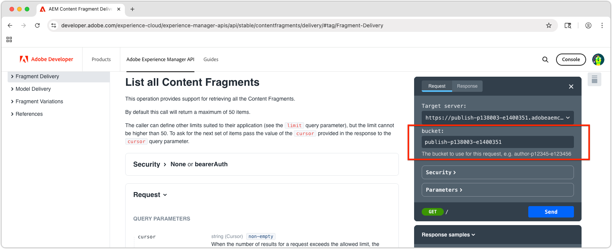

# Esplora le API di distribuzione dei frammenti di contenuto basate su OpenAPI di AEM

La [Distribuzione di frammenti di contenuto di AEM con API OpenAPI](https://developer.adobe.com/experience-cloud/experience-manager-apis/api/stable/contentfragments/delivery/) in AEM fornisce un modo potente per distribuire contenuti strutturati a qualsiasi applicazione o canale. In questo capitolo viene illustrato come utilizzare le OpenAPI per recuperare frammenti di contenuto tramite la funzionalità **Prova** della documentazione.

## Prerequisiti {#prerequisites}

Questo è un tutorial in più parti e presuppone che i passaggi descritti in [Authoring Content Fragments](./2-author-content-fragments.md) siano stati completati.

Assicurati di disporre dei seguenti elementi:

* Il nome host del servizio di pubblicazione di AEM (ad esempio `https://publish-<PROGRAM_ID>-e<ENVIRONMENT_ID >.adobeaemcloud.com/`) [I frammenti di contenuto sono pubblicati in](./2-author-content-fragments.md#publish-content-fragments). Se pubblichi il servizio di anteprima AEM, usa il nome host disponibile (ad esempio, `https://preview-<PROGRAM_ID>-e<ENVIRONMENT_ID>.adobeaemcloud.com/`).

## Obiettivi {#objectives}

* Acquisisci familiarità con [AEM Content Fragment Delivery con API OpenAPI](https://developer.adobe.com/experience-cloud/experience-manager-apis/api/stable/contentfragments/delivery/).
* Richiama le API utilizzando la funzionalità **Prova** della documentazione API.

## API di consegna

La distribuzione di frammenti di contenuto di AEM con API OpenAPI fornisce un’interfaccia RESTful per recuperare frammenti di contenuto. Le API descritte in questa esercitazione sono disponibili solo nei servizi di pubblicazione e anteprima di AEM e non nel servizio di authoring. Esistono altre OpenAPI per [l&#39;interazione con frammenti di contenuto nel servizio AEM Author](https://developer.adobe.com/experience-cloud/experience-manager-apis/api/stable/sites/).

## Esplorare le API

[Documentazione sulla distribuzione di frammenti di contenuto AEM con API OpenAPI](https://developer.adobe.com/experience-cloud/experience-manager-apis/api/stable/contentfragments/delivery/) include una funzione &quot;Prova&quot; che consente di esplorare le API e testarle direttamente dal browser. Questo è un ottimo modo per acquisire familiarità con gli endpoint API e le loro funzionalità.

Apri i [documenti API di AEM Sites](https://developer.adobe.com/experience-cloud/experience-manager-apis/api/stable/contentfragments/delivery/) nel browser.

Le API sono elencate nella barra di navigazione a sinistra nella sezione **Consegna frammenti**. Puoi espandere questa sezione per visualizzare le API disponibili. Quando si seleziona un&#39;API, i relativi dettagli vengono visualizzati nel pannello principale e una sezione **Prova** nella barra a destra, che consente di testare ed esplorare l&#39;API direttamente dal browser.


## Elenco frammenti di contenuto

1. Apri la [Distribuzione dei frammenti di contenuto di AEM con i documenti per sviluppatori OpenAPI](https://developer.adobe.com/experience-cloud/experience-manager-apis/api/stable/contentfragments/delivery/) nel browser.
1. Nel menu di navigazione a sinistra, espandi la sezione **Consegna frammenti** e seleziona l&#39;API **Elenca tutti i frammenti di contenuto**

Questa API consente di recuperare da AEM un elenco impaginato di tutti i frammenti di contenuto per cartella. Il modo più semplice per utilizzare questa API consiste nel fornire il percorso della cartella contenente i frammenti di contenuto.

1. Seleziona **Prova** nella parte superiore della barra a destra.
1. Immetti l’identificatore del servizio AEM a cui l’API si connetterà per recuperare i frammenti di contenuto. Il bucket è la prima parte dell&#39;URL del servizio di pubblicazione (o anteprima) di AEM, in genere nel formato: `publish-p<PROGRAM_ID>-e<ENVIRONMENT_ID>` o `preview-p<PROGRAM_ID>-e<ENVIRONMENT_ID>`.

Poiché utilizziamo il servizio di pubblicazione AEM, imposta il bucket sull’identificatore del servizio di pubblicazione AEM. Ad esempio:

* **bucket**: `publish-p138003-e1400351`



Quando il bucket è impostato, il campo **Server di destinazione** viene aggiornato automaticamente all&#39;URL API completo del servizio di pubblicazione di AEM, ad esempio: `https://publish-p138003-e1400351.adobeaemcloud.com/adobe/contentFragments`

1. Espandere la sezione **Sicurezza** e impostare **Schema di sicurezza** su **Nessuno**. Questo perché il servizio di pubblicazione di AEM (e il servizio di anteprima) non richiede l’autenticazione per la distribuzione di frammenti di contenuto di AEM con API OpenAPI.

1. Espandi la sezione **Parameters** per fornire i dettagli del frammento di contenuto da ottenere.

* **cursor**: lascia vuoto, viene utilizzato per l&#39;impaginazione e si tratta di una richiesta iniziale.
* **limit**: lascia vuoto, viene utilizzato per limitare il numero di risultati restituiti per pagina di risultati.
* **percorso**: `/content/dam/my-project/en`

  >[!TIP]
  > Quando si immette un percorso, assicurarsi che il prefisso sia `/content/dam/` e che **not** termini con una barra finale `/`.

  

1. Seleziona il pulsante **Invia** per eseguire la chiamata API.
1. Nella scheda **Risposta** nel pannello **Prova**, dovrebbe essere visualizzata una risposta JSON contenente un elenco di frammenti di contenuto nella cartella specificata. La risposta sarà simile alla seguente:

   

1. La risposta contiene tutti i frammenti di contenuto nella cartella `path` del parametro `/content/dam/my-project`, incluse le sottocartelle, inclusi i frammenti di contenuto **Person** e **Team**.
1. Fare clic sull&#39;array `items` e individuare il valore `Team Alpha` dell&#39;elemento `id`. L’ID viene utilizzato nella sezione successiva per recuperare i dettagli di un singolo frammento di contenuto.
1. Seleziona **Modifica richiesta** nella parte superiore del pannello **Prova** e i vari parametri nella chiamata API per vedere come cambia la risposta. Ad esempio, puoi modificare il percorso di una cartella diversa contenente Frammenti di contenuto oppure aggiungere parametri di query per filtrare i risultati. Ad esempio, cambiare il parametro `path` in `/content/dam/my-project/teams` in solo frammenti di contenuto in quella cartella (e sottocartelle).

## Ottieni dettagli frammento di contenuto

Simile all&#39;API **Elenca tutti i frammenti di contenuto**, l&#39;API **Ottieni un frammento di contenuto** recupera un singolo frammento di contenuto in base al relativo ID insieme a eventuali riferimenti facoltativi. Per esplorare questa API, richiederemo il frammento di contenuto del team che fa riferimento a diversi frammenti di contenuto della persona.

1. Espandi la sezione **Consegna frammenti** nella barra a sinistra e seleziona l&#39;API **Ottieni un frammento di contenuto**.
1. Seleziona **Prova** nella parte superiore della barra a destra.
1. Verifica che `bucket` punti al tuo servizio di pubblicazione o anteprima AEM as a Cloud Service.
1. Espandere la sezione **Sicurezza** e impostare **Schema di sicurezza** su **Nessuno**. Questo perché il servizio di pubblicazione di AEM non richiede l’autenticazione per la distribuzione di frammenti di contenuto di AEM con API OpenAPI.
1. Espandi la sezione **Parameters** per fornire i dettagli del frammento di contenuto da ottenere:

In questo esempio, utilizza l’ID del frammento di contenuto del team recuperato nella sezione precedente. Ad esempio, per questa risposta Frammento di contenuto in **Elenca tutti i frammenti di contenuto**, utilizzare il valore nel campo `id` di `b954923a-0368-4fa2-93ea-2845f599f512`. `id` sarà diverso dal valore utilizzato nell&#39;esercitazione.

```json
{
    "path": "/content/dam/my-project/teams/team-alpha",
    "name": "",
    "title": "Team Alpha",
    "id": "50f28a14-fec7-4783-a18f-2ce2dc017f55", // This is the Content Fragment ID
    "description": "",
    "model": {},
    "fields": {} 
}
```

* **fragmentId**: `50f28a14-fec7-4783-a18f-2ce2dc017f55`
* **riferimenti**: `none`
* **depth**: lascia vuoto, il parametro **references** determinerà la profondità dei frammenti di riferimento.
* **idratato**: lascia vuoto, il parametro **references** determinerà l&#39;idratazione dei frammenti a cui si fa riferimento.
* **If-None-Match**: lascia vuoto

1. Seleziona il pulsante **Invia** per eseguire la chiamata API.
1. Rivedi la risposta nella scheda **Risposta** nel pannello **Prova**. Dovresti trovare una risposta JSON contenente i dettagli del frammento di contenuto, incluse le sue proprietà e tutti i riferimenti a esso contenuti.
1. Seleziona **Modifica richiesta** nella parte superiore del pannello **Prova** e, nelle sezioni **Parametri**, regola il parametro `references` su `all-hydrated`, in modo che tutto il contenuto del frammento di contenuto di riferimento venga incluso nella chiamata API.

   * **fragmentId**: `50f28a14-fec7-4783-a18f-2ce2dc017f55`
   * **riferimenti**: `all-hydrated`
   * **depth**: lascia vuoto, il parametro **references** determinerà la profondità dei frammenti di riferimento.
   * **idratato**: lascia vuoto, il parametro **references** determinerà l&#39;idratazione dei frammenti a cui si fa riferimento.
   * **If-None-Match**: lascia vuoto

1. Seleziona il pulsante **Invia di nuovo** per eseguire di nuovo la chiamata API.
1. Rivedi la risposta nella scheda **Risposta** nel pannello **Prova**. Dovresti trovare una risposta JSON contenente i dettagli del frammento di contenuto, incluse le sue proprietà e quelle dei frammenti di contenuto della persona di riferimento.

Si noti che l&#39;array `teamMembers` ora include i dettagli dei frammenti di contenuto della persona a cui si fa riferimento. L’idratazione dei riferimenti ti consente di recuperare tutti i dati necessari in una singola chiamata API, il che è particolarmente utile per ridurre il numero di richieste effettuate dalle applicazioni client.

## Congratulazioni.

Congratulazioni, hai creato ed eseguito diverse consegne di frammenti di contenuto di AEM con chiamate API OpenAPI utilizzando la funzionalità **Prova** della documentazione di AEM.

## Passaggi successivi

Nel prossimo capitolo, [Creare un&#39;app React](./4-react-app.md), scopri come un&#39;applicazione esterna può interagire con la distribuzione di frammenti di contenuto di AEM tramite API OpenAPI.

