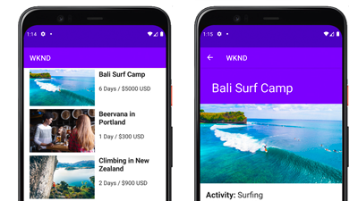

# Tutorial per contenuti headless in AEM{#aem-headless-tutorials}

Adobe Experience Manager (AEM) dispone di più opzioni per definire endpoint headless e distribuirne il contenuto come JSON. Utilizza questi pratici tutorial per scoprire come utilizzare le varie opzioni e scegliere cosa è meglio per te.

>[!TIP]
>
>Questa raccolta di tutorial è stata progettata per coloro che preferiscono **imparare con la pratica**. Se preferisci imparare concetti da zero, consulta il [Percorso per sviluppatori AEM headless](https://experienceleague.adobe.com/it/docs/experience-manager-cloud-service/content/headless/journeys/developer/overview). Questa serie di tutorial e il percorso si completano a vicenda.

## Tutorial per API

<table>
<tr>
  <td>
    
    

      <a href="https://experienceleague.adobe.com/docs/experience-manager-learn/getting-started-with-aem-headless/graphql/overview.html?lang=it">
    <strong>API GraphQL</strong>
    </a>
    

    

    <em>Scopri come un’applicazione può utilizzare l’API GraphQL di AEM per eseguire query sul contenuto.</em>
    

  </td>
  <td>
    
    

    <a href="https://experienceleague.adobe.com/it/docs/experience-manager-learn/getting-started-with-aem-headless/authentication/overview">
    <strong>Autenticazione token</strong>
    </a>
    

    

    <em>Scopri come un’applicazione può autenticarsi in modo sicuro con AEM.</em>
    

  </td>
  <td>
    
     

      <a href="https://experienceleague.adobe.com/it/docs/experience-manager-learn/getting-started-with-aem-headless/content-services/overview">
        <strong>Content Services</strong>
      </a>
    

    

    <em>Scopri come un’applicazione può utilizzare un’API REST per utilizzare contenuti.</em>
    

  </td>
</tr>
</table>

## Applicazioni di esempio

Le applicazioni di esempio sono un ottimo modo per esplorare le funzionalità headless di Adobe Experience Manager (AEM). Scarica e installa questi esempi per iniziare subito.

<table>
<tr>
  <td>
    
    

      <a href="https://experienceleague.adobe.com/it/docs/experience-manager-learn/getting-started-with-aem-headless/how-to/example-apps/ios-swiftui-app">
    <strong>Esempio iOS SwiftUI</strong>
    </a>
    

    

    <em>Un’applicazione iOS basata sulle API GraphQL di AEM.</em>
    

  </td>
  <td>
    
    

    <a href="https://experienceleague.adobe.com/it/docs/experience-manager-learn/getting-started-with-aem-headless/how-to/example-apps/android-app">
    <strong>Esempio di Android™</strong>
    </a>
    

    

    <em>Un’applicazione Android™ basata sulle API GraphQL di AEM.</em>
    

  </td>
  <td>
    
     

      <a href="https://experienceleague.adobe.com/it/docs/experience-manager-learn/getting-started-with-aem-headless/how-to/example-apps/react-app">
        <strong>Esempio di React</strong>
      </a>
    

    

    <em>Un’applicazione React basata sulle API GraphQL di AEM.</em>
    

  </td>
</tr>
</table>

## Tutorial

Sfoglia i seguenti tutorial in base alla tecnologia utilizzata. Scopri come AEM può andare oltre un caso d’uso headless, con opzioni per l’authoring nel contesto e la gestione delle esperienze.

<table>
<tr>
  <td>
    
    

      <a href="https://experienceleague.adobe.com/docs/experience-manager-learn/getting-started-with-aem-headless/graphql/overview.html?lang=it">
    <strong>React - Headless</strong>
    </a>
    

    

    <em>Crea un’app React JS utilizzando GraphQL in uno scenario puramente headless.</em>
    

  </td>
  <td>
    
     

      <a href="https://experienceleague.adobe.com/it/docs/experience-manager-learn/cloud-service/developing/universal-editor/react-app-editing/overview">
        <strong>React - Modificare il contenuto tramite l’editor universale</strong>
      </a>
    

    

    <em>Utilizzare l’editor universale per modificare il contenuto di un’applicazione React.</em>
    

  </td>  
  <td>
    
    

    <a href="https://experienceleague.adobe.com/it/docs/experience-manager-learn/getting-started-with-aem-headless/spa-editor/remote-spa/overview">
    <strong>React - Editor remoto</strong>
    </a>
    

    

    <em>Creare nel contesto una parte di un’applicazione React ospitata in remoto.</em>
    

  </td>
</tr>
<tr>  
  <td>
    
     

      <a href="https://experienceleague.adobe.com/it/docs/experience-manager-learn/getting-started-with-aem-headless/spa-editor/react/overview">
        <strong>React - Editor di SPA</strong>
      </a>
    

    

    <em>Utilizza l’editor di SPA di AEM per gestire l’esperienza completa dell’app React.</em>
    

  </td>
  <td>
    
    

    <a href="https://experienceleague.adobe.com/it/docs/experience-manager-learn/getting-started-with-aem-headless/content-services/overview">
    <strong>Android - Content Services</strong>
    </a>
    

    

    <em>Utilizzare Content Services e REST per potenziare un’applicazione per dispositivi mobili Android™.</em>
    

  </td>
  <td>
    
     

      <a href="https://experienceleague.adobe.com/it/docs/experience-manager-learn/getting-started-with-aem-headless/authentication/overview">
        <strong>Node.js - Autenticazione</strong>
      </a>
    

    

    <em>Crea un’app Node.js utilizzando i token di sviluppo e di servizio per l’autenticazione.</em>
    

  </td>
</tr>
</table>
