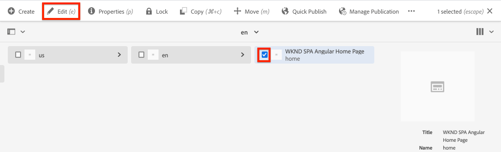

# Progetto editor SPA {#create-project}

Scopri come utilizzare un progetto Maven Adobe Experience Manager (AEM) come punto di partenza per un’applicazione di Angular integrata con l’editor SPA dell’AEM.

## Obiettivo

1. Comprendere la struttura di un nuovo progetto dell’Editor SPA dell’AEM creato da un archetipo Maven.
2. Distribuisci il progetto iniziale in un’istanza locale dell’AEM.

## Cosa verrà creato

In questo capitolo, viene implementato un nuovo progetto AEM, basato sulla [Archetipo progetto AEM](https://github.com/adobe/aem-project-archetype). Il progetto AEM viene avviato con un punto di partenza molto semplice per l&#39;SPA Angular. Il progetto utilizzato in questo capitolo servirà da base per l’attuazione dell’SPA del WKND e sarà sviluppato nei capitoli futuri.


*Un classico messaggio Hello World.*

## Prerequisiti

Esaminare gli strumenti e le istruzioni necessari per l&#39;impostazione di un [ambiente di sviluppo locale](overview.md#local-dev-environment). Assicurati che una nuova istanza di Adobe Experience Manager, avviata in **autore** , è in esecuzione in locale.

## Scarica il progetto

Sono disponibili diverse opzioni per creare un progetto Maven Multi-module per l’AEM. Questo tutorial utilizzava i più recenti [Archetipo progetto AEM](https://github.com/adobe/aem-project-archetype) come base per il codice dell’esercitazione. Sono state apportate modifiche al codice del progetto per supportare più versioni dell’AEM. Rivedi [la nota sulla compatibilità con le versioni precedenti](overview.md#compatibility).

>[!CAUTION]
>
>È consigliabile utilizzare la **più recente** versione di [archetipo](https://github.com/adobe/aem-project-archetype) generare un nuovo progetto per un’implementazione reale. I progetti dell&#39;AEM dovrebbero riguardare una sola versione dell&#39;AEM `aemVersion` dell’archetipo.

1. Scarica il punto di partenza per questa esercitazione tramite Git:

   ```shell
   $ git clone git@github.com:adobe/aem-guides-wknd-spa.git
   $ cd aem-guides-wknd-spa
   $ git checkout Angular/create-project-start
   ```

2. La seguente struttura di file e cartelle rappresenta il progetto AEM generato dall’archetipo Maven nel file system locale:

   ```plain
   |--- aem-guides-wknd-spa
       |--- all/
       |--- core/
       |--- dispatcher/
       |--- ui.apps/
       |--- ui.apps.structure/
       |--- ui.content/
       |--- ui.frontend /
       |--- it.tests/
       |--- pom.xml
       |--- README.md
       |--- .gitignore
       |--- archetype.properties
   ```

3. Le seguenti proprietà sono state utilizzate durante la generazione del progetto AEM da [Archetipo progetto AEM](https://github.com/Adobe-Marketing-Cloud/aem-project-archetype/releases/tag/aem-project-archetype-14):

   | Proprietà | Valore |
   |-----------------|---------------------------------------|
   | aemVersion | cloud |
   | appTitle | WKND ANGULAR SPA |
   | appId | wknd-spa-angular |
   | groupId | com.adobe.aem.guides |
   | frontendModule | angular |
   | pacchetto | com.adobe.aem.guides.wknd.spa.angular |
   | includeExamples | n |

   >[!NOTE]
   >
   > Osserva `frontendModule=angular` proprietà. Questo comunica all’Archetipo progetto AEM di avviare il progetto con un avviatore [Angular base di codice](https://experienceleague.adobe.com/docs/experience-manager-core-components/using/developing/archetype/uifrontend-angular.html) da utilizzare con l’editor SPA dell’AEM.

## Creare il progetto

Quindi, compila, genera e implementa il codice del progetto in un’istanza locale dell’AEM utilizzando Maven.

1. Verificare che un&#39;istanza dell&#39;AEM sia in esecuzione localmente sulla porta **4502**.
2. Dal terminale della riga di comando, verifica che Maven sia installato:

   ```shell
   $ mvn --version
   Apache Maven 3.6.2
   Maven home: /Library/apache-maven-3.6.2
   Java version: 11.0.4, vendor: Oracle Corporation, runtime: /Library/Java/JavaVirtualMachines/jdk-11.0.4.jdk/Contents/Home
   ```

3. Esegui il seguente comando Maven da `aem-guides-wknd-spa` directory per generare e distribuire il progetto in AEM:

   ```shell
   $ mvn -PautoInstallSinglePackage clean install
   ```

   Se si utilizza [AEM 6.x](overview.md#compatibility):

   ```shell
   $ mvn clean install -PautoInstallSinglePackage -Pclassic
   ```

   I moduli multipli del progetto devono essere compilati e distribuiti all’AEM.

   ```plain
   [INFO] ------------------------------------------------------------------------
   [INFO] Reactor Summary for wknd-spa-angular 1.0.0-SNAPSHOT:
   [INFO] 
   [INFO] wknd-spa-angular ................................... SUCCESS [  0.473 s]
   [INFO] WKND SPA Angular - Core ............................ SUCCESS [ 54.866 s]
   [INFO] wknd-spa-angular.ui.frontend - UI Frontend ......... SUCCESS [02:10 min]
   [INFO] WKND SPA Angular - Repository Structure Package .... SUCCESS [  0.694 s]
   [INFO] WKND SPA Angular - UI apps ......................... SUCCESS [  6.351 s]
   [INFO] WKND SPA Angular - UI content ...................... SUCCESS [  2.885 s]
   [INFO] WKND SPA Angular - All ............................. SUCCESS [  1.736 s]
   [INFO] WKND SPA Angular - Integration Tests Bundles ....... SUCCESS [  2.563 s]
   [INFO] WKND SPA Angular - Integration Tests Launcher ...... SUCCESS [  1.846 s]
   [INFO] WKND SPA Angular - Dispatcher ...................... SUCCESS [  0.270 s]
   [INFO] ------------------------------------------------------------------------
   [INFO] BUILD SUCCESS
   [INFO] ------------------------------------------------------------------------
   ```

   Profilo Maven ***autoInstallSinglePackage*** compila i singoli moduli del progetto e distribuisce un singolo pacchetto all’istanza AEM. Per impostazione predefinita, questo pacchetto viene distribuito a un’istanza AEM in esecuzione localmente sulla porta **4502** e con le credenziali di **amministratore:amministratore**.

4. Accedi a **[!UICONTROL Gestione pacchetti]** nell’istanza AEM locale: [http://localhost:4502/crx/packmgr/index.jsp](http://localhost:4502/crx/packmgr/index.jsp).

5. Dovresti vedere tre pacchetti per `wknd-spa-angular.all`, `wknd-spa-angular.ui.apps` e `wknd-spa-angular.ui.content`.

   

   Tutto il codice personalizzato necessario per il progetto è incluso in questi pacchetti e installato sul runtime AEM.

6. Dovresti anche vedere diversi pacchetti per `spa.project.core` e `core.wcm.components`. Si tratta di dipendenze incluse automaticamente dall’archetipo. Ulteriori informazioni su [I componenti core AEM sono disponibili qui](https://experienceleague.adobe.com/docs/experience-manager-core-components/using/introduction.html?lang=it).

## Contenuto autore

Quindi, apri l’SPA iniziale generato dall’archetipo e aggiorna alcuni contenuti.

1. Accedi a **[!UICONTROL Sites]** console: [http://localhost:4502/sites.html/content](http://localhost:4502/sites.html/content).

   L’SPA del WKND include una struttura di base del sito con un paese, una lingua e una pagina Home. Questa gerarchia si basa sui valori predefiniti dell’archetipo per `language_country` e `isSingleCountryWebsite`. Questi valori possono essere sovrascritti aggiornando il [proprietà disponibili](https://github.com/adobe/aem-project-archetype#available-properties) durante la generazione di un progetto.

2. Apri **[!DNL us]** > **[!DNL en]** > **[!DNL WKND SPA Angular Home Page]** selezionando la pagina e facendo clic sul pulsante **[!UICONTROL Modifica]** nella barra dei menu:

   

3. A **[!UICONTROL Testo]** il componente è già stato aggiunto alla pagina. Puoi modificare questo componente come qualsiasi altro componente nell’AEM.

   

4. Aggiungi un ulteriore **[!UICONTROL Testo]** alla pagina.

   L’esperienza di authoring è simile a quella di una pagina AEM Sites tradizionale. Attualmente è disponibile un numero limitato di componenti da utilizzare. Nel corso dell’esercitazione verranno aggiunte ulteriori informazioni.

## Inspect: applicazione a pagina singola

Quindi, verifica che si tratti di un’applicazione a pagina singola con l’utilizzo degli strumenti di sviluppo del browser.

1. In **[!UICONTROL Editor pagina]**, fare clic su **[!UICONTROL Informazioni pagina]** menu > **[!UICONTROL Visualizza come pubblicato]**:

   

   Verrà aperta una nuova scheda con il parametro query `?wcmmode=disabled` che disattiva efficacemente l’editor AEM: [http://localhost:4502/content/wknd-spa-angular/us/en/home.html?wcmmode=disabled](http://localhost:4502/content/wknd-spa-angular/us/en/home.html?wcmmode=disabled)

2. Visualizza l’origine della pagina e osserva che il contenuto del testo **[!DNL Hello World]** o qualsiasi altro contenuto non trovato. Dovresti invece visualizzare HTML come segue:

   ```html
   ...
   <body>
       <noscript>You need to enable JavaScript to run this app.</noscript>
       <div id="spa-root"></div>
       <script type="text/javascript" src="/etc.clientlibs/wknd-spa-angular/clientlibs/clientlib-angular.min.js"></script>
       ...
   </body>
   ...
   ```

   `clientlib-angular.min.js` è l’SPA di Angular caricato sulla pagina e responsabile del rendering del contenuto.

   *Da dove proviene il contenuto?*

3. Torna alla scheda: [http://localhost:4502/content/wknd-spa-angular/us/en/home.html?wcmmode=disabled](http://localhost:4502/content/wknd-spa-angular/us/en/home.html?wcmmode=disabled)
4. Apri gli strumenti di sviluppo del browser e controlla il traffico di rete della pagina durante un aggiornamento. Visualizza **XHR** richieste:

   

   Deve essere presente una richiesta a [http://localhost:4502/content/wknd-spa-angular/us/en.model.json](http://localhost:4502/content/wknd-spa-angular/us/en.model.json). Contiene tutti i contenuti, formattati in JSON, che determineranno l’SPA.

5. In una nuova scheda, apri [http://localhost:4502/content/wknd-spa-angular/us/en.model.json](http://localhost:4502/content/wknd-spa-angular/us/en.model.json)

   La richiesta `en.model.json` rappresenta il modello di contenuto che guiderà l&#39;applicazione. Inspect l’output JSON e dovresti essere in grado di trovare lo snippet che rappresenta **[!UICONTROL Testo]** componenti.

   ```json
   ...
   ":items": {
       "text": {
           "text": "<p>Hello World! Updated content!</p>\r\n",
           "richText": true,
           ":type": "wknd-spa-angular/components/text"
       },
       "text_98796435": {
           "text": "<p>A new text component.</p>\r\n",
           "richText": true,
           ":type": "wknd-spa-angular/components/text"
   },
   ...
   ```

   Nel prossimo capitolo verrà esaminato come il contenuto JSON viene mappato dai Componenti AEM ai Componenti SPA per formare la base dell’esperienza dell’Editor SPA dell’AEM.

   >[!NOTE]
   >
   > Potrebbe essere utile installare un’estensione del browser per formattare automaticamente l’output JSON.

## Congratulazioni. {#congratulations}

Congratulazioni, hai appena creato il tuo primo progetto di editor SPA per l’AEM!

Al momento è piuttosto semplice, ma nei prossimi capitoli saranno aggiunte ulteriori funzionalità.

### Passaggi successivi {#next-steps}

[Integrare l’SPA](integrate-spa.md) - Scopri come il codice sorgente dell’SPA viene integrato con il progetto AEM e quali strumenti sono disponibili per sviluppare rapidamente l’SPA.
