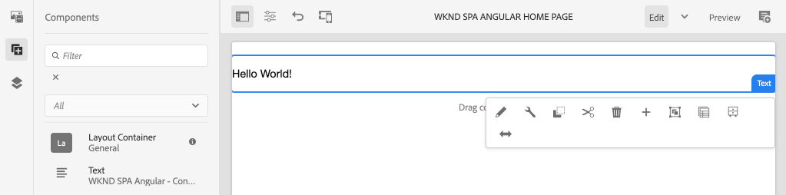
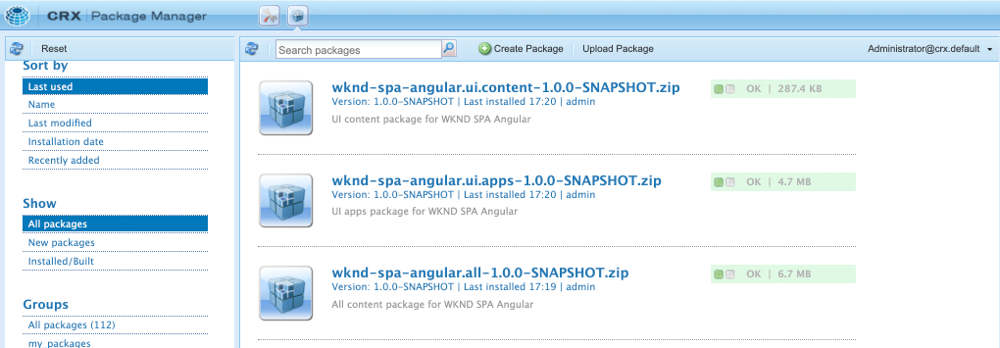
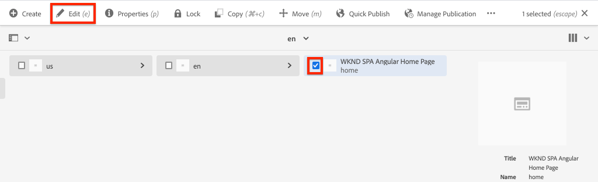
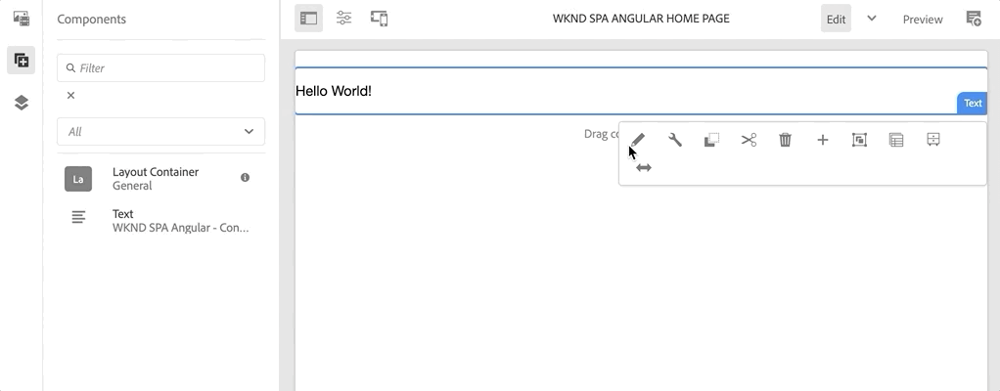
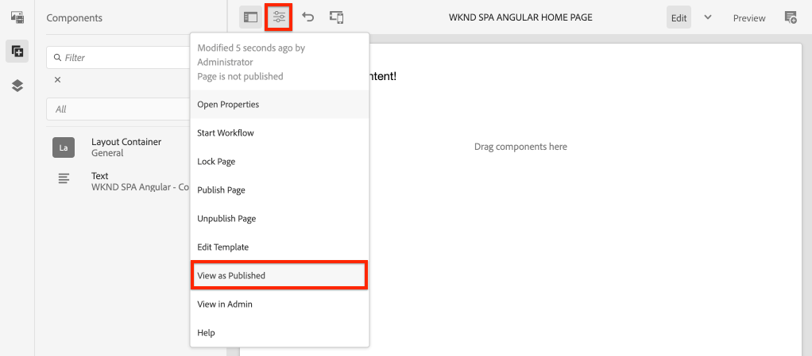
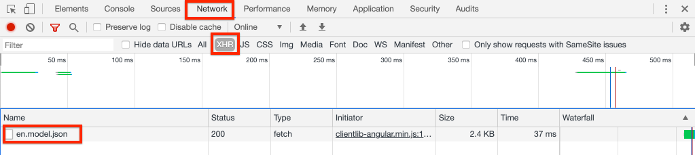

# SPA Editor Project {#create-project}

{{spa-editor-deprecation}}

Learn how to use an Adobe Experience Manager (AEM) Maven project as a starting point for an Angular application integrated with the AEM SPA Editor.

## Obiettivo

1. Understand the structure of a new AEM SPA Editor project built from a Maven archetype.
2. Deploy the starter project to a local instance of AEM.

## Cosa verrà creato

In this chapter, a new AEM project is deployed, based on the [AEM Project Archetype](https://github.com/adobe/aem-project-archetype). The AEM project is bootstrapped with a very simple starting point for the Angular SPA. The project used in this chapter will serve as the basis for an implementation of the WKND SPA and is built upon in future chapters.



*A classic Hello World message.*

## Prerequisiti

Rivedi gli strumenti e le istruzioni necessari per configurare un [ambiente di sviluppo locale](overview.md#local-dev-environment). Ensure that a fresh instance of Adobe Experience Manager, started in **author** mode, is running locally.

## Get the project

There are several options to create a Maven Multi-module project for AEM. This tutorial used the latest [AEM Project Archetype](https://github.com/adobe/aem-project-archetype) as a basis for the tutorial code. Modifications have been made to the project code in order to support multiple versions of AEM. Please review [the note about backward compatibility](overview.md#compatibility).

>[!CAUTION]
>
>It is a best practice to use the **latest** version of the [archetype](https://github.com/adobe/aem-project-archetype) to generate a new project for a real-world implementation. AEM projects should target a single version of AEM using the `aemVersion` property of the archetype.

1. Scarica il punto di partenza per questa esercitazione tramite Git:

   ```shell
   $ git clone git@github.com:adobe/aem-guides-wknd-spa.git
   $ cd aem-guides-wknd-spa
   $ git checkout Angular/create-project-start
   ```

2. La seguente struttura di file e cartelle rappresenta il progetto AEM generato dall’archetipo Maven nel file system locale:

   ```plain
   |--- aem-guides-wknd-spa
       |--- all/
       |--- core/
       |--- dispatcher/
       |--- ui.apps/
       |--- ui.apps.structure/
       |--- ui.content/
       |--- ui.frontend /
       |--- it.tests/
       |--- pom.xml
       |--- README.md
       |--- .gitignore
       |--- archetype.properties
   ```

3. Le seguenti proprietà sono state utilizzate durante la generazione del progetto AEM dall&#39;[archetipo progetto AEM](https://github.com/Adobe-Marketing-Cloud/aem-project-archetype/releases/tag/aem-project-archetype-14):

   | Proprietà | Valore |
   |-----------------|---------------------------------------|
   | aemVersion | cloud |
   | appTitle | ANGULAR SPA WKND |
   | appId | wknd-spa-angular |
   | groupId | com.adobe.aem.guides |
   | frontendModule | angular |
   | pacchetto | com.adobe.aem.guides.wknd.spa.angular |
   | includeExamples | n |

   >[!NOTE]
   >
   > Osserva la proprietà `frontendModule=angular`. Questo comunica all&#39;Archetipo progetto AEM di avviare il progetto con una [base di codice Angular](https://experienceleague.adobe.com/docs/experience-manager-core-components/using/developing/archetype/uifrontend-angular.html?lang=it) iniziale da utilizzare con l&#39;Editor SPA di AEM.

## Creare il progetto

Quindi, compila, genera e implementa il codice del progetto in un’istanza locale di AEM utilizzando Maven.

1. Verificare che un&#39;istanza di AEM sia in esecuzione localmente sulla porta **4502**.
2. Dal terminale della riga di comando, verifica che Maven sia installato:

   ```shell
   $ mvn --version
   Apache Maven 3.6.2
   Maven home: /Library/apache-maven-3.6.2
   Java version: 11.0.4, vendor: Oracle Corporation, runtime: /Library/Java/JavaVirtualMachines/jdk-11.0.4.jdk/Contents/Home
   ```

3. Eseguire il comando Maven seguente dalla directory `aem-guides-wknd-spa` per generare e distribuire il progetto in AEM:

   ```shell
   $ mvn -PautoInstallSinglePackage clean install
   ```

   Se si utilizza [AEM 6.x](overview.md#compatibility):

   ```shell
   $ mvn clean install -PautoInstallSinglePackage -Pclassic
   ```

   I moduli multipli del progetto devono essere compilati e distribuiti in AEM.

   ```plain
   [INFO] ------------------------------------------------------------------------
   [INFO] Reactor Summary for wknd-spa-angular 1.0.0-SNAPSHOT:
   [INFO] 
   [INFO] wknd-spa-angular ................................... SUCCESS [  0.473 s]
   [INFO] WKND SPA Angular - Core ............................ SUCCESS [ 54.866 s]
   [INFO] wknd-spa-angular.ui.frontend - UI Frontend ......... SUCCESS [02:10 min]
   [INFO] WKND SPA Angular - Repository Structure Package .... SUCCESS [  0.694 s]
   [INFO] WKND SPA Angular - UI apps ......................... SUCCESS [  6.351 s]
   [INFO] WKND SPA Angular - UI content ...................... SUCCESS [  2.885 s]
   [INFO] WKND SPA Angular - All ............................. SUCCESS [  1.736 s]
   [INFO] WKND SPA Angular - Integration Tests Bundles ....... SUCCESS [  2.563 s]
   [INFO] WKND SPA Angular - Integration Tests Launcher ...... SUCCESS [  1.846 s]
   [INFO] WKND SPA Angular - Dispatcher ...................... SUCCESS [  0.270 s]
   [INFO] ------------------------------------------------------------------------
   [INFO] BUILD SUCCESS
   [INFO] ------------------------------------------------------------------------
   ```

   Il profilo Maven ***autoInstallSinglePackage*** compila i singoli moduli del progetto e distribuisce un singolo pacchetto nell&#39;istanza di AEM. Per impostazione predefinita, questo pacchetto viene distribuito a un&#39;istanza di AEM in esecuzione localmente sulla porta **4502** e con le credenziali di **admin:admin**.

4. Passa a **[!UICONTROL Gestione pacchetti]** nell&#39;istanza AEM locale: [http://localhost:4502/crx/packmgr/index.jsp](http://localhost:4502/crx/packmgr/index.jsp).

5. Dovrebbero essere visualizzati tre pacchetti per `wknd-spa-angular.all`, `wknd-spa-angular.ui.apps` e `wknd-spa-angular.ui.content`.

   

   Tutto il codice personalizzato necessario per il progetto è incluso in questi pacchetti e installato sul runtime di AEM.

6. Dovrebbero essere visualizzati anche diversi pacchetti per `spa.project.core` e `core.wcm.components`. Si tratta di dipendenze incluse automaticamente dall’archetipo. Ulteriori informazioni sui [componenti core di AEM sono disponibili qui](https://experienceleague.adobe.com/docs/experience-manager-core-components/using/introduction.html?lang=it).

## Contenuto autore

Quindi, apri l’applicazione a pagina singola iniziale generata dall’archetipo e aggiorna alcuni contenuti.

1. Passa alla console **[!UICONTROL Sites]**: [http://localhost:4502/sites.html/content](http://localhost:4502/sites.html/content).

   L’applicazione a pagina singola WKND include una struttura di sito di base con un paese, una lingua e una pagina Home. Questa gerarchia si basa sui valori predefiniti dell&#39;archetipo per `language_country` e `isSingleCountryWebsite`. Questi valori possono essere sovrascritti aggiornando le [proprietà disponibili](https://github.com/adobe/aem-project-archetype#available-properties) durante la generazione di un progetto.

2. Apri la pagina **[!DNL us]** > **[!DNL en]** > **[!DNL WKND SPA Angular Home Page]** selezionando la pagina e facendo clic sul pulsante **[!UICONTROL Modifica]** nella barra dei menu:

   

3. Un componente **[!UICONTROL Testo]** è già stato aggiunto alla pagina. Puoi modificare questo componente come qualsiasi altro componente in AEM.

   

4. Aggiungi un componente aggiuntivo **[!UICONTROL Testo]** alla pagina.

   L’esperienza di authoring è simile a quella di una pagina AEM Sites tradizionale. Attualmente è disponibile un numero limitato di componenti da utilizzare. Nel corso dell’esercitazione verranno aggiunte ulteriori informazioni.

## Esamina l&#39;applicazione a pagina singola

Quindi, verifica che si tratti di un’applicazione a pagina singola con l’utilizzo degli strumenti di sviluppo del browser.

1. Nell&#39;**[!UICONTROL Editor pagine]**, fai clic sul menu **[!UICONTROL Informazioni pagina]** > **[!UICONTROL Visualizza come pubblicato]**:

   

   Verrà aperta una nuova scheda con il parametro di query `?wcmmode=disabled` che disattiva l&#39;editor AEM: [http://localhost:4502/content/wknd-spa-angular/us/en/home.html?wcmmode=disabled](http://localhost:4502/content/wknd-spa-angular/us/en/home.html?wcmmode=disabled)

2. Visualizzare l&#39;origine della pagina e notare che il contenuto di testo **[!DNL Hello World]** o qualsiasi altro contenuto non è stato trovato. Dovresti invece visualizzare HTML come segue:

   ```html
   ...
   <body>
       <noscript>You need to enable JavaScript to run this app.</noscript>
       <div id="spa-root"></div>
       <script type="text/javascript" src="/etc.clientlibs/wknd-spa-angular/clientlibs/clientlib-angular.min.js"></script>
       ...
   </body>
   ...
   ```

   `clientlib-angular.min.js` è l&#39;applicazione a pagina singola di Angular caricata sulla pagina e responsabile del rendering del contenuto.

   *Da dove proviene il contenuto?*

3. Torna alla scheda: [http://localhost:4502/content/wknd-spa-angular/us/en/home.html?wcmmode=disabled](http://localhost:4502/content/wknd-spa-angular/us/en/home.html?wcmmode=disabled)
4. Apri gli strumenti di sviluppo del browser e controlla il traffico di rete della pagina durante un aggiornamento. Visualizza le richieste **XHR**:

   

   È necessaria una richiesta a [http://localhost:4502/content/wknd-spa-angular/us/en.model.json](http://localhost:4502/content/wknd-spa-angular/us/en.model.json). Contiene tutti i contenuti, formattati in JSON, che determineranno l’applicazione a pagina singola.

5. In una nuova scheda, apri [http://localhost:4502/content/wknd-spa-angular/us/en.model.json](http://localhost:4502/content/wknd-spa-angular/us/en.model.json)

   La richiesta `en.model.json` rappresenta il modello di contenuto che guiderà l&#39;applicazione. Ispeziona l&#39;output JSON e dovresti essere in grado di trovare lo snippet che rappresenta i **[!UICONTROL Componenti testo]**.

   ```json
   ...
   ":items": {
       "text": {
           "text": "<p>Hello World! Updated content!</p>\r\n",
           "richText": true,
           ":type": "wknd-spa-angular/components/text"
       },
       "text_98796435": {
           "text": "<p>A new text component.</p>\r\n",
           "richText": true,
           ":type": "wknd-spa-angular/components/text"
   },
   ...
   ```

   Nel prossimo capitolo esamineremo come il contenuto JSON viene mappato dai componenti di AEM ai componenti SPA per formare la base dell’esperienza di AEM SPA Editor.

   >[!NOTE]
   >
   > Potrebbe essere utile installare un’estensione del browser per formattare automaticamente l’output JSON.

## Congratulazioni. {#congratulations}

Congratulazioni, hai appena creato il tuo primo progetto Editor SPA di AEM.

Al momento è piuttosto semplice, ma nei prossimi capitoli saranno aggiunte ulteriori funzionalità.

### Passaggi successivi {#next-steps}

[Integrare l&#39;applicazione a pagina singola](integrate-spa.md) - Scopri come il codice sorgente dell&#39;applicazione a pagina singola viene integrato con il progetto AEM e quali strumenti sono disponibili per sviluppare rapidamente l&#39;applicazione a pagina singola.
