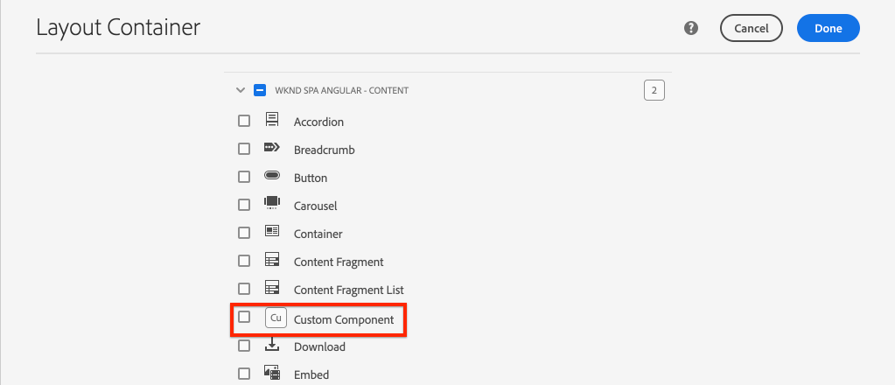

# Creare un componente personalizzato {#custom-component}

Scopri come creare un componente personalizzato da utilizzare con l’Editor SPA dell’AEM. Scopri come sviluppare finestre di dialogo di authoring e modelli Sling per estendere il modello JSON e popolare un componente personalizzato.

## Obiettivo

1. Comprendi il ruolo dei modelli Sling nella manipolazione dell’API del modello JSON fornita dall’AEM.
2. Scopri come creare finestre di dialogo per i componenti AEM.
3. Scopri come creare un **personalizzato** Componente AEM compatibile con il framework dell’editor SPA.

## Cosa verrà creato

L’obiettivo dei capitoli precedenti era lo sviluppo di componenti SPA e la loro mappatura su *esistente* Componenti core AEM. Questo capitolo illustra come creare ed estendere *nuovo* Componenti dell’AEM e manipolazione del modello JSON fornito dall’AEM.

Un semplice `Custom Component` illustra i passaggi necessari per creare un nuovo componente AEM.


## Prerequisiti

Esaminare gli strumenti e le istruzioni necessari per l&#39;impostazione di un [ambiente di sviluppo locale](overview.md#local-dev-environment).

### Ottieni il codice

1. Scarica il punto di partenza per questa esercitazione tramite Git:

   ```shell
   $ git clone git@github.com:adobe/aem-guides-wknd-spa.git
   $ cd aem-guides-wknd-spa
   $ git checkout Angular/custom-component-start
   ```

2. Distribuisci la base di codice in un’istanza AEM locale utilizzando Maven:

   ```shell
   $ mvn clean install -PautoInstallSinglePackage
   ```

   Se si utilizza [AEM 6.x](overview.md#compatibility) aggiungi `classic` profilo:

   ```shell
   $ mvn clean install -PautoInstallSinglePackage -Pclassic
   ```

3. Installare il pacchetto finito per il tradizionale [Sito di riferimento WKND](https://github.com/adobe/aem-guides-wknd/releases/latest). Le immagini fornite da [Sito di riferimento WKND](https://github.com/adobe/aem-guides-wknd/releases/latest) sono riutilizzati nel WKND SPA. Il pacchetto può essere installato utilizzando [Gestione pacchetti AEM](http://localhost:4502/crx/packmgr/index.jsp).

   

Puoi sempre visualizzare il codice finito su [GitHub](https://github.com/adobe/aem-guides-wknd-spa/tree/Angular/custom-component-solution) oppure estrarre il codice localmente passando al ramo `Angular/custom-component-solution`.

## Definire il componente AEM

Un componente AEM è definito come nodo e proprietà. Nel progetto, questi nodi e proprietà sono rappresentati come file XML in `ui.apps` modulo. Quindi, crea il componente AEM in `ui.apps` modulo.

>[!NOTE]
>
> Un rapido aggiornamento del [informazioni di base sui componenti dell’AEM possono essere utili](https://experienceleague.adobe.com/docs/experience-manager-learn/getting-started-wknd-tutorial-develop/project-archetype/component-basics.html).

1. Apri `ui.apps` nell’IDE che preferisci.
2. Accedi a `ui.apps/src/main/content/jcr_root/apps/wknd-spa-angular/components` e crea una cartella denominata `custom-component`.
3. Crea un file denominato `.content.xml` sotto `custom-component` cartella. Popolare il `custom-component/.content.xml` con le seguenti caratteristiche:

   ```xml
   <?xml version="1.0" encoding="UTF-8"?>
   <jcr:root xmlns:sling="http://sling.apache.org/jcr/sling/1.0" xmlns:cq="http://www.day.com/jcr/cq/1.0" xmlns:jcr="http://www.jcp.org/jcr/1.0"
       jcr:primaryType="cq:Component"
       jcr:title="Custom Component"
       componentGroup="WKND SPA Angular - Content"/>
   ```

   

   `jcr:primaryType="cq:Component"` - identifica che questo nodo è un componente AEM.

   `jcr:title` è il valore visualizzato agli autori di contenuti e al `componentGroup` determina il raggruppamento di componenti nell’interfaccia utente di creazione.

4. Sotto `custom-component` cartella, crea un’altra cartella denominata `_cq_dialog`.
5. Sotto `_cq_dialog` cartella creare un file denominato `.content.xml` e popolarlo con quanto segue:

   ```xml
   <?xml version="1.0" encoding="UTF-8"?>
   <jcr:root xmlns:sling="http://sling.apache.org/jcr/sling/1.0" xmlns:granite="http://www.adobe.com/jcr/granite/1.0" xmlns:cq="http://www.day.com/jcr/cq/1.0" xmlns:jcr="http://www.jcp.org/jcr/1.0" xmlns:nt="http://www.jcp.org/jcr/nt/1.0"
       jcr:primaryType="nt:unstructured"
       jcr:title="Custom Component"
       sling:resourceType="cq/gui/components/authoring/dialog">
       <content
           jcr:primaryType="nt:unstructured"
           sling:resourceType="granite/ui/components/coral/foundation/container">
           <items jcr:primaryType="nt:unstructured">
               <tabs
                   jcr:primaryType="nt:unstructured"
                   sling:resourceType="granite/ui/components/coral/foundation/tabs"
                   maximized="{Boolean}true">
                   <items jcr:primaryType="nt:unstructured">
                       <properties
                           jcr:primaryType="nt:unstructured"
                           jcr:title="Properties"
                           sling:resourceType="granite/ui/components/coral/foundation/container"
                           margin="{Boolean}true">
                           <items jcr:primaryType="nt:unstructured">
                               <columns
                                   jcr:primaryType="nt:unstructured"
                                   sling:resourceType="granite/ui/components/coral/foundation/fixedcolumns"
                                   margin="{Boolean}true">
                                   <items jcr:primaryType="nt:unstructured">
                                       <column
                                           jcr:primaryType="nt:unstructured"
                                           sling:resourceType="granite/ui/components/coral/foundation/container">
                                           <items jcr:primaryType="nt:unstructured">
                                               <message
                                                   jcr:primaryType="nt:unstructured"
                                                   sling:resourceType="granite/ui/components/coral/foundation/form/textfield"
                                                   fieldDescription="The text to display on the component."
                                                   fieldLabel="Message"
                                                   name="./message"/>
                                           </items>
                                       </column>
                                   </items>
                               </columns>
                           </items>
                       </properties>
                   </items>
               </tabs>
           </items>
       </content>
   </jcr:root>
   ```

   

   Il file XML sopra riportato genera una semplice finestra di dialogo per `Custom Component`. La parte critica del file è la parte interna `<message>` nodo. Questa finestra di dialogo contiene un semplice `textfield` denominato `Message` e rendono persistente il valore del campo di testo in una proprietà denominata `message`.

   Un modello Sling viene creato accanto a per esporre il valore del `message` tramite il modello JSON.

   >[!NOTE]
   >
   > Puoi visualizzare molto di più [esempi di finestre di dialogo visualizzando le definizioni dei Componenti core](https://github.com/adobe/aem-core-wcm-components/tree/master/content/src/content/jcr_root/apps/core/wcm/components). Puoi anche visualizzare campi modulo aggiuntivi, come `select`, `textarea`, `pathfield`, disponibile sotto `/libs/granite/ui/components/coral/foundation/form` in [CRXDE-Lite](http://localhost:4502/crx/de/index.jsp#/libs/granite/ui/components/coral/foundation/form).

   Con una componente tradizionale AEM, [HTL](https://experienceleague.adobe.com/docs/experience-manager-htl/content/overview.html?lang=it) in genere è richiesto uno script. Poiché l’SPA esegue il rendering del componente, non è necessario alcuno script HTL.

## Creare il modello Sling

I modelli Sling sono Java™ &quot;POJO&quot; (Plain Old Java™ Objects) basati su annotazioni che facilitano la mappatura dei dati dalle variabili JCR a Java™. [Modelli Sling](https://experienceleague.adobe.com/docs/experience-manager-learn/getting-started-wknd-tutorial-develop/project-archetype/component-basics.html#sling-models) in genere funziona per incapsulare una logica di business lato server complessa per i componenti AEM.

Nel contesto dell’editor SPA, i modelli Sling espongono il contenuto di un componente tramite il modello JSON tramite una funzione che utilizza [Esportatore modello Sling](https://experienceleague.adobe.com/docs/experience-manager-learn/foundation/development/develop-sling-model-exporter.html?lang=it).

1. Nell’IDE che preferisci, apri `core` modulo. `CustomComponent.java` e `CustomComponentImpl.java` sono già stati creati e inseriti come parte del codice iniziale del capitolo.

   >[!NOTE]
   >
   > Se si utilizza l&#39;IDE di Visual Studio Code, può essere utile installare [estensioni per Java™](https://code.visualstudio.com/docs/java/extensions).

2. Aprire l&#39;interfaccia Java™ `CustomComponent.java` a `core/src/main/java/com/adobe/aem/guides/wknd/spa/angular/core/models/CustomComponent.java`:

   

   Si tratta dell’interfaccia Java™ implementata dal modello Sling.

3. Aggiorna `CustomComponent.java` in modo da estendere il `ComponentExporter` Interfaccia:

   ```java
   package com.adobe.aem.guides.wknd.spa.angular.core.models;
   import com.adobe.cq.export.json.ComponentExporter;
   
   public interface CustomComponent extends ComponentExporter {
   
       public String getMessage();
   
   }
   ```

   Implementazione di `ComponentExporter` L’interfaccia di è un requisito affinché il modello Sling possa essere rilevato automaticamente dall’API del modello JSON.

   Il `CustomComponent` L&#39;interfaccia include un singolo metodo getter `getMessage()`. Questo è il metodo che espone il valore della finestra di dialogo dell’autore tramite il modello JSON. Solo metodi getter con parametri vuoti `()` vengono esportati nel modello JSON.

4. Apri `CustomComponentImpl.java` a `core/src/main/java/com/adobe/aem/guides/wknd/spa/angular/core/models/impl/CustomComponentImpl.java`.

   Questa è l&#39;implementazione del `CustomComponent` di rete. Il `@Model` L’annotazione identifica la classe Java™ come modello Sling. Il `@Exporter` l’annotazione consente di serializzare e esportare la classe Java™ tramite Sling Model Exporter.

5. Aggiornare la variabile statica `RESOURCE_TYPE` puntare alla componente AEM `wknd-spa-angular/components/custom-component` creato nell&#39;esercizio precedente.

   ```java
   static final String RESOURCE_TYPE = "wknd-spa-angular/components/custom-component";
   ```

   Il tipo di risorsa del componente è ciò che associa il modello Sling al componente AEM e alla fine lo associa al componente Angular.

6. Aggiungi il `getExportedType()` al metodo `CustomComponentImpl` classe per restituire il tipo di risorsa del componente:

   ```java
   @Override
   public String getExportedType() {
       return CustomComponentImpl.RESOURCE_TYPE;
   }
   ```

   Questo metodo è necessario quando si implementa `ComponentExporter` ed espone il tipo di risorsa che consente il mapping al componente Angular.

7. Aggiornare il `getMessage()` metodo per restituire il valore del `message` persistente dalla finestra di dialogo di authoring. Utilizza il `@ValueMap` l’annotazione è mappare il valore JCR `message` a una variabile Java™:

   ```java
   import org.apache.commons.lang3.StringUtils;
   ...
   
   @ValueMapValue
   private String message;
   
   @Override
   public String getMessage() {
       return StringUtils.isNotBlank(message) ? message.toUpperCase() : null;
   }
   ```

   Viene aggiunta un’ulteriore &quot;logica di business&quot; per restituire il valore del messaggio in maiuscolo. Questo consente di vedere la differenza tra il valore non elaborato memorizzato dalla finestra di dialogo di authoring e il valore esposto dal modello Sling.

   >[!NOTE]
   >
   È possibile visualizzare [CustomComponentImpl.java finito qui](https://github.com/adobe/aem-guides-wknd-spa/blob/Angular/custom-component-solution/core/src/main/java/com/adobe/aem/guides/wknd/spa/angular/core/models/impl/CustomComponentImpl.java).

## Aggiornare il componente Angular

Il codice di Angular per il componente personalizzato è già stato creato. Quindi, effettua alcuni aggiornamenti per mappare il componente Angular al componente AEM.

1. In `ui.frontend` modulo apri il file `ui.frontend/src/app/components/custom/custom.component.ts`
2. Osserva le `@Input() message: string;` linea. È previsto che il valore in maiuscolo trasformato sia mappato a questa variabile.
3. Importa `MapTo` oggetto dall’SDK JS dell’Editor SPA dell’AEM e utilizzarlo per la mappatura sul componente AEM:

   ```diff
   + import {MapTo} from '@adobe/cq-angular-editable-components';
   
    ...
    export class CustomComponent implements OnInit {
        ...
    }
   
   + MapTo('wknd-spa-angular/components/custom-component')(CustomComponent, CustomEditConfig);
   ```

4. Apri `cutom.component.html` e osserva che il valore di `{{message}}` viene visualizzato in un lato `<h2>` tag.
5. Apri `custom.component.css` e aggiungi la seguente regola:

   ```css
   :host-context {
       display: block;
   }
   ```

   Affinché il segnaposto dell’editor AEM venga visualizzato correttamente quando il componente è vuoto, è necessario che `:host-context` o un altro `<div>` deve essere impostato su `display: block;`.

6. Distribuisci gli aggiornamenti a un ambiente AEM locale dalla directory principale del progetto, utilizzando le tue competenze Maven:

   ```shell
   $ cd aem-guides-wknd-spa
   $ mvn clean install -PautoInstallSinglePackage
   ```

## Aggiornare il criterio del modello

Quindi, passa a AEM per verificare gli aggiornamenti e consentire `Custom Component` da aggiungere all&#39;SPA.

1. Verifica la registrazione del nuovo modello Sling passando a [http://localhost:4502/system/console/status-slingmodels](http://localhost:4502/system/console/status-slingmodels).

   ```plain
   com.adobe.aem.guides.wknd.spa.angular.core.models.impl.CustomComponentImpl - wknd-spa-angular/components/custom-component
   
   com.adobe.aem.guides.wknd.spa.angular.core.models.impl.CustomComponentImpl exports 'wknd-spa-angular/components/custom-component' with selector 'model' and extension '[Ljava.lang.String;@6fb4a693' with exporter 'jackson'
   ```

   Dovresti vedere le due righe precedenti che indicano `CustomComponentImpl` è associato al `wknd-spa-angular/components/custom-component` e che è registrato tramite Sling Model Exporter.

2. Passa al modello di pagina dell’SPA all’indirizzo [http://localhost:4502/editor.html/conf/wknd-spa-angular/settings/wcm/templates/spa-page-template/structure.html](http://localhost:4502/editor.html/conf/wknd-spa-angular/settings/wcm/templates/spa-page-template/structure.html).
3. Aggiorna il criterio del Contenitore di layout per aggiungere il nuovo `Custom Component` come componente consentito:

   

   Salva le modifiche apportate al criterio e osserva `Custom Component` come componente consentito:

   

## Creare il componente personalizzato

Quindi, crea il `Custom Component` utilizzando l’editor SPA dell’AEM.

1. Accedi a [http://localhost:4502/editor.html/content/wknd-spa-angular/us/en/home.html](http://localhost:4502/editor.html/content/wknd-spa-angular/us/en/home.html).
2. In entrata `Edit` , aggiungi il `Custom Component` al `Layout Container`:

   

3. Apri la finestra di dialogo del componente e immetti un messaggio contenente alcune lettere minuscole.

   

   Questa è la finestra di dialogo creata in base al file XML precedente nel capitolo.

4. Salva le modifiche. Il messaggio visualizzato deve essere scritto in maiuscolo.

   

5. Visualizza il modello JSON passando a [http://localhost:4502/content/wknd-spa-angular/us/en.model.json](http://localhost:4502/content/wknd-spa-angular/us/en.model.json). Cerca `wknd-spa-angular/components/custom-component`:

   ```json
   "custom_component_208183317": {
       "message": "HELLO WORLD",
       ":type": "wknd-spa-angular/components/custom-component"
   }
   ```

   Il valore JSON è impostato su tutte le lettere maiuscole in base alla logica aggiunta al modello Sling.

## Congratulazioni. {#congratulations}

Congratulazioni, hai imparato a creare un componente AEM personalizzato e il funzionamento dei modelli e delle finestre di dialogo Sling con il modello JSON.

Puoi sempre visualizzare il codice finito su [GitHub](https://github.com/adobe/aem-guides-wknd-spa/tree/Angular/custom-component-solution) oppure estrarre il codice localmente passando al ramo `Angular/custom-component-solution`.

### Passaggi successivi {#next-steps}

[Estendere un componente core](extend-component.md) - Scopri come estendere un Componente core esistente da utilizzare con l’Editor SPA dell’AEM. Comprendere come aggiungere proprietà e contenuti a un componente esistente è una tecnica efficace per espandere le funzionalità di un’implementazione dell’Editor SPA dell’AEM.
