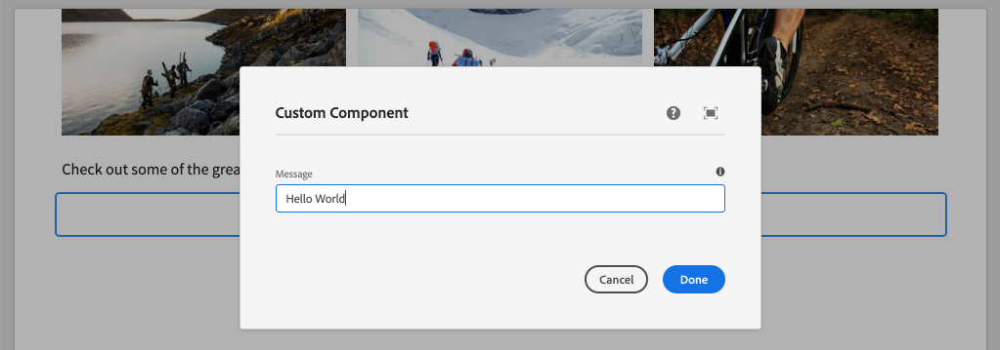

# Creare un componente personalizzato {#custom-component}

Scopri come creare un componente personalizzato da utilizzare con l’editor SPA AEM. Scopri come sviluppare le finestre di dialogo degli autori e i modelli Sling per estendere il modello JSON a un componente personalizzato.

## Obiettivo

1. Comprendi il ruolo dei modelli Sling nella manipolazione dell’API del modello JSON fornita da AEM.
2. Scopri come creare nuove finestre di dialogo dei componenti AEM.
3. Scopri come creare un componente **personalizzato** AEM compatibile con il framework dell’editor SPA.

## Cosa verrà creato

I capitoli precedenti erano incentrati sullo sviluppo di componenti SPA e sulla loro mappatura su *componenti core esistenti* AEM. Questo capitolo si concentrerà su come creare ed estendere *nuovi* componenti AEM e manipolare il modello JSON gestito da AEM.

Un semplice `Custom Component` illustra i passaggi necessari per creare un nuovo componente AEM.


## Prerequisiti

Rivedi gli strumenti e le istruzioni necessari per configurare un [ambiente di sviluppo locale](overview.md#local-dev-environment).

### Ottieni il codice

1. Scarica il punto di partenza per questa esercitazione tramite Git:

   ```shell
   $ git clone git@github.com:adobe/aem-guides-wknd-spa.git
   $ cd aem-guides-wknd-spa
   $ git checkout Angular/custom-component-start
   ```

2. Distribuisci la base di codice in un&#39;istanza AEM locale utilizzando Maven:

   ```shell
   $ mvn clean install -PautoInstallSinglePackage
   ```

   Se utilizzi [AEM 6.x](overview.md#compatibility) aggiungi il profilo `classic`:

   ```shell
   $ mvn clean install -PautoInstallSinglePackage -Pclassic
   ```

3. Installa il pacchetto finito per il tradizionale [sito di riferimento WKND](https://github.com/adobe/aem-guides-wknd/releases/latest). Le immagini fornite dal [sito di riferimento WKND](https://github.com/adobe/aem-guides-wknd/releases/latest) verranno riutilizzate nel SPA WKND. Il pacchetto può essere installato utilizzando [Gestione pacchetti AEM](http://localhost:4502/crx/packmgr/index.jsp).

   

Puoi sempre visualizzare il codice finito su [GitHub](https://github.com/adobe/aem-guides-wknd-spa/tree/Angular/custom-component-solution) o estrarre il codice localmente passando al ramo `Angular/custom-component-solution`.

## Definire il componente AEM

Un componente AEM è definito come un nodo e proprietà. Nel progetto questi nodi e proprietà sono rappresentati come file XML nel modulo `ui.apps` . Quindi, crea il componente AEM nel modulo `ui.apps` .

>[!NOTE]
>
> È utile un aggiornamento rapido sulle [nozioni di base dei componenti AEM](https://experienceleague.adobe.com/docs/experience-manager-learn/getting-started-wknd-tutorial-develop/project-archetype/component-basics.html).

1. Nell’IDE che preferisci, apri la cartella `ui.apps` .
2. Passa a `ui.apps/src/main/content/jcr_root/apps/wknd-spa-angular/components` e crea una nuova cartella denominata `custom-component`.
3. Crea un nuovo file denominato `.content.xml` sotto la cartella `custom-component` . Popolare il `custom-component/.content.xml` con quanto segue:

   ```xml
   <?xml version="1.0" encoding="UTF-8"?>
   <jcr:root xmlns:sling="http://sling.apache.org/jcr/sling/1.0" xmlns:cq="http://www.day.com/jcr/cq/1.0" xmlns:jcr="http://www.jcp.org/jcr/1.0"
       jcr:primaryType="cq:Component"
       jcr:title="Custom Component"
       componentGroup="WKND SPA Angular - Content"/>
   ```

   

   `jcr:primaryType="cq:Component"` - identifica che questo nodo sarà un componente AEM.

   `jcr:title` è il valore che verrà visualizzato agli autori di contenuti e  `componentGroup` determina il raggruppamento di componenti nell’interfaccia utente di authoring.

4. Sotto la cartella `custom-component` , crea un’altra cartella denominata `_cq_dialog`.
5. Sotto la cartella `_cq_dialog` crea un nuovo file denominato `.content.xml` e popolalo con i seguenti elementi:

   ```xml
   <?xml version="1.0" encoding="UTF-8"?>
   <jcr:root xmlns:sling="http://sling.apache.org/jcr/sling/1.0" xmlns:granite="http://www.adobe.com/jcr/granite/1.0" xmlns:cq="http://www.day.com/jcr/cq/1.0" xmlns:jcr="http://www.jcp.org/jcr/1.0" xmlns:nt="http://www.jcp.org/jcr/nt/1.0"
       jcr:primaryType="nt:unstructured"
       jcr:title="Custom Component"
       sling:resourceType="cq/gui/components/authoring/dialog">
       <content
           jcr:primaryType="nt:unstructured"
           sling:resourceType="granite/ui/components/coral/foundation/container">
           <items jcr:primaryType="nt:unstructured">
               <tabs
                   jcr:primaryType="nt:unstructured"
                   sling:resourceType="granite/ui/components/coral/foundation/tabs"
                   maximized="{Boolean}true">
                   <items jcr:primaryType="nt:unstructured">
                       <properties
                           jcr:primaryType="nt:unstructured"
                           jcr:title="Properties"
                           sling:resourceType="granite/ui/components/coral/foundation/container"
                           margin="{Boolean}true">
                           <items jcr:primaryType="nt:unstructured">
                               <columns
                                   jcr:primaryType="nt:unstructured"
                                   sling:resourceType="granite/ui/components/coral/foundation/fixedcolumns"
                                   margin="{Boolean}true">
                                   <items jcr:primaryType="nt:unstructured">
                                       <column
                                           jcr:primaryType="nt:unstructured"
                                           sling:resourceType="granite/ui/components/coral/foundation/container">
                                           <items jcr:primaryType="nt:unstructured">
                                               <message
                                                   jcr:primaryType="nt:unstructured"
                                                   sling:resourceType="granite/ui/components/coral/foundation/form/textfield"
                                                   fieldDescription="The text to display on the component."
                                                   fieldLabel="Message"
                                                   name="./message"/>
                                           </items>
                                       </column>
                                   </items>
                               </columns>
                           </items>
                       </properties>
                   </items>
               </tabs>
           </items>
       </content>
   </jcr:root>
   ```

   

   Il file XML di cui sopra genera una finestra di dialogo molto semplice per `Custom Component`. La parte critica del file è il nodo interno `<message>`. Questa finestra di dialogo conterrà un `textfield` semplice denominato `Message` e persisterà il valore del campo di testo in una proprietà denominata `message`.

   Verrà creato un modello Sling accanto a per esporre il valore della proprietà `message` tramite il modello JSON.

   >[!NOTE]
   >
   > Puoi visualizzare molti altri [esempi di finestre di dialogo visualizzando le definizioni dei componenti core](https://github.com/adobe/aem-core-wcm-components/tree/master/content/src/content/jcr_root/apps/core/wcm/components). È inoltre possibile visualizzare campi modulo aggiuntivi, come `select`, `textarea`, `pathfield`, disponibili sotto `/libs/granite/ui/components/coral/foundation/form` in [CRXDE-Lite](http://localhost:4502/crx/de/index.jsp#/libs/granite/ui/components/coral/foundation/form).

   Con un componente AEM tradizionale, in genere è richiesto uno script [HTL](https://experienceleague.adobe.com/docs/experience-manager-htl/using/overview.html?lang=it). Poiché il SPA eseguirà il rendering del componente, non è necessario alcuno script HTL.

## Creare il modello Sling

I modelli Sling sono Java &quot;POJO&quot; (Plain Old Java Objects) basati su annotazioni che facilitano la mappatura dei dati da JCR alle variabili Java. [Funzione Sling ](https://experienceleague.adobe.com/docs/experience-manager-learn/getting-started-wknd-tutorial-develop/project-archetype/component-basics.html#sling-models) Modelstypical per incapsulare logiche aziendali complesse lato server per i componenti AEM.

Nel contesto dell’editor di SPA, i modelli Sling espongono il contenuto di un componente attraverso il modello JSON attraverso una funzione utilizzando [Sling Model Exporter](https://experienceleague.adobe.com/docs/experience-manager-learn/foundation/development/develop-sling-model-exporter.html).

1. Nell’IDE che preferisci, apri il modulo `core` . `CustomComponent.java` e  `CustomComponentImpl.java` sono già stati creati e inseriti come parte del codice iniziale del capitolo.

   >[!NOTE]
   >
   > Se si utilizza l&#39;IDE di codice di Visual Studio, può essere utile installare [estensioni per Java](https://code.visualstudio.com/docs/java/extensions).

2. Apri l&#39;interfaccia Java `CustomComponent.java` in `core/src/main/java/com/adobe/aem/guides/wknd/spa/angular/core/models/CustomComponent.java`:

   

   Questa è l’interfaccia Java che verrà implementata dal modello Sling.

3. Aggiorna `CustomComponent.java` in modo che estenda l&#39;interfaccia `ComponentExporter`:

   ```java
   package com.adobe.aem.guides.wknd.spa.angular.core.models;
   import com.adobe.cq.export.json.ComponentExporter;
   
   public interface CustomComponent extends ComponentExporter {
   
       public String getMessage();
   
   }
   ```

   L’implementazione dell’interfaccia `ComponentExporter` richiede che il modello Sling venga automaticamente acquisito dall’API del modello JSON.

   L&#39;interfaccia `CustomComponent` include un singolo metodo getter `getMessage()`. Questo è il metodo che esporrà il valore della finestra di dialogo di authoring attraverso il modello JSON. Nel modello JSON verranno esportati solo i metodi getter con parametri vuoti `()` .

4. Apri `CustomComponentImpl.java` in `core/src/main/java/com/adobe/aem/guides/wknd/spa/angular/core/models/impl/CustomComponentImpl.java`.

   Questa è l’implementazione dell’ interfaccia `CustomComponent` . L’annotazione `@Model` identifica la classe Java come modello Sling. L’annotazione `@Exporter` consente di serializzare ed esportare la classe Java tramite l’esportazione di modelli Sling.

5. Aggiorna la variabile statica `RESOURCE_TYPE` in modo che punti al componente AEM `wknd-spa-angular/components/custom-component` creato nell&#39;esercizio precedente.

   ```java
   static final String RESOURCE_TYPE = "wknd-spa-angular/components/custom-component";
   ```

   Il tipo di risorsa del componente è ciò che associa il modello Sling al componente AEM e, in ultima analisi, viene mappato al componente Angular.

6. Aggiungi il metodo `getExportedType()` alla classe `CustomComponentImpl` per restituire il tipo di risorsa del componente:

   ```java
   @Override
   public String getExportedType() {
       return CustomComponentImpl.RESOURCE_TYPE;
   }
   ```

   Questo metodo è necessario durante l’implementazione dell’interfaccia `ComponentExporter` e mostrerà il tipo di risorsa che consente la mappatura al componente Angular.

7. Aggiorna il metodo `getMessage()` per restituire il valore della proprietà `message` persistente dalla finestra di dialogo dell’autore. Utilizza l’ `@ValueMap` annotazione per mappare il valore JCR `message` a una variabile Java:

   ```java
   import org.apache.commons.lang3.StringUtils;
   ...
   
   @ValueMapValue
   private String message;
   
   @Override
   public String getMessage() {
       return StringUtils.isNotBlank(message) ? message.toUpperCase() : null;
   }
   ```

   Viene aggiunta una nuova &quot;logica di business&quot; per restituire il valore del messaggio in maiuscolo. Questo ci permetterà di vedere la differenza tra il valore non elaborato memorizzato dalla finestra di dialogo dell’autore e il valore esposto dal modello Sling.

   >[!NOTE]
   >
   > Puoi visualizzare il file [finito CustomComponentImpl.java qui](https://github.com/adobe/aem-guides-wknd-spa/blob/Angular/custom-component-solution/core/src/main/java/com/adobe/aem/guides/wknd/spa/angular/core/models/impl/CustomComponentImpl.java).

## Aggiornare il componente Angular

Il codice di Angular per il componente personalizzato è già stato creato. Quindi, effettua alcuni aggiornamenti per mappare il componente Angular al componente AEM.

1. Nel modulo `ui.frontend` apri il file `ui.frontend/src/app/components/custom/custom.component.ts`
2. Osserva la riga `@Input() message: string;`. È previsto che il valore in maiuscolo trasformato venga mappato su questa variabile.
3. Importa l&#39;oggetto `MapTo` dall&#39;SDK JS dell&#39;editor SPA AEM e lo utilizza per eseguire il mapping al componente AEM:

   ```diff
   + import {MapTo} from '@adobe/cq-angular-editable-components';
   
    ...
    export class CustomComponent implements OnInit {
        ...
    }
   
   + MapTo('wknd-spa-angular/components/custom-component')(CustomComponent, CustomEditConfig);
   ```

4. Apri `cutom.component.html` e osserva che il valore di `{{message}}` verrà visualizzato accanto a un tag `<h2>` .
5. Apri `custom.component.css` e aggiungi la seguente regola:

   ```css
   :host-context {
       display: block;
   }
   ```

   Affinché il segnaposto dell’editor di AEM venga visualizzato correttamente quando il componente è vuoto, è necessario impostare `:host-context` o un altro `<div>` su `display: block;`.

6. Distribuisci tutti gli aggiornamenti a un ambiente AEM locale dalla directory principale della directory di progetto, utilizzando le tue competenze Maven:

   ```shell
   $ cd aem-guides-wknd-spa
   $ mvn clean install -PautoInstallSinglePackage
   ```

## Aggiornare i criteri dei modelli

Quindi, accedi a AEM per verificare gli aggiornamenti e consentire l&#39;aggiunta di `Custom Component` al SPA.

1. Verifica la registrazione del nuovo modello Sling passando a [http://localhost:4502/system/console/status-slingmodels](http://localhost:4502/system/console/status-slingmodels).

   ```plain
   com.adobe.aem.guides.wknd.spa.angular.core.models.impl.CustomComponentImpl - wknd-spa-angular/components/custom-component
   
   com.adobe.aem.guides.wknd.spa.angular.core.models.impl.CustomComponentImpl exports 'wknd-spa-angular/components/custom-component' with selector 'model' and extension '[Ljava.lang.String;@6fb4a693' with exporter 'jackson'
   ```

   Dovresti visualizzare le due righe precedenti che indicano che il `CustomComponentImpl` è associato al componente `wknd-spa-angular/components/custom-component` e che è registrato tramite l’esportatore di modelli Sling.

2. Passa al SPA modello di pagina in [http://localhost:4502/editor.html/conf/wknd-spa-angular/settings/wcm/templates/spa-page-template/structure.html](http://localhost:4502/editor.html/conf/wknd-spa-angular/settings/wcm/templates/spa-page-template/structure.html).
3. Aggiorna i criteri del Contenitore di layout per aggiungere il nuovo `Custom Component` come componente consentito:

   

   Salva le modifiche al criterio e osserva `Custom Component` come componente consentito:

   

## Creare il componente personalizzato

Quindi, crea il `Custom Component` utilizzando l&#39;editor di SPA AEM.

1. Passa a [http://localhost:4502/editor.html/content/wknd-spa-angular/us/en/home.html](http://localhost:4502/editor.html/content/wknd-spa-angular/us/en/home.html).
2. In modalità `Edit`, aggiungi `Custom Component` a `Layout Container`:

   

3. Apri la finestra di dialogo del componente e inserisci un messaggio contenente lettere minuscole.

   

   Questa è la finestra di dialogo creata in base al file XML precedente nel capitolo.

4. Salva le modifiche. Il messaggio visualizzato è in maiuscolo.

   

5. Visualizzare il modello JSON andando su [http://localhost:4502/content/wknd-spa-angular/us/en.model.json](http://localhost:4502/content/wknd-spa-angular/us/en.model.json). Cerca `wknd-spa-angular/components/custom-component`:

   ```json
   "custom_component_208183317": {
       "message": "HELLO WORLD",
       ":type": "wknd-spa-angular/components/custom-component"
   }
   ```

   Il valore JSON viene impostato su tutte le lettere maiuscole in base alla logica aggiunta al modello Sling.

## Congratulazioni! {#congratulations}

Congratulazioni, hai imparato a creare un componente AEM personalizzato e come funzionano i modelli e le finestre di dialogo Sling con il modello JSON.

Puoi sempre visualizzare il codice finito su [GitHub](https://github.com/adobe/aem-guides-wknd-spa/tree/Angular/custom-component-solution) o estrarre il codice localmente passando al ramo `Angular/custom-component-solution`.

### Passaggi successivi {#next-steps}

[Estendere un componente](extend-component.md)  core - Scopri come estendere un componente core esistente da utilizzare con l’editor di SPA AEM. Scopri come aggiungere proprietà e contenuto a un componente esistente è una tecnica potente per espandere le funzionalità di un’implementazione di AEM Editor SPA.
