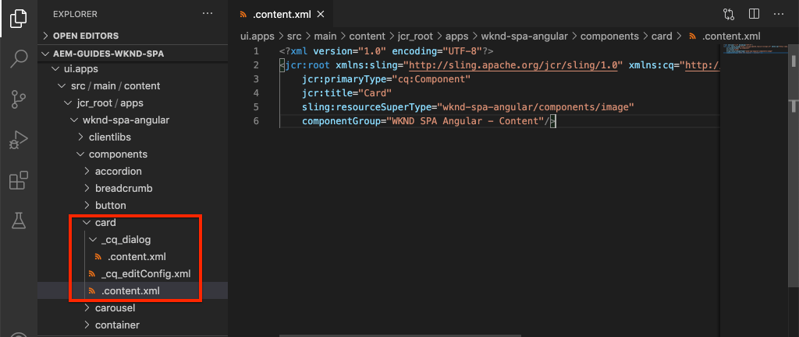
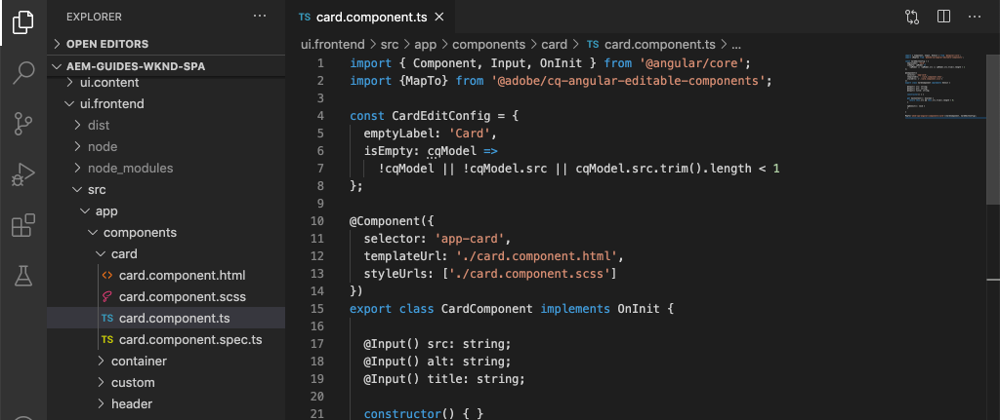
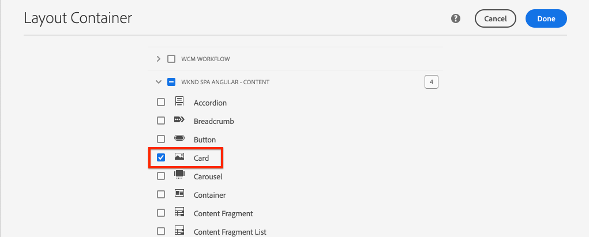
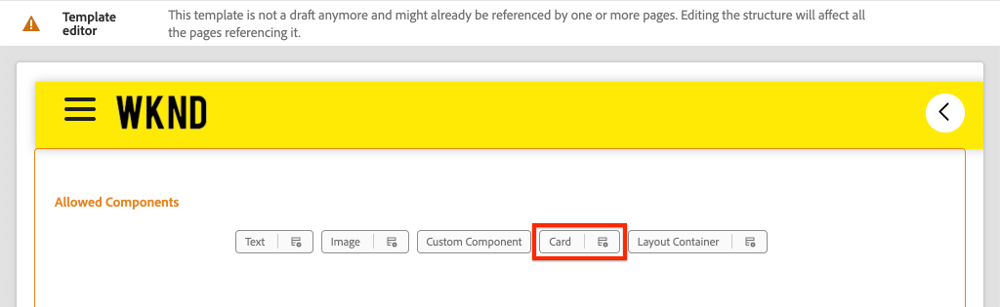
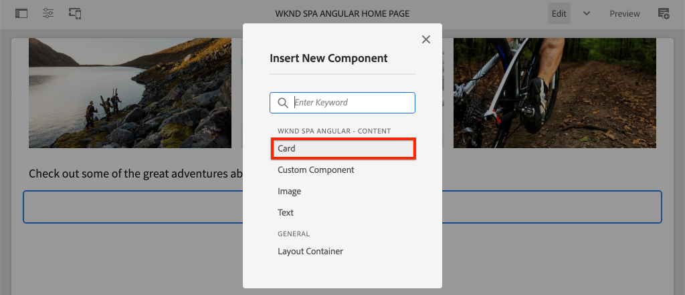
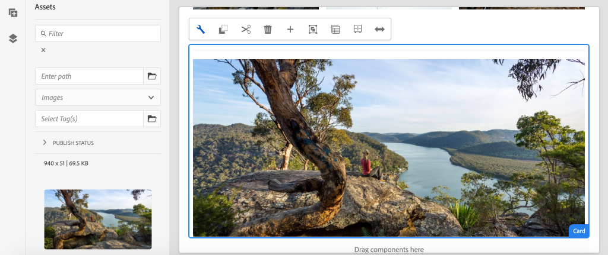
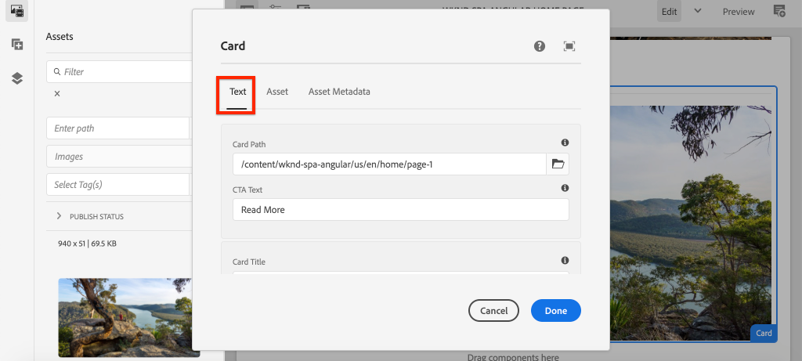
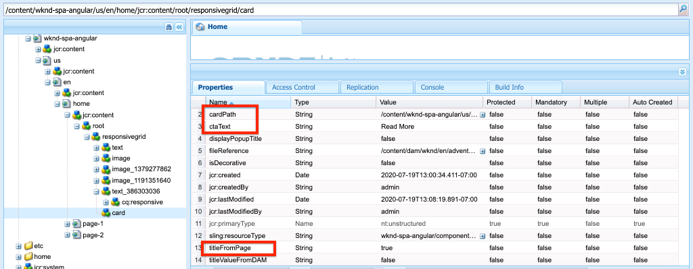
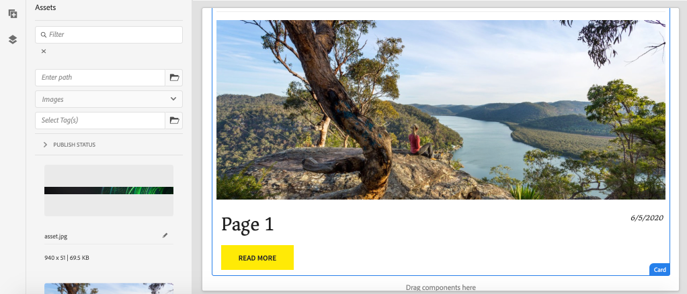

# Estendere un componente core {#extend-component}

{{spa-editor-deprecation}}

Scopri come estendere un Componente core esistente da utilizzare con l’Editor SPA di AEM. Scopri come estendere un componente esistente è una tecnica potente per personalizzare ed espandere le funzionalità di un’implementazione dell’Editor SPA di AEM.

## Obiettivo

1. Estendi un componente core esistente con proprietà e contenuti aggiuntivi.
2. Comprendere le nozioni di base dell&#39;ereditarietà dei componenti con l&#39;utilizzo di `sling:resourceSuperType`.
3. Scopri come utilizzare il [Pattern di delega](https://github.com/adobe/aem-core-wcm-components/wiki/Delegation-Pattern-for-Sling-Models) per modelli Sling per riutilizzare la logica e le funzionalità esistenti.

## Cosa verrà creato

In questo capitolo viene creato un nuovo componente `Card`. Il componente `Card` estende il [componente core Immagine](https://experienceleague.adobe.com/docs/experience-manager-core-components/using/components/image.html?lang=it) aggiungendo campi di contenuto aggiuntivi come un titolo e un pulsante Call to action per eseguire il ruolo di teaser per altri contenuti nell&#39;applicazione a pagina singola.


>[!NOTE]
>
> In un&#39;implementazione reale potrebbe essere più appropriato utilizzare semplicemente il [componente Teaser](https://experienceleague.adobe.com/docs/experience-manager-core-components/using/components/teaser.html?lang=it) piuttosto che estendere il [componente core Immagine](https://experienceleague.adobe.com/docs/experience-manager-core-components/using/components/image.html?lang=it) per creare un componente `Card` a seconda dei requisiti del progetto. Si consiglia sempre di utilizzare [Componenti core](https://experienceleague.adobe.com/docs/experience-manager-core-components/using/introduction.html?lang=it) direttamente quando possibile.

## Prerequisiti

Rivedi gli strumenti e le istruzioni necessari per configurare un [ambiente di sviluppo locale](overview.md#local-dev-environment).

### Ottieni il codice

1. Scarica il punto di partenza per questa esercitazione tramite Git:

   ```shell
   $ git clone git@github.com:adobe/aem-guides-wknd-spa.git
   $ cd aem-guides-wknd-spa
   $ git checkout Angular/extend-component-start
   ```

2. Implementa la base di codice in un’istanza AEM locale utilizzando Maven:

   ```shell
   $ mvn clean install -PautoInstallSinglePackage
   ```

   Se utilizzi [AEM 6.x](overview.md#compatibility), aggiungi il profilo `classic`:

   ```shell
   $ mvn clean install -PautoInstallSinglePackage -Pclassic
   ```

3. Installa il pacchetto finito per il [sito di riferimento WKND tradizionale](https://github.com/adobe/aem-guides-wknd/releases/tag/aem-guides-wknd-2.1.0). Le immagini fornite dal [sito di riferimento WKND](https://github.com/adobe/aem-guides-wknd/releases/latest) vengono riutilizzate nell&#39;applicazione a pagina singola WKND. È possibile installare il pacchetto utilizzando [Gestione pacchetti di AEM](http://localhost:4502/crx/packmgr/index.jsp).

   

Puoi sempre visualizzare il codice finito su [GitHub](https://github.com/adobe/aem-guides-wknd-spa/tree/Angular/extend-component-solution) o estrarlo localmente passando al ramo `Angular/extend-component-solution`.

## Ispezionare l’implementazione iniziale della carta

Un componente iniziale della scheda è stato fornito dal codice iniziale del capitolo. Ispeziona il punto di partenza per l’implementazione della scheda.

1. Nell&#39;IDE scelto aprire il modulo `ui.apps`.
2. Passare a `ui.apps/src/main/content/jcr_root/apps/wknd-spa-angular/components/card` e visualizzare il file `.content.xml`.

   

   ```xml
   <?xml version="1.0" encoding="UTF-8"?>
   <jcr:root xmlns:sling="http://sling.apache.org/jcr/sling/1.0" xmlns:cq="http://www.day.com/jcr/cq/1.0" xmlns:jcr="http://www.jcp.org/jcr/1.0"
       jcr:primaryType="cq:Component"
       jcr:title="Card"
       sling:resourceSuperType="wknd-spa-angular/components/image"
       componentGroup="WKND SPA Angular - Content"/>
   ```

   La proprietà `sling:resourceSuperType` punta a `wknd-spa-angular/components/image` indicando che il componente `Card` eredita la funzionalità dal componente immagine SPA WKND.

3. Esaminare il file `ui.apps/src/main/content/jcr_root/apps/wknd-spa-angular/components/image/.content.xml`:

   ```xml
   <?xml version="1.0" encoding="UTF-8"?>
   <jcr:root xmlns:sling="http://sling.apache.org/jcr/sling/1.0" xmlns:cq="http://www.day.com/jcr/cq/1.0" xmlns:jcr="http://www.jcp.org/jcr/1.0"
       jcr:primaryType="cq:Component"
       jcr:title="Image"
       sling:resourceSuperType="core/wcm/components/image/v2/image"
       componentGroup="WKND SPA Angular - Content"/>
   ```

   `sling:resourceSuperType` punta a `core/wcm/components/image/v2/image`. Questo indica che il componente immagine SPA WKND eredita la funzionalità dall’immagine del componente core.

   Anche nota come [Ereditarietà delle risorse Sling per pattern proxy](https://experienceleague.adobe.com/docs/experience-manager-core-components/using/developing/guidelines.html?lang=it#proxy-component-pattern) è una potente struttura che consente ai componenti figlio di ereditare funzionalità ed estendere/ignorare il comportamento quando desiderato. L&#39;ereditarietà Sling supporta più livelli di ereditarietà, pertanto alla fine il nuovo componente `Card` eredita la funzionalità dell&#39;immagine del componente core.

   Many development teams strive to be D.R.Y. (don&#39;t repeat yourself). Sling inheritance makes this possible with AEM.

4. Beneath the `card` folder, open the file `_cq_dialog/.content.xml`.

   This file is the Component Dialog definition for the `Card` component. If using Sling inheritance, it is possible to use features of the [Sling Resource Merger](https://experienceleague.adobe.com/docs/experience-manager-65/developing/platform/sling-resource-merger.html?lang=it) to override or extend portions of the dialog. In this sample, a new tab has been added to the dialog to capture additional data from an author to populate the Card Component.

   Properties like `sling:orderBefore` allow a developer to choose where to insert new tabs or form fields. In this case, the `Text` tab is inserted before the `asset` tab. To make full use of the Sling Resource Merger, it is important to know the original dialog node structure for the [Image component dialog](https://github.com/adobe/aem-core-wcm-components/blob/master/content/src/content/jcr_root/apps/core/wcm/components/image/v2/image/_cq_dialog/.content.xml).

5. Beneath the `card` folder, open the file `_cq_editConfig.xml`. This file dictates the drag and drop behavior in the AEM authoring UI. When extending the Image component, it is important that the resource type matches the component itself. Review the `<parameters>` node:

   ```xml
   <parameters
       jcr:primaryType="nt:unstructured"
       sling:resourceType="wknd-spa-angular/components/card"
       imageCrop=""
       imageMap=""
       imageRotate=""/>
   ```

   Most components do not require a `cq:editConfig`, the Image, and child descendents of the Image component are exceptions.

6. In the IDE switch to the `ui.frontend` module, navigating to `ui.frontend/src/app/components/card`:

   

7. Ispeziona il file `card.component.ts`.

   The component has already been stubbed out to map to the AEM `Card` Component using the standard `MapTo` function.

   ```js
   MapTo('wknd-spa-angular/components/card')(CardComponent, CardEditConfig);
   ```

   Review the three `@Input` parameters in the class for `src`, `alt`, and `title`. These are expected JSON values from the AEM component that are mapped to the Angular component.

8. Open the file `card.component.html`:

   ```html
   <div class="card"  *ngIf="hasContent">
       <app-image class="card__image" [src]="src" [alt]="alt" [title]="title"></app-image>
   </div>
   ```

   In this example we chose to reuse the existing Angular Image component `app-image` by simply passing the `@Input` parameters from `card.component.ts`. Later in the tutorial, additional properties are added and displayed.

## Aggiornare il criterio del modello

With this initial `Card` implementation review the functionality in the AEM SPA Editor. To see the initial `Card` component an update to the Template policy is needed.

1. Deploy the starter code to a local instance of AEM, if you haven&#39;t already:

   ```shell
   $ cd aem-guides-wknd-spa
   $ mvn clean install -PautoInstallSinglePackage
   ```

2. Passa al modello pagina SPA all&#39;indirizzo [http://localhost:4502/editor.html/conf/wknd-spa-angular/settings/wcm/templates/spa-page-template/structure.html](http://localhost:4502/editor.html/conf/wknd-spa-angular/settings/wcm/templates/spa-page-template/structure.html).
3. Update the Layout Container&#39;s policy to add the new `Card` component as an allowed component:

   

   Save the changes to the policy, and observe the `Card` component as an allowed component:

   

## Author initial Card component

Next, author the `Card` component using the AEM SPA Editor.

1. Passa a [http://localhost:4502/editor.html/content/wknd-spa-angular/us/en/home.html](http://localhost:4502/editor.html/content/wknd-spa-angular/us/en/home.html).
2. In `Edit` mode, add the `Card` component to the `Layout Container`:

   

3. Drag and drop an image from the Asset finder onto the `Card` component:

   

4. Open the `Card` component dialog and notice the addition of a **Text** Tab.
5. Enter the following values on the **Text** tab:

   

   **Card Path** - choose a page beneath the SPA homepage.

   **CTA Text** - &quot;Read More&quot;

   **Card Title** - leave blank

   **Get title from linked page** - check the checkbox to indicate true.

6. Update the **Asset Metadata** tab to add values for **Alternative Text** and **Caption**.

   Currently no additional changes appear after updating the dialog. To expose the new fields to the Angular Component, we need to update the Sling Model for the `Card` component.

7. Open a new tab and navigate to [CRXDE-Lite](http://localhost:4502/crx/de/index.jsp#/content/wknd-spa-angular/us/en/home/jcr%3Acontent/root/responsivegrid/card). Inspect the content nodes beneath `/content/wknd-spa-angular/us/en/home/jcr:content/root/responsivegrid` to find the `Card` component content.

   

   Osservare che le proprietà `cardPath`, `ctaText`, `titleFromPage` sono rese permanenti dalla finestra di dialogo.

## Aggiorna modello Sling della scheda

Per esporre in definitiva i valori della finestra di dialogo del componente al componente Angular, è necessario aggiornare il modello Sling che popola il JSON per il componente `Card`. Abbiamo anche l’opportunità di implementare due parti della logica di business:

* Se `titleFromPage` è **true**, restituire il titolo della pagina specificato da `cardPath`. In caso contrario, restituire il valore di `cardTitle` textfield.
* Restituisce la data dell&#39;ultima modifica della pagina specificata da `cardPath`.

Tornare all&#39;IDE desiderato e aprire il modulo `core`.

1. Aprire il file `Card.java` in `core/src/main/java/com/adobe/aem/guides/wknd/spa/angular/core/models/Card.java`.

   L&#39;interfaccia `Card` estende attualmente `com.adobe.cq.wcm.core.components.models.Image` ed eredita pertanto i metodi dell&#39;interfaccia `Image`. L&#39;interfaccia `Image` estende già l&#39;interfaccia `ComponentExporter` che consente l&#39;esportazione del modello Sling come JSON e la mappatura da parte dell&#39;editor SPA. Non è pertanto necessario estendere esplicitamente l&#39;interfaccia `ComponentExporter` come nel [capitolo Componente personalizzato](custom-component.md).

2. Aggiungi i seguenti metodi all’interfaccia:

   ```java
   @ProviderType
   public interface Card extends Image {
   
       /***
       * The URL to populate the CTA button as part of the card.
       * The link should be based on the cardPath property that points to a page.
       * @return String URL
       */
       public String getCtaLinkURL();
   
       /***
       * The text to display on the CTA button of the card.
       * @return String CTA text
       */
       public String getCtaText();
   
   
   
       /***
       * The date to be displayed as part of the card.
       * This is based on the last modified date of the page specified by the cardPath
       * @return
       */
       public Calendar getCardLastModified();
   
   
       /**
       * Return the title of the page specified by cardPath if `titleFromPage` is set to true.
       * Otherwise return the value of `cardTitle`
       * @return
       */
       public String getCardTitle();
   }
   ```

   Questi metodi vengono esposti tramite l’API del modello JSON e passati al componente Angular.

3. Apri `CardImpl.java`. Implementazione dell&#39;interfaccia `Card.java`. Questa implementazione è stata parzialmente testata per accelerare l’esercitazione.  Osserva l’utilizzo delle annotazioni `@Model` e `@Exporter` per garantire che il modello Sling possa essere serializzato come JSON tramite Sling Model Exporter.

   `CardImpl.java` utilizza anche il [pattern di delega per modelli Sling](https://github.com/adobe/aem-core-wcm-components/wiki/Delegation-Pattern-for-Sling-Models) per evitare di riscrivere la logica dal componente core Immagine.

4. Osserva le righe seguenti:

   ```java
   @Self
   @Via(type = ResourceSuperType.class)
   private Image image;
   ```

   L&#39;annotazione precedente crea un&#39;istanza di un oggetto Image denominato `image` in base all&#39;ereditarietà `sling:resourceSuperType` del componente `Card`.

   ```java
   @Override
   public String getSrc() {
       return null != image ? image.getSrc() : null;
   }
   ```

   È quindi possibile utilizzare semplicemente l&#39;oggetto `image` per implementare i metodi definiti dall&#39;interfaccia `Image`, senza dover scrivere direttamente la logica. Questa tecnica è utilizzata per `getSrc()`, `getAlt()` e `getTitle()`.

5. Implementare quindi il metodo `initModel()` per avviare una variabile privata `cardPage` in base al valore di `cardPath`

   ```java
   @PostConstruct
   public void initModel() {
       if(StringUtils.isNotBlank(cardPath) && pageManager != null) {
           cardPage = pageManager.getPage(this.cardPath);
       }
   }
   ```

   `@PostConstruct initModel()` viene chiamato quando il modello Sling viene inizializzato, pertanto è una buona opportunità per inizializzare oggetti che possono essere utilizzati da altri metodi nel modello. `pageManager` è uno dei numerosi [oggetti globali supportati da Java™](https://experienceleague.adobe.com/docs/experience-manager-htl/content/global-objects.html?lang=it&=it) resi disponibili ai modelli Sling tramite l&#39;annotazione `@ScriptVariable`. Il metodo [getPage](https://developer.adobe.com/experience-manager/reference-materials/cloud-service/javadoc/com/day/cq/wcm/api/PageManager.html) accetta un percorso e restituisce un oggetto AEM [Page](https://developer.adobe.com/experience-manager/reference-materials/cloud-service/javadoc/com/day/cq/wcm/api/Page.html) oppure null se il percorso non punta a una pagina valida.

   Inizializza la variabile `cardPage`, utilizzata dagli altri nuovi metodi per restituire dati sulla pagina collegata sottostante.

6. Rivedi le variabili globali già mappate alle proprietà JCR salvate nella finestra di dialogo di authoring. L&#39;annotazione `@ValueMapValue` viene utilizzata per eseguire automaticamente la mappatura.

   ```java
   @ValueMapValue
   private String cardPath;
   
   @ValueMapValue
   private String ctaText;
   
   @ValueMapValue
   private boolean titleFromPage;
   
   @ValueMapValue
   private String cardTitle;
   ```

   Queste variabili vengono utilizzate per implementare i metodi aggiuntivi per l&#39;interfaccia `Card.java`.

7. Implementare i metodi aggiuntivi definiti nell&#39;interfaccia `Card.java`:

   ```java
   @Override
   public String getCtaLinkURL() {
       if(cardPage != null) {
           return cardPage.getPath() + ".html";
       }
       return null;
   }
   
   @Override
   public String getCtaText() {
       return ctaText;
   }
   
   @Override
   public Calendar getCardLastModified() {
      if(cardPage != null) {
          return cardPage.getLastModified();
      }
      return null;
   }
   
   @Override
   public String getCardTitle() {
       if(titleFromPage) {
           return cardPage != null ? cardPage.getTitle() : null;
       }
       return cardTitle;
   }
   ```

   >[!NOTE]
   >
   > Puoi visualizzare [CardImpl.java finito qui](https://github.com/adobe/aem-guides-wknd-spa/blob/Angular/extend-component-solution/core/src/main/java/com/adobe/aem/guides/wknd/spa/angular/core/models/impl/CardImpl.java).

8. Aprire una finestra del terminale e distribuire solo gli aggiornamenti al modulo `core` utilizzando il profilo Maven `autoInstallBundle` dalla directory `core`.

   ```shell
   $ cd core/
   $ mvn clean install -PautoInstallBundle
   ```

   Se utilizzi [AEM 6.x](overview.md#compatibility), aggiungi il profilo `classic`.

9. Visualizza la risposta del modello JSON in: [http://localhost:4502/content/wknd-spa-angular/us/en.model.json](http://localhost:4502/content/wknd-spa-angular/us/en.model.json) e cerca `wknd-spa-angular/components/card`:

   ```json
   "card": {
       "ctaText": "Read More",
       "cardTitle": "Page 1",
       "title": "Woman chillaxing with river views in Australian bushland",
       "src": "/content/wknd-spa-angular/us/en/home/_jcr_content/root/responsivegrid/card.coreimg.jpeg/1595190732886/adobestock-216674449.jpeg",
       "alt": "Female sitting on a large rock relaxing in afternoon dappled light the Australian bushland with views over the river",
       "cardLastModified": 1591360492414,
       "ctaLinkURL": "/content/wknd-spa-angular/us/en/home/page-1.html",
       ":type": "wknd-spa-angular/components/card"
   }
   ```

   Il modello JSON viene aggiornato con altre coppie chiave/valore dopo l&#39;aggiornamento dei metodi nel modello Sling `CardImpl`.

## Aggiorna componente Angular

Ora che il modello JSON è compilato con nuove proprietà per `ctaLinkURL`, `ctaText`, `cardTitle` e `cardLastModified`, è possibile aggiornare il componente Angular per visualizzarli.

1. Tornare all&#39;IDE e aprire il modulo `ui.frontend`. Se necessario, avviare il server di sviluppo Webpack da una nuova finestra del terminale per visualizzare le modifiche in tempo reale:

   ```shell
   $ cd ui.frontend
   $ npm install
   $ npm start
   ```

2. Apri `card.component.ts` alle `ui.frontend/src/app/components/card/card.component.ts`. Aggiungi ulteriori `@Input` annotazioni per acquisire il nuovo modello:

   ```diff
   export class CardComponent implements OnInit {
   
        @Input() src: string;
        @Input() alt: string;
        @Input() title: string;
   +    @Input() cardTitle: string;
   +    @Input() cardLastModified: number;
   +    @Input() ctaLinkURL: string;
   +    @Input() ctaText: string;
   ```

3. Aggiungere metodi per verificare se Call to action è pronto e per restituire una stringa data/ora basata sull&#39;input `cardLastModified`:

   ```js
   export class CardComponent implements OnInit {
       ...
       get hasCTA(): boolean {
           return this.ctaLinkURL && this.ctaLinkURL.trim().length > 0 && this.ctaText && this.ctaText.trim().length > 0;
       }
   
       get lastModifiedDate(): string {
           const lastModifiedDate = this.cardLastModified ? new Date(this.cardLastModified) : null;
   
           if (lastModifiedDate) {
           return lastModifiedDate.toLocaleDateString();
           }
           return null;
       }
       ...
   }
   ```

4. Apri `card.component.html` e aggiungi il seguente markup per visualizzare il titolo, il call to action e la data dell&#39;ultima modifica:

   ```html
   <div class="card"  *ngIf="hasContent">
       <app-image class="card__image" [src]="src" [alt]="alt" [title]="title"></app-image>
       <div class="card__content">
           <h2 class="card__title">
               {{cardTitle}}
               <span class="card__lastmod" *ngIf="lastModifiedDate">{{lastModifiedDate}}</span>
           </h2>
           <div class="card__action-container" *ngIf="hasCTA">
               <a [routerLink]="ctaLinkURL" class="card__action-link" [title]="ctaText">
                   {{ctaText}}
               </a>
           </div>
       </div>
   </div>
   ```

   Le regole Sass sono già state aggiunte alle `card.component.scss` per assegnare uno stile al titolo, al call to action e alla data dell&#39;ultima modifica.

   >[!NOTE]
   >
   > Puoi visualizzare il [codice del componente Angular Card completato qui](https://github.com/adobe/aem-guides-wknd-spa/tree/Angular/extend-component-solution/ui.frontend/src/app/components/card).

5. Implementa le modifiche complete ad AEM dalla directory principale del progetto utilizzando Maven:

   ```shell
   $ cd aem-guides-wknd-spa
   $ mvn clean install -PautoInstallSinglePackage
   ```

6. Passa a [http://localhost:4502/editor.html/content/wknd-spa-angular/us/en/home.html](http://localhost:4502/editor.html/content/wknd-spa-angular/us/en/home.html) per visualizzare il componente aggiornato:

   

7. Dovresti essere in grado di riscrivere il contenuto esistente per creare una pagina simile alla seguente:

   

## Congratulazioni. {#congratulations}

Congratulazioni, hai imparato a estendere un componente AEM e come i modelli e le finestre di dialogo Sling funzionano con il modello JSON.

Puoi sempre visualizzare il codice finito su [GitHub](https://github.com/adobe/aem-guides-wknd-spa/tree/Angular/extend-component-solution) o estrarlo localmente passando al ramo `Angular/extend-component-solution`.
