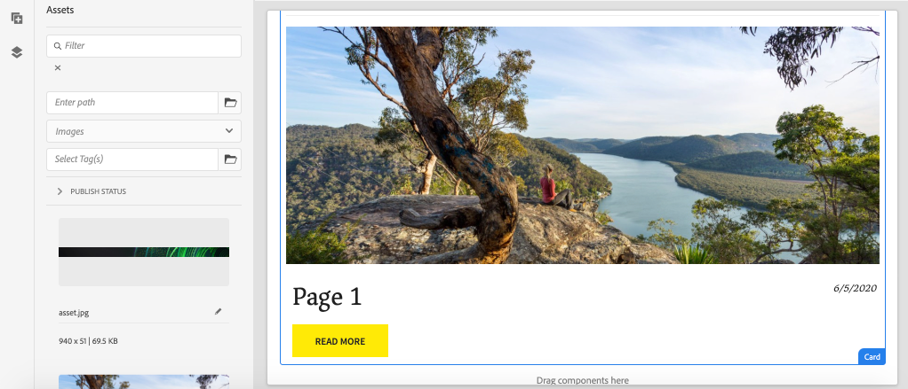

# Estendere un componente core {#extend-component}

Scopri come estendere un Componente core esistente da utilizzare con l’Editor SPA di AEM. Scopri come estendere un componente esistente è una tecnica potente per personalizzare ed espandere le funzionalità di un’implementazione dell’Editor SPA di AEM.

## Obiettivo

1. Estendi un componente core esistente con proprietà e contenuti aggiuntivi.
2. Comprendere le nozioni di base dell&#39;ereditarietà dei componenti con l&#39;utilizzo di `sling:resourceSuperType`.
3. Scopri come utilizzare il [Pattern di delega](https://github.com/adobe/aem-core-wcm-components/wiki/Delegation-Pattern-for-Sling-Models) per modelli Sling per riutilizzare la logica e le funzionalità esistenti.

## Cosa verrà creato

In questo capitolo viene creato un nuovo componente `Card`. Il componente `Card` estende il [componente core Immagine](https://experienceleague.adobe.com/docs/experience-manager-core-components/using/components/image.html?lang=it) aggiungendo campi di contenuto aggiuntivi, come un titolo e un pulsante di invito all&#39;azione, per eseguire il ruolo di teaser per altri contenuti nell&#39;applicazione a pagina singola.


>[!NOTE]
>
> In un&#39;implementazione reale potrebbe essere più appropriato utilizzare semplicemente il [componente Teaser](https://experienceleague.adobe.com/docs/experience-manager-core-components/using/components/teaser.html?lang=it) piuttosto che estendere il [componente core Immagine](https://experienceleague.adobe.com/docs/experience-manager-core-components/using/components/image.html?lang=it) per creare un componente `Card` a seconda dei requisiti del progetto. Si consiglia sempre di utilizzare [Componenti core](https://experienceleague.adobe.com/docs/experience-manager-core-components/using/introduction.html?lang=it) direttamente quando possibile.

## Prerequisiti

Esaminare gli strumenti e le istruzioni necessari per configurare un [ambiente di sviluppo locale](overview.md#local-dev-environment).

### Ottieni il codice

1. Scarica il punto di partenza per questa esercitazione tramite Git:

   ```shell
   $ git clone git@github.com:adobe/aem-guides-wknd-spa.git
   $ cd aem-guides-wknd-spa
   $ git checkout Angular/extend-component-start
   ```

2. Implementa la base di codice in un’istanza AEM locale utilizzando Maven:

   ```shell
   $ mvn clean install -PautoInstallSinglePackage
   ```

   Se utilizzi [AEM 6.x](overview.md#compatibility), aggiungi il profilo `classic`:

   ```shell
   $ mvn clean install -PautoInstallSinglePackage -Pclassic
   ```

3. Installa il pacchetto finito per il [sito di riferimento WKND tradizionale](https://github.com/adobe/aem-guides-wknd/releases/tag/aem-guides-wknd-2.1.0). Le immagini fornite dal [sito di riferimento WKND](https://github.com/adobe/aem-guides-wknd/releases/latest) vengono riutilizzate nell&#39;applicazione a pagina singola WKND. È possibile installare il pacchetto utilizzando [Gestione pacchetti di AEM](http://localhost:4502/crx/packmgr/index.jsp).

   

Puoi sempre visualizzare il codice finito su [GitHub](https://github.com/adobe/aem-guides-wknd-spa/tree/Angular/extend-component-solution) o estrarre il codice localmente passando al ramo `Angular/extend-component-solution`.

## Ispezionare l’implementazione iniziale della carta

Un componente iniziale della scheda è stato fornito dal codice iniziale del capitolo. Ispeziona il punto di partenza per l’implementazione della scheda.

1. Nell&#39;IDE scelto aprire il modulo `ui.apps`.
2. Passare a `ui.apps/src/main/content/jcr_root/apps/wknd-spa-angular/components/card` e visualizzare il file `.content.xml`.

   

   ```xml
   <?xml version="1.0" encoding="UTF-8"?>
   <jcr:root xmlns:sling="http://sling.apache.org/jcr/sling/1.0" xmlns:cq="http://www.day.com/jcr/cq/1.0" xmlns:jcr="http://www.jcp.org/jcr/1.0"
       jcr:primaryType="cq:Component"
       jcr:title="Card"
       sling:resourceSuperType="wknd-spa-angular/components/image"
       componentGroup="WKND SPA Angular - Content"/>
   ```

   La proprietà `sling:resourceSuperType` punta a `wknd-spa-angular/components/image` indicando che il componente `Card` eredita la funzionalità dal componente immagine SPA WKND.

3. Esaminare il file `ui.apps/src/main/content/jcr_root/apps/wknd-spa-angular/components/image/.content.xml`:

   ```xml
   <?xml version="1.0" encoding="UTF-8"?>
   <jcr:root xmlns:sling="http://sling.apache.org/jcr/sling/1.0" xmlns:cq="http://www.day.com/jcr/cq/1.0" xmlns:jcr="http://www.jcp.org/jcr/1.0"
       jcr:primaryType="cq:Component"
       jcr:title="Image"
       sling:resourceSuperType="core/wcm/components/image/v2/image"
       componentGroup="WKND SPA Angular - Content"/>
   ```

   `sling:resourceSuperType` punta a `core/wcm/components/image/v2/image`. Questo indica che il componente immagine SPA WKND eredita la funzionalità dall’immagine del componente core.

   Anche nota come [Ereditarietà delle risorse Sling per pattern proxy](https://experienceleague.adobe.com/docs/experience-manager-core-components/using/developing/guidelines.html?lang=it#proxy-component-pattern) è una potente struttura che consente ai componenti figlio di ereditare funzionalità ed estendere/ignorare il comportamento quando desiderato. L&#39;ereditarietà Sling supporta più livelli di ereditarietà, pertanto alla fine il nuovo componente `Card` eredita la funzionalità dell&#39;immagine del componente core.

   Molti team di sviluppo si sforzano di essere D.R.Y. (non ripeterti). L’ereditarietà Sling lo rende possibile con AEM.

4. Nella cartella `card` aprire il file `_cq_dialog/.content.xml`.

   Questo file è la definizione della finestra di dialogo del componente `Card`. Se si utilizza l&#39;ereditarietà Sling, è possibile utilizzare le funzionalità di [Sling Resource Merger](https://experienceleague.adobe.com/docs/experience-manager-65/developing/platform/sling-resource-merger.html?lang=it) per ignorare o estendere parti della finestra di dialogo. In questo esempio, è stata aggiunta una nuova scheda alla finestra di dialogo per acquisire dati aggiuntivi da un autore per popolare il componente Scheda.

   Proprietà come `sling:orderBefore` consentono a uno sviluppatore di scegliere dove inserire nuove schede o campi modulo. In questo caso, la scheda `Text` viene inserita prima della scheda `asset`. Per utilizzare appieno Sling Resource Merger, è importante conoscere la struttura originale del nodo della finestra di dialogo per la [finestra di dialogo del componente immagine](https://github.com/adobe/aem-core-wcm-components/blob/master/content/src/content/jcr_root/apps/core/wcm/components/image/v2/image/_cq_dialog/.content.xml).

5. Nella cartella `card` aprire il file `_cq_editConfig.xml`. Questo file determina il comportamento di trascinamento nell’interfaccia utente di authoring di AEM. Quando si estende il componente Immagine, è importante che il tipo di risorsa corrisponda al componente stesso. Rivedi il nodo `<parameters>`:

   ```xml
   <parameters
       jcr:primaryType="nt:unstructured"
       sling:resourceType="wknd-spa-angular/components/card"
       imageCrop=""
       imageMap=""
       imageRotate=""/>
   ```

   La maggior parte dei componenti non richiede un `cq:editConfig`, l&#39;Immagine e i discendenti secondari del componente Immagine sono eccezioni.

6. Nell&#39;IDE passare al modulo `ui.frontend`, passando a `ui.frontend/src/app/components/card`:

   

7. Controllare il file `card.component.ts`.

   Il componente è già stato sottoposto a stubout per la mappatura al componente AEM `Card` utilizzando la funzione standard `MapTo`.

   ```js
   MapTo('wknd-spa-angular/components/card')(CardComponent, CardEditConfig);
   ```

   Esaminare i tre parametri `@Input` nella classe per `src`, `alt` e `title`. Si tratta di valori JSON previsti dal componente AEM mappati al componente Angular.

8. Aprire il file `card.component.html`:

   ```html
   <div class="card"  *ngIf="hasContent">
       <app-image class="card__image" [src]="src" [alt]="alt" [title]="title"></app-image>
   </div>
   ```

   In questo esempio si è scelto di riutilizzare il componente immagine di Angular esistente `app-image` semplicemente passando i parametri `@Input` da `card.component.ts`. Più avanti nell’esercitazione, vengono aggiunte e visualizzate ulteriori proprietà.

## Aggiornare il criterio del modello

Con questa implementazione iniziale di `Card`, controlla la funzionalità nell&#39;editor SPA di AEM. Per visualizzare il componente `Card` iniziale è necessario aggiornare il criterio del modello.

1. Distribuisci il codice di avvio in un’istanza locale di AEM, se non lo hai già fatto:

   ```shell
   $ cd aem-guides-wknd-spa
   $ mvn clean install -PautoInstallSinglePackage
   ```

2. Passa al modello per pagina SPA all&#39;indirizzo [http://localhost:4502/editor.html/conf/wknd-spa-angular/settings/wcm/templates/spa-page-template/structure.html](http://localhost:4502/editor.html/conf/wknd-spa-angular/settings/wcm/templates/spa-page-template/structure.html).
3. Aggiornare il criterio Contenitore di layout per aggiungere il nuovo componente `Card` come componente consentito:

   

   Salvare le modifiche al criterio e osservare il componente `Card` come componente consentito:

   

## Componente carta iniziale autore

Quindi, creare il componente `Card` utilizzando l&#39;editor SPA di AEM.

1. Passa a [http://localhost:4502/editor.html/content/wknd-spa-angular/us/en/home.html](http://localhost:4502/editor.html/content/wknd-spa-angular/us/en/home.html).
2. In modalità `Edit`, aggiungere il componente `Card` a `Layout Container`:

   

3. Trascina e rilascia un&#39;immagine da Asset Finder al componente `Card`:

   

4. Apri la finestra di dialogo del componente `Card` e osserva l&#39;aggiunta di una scheda **Testo**.
5. Immetti i seguenti valori nella scheda **Testo**:

   

   **Percorso scheda** - scegli una pagina sotto la home page dell&#39;applicazione a pagina singola.

   **Testo CTA** - &quot;Ulteriori informazioni&quot;

   **Titolo carta** - lascia vuoto

   **Ottieni titolo da pagina collegata**. Selezionare la casella di controllo per indicare true.

6. Aggiorna la scheda **Metadati risorsa** per aggiungere valori per **Testo alternativo** e **Didascalia**.

   Al momento non vengono visualizzate ulteriori modifiche dopo l’aggiornamento della finestra di dialogo. Per esporre i nuovi campi al componente Angular, è necessario aggiornare il modello Sling per il componente `Card`.

7. Apri una nuova scheda e passa a [CRXDE-Lite](http://localhost:4502/crx/de/index.jsp#/content/wknd-spa-angular/us/en/home/jcr%3Acontent/root/responsivegrid/card). Esaminare i nodi di contenuto sotto `/content/wknd-spa-angular/us/en/home/jcr:content/root/responsivegrid` per trovare il contenuto del componente `Card`.

   

   Osservare che le proprietà `cardPath`, `ctaText`, `titleFromPage` sono rese permanenti dalla finestra di dialogo.

## Aggiorna modello Sling della scheda

Per esporre in definitiva i valori della finestra di dialogo del componente al componente Angular, è necessario aggiornare il modello Sling che popola il JSON per il componente `Card`. Abbiamo anche l’opportunità di implementare due parti della logica di business:

* Se `titleFromPage` è **true**, restituire il titolo della pagina specificato da `cardPath`. In caso contrario, restituire il valore di `cardTitle` textfield.
* Restituisce la data dell&#39;ultima modifica della pagina specificata da `cardPath`.

Tornare all&#39;IDE desiderato e aprire il modulo `core`.

1. Aprire il file `Card.java` in `core/src/main/java/com/adobe/aem/guides/wknd/spa/angular/core/models/Card.java`.

   L&#39;interfaccia `Card` estende attualmente `com.adobe.cq.wcm.core.components.models.Image` ed eredita pertanto i metodi dell&#39;interfaccia `Image`. L&#39;interfaccia `Image` estende già l&#39;interfaccia `ComponentExporter` che consente l&#39;esportazione del modello Sling come JSON e la mappatura da parte dell&#39;editor SPA. Non è pertanto necessario estendere esplicitamente l&#39;interfaccia `ComponentExporter` come nel [capitolo Componente personalizzato](custom-component.md).

2. Aggiungi i seguenti metodi all’interfaccia:

   ```java
   @ProviderType
   public interface Card extends Image {
   
       /***
       * The URL to populate the CTA button as part of the card.
       * The link should be based on the cardPath property that points to a page.
       * @return String URL
       */
       public String getCtaLinkURL();
   
       /***
       * The text to display on the CTA button of the card.
       * @return String CTA text
       */
       public String getCtaText();
   
   
   
       /***
       * The date to be displayed as part of the card.
       * This is based on the last modified date of the page specified by the cardPath
       * @return
       */
       public Calendar getCardLastModified();
   
   
       /**
       * Return the title of the page specified by cardPath if `titleFromPage` is set to true.
       * Otherwise return the value of `cardTitle`
       * @return
       */
       public String getCardTitle();
   }
   ```

   Questi metodi vengono esposti tramite l’API del modello JSON e passati al componente Angular.

3. Apri `CardImpl.java`. Implementazione dell&#39;interfaccia `Card.java`. Questa implementazione è stata parzialmente testata per accelerare l’esercitazione.  Osserva l’utilizzo delle annotazioni `@Model` e `@Exporter` per garantire che il modello Sling possa essere serializzato come JSON tramite Sling Model Exporter.

   `CardImpl.java` utilizza anche il [pattern di delega per modelli Sling](https://github.com/adobe/aem-core-wcm-components/wiki/Delegation-Pattern-for-Sling-Models) per evitare di riscrivere la logica dal componente core Immagine.

4. Osserva le righe seguenti:

   ```java
   @Self
   @Via(type = ResourceSuperType.class)
   private Image image;
   ```

   L&#39;annotazione precedente crea un&#39;istanza di un oggetto Image denominato `image` in base all&#39;ereditarietà `sling:resourceSuperType` del componente `Card`.

   ```java
   @Override
   public String getSrc() {
       return null != image ? image.getSrc() : null;
   }
   ```

   È quindi possibile utilizzare semplicemente l&#39;oggetto `image` per implementare i metodi definiti dall&#39;interfaccia `Image`, senza dover scrivere direttamente la logica. Questa tecnica è utilizzata per `getSrc()`, `getAlt()` e `getTitle()`.

5. Implementare quindi il metodo `initModel()` per avviare una variabile privata `cardPage` in base al valore di `cardPath`

   ```java
   @PostConstruct
   public void initModel() {
       if(StringUtils.isNotBlank(cardPath) && pageManager != null) {
           cardPage = pageManager.getPage(this.cardPath);
       }
   }
   ```

   `@PostConstruct initModel()` viene chiamato quando il modello Sling viene inizializzato, pertanto è una buona opportunità per inizializzare oggetti che possono essere utilizzati da altri metodi nel modello. `pageManager` è uno dei numerosi [oggetti globali supportati da Java™](https://experienceleague.adobe.com/docs/experience-manager-htl/content/global-objects.html?lang=it) resi disponibili ai modelli Sling tramite l&#39;annotazione `@ScriptVariable`. Il metodo [getPage](https://developer.adobe.com/experience-manager/reference-materials/cloud-service/javadoc/com/day/cq/wcm/api/PageManager.html) accetta un percorso e restituisce un oggetto AEM [Page](https://developer.adobe.com/experience-manager/reference-materials/cloud-service/javadoc/com/day/cq/wcm/api/Page.html) oppure null se il percorso non punta a una pagina valida.

   Inizializza la variabile `cardPage`, utilizzata dagli altri nuovi metodi per restituire dati sulla pagina collegata sottostante.

6. Rivedi le variabili globali già mappate alle proprietà JCR salvate nella finestra di dialogo di authoring. L&#39;annotazione `@ValueMapValue` viene utilizzata per eseguire automaticamente la mappatura.

   ```java
   @ValueMapValue
   private String cardPath;
   
   @ValueMapValue
   private String ctaText;
   
   @ValueMapValue
   private boolean titleFromPage;
   
   @ValueMapValue
   private String cardTitle;
   ```

   Queste variabili vengono utilizzate per implementare i metodi aggiuntivi per l&#39;interfaccia `Card.java`.

7. Implementare i metodi aggiuntivi definiti nell&#39;interfaccia `Card.java`:

   ```java
   @Override
   public String getCtaLinkURL() {
       if(cardPage != null) {
           return cardPage.getPath() + ".html";
       }
       return null;
   }
   
   @Override
   public String getCtaText() {
       return ctaText;
   }
   
   @Override
   public Calendar getCardLastModified() {
      if(cardPage != null) {
          return cardPage.getLastModified();
      }
      return null;
   }
   
   @Override
   public String getCardTitle() {
       if(titleFromPage) {
           return cardPage != null ? cardPage.getTitle() : null;
       }
       return cardTitle;
   }
   ```

   >[!NOTE]
   >
   > Puoi visualizzare [CardImpl.java finito qui](https://github.com/adobe/aem-guides-wknd-spa/blob/Angular/extend-component-solution/core/src/main/java/com/adobe/aem/guides/wknd/spa/angular/core/models/impl/CardImpl.java).

8. Aprire una finestra del terminale e distribuire solo gli aggiornamenti al modulo `core` utilizzando il profilo Maven `autoInstallBundle` dalla directory `core`.

   ```shell
   $ cd core/
   $ mvn clean install -PautoInstallBundle
   ```

   Se utilizzi [AEM 6.x](overview.md#compatibility), aggiungi il profilo `classic`.

9. Visualizza la risposta del modello JSON in: [http://localhost:4502/content/wknd-spa-angular/us/en.model.json](http://localhost:4502/content/wknd-spa-angular/us/en.model.json) e cerca `wknd-spa-angular/components/card`:

   ```json
   "card": {
       "ctaText": "Read More",
       "cardTitle": "Page 1",
       "title": "Woman chillaxing with river views in Australian bushland",
       "src": "/content/wknd-spa-angular/us/en/home/_jcr_content/root/responsivegrid/card.coreimg.jpeg/1595190732886/adobestock-216674449.jpeg",
       "alt": "Female sitting on a large rock relaxing in afternoon dappled light the Australian bushland with views over the river",
       "cardLastModified": 1591360492414,
       "ctaLinkURL": "/content/wknd-spa-angular/us/en/home/page-1.html",
       ":type": "wknd-spa-angular/components/card"
   }
   ```

   Il modello JSON viene aggiornato con altre coppie chiave/valore dopo l&#39;aggiornamento dei metodi nel modello Sling `CardImpl`.

## Aggiorna componente Angular

Ora che il modello JSON è compilato con nuove proprietà per `ctaLinkURL`, `ctaText`, `cardTitle` e `cardLastModified`, è possibile aggiornare il componente Angular per visualizzarli.

1. Tornare all&#39;IDE e aprire il modulo `ui.frontend`. Se necessario, avviare il server di sviluppo Webpack da una nuova finestra del terminale per visualizzare le modifiche in tempo reale:

   ```shell
   $ cd ui.frontend
   $ npm install
   $ npm start
   ```

2. Apri `card.component.ts` alle `ui.frontend/src/app/components/card/card.component.ts`. Aggiungi ulteriori `@Input` annotazioni per acquisire il nuovo modello:

   ```diff
   export class CardComponent implements OnInit {
   
        @Input() src: string;
        @Input() alt: string;
        @Input() title: string;
   +    @Input() cardTitle: string;
   +    @Input() cardLastModified: number;
   +    @Input() ctaLinkURL: string;
   +    @Input() ctaText: string;
   ```

3. Aggiungere metodi per verificare se l&#39;invito all&#39;azione è pronto e per restituire una stringa di data/ora basata sull&#39;input `cardLastModified`:

   ```js
   export class CardComponent implements OnInit {
       ...
       get hasCTA(): boolean {
           return this.ctaLinkURL && this.ctaLinkURL.trim().length > 0 && this.ctaText && this.ctaText.trim().length > 0;
       }
   
       get lastModifiedDate(): string {
           const lastModifiedDate = this.cardLastModified ? new Date(this.cardLastModified) : null;
   
           if (lastModifiedDate) {
           return lastModifiedDate.toLocaleDateString();
           }
           return null;
       }
       ...
   }
   ```

4. Apri `card.component.html` e aggiungi il seguente markup per visualizzare il titolo, l&#39;invito all&#39;azione e la data dell&#39;ultima modifica:

   ```html
   <div class="card"  *ngIf="hasContent">
       <app-image class="card__image" [src]="src" [alt]="alt" [title]="title"></app-image>
       <div class="card__content">
           <h2 class="card__title">
               {{cardTitle}}
               <span class="card__lastmod" *ngIf="lastModifiedDate">{{lastModifiedDate}}</span>
           </h2>
           <div class="card__action-container" *ngIf="hasCTA">
               <a [routerLink]="ctaLinkURL" class="card__action-link" [title]="ctaText">
                   {{ctaText}}
               </a>
           </div>
       </div>
   </div>
   ```

   Le regole Sass sono già state aggiunte alle `card.component.scss` per assegnare uno stile al titolo, all&#39;invito all&#39;azione e alla data dell&#39;ultima modifica.

   >[!NOTE]
   >
   > Puoi visualizzare il [codice del componente Angular Card completato qui](https://github.com/adobe/aem-guides-wknd-spa/tree/Angular/extend-component-solution/ui.frontend/src/app/components/card).

5. Implementa le modifiche complete ad AEM dalla directory principale del progetto utilizzando Maven:

   ```shell
   $ cd aem-guides-wknd-spa
   $ mvn clean install -PautoInstallSinglePackage
   ```

6. Passa a [http://localhost:4502/editor.html/content/wknd-spa-angular/us/en/home.html](http://localhost:4502/editor.html/content/wknd-spa-angular/us/en/home.html) per visualizzare il componente aggiornato:

   

7. Dovresti essere in grado di riscrivere il contenuto esistente per creare una pagina simile alla seguente:

   

## Congratulazioni. {#congratulations}

Congratulazioni, hai imparato a estendere un componente AEM e come i modelli e le finestre di dialogo Sling funzionano con il modello JSON.

Puoi sempre visualizzare il codice finito su [GitHub](https://github.com/adobe/aem-guides-wknd-spa/tree/Angular/extend-component-solution) o estrarre il codice localmente passando al ramo `Angular/extend-component-solution`.
