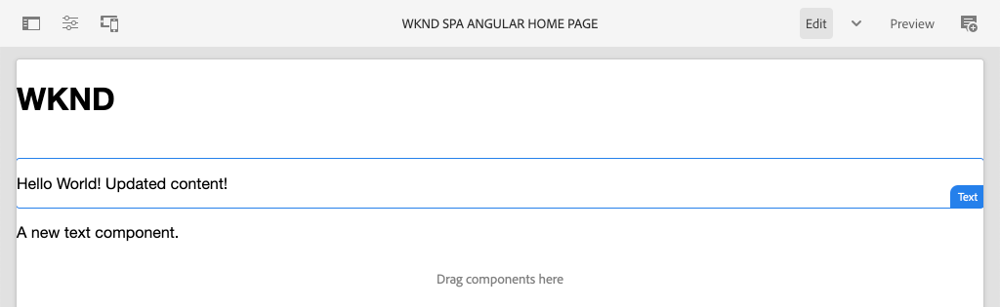
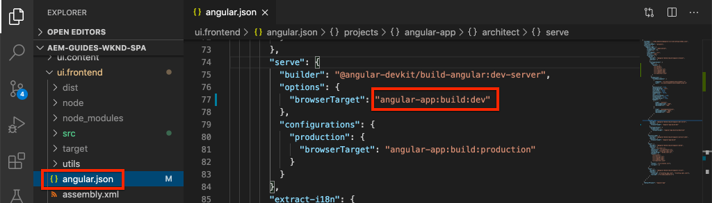

# Integrare un SPA {#integrate-spa}

Comprendere come il codice sorgente per un’applicazione a pagina singola (SPA) scritto in Angular può essere integrato con un progetto Adobe Experience Manager (AEM). Scopri come utilizzare strumenti front-end moderni, come un server di sviluppo Webpack, per sviluppare rapidamente l’SPA contro l’API modello JSON dell’AEM.

## Obiettivo

1. Comprendere come il progetto SPA viene integrato con l’AEM con le librerie lato client.
2. Scopri come utilizzare un server di sviluppo locale per lo sviluppo front-end dedicato.
3. Esplorare l’utilizzo di **proxy** e statico **finta** file per lo sviluppo rispetto all’API del modello JSON per AEM

## Cosa verrà creato

Questo capitolo aggiungerà un semplice `Header` all&#39;SPA. Nel processo di creazione di questo statico `Header` componente vengono utilizzati diversi approcci allo sviluppo dell’SPA da parte dell’AEM.


*L’SPA viene esteso per aggiungere un’ `Header` componente*

## Prerequisiti

Esaminare gli strumenti e le istruzioni necessari per l&#39;impostazione di un [ambiente di sviluppo locale](overview.md#local-dev-environment).

### Ottieni il codice

1. Scarica il punto di partenza per questa esercitazione tramite Git:

   ```shell
   $ git clone git@github.com:adobe/aem-guides-wknd-spa.git
   $ cd aem-guides-wknd-spa
   $ git checkout Angular/integrate-spa-start
   ```

2. Distribuisci la base di codice in un’istanza AEM locale utilizzando Maven:

   ```shell
   $ mvn clean install -PautoInstallSinglePackage
   ```

   Se si utilizza [AEM 6.x](overview.md#compatibility) aggiungi `classic` profilo:

   ```shell
   $ mvn clean install -PautoInstallSinglePackage -Pclassic
   ```

Puoi sempre visualizzare il codice finito su [GitHub](https://github.com/adobe/aem-guides-wknd-spa/tree/Angular/integrate-spa-solution) oppure controllare il codice localmente passando alla filiale `Angular/integrate-spa-solution`.

## Approccio all’integrazione {#integration-approach}

Nell’ambito del progetto AEM sono stati creati due moduli: `ui.apps` e `ui.frontend`.

Il `ui.frontend` il modulo è un [webpack](https://webpack.js.org/) progetto che contiene tutto il codice sorgente dell’SPA. La maggior parte dello sviluppo e dei test dell’SPA viene effettuata nel progetto webpack. Quando viene attivata una build di produzione, l’SPA viene generato e compilato utilizzando Webpack. Gli artefatti compilati (CSS e JavaScript) vengono copiati nel `ui.apps` che viene quindi distribuito nel runtime AEM.


*Rappresentazione di alto livello dell’integrazione dell’SPA.*

Ulteriori informazioni sulla build front-end possono essere [trovato qui](https://experienceleague.adobe.com/docs/experience-manager-core-components/using/developing/archetype/uifrontend-angular.html).

## Integrazione di Inspect con l’SPA {#inspect-spa-integration}

Quindi, controlla `ui.frontend` per comprendere l’SPA che è stato generato automaticamente dal [Archetipo progetto AEM](https://experienceleague.adobe.com/docs/experience-manager-core-components/using/developing/archetype/uifrontend-angular.html).

1. Nell’IDE che preferisci, apri il progetto AEM per l’SPA WKND. Questa esercitazione utilizzerà [IDE codice Visual Studio](https://experienceleague.adobe.com/docs/experience-manager-learn/cloud-service/local-development-environment-set-up/development-tools.html#microsoft-visual-studio-code).

   

2. Espandere ed esaminare `ui.frontend` cartella. Apri il file `ui.frontend/package.json`

3. Sotto `dependencies` ne dovresti vedere diversi relativi a `@angular`:

   ```json
   "@angular/animations": "~9.1.11",
   "@angular/common": "~9.1.11",
   "@angular/compiler": "~9.1.11",
   "@angular/core": "~9.1.11",
   "@angular/forms": "~9.1.10",
   "@angular/platform-browser": "~9.1.10",
   "@angular/platform-browser-dynamic": "~9.1.10",
   "@angular/router": "~9.1.10",
   ```

   Il `ui.frontend` il modulo è un [applicazione Angular](https://angular.io) generato utilizzando [Angular CLI, strumento](https://angular.io/cli) che include l&#39;instradamento.

4. Sono inoltre disponibili tre dipendenze con prefisso `@adobe`:

   ```json
   "@adobe/cq-angular-editable-components": "^2.0.2",
   "@adobe/cq-spa-component-mapping": "^1.0.3",
   "@adobe/cq-spa-page-model-manager": "^1.1.3",
   ```

   I moduli di cui sopra costituiscono [SDK JS per l’editor SPA dell’AEM](https://experienceleague.adobe.com/docs/experience-manager-65/developing/headless/spas/spa-blueprint.html) e fornire la funzionalità che consente di mappare i Componenti SPA ai Componenti AEM.

5. In `package.json` file diversi `scripts` sono definiti:

   ```json
   "scripts": {
       "start": "ng serve --open --proxy-config ./proxy.conf.json",
       "build": "ng lint && ng build && clientlib",
       "build:production": "ng lint && ng build --prod && clientlib",
       "test": "ng test",
       "sync": "aemsync -d -w ../ui.apps/src/main/content"
   }
   ```

   Questi script si basano su [Angular di comandi CLI](https://angular.io/cli/build) ma sono stati leggermente modificati per funzionare con il progetto AEM più ampio.

   `start` : esegue l’app di Angular localmente utilizzando un server web locale. È stato aggiornato per fungere da proxy del contenuto dell’istanza AEM locale.

   `build` : compila l’app Angular per la distribuzione in produzione. L&#39;aggiunta di `&& clientlib` è responsabile della copia dell’SPA compilato nella `ui.apps` come libreria lato client durante una generazione. Il modulo npm [aem-clientlib-generator](https://github.com/wcm-io-frontend/aem-clientlib-generator) viene utilizzato per facilitare questa operazione.

   Ulteriori dettagli sugli script disponibili sono disponibili [qui](https://experienceleague.adobe.com/docs/experience-manager-core-components/using/developing/archetype/uifrontend-angular.html).

6. Inspect il file `ui.frontend/clientlib.config.js`. Questo file di configurazione viene utilizzato da [aem-clientlib-generator](https://github.com/wcm-io-frontend/aem-clientlib-generator#clientlibconfigjs) per determinare come generare la libreria client.

7. Inspect il file `ui.frontend/pom.xml`. Questo file trasforma `ui.frontend` cartella in una [Modulo Maven](https://maven.apache.org/guides/mini/guide-multiple-modules.html). Il `pom.xml` il file è stato aggiornato per utilizzare [frontend-maven-plugin](https://github.com/eirslett/frontend-maven-plugin) a **test** e **build** l’SPA durante una build Maven.

8. Inspect il file `app.component.ts` a `ui.frontend/src/app/app.component.ts`:

   ```js
   import { Constants } from '@adobe/cq-angular-editable-components';
   import { ModelManager } from '@adobe/cq-spa-page-model-manager';
   import { Component } from '@angular/core';
   
   @Component({
   selector: '#spa-root', // tslint:disable-line
   styleUrls: ['./app.component.css'],
   templateUrl: './app.component.html'
   })
   export class AppComponent {
       ...
   
       constructor() {
           ModelManager.initialize().then(this.updateData);
       }
   
       private updateData = pageModel => {
           this.path = pageModel[Constants.PATH_PROP];
           this.items = pageModel[Constants.ITEMS_PROP];
           this.itemsOrder = pageModel[Constants.ITEMS_ORDER_PROP];
       }
   }
   ```

   `app.component.js` è il punto di ingresso dell&#39;SPA. `ModelManager` è fornito dall’SDK JS dell’editor SPA dell’AEM. È responsabile della chiamata e dell’iniezione della `pageModel` (il contenuto JSON) nell’applicazione.

## Aggiungere un componente Intestazione {#header-component}

Quindi, aggiungi un nuovo componente all’SPA e implementa le modifiche in un’istanza AEM locale per visualizzare l’integrazione.

1. Apri una nuova finestra del terminale e passa alla `ui.frontend` cartella:

   ```shell
   $ cd aem-guides-wknd-spa/ui.frontend
   ```

2. Installa [CLI ANGULAR](https://angular.io/cli#installing-angular-cli) a livello globale, viene utilizzato per generare componenti Angular nonché per generare e gestire l’applicazione Angular tramite **ng** comando.

   ```shell
   $ npm install -g @angular/cli
   ```

   >[!CAUTION]
   >
   > Versione di **@angular/cli** utilizzato da questo progetto è **9.1.7.**. Si consiglia di mantenere sincronizzate le versioni CLI Angular.

3. Crea un nuovo `Header` eseguendo Angular CLI `ng generate component` comando dall&#39;interno di `ui.frontend` cartella.

   ```shell
   $ ng generate component components/header
   
   CREATE src/app/components/header/header.component.css (0 bytes)
   CREATE src/app/components/header/header.component.html (21 bytes)
   CREATE src/app/components/header/header.component.spec.ts (628 bytes)
   CREATE src/app/components/header/header.component.ts (269 bytes)
   UPDATE src/app/app.module.ts (1809 bytes)
   ```

   Verrà creata un&#39;ossatura per il nuovo componente Intestazione Angular in `ui.frontend/src/app/components/header`.

4. Apri `aem-guides-wknd-spa` progetto nell’IDE che preferisci. Accedi a `ui.frontend/src/app/components/header` cartella.

   

5. Apri il file `header.component.html` e sostituire il contenuto con quanto segue:

   ```html
   <!--/* header.component.html */-->
   <header className="header">
       <div className="header-container">
           <h1>WKND</h1>
       </div>
   </header>
   ```

   In questo modo viene visualizzato il contenuto statico; pertanto, questo componente di Angular non richiede alcuna modifica al contenuto generato di default `header.component.ts`.

6. Apri il file **app.component.html** a  `ui.frontend/src/app/app.component.html`. Aggiungi il `app-header`:

   ```html
   <app-header></app-header>
   <router-outlet></router-outlet>
   ```

   Ciò includerà `header` sopra tutto il contenuto della pagina.

7. Apri un nuovo terminale e accedi al `ui.frontend` ed eseguire il comando `npm run build` comando:

   ```shell
   $ cd ui.frontend
   $ npm run build
   
   Linting "angular-app"...
   All files pass linting.
   Generating ES5 bundles for differential loading...
   ES5 bundle generation complete.
   ```

8. Accedi a `ui.apps` cartella. Sotto `ui.apps/src/main/content/jcr_root/apps/wknd-spa-angular/clientlibs/clientlib-angular` dovresti vedere che i file SPA compilati sono stati copiati dal`ui.frontend/build` cartella.

   

9. Torna al terminale e passa alla `ui.apps` cartella. Esegui il seguente comando Maven:

   ```shell
   $ cd ../ui.apps
   $ mvn clean install -PautoInstallPackage
   ...
   [INFO] ------------------------------------------------------------------------
   [INFO] BUILD SUCCESS
   [INFO] ------------------------------------------------------------------------
   [INFO] Total time:  9.629 s
   [INFO] Finished at: 2020-05-04T17:48:07-07:00
   [INFO] ------------------------------------------------------------------------
   ```

   Verrà distribuito `ui.apps` in un&#39;istanza locale in esecuzione dell&#39;AEM.

10. Apri una scheda del browser e passa a [http://localhost:4502/editor.html/content/wknd-spa-angular/us/en/home.html](http://localhost:4502/editor.html/content/wknd-spa-angular/us/en/home.html). Ora dovresti vedere il contenuto della sezione `Header` componente visualizzato nell’SPA.

   

   Passaggi **7-9** vengono eseguiti automaticamente quando si attiva una build Maven dalla radice del progetto (ad esempio `mvn clean install -PautoInstallSinglePackage`). Ora dovresti comprendere le basi dell’integrazione tra l’SPA e le librerie lato client dell’AEM. Puoi comunque modificare e aggiungere `Text` componenti dell&#39;AEM, tuttavia `Header` componente non modificabile.

## Server di sviluppo Webpack: proxy dell’API JSON {#proxy-json}

Come visto negli esercizi precedenti, l’esecuzione di una build e la sincronizzazione della libreria client con un’istanza locale dell’AEM richiedono alcuni minuti. Questo è accettabile per i test finali, ma non è ideale per la maggior parte dello sviluppo dell&#39;SPA.

A [server di sviluppo webpack](https://webpack.js.org/configuration/dev-server/) può essere utilizzata per sviluppare rapidamente l’SPA. L’SPA è guidato da un modello JSON generato dall’AEM. In questo esercizio il contenuto JSON di un’istanza in esecuzione dell’AEM è **proxy** nel server di sviluppo configurato da [progetto Angular](https://angular.io/guide/build).

1. Torna all’IDE e apri il file **proxy.conf.json** a `ui.frontend/proxy.conf.json`.

   ```json
   [
       {
           "context": [
                       "/content/**/*.(jpg|jpeg|png|model.json)",
                       "/etc.clientlibs/**/*"
                   ],
           "target": "http://localhost:4502",
           "auth": "admin:admin",
           "logLevel": "debug"
       }
   ]
   ```

   Il [app di Angular](https://angular.io/guide/build#proxying-to-a-backend-server) fornisce un semplice meccanismo per proxy le richieste API. I pattern specificati in `context` tramite proxy `localhost:4502`, il modulo di avvio rapido per l’AEM locale.

2. Apri il file **index.html** a `ui.frontend/src/index.html`. Si tratta del file HTML radice utilizzato dal server di sviluppo.

   Nota che è presente una voce per `base href="/"`. Il [tag di base](https://angular.io/guide/deployment#the-base-tag) è fondamentale perché l’app possa risolvere gli URL relativi.

   ```html
   <base href="/">
   ```

3. Apri una finestra del terminale e passa a `ui.frontend` cartella. Esegui il comando `npm start`:

   ```shell
   $ cd ui.frontend
   $ npm start
   
   > wknd-spa-angular@0.1.0 start /Users/dgordon/Documents/code/aem-guides-wknd-spa/ui.frontend
   > ng serve --open --proxy-config ./proxy.conf.json
   
   10% building 3/3 modules 0 active[HPM] Proxy created: [ '/content/**/*.(jpg|jpeg|png|model.json)', '/etc.clientlibs/**/*' ]  ->  http://localhost:4502
   [HPM] Subscribed to http-proxy events:  [ 'error', 'close' ]
   ℹ ｢wds｣: Project is running at http://localhost:4200/webpack-dev-server/
   ℹ ｢wds｣: webpack output is served from /
   ℹ ｢wds｣: 404s will fallback to //index.html
   ```

4. Apri una nuova scheda del browser (se non è già aperta) e passa a [http://localhost:4200/content/wknd-spa-angular/us/en/home.html](http://localhost:4200/content/wknd-spa-angular/us/en/home.html).

   

   Dovresti visualizzare gli stessi contenuti dell’AEM, ma senza le funzionalità di authoring abilitate.

5. Torna all’IDE e crea una nuova cartella denominata `img` a `ui.frontend/src/assets`.
6. Scarica e aggiungi il seguente logo WKND alla `img` cartella:

   

7. Apri **header.component.html** a `ui.frontend/src/app/components/header/header.component.html` e includere il logo:

   ```html
   <header class="header">
       <div class="header-container">
           <div class="logo">
               
           </div>
       </div>
   </header>
   ```

   Salva le modifiche apportate a **header.component.html**.

8. Torna al browser. Dovresti vedere immediatamente le modifiche apportate all’app.

   

   Puoi continuare a eseguire aggiornamenti dei contenuti in **AEM** e vederli riflessi in **server di sviluppo webpack**, dal momento che stiamo eseguendo il proxy del contenuto. Le modifiche apportate al contenuto sono visibili solo nel **server di sviluppo webpack**.

9. Arresta il server Web locale con `ctrl+c` nel terminale.

## Server di sviluppo Webpack - Mock dell’API JSON {#mock-json}

Un altro approccio allo sviluppo rapido consiste nell’utilizzare un file JSON statico come modello JSON. &quot;Deridendo&quot; il JSON, rimuoviamo la dipendenza da un’istanza AEM locale. Consente inoltre a uno sviluppatore front-end di aggiornare il modello JSON per testare la funzionalità e apportare modifiche all’API JSON che verrebbero successivamente implementate da uno sviluppatore back-end.

L’impostazione iniziale del JSON fittizio **richiedono un’istanza AEM locale**.

1. Nel browser passa a [http://localhost:4502/content/wknd-spa-angular/us/en.model.json](http://localhost:4502/content/wknd-spa-angular/us/en.model.json).

   Questo è il JSON esportato dall’AEM che sta guidando l’applicazione. Copia l’output JSON.

2. Torna all’IDE passa a `ui.frontend/src` e aggiungi nuove cartelle denominate **beffa** e **json** affinché corrisponda alla seguente struttura di cartelle:

   ```plain
   |-- ui.frontend
       |-- src
           |-- mocks
               |-- json
   ```

3. Crea un nuovo file denominato **en.model.json** sotto `ui.frontend/public/mocks/json`. Incolla l’output JSON da **Passaggio 1** qui.

   

4. Crea un nuovo file **proxy.mock.conf.json** sotto `ui.frontend`. Compila il file con quanto segue:

   ```json
   [
       {
       "context": [
           "/content/**/*.model.json"
       ],
       "pathRewrite": { "^/content/wknd-spa-angular/us" : "/mocks/json"} ,
       "target": "http://localhost:4200",
       "logLevel": "debug"
       }
   ]
   ```

   Questa configurazione proxy riscriverà le richieste che iniziano con `/content/wknd-spa-angular/us` con `/mocks/json` e elabora il file JSON statico corrispondente, ad esempio:

   ```plain
   /content/wknd-spa-angular/us/en.model.json -> /mocks/json/en.model.json
   ```

5. Apri il file **angular.json**. Aggiungi un nuovo **dev** configurazione con un aggiornamento **risorse** array per fare riferimento a **beffa** cartella creata.

   ```json
    "dev": {
             "assets": [
               "src/mocks",
               "src/assets",
               "src/favicon.ico",
               "src/logo192.png",
               "src/logo512.png",
               "src/manifest.json"
             ]
       },
   ```

   

   Creazione di un **dev** garantisce che la configurazione **beffa** viene utilizzata solo durante lo sviluppo e non viene mai distribuita all’AEM in una build di produzione.

6. In **angular.json** file, aggiorna il **browserTarget** configurazione per utilizzare il nuovo **dev** configurazione:

   ```diff
     ...
     "serve": {
         "builder": "@angular-devkit/build-angular:dev-server",
         "options": {
   +       "browserTarget": "angular-app:build:dev"
   -       "browserTarget": "angular-app:build"
         },
     ...
   ```

   

7. Apri il file `ui.frontend/package.json` e aggiungi un nuovo **inizio:simulazione** comando per fare riferimento a **proxy.mock.conf.json** file.

   ```diff
       "scripts": {
           "start": "ng serve --open --proxy-config ./proxy.conf.json",
   +       "start:mock": "ng serve --open --proxy-config ./proxy.mock.conf.json",
           "build": "ng lint && ng build && clientlib",
           "build:production": "ng lint && ng build --prod && clientlib",
           "test": "ng test",
           "sync": "aemsync -d -w ../ui.apps/src/main/content"
       }
   ```

   L’aggiunta di un nuovo comando consente di passare facilmente da una configurazione proxy all’altra.

8. Se è in esecuzione, arrestare **server di sviluppo webpack**. Avvia il **server di sviluppo webpack** utilizzando **inizio:simulazione** script:

   ```shell
   $ npm run start:mock
   
   > wknd-spa-angular@0.1.0 start:mock /Users/dgordon/Documents/code/aem-guides-wknd-spa/ui.frontend
   > ng serve --open --proxy-config ./proxy.mock.conf.json
   ```

   Accedi a [http://localhost:4200/content/wknd-spa-angular/us/en/home.html](http://localhost:4200/content/wknd-spa-angular/us/en/home.html) e si dovrebbe vedere lo stesso SPA, ma il contenuto è ora estratto dal **finta** File JSON.

9. Effettua una piccola modifica al **en.model.json** file creato in precedenza. Il contenuto aggiornato deve essere immediatamente riflesso nella **server di sviluppo webpack**.

   

   La capacità di manipolare il modello JSON e di vedere gli effetti su un SPA in tempo reale può aiutare uno sviluppatore a comprendere l’API del modello JSON. Consente inoltre lo sviluppo sia front-end che back-end in parallelo.

## Aggiungi stili con Sass

Successivamente, al progetto viene aggiunto uno stile aggiornato. Questo progetto aggiungerà [Sass](https://sass-lang.com/) supporto di alcune funzioni utili come le variabili.

1. Aprire una finestra del terminale e arrestare **server di sviluppo webpack** se avviato. Dall&#39;interno del `ui.frontend` cartella immetti il seguente comando per aggiornare l&#39;app Angular da elaborare **scss** file.

   ```shell
   $ cd ui.frontend
   $ ng config schematics.@schematics/angular:component.styleext scss
   ```

   Questo aggiornerà il `angular.json` file con una nuova voce nella parte inferiore del file:

   ```json
   "schematics": {
       "@schematics/angular:component": {
       "styleext": "scss"
       }
   }
   ```

2. Installa `normalize-scss` per normalizzare gli stili nei vari browser:

   ```shell
   $ npm install normalize-scss --save
   ```

3. Torna all’IDE e sotto `ui.frontend/src` crea una nuova cartella denominata `styles`.
4. Crea un nuovo file sotto `ui.frontend/src/styles` denominato `_variables.scss` e compilalo con le seguenti variabili:

   ```scss
   //_variables.scss
   
   //== Colors
   //
   //## Gray and brand colors for use across theme.
   
   $black:                  #202020;
   $gray:                   #696969;
   $gray-light:             #EBEBEB;
   $gray-lighter:           #F7F7F7;
   $white:                  #FFFFFF;
   $yellow:                 #FFEA00;
   $blue:                   #0045FF;
   
   
   //== Typography
   //
   //## Font, line-height, and color for body text, headings, and more.
   
   $font-family-sans-serif:  "Helvetica Neue", Helvetica, Arial, sans-serif;
   $font-family-serif:       Georgia, "Times New Roman", Times, serif;
   $font-family-base:        $font-family-sans-serif;
   $font-size-base:          18px;
   
   $line-height-base:        1.5;
   $line-height-computed:    floor(($font-size-base * $line-height-base));
   
   // Functional Colors
   $brand-primary:             $yellow;
   $body-bg:                   $white;
   $text-color:                $black;
   $text-color-inverse:        $gray-light;
   $link-color:                $blue;
   
   //Layout
   $max-width: 1024px;
   $header-height: 75px;
   
   // Spacing
   $gutter-padding: 12px;
   ```

5. Rinomina l’estensione del file **style.css** a `ui.frontend/src/styles.css` a **style.scss**. Sostituire il contenuto con quanto segue:

   ```scss
   /* styles.scss * /
   
   /* Normalize */
   @import '~normalize-scss/sass/normalize';
   
   @import './styles/variables';
   
   body {
       background-color: $body-bg;
       font-family: $font-family-base;
       margin: 0;
       padding: 0;
       font-size: $font-size-base;
       text-align: left;
       color: $text-color;
       line-height: $line-height-base;
   }
   
   body.page {
       max-width: $max-width;
       margin: 0 auto;
       padding: $gutter-padding;
       padding-top: $header-height;
   }
   ```

6. Aggiorna **angular.json** e rinomina tutti i riferimenti a **style.css** con **style.scss**. Dovrebbero essere presenti 3 riferimenti.

   ```diff
     "styles": [
   -    "src/styles.css"
   +    "src/styles.scss"
      ],
   ```

## Aggiorna stili intestazione

Ora aggiungi alcuni stili specifici del brand al **Intestazione** componente che utilizza Sass.

1. Avvia il **server di sviluppo webpack** per visualizzare l’aggiornamento degli stili in tempo reale:

   ```shell
   $ npm run start:mock
   ```

2. Sotto `ui.frontend/src/app/components/header` rinomina **header.component.css** a **header.component.scss**. Compila il file con quanto segue:

   ```scss
   @import "~src/styles/variables";
   
   .header {
       width: 100%;
       position: fixed;
       top: 0;
       left:0;
       z-index: 99;
       background-color: $brand-primary;
       box-shadow: 0px 0px 10px 0px rgba(0, 0, 0, 0.24);
   }
   
   .header-container {
       display: flex;
       max-width: $max-width;
       margin: 0 auto;
       padding-left: $gutter-padding;
       padding-right: $gutter-padding;
   }
   
   .logo {
       z-index: 100;
       display: flex;
       padding-top: $gutter-padding;
       padding-bottom: $gutter-padding;
   }
   
   .logo-img {
       width: 100px;
   }
   ```

3. Aggiorna **header.component.ts** a riferimento **header.component.scss**:

   ```diff
   ...
     @Component({
       selector: 'app-header',
       templateUrl: './header.component.html',
   -   styleUrls: ['./header.component.css']
   +   styleUrls: ['./header.component.scss']
     })
   ...
   ```

4. Torna al browser e alla **server di sviluppo webpack**:

   

   Ora dovresti vedere gli stili aggiornati aggiunti al **Intestazione** componente.

## Distribuire gli aggiornamenti SPA all’AEM

Le modifiche apportate al **Intestazione** sono attualmente visibili solo tramite **server di sviluppo webpack**. Distribuire l’SPA aggiornato nell’AEM per visualizzare le modifiche.

1. Interrompi **server di sviluppo webpack**.
2. Passa alla directory principale del progetto `/aem-guides-wknd-spa` e implementa il progetto in AEM utilizzando Maven:

   ```shell
   $ cd ..
   $ mvn clean install -PautoInstallSinglePackage
   ```

3. Accedi a [http://localhost:4502/editor.html/content/wknd-spa-angular/us/en/home.html](http://localhost:4502/editor.html/content/wknd-spa-angular/us/en/home.html). Dovresti visualizzare il **Intestazione** con logo e stili applicati:

   

   Ora che l’SPA aggiornato è in AEM, la creazione può continuare.

## Congratulazioni. {#congratulations}

Congratulazioni, hai aggiornato l’SPA ed esplorato l’integrazione con l’AEM! Ora conosci due diversi approcci per lo sviluppo dell’SPA rispetto all’API del modello JSON dell’AEM utilizzando **server di sviluppo webpack**.

Puoi sempre visualizzare il codice finito su [GitHub](https://github.com/adobe/aem-guides-wknd-spa/tree/Angular/integrate-spa-solution) oppure controllare il codice localmente passando alla filiale `Angular/integrate-spa-solution`.

### Passaggi successivi {#next-steps}

[Mappare i componenti dell’SPA ai componenti dell’AEM](map-components.md) : scopri come mappare i componenti Angular ai componenti Adobe Experience Manager (AEM AEM) con l’SDK JS dell’editor dell’SPA. La mappatura dei componenti consente agli autori di apportare aggiornamenti dinamici ai componenti SPA nell’Editor SPA dell’AEM, in modo simile all’authoring AEM tradizionale.
