# Integrate a SPA {#integrate-spa}

{{spa-editor-deprecation}}

Scopri come il codice sorgente di un’applicazione a pagina singola scritto in Angular può essere integrato con un progetto Adobe Experience Manager (AEM). Learn to use modern front-end tools, like a webpack dev server, to rapidly develop the SPA against the AEM JSON model API.

## Obiettivo

1. Understand how the SPA project is integrated with AEM with client-side libraries.
2. Learn how to use a local development server for dedicated front-end development.
3. Explore the use of a **proxy** and static **mock** file for developing against the AEM JSON model API

## Cosa verrà creato

This chapter will add a simple `Header` component to the SPA. In the process of building out this static `Header` component several approaches to AEM SPA development are used.

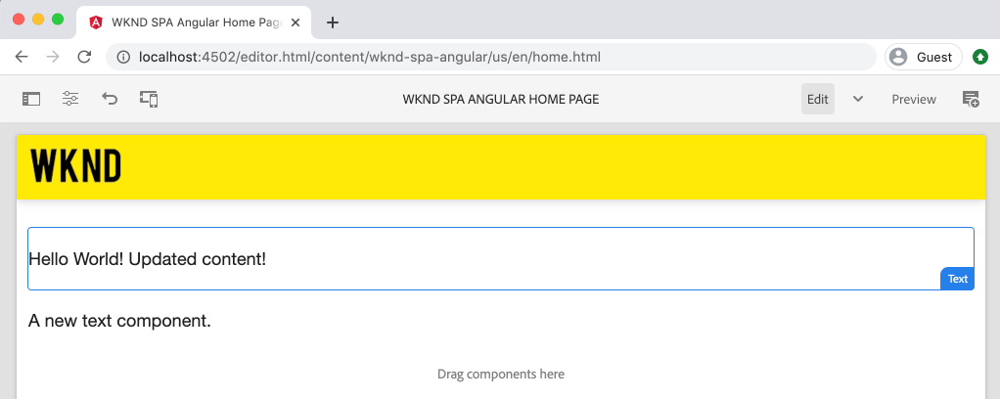

*The SPA is extended to add a static `Header` component*

## Prerequisiti

Rivedi gli strumenti e le istruzioni necessari per configurare un [ambiente di sviluppo locale](overview.md#local-dev-environment).

### Ottieni il codice

1. Scarica il punto di partenza per questa esercitazione tramite Git:

   ```shell
   $ git clone git@github.com:adobe/aem-guides-wknd-spa.git
   $ cd aem-guides-wknd-spa
   $ git checkout Angular/integrate-spa-start
   ```

2. Implementa la base di codice in un’istanza AEM locale utilizzando Maven:

   ```shell
   $ mvn clean install -PautoInstallSinglePackage
   ```

   Se utilizzi [AEM 6.x](overview.md#compatibility), aggiungi il profilo `classic`:

   ```shell
   $ mvn clean install -PautoInstallSinglePackage -Pclassic
   ```

You can always view the finished code on [GitHub](https://github.com/adobe/aem-guides-wknd-spa/tree/Angular/integrate-spa-solution) or check the code out locally by switching to the branch `Angular/integrate-spa-solution`.

## Integration approach {#integration-approach}

Two modules were created as part of the AEM project: `ui.apps` and `ui.frontend`.

The `ui.frontend` module is a [webpack](https://webpack.js.org/) project that contains all of the SPA source code. A majority of the SPA development and testing is done in the webpack project. When a production build is triggered, the SPA is built and compiled using webpack. The compiled artifacts (CSS and Javascript) are copied into the `ui.apps` module which is then deployed to the AEM runtime.

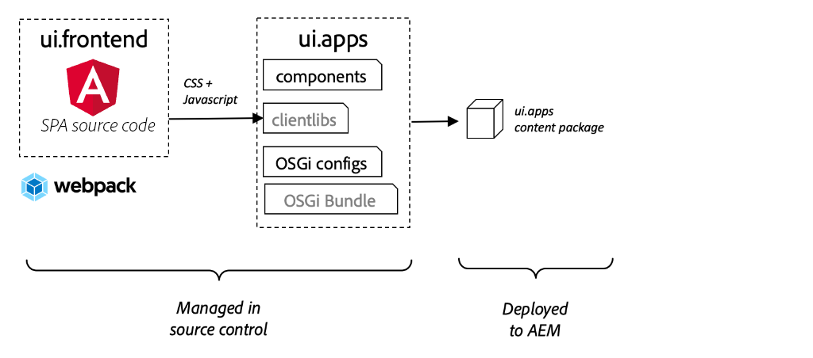

*A high-level depiction of the SPA integration.*

Additional information about the Front-end build can be [found here](https://experienceleague.adobe.com/docs/experience-manager-core-components/using/developing/archetype/uifrontend-angular.html?lang=it).

## Inspect the SPA integration {#inspect-spa-integration}

Esaminare quindi il modulo `ui.frontend` per comprendere l&#39;applicazione a pagina singola generata automaticamente dall&#39;[archetipo progetto AEM](https://experienceleague.adobe.com/docs/experience-manager-core-components/using/developing/archetype/uifrontend-angular.html?lang=it).

1. Nell’IDE che preferisci, apri il progetto AEM per l’applicazione a pagina singola WKND. Questa esercitazione utilizzerà l&#39;[IDE codice di Visual Studio](https://experienceleague.adobe.com/docs/experience-manager-learn/cloud-service/local-development-environment-set-up/development-tools.html?lang=it#microsoft-visual-studio-code).

   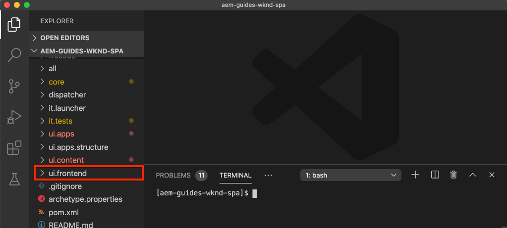

2. Espandere ed esaminare la cartella `ui.frontend`. Apri il file in `ui.frontend/package.json`

3. Sotto `dependencies` dovresti vedere diversi relativi a `@angular`:

   ```json
   "@angular/animations": "~9.1.11",
   "@angular/common": "~9.1.11",
   "@angular/compiler": "~9.1.11",
   "@angular/core": "~9.1.11",
   "@angular/forms": "~9.1.10",
   "@angular/platform-browser": "~9.1.10",
   "@angular/platform-browser-dynamic": "~9.1.10",
   "@angular/router": "~9.1.10",
   ```

   Il modulo `ui.frontend` è un&#39;applicazione [Angular](https://angular.io) generata utilizzando lo strumento [Angular CLI](https://angular.io/cli) che include il routing.

4. Ci sono anche tre dipendenze con prefisso `@adobe`:

   ```json
   "@adobe/cq-angular-editable-components": "^2.0.2",
   "@adobe/cq-spa-component-mapping": "^1.0.3",
   "@adobe/cq-spa-page-model-manager": "^1.1.3",
   ```

   I moduli di cui sopra costituiscono [AEM SPA Editor JS SDK](https://experienceleague.adobe.com/docs/experience-manager-65/developing/headless/spas/spa-blueprint.html?lang=it) e forniscono la funzionalità che consente di mappare i componenti SPA ai componenti AEM.

5. Nel file `package.json` sono definiti diversi `scripts`:

   ```json
   "scripts": {
       "start": "ng serve --open --proxy-config ./proxy.conf.json",
       "build": "ng lint && ng build && clientlib",
       "build:production": "ng lint && ng build --prod && clientlib",
       "test": "ng test",
       "sync": "aemsync -d -w ../ui.apps/src/main/content"
   }
   ```

   Questi script si basano su [comandi CLI di Angular](https://angular.io/cli/build) comuni, ma sono stati leggermente modificati per funzionare con il progetto AEM più grande.

   `start` - esegue l&#39;app Angular localmente utilizzando un server Web locale. È stato aggiornato per fungere da proxy del contenuto dell’istanza AEM locale.

   `build` - compila l&#39;app Angular per la distribuzione di produzione. L&#39;aggiunta di `&& clientlib` è responsabile della copia dell&#39;applicazione a pagina singola compilata nel modulo `ui.apps` come libreria lato client durante una compilazione. Per facilitare questa operazione, viene utilizzato il modulo npm [aem-clientlib-generator](https://github.com/wcm-io-frontend/aem-clientlib-generator).

   Ulteriori dettagli sugli script disponibili sono disponibili [qui](https://experienceleague.adobe.com/docs/experience-manager-core-components/using/developing/archetype/uifrontend-angular.html?lang=it).

6. Esamina il file `ui.frontend/clientlib.config.js`. Questo file di configurazione viene utilizzato da [aem-clientlib-generator](https://github.com/wcm-io-frontend/aem-clientlib-generator#clientlibconfigjs) per determinare come generare la libreria client.

7. Esamina il file `ui.frontend/pom.xml`. Questo file trasforma la cartella `ui.frontend` in un [modulo Maven](https://maven.apache.org/guides/mini/guide-multiple-modules.html). Il file `pom.xml` è stato aggiornato per utilizzare [frontend-maven-plugin](https://github.com/eirslett/frontend-maven-plugin) per **test** e **build** l&#39;applicazione a pagina singola durante una compilazione Maven.

8. Esaminare il file `app.component.ts` in `ui.frontend/src/app/app.component.ts`:

   ```js
   import { Constants } from '@adobe/cq-angular-editable-components';
   import { ModelManager } from '@adobe/cq-spa-page-model-manager';
   import { Component } from '@angular/core';
   
   @Component({
   selector: '#spa-root', // tslint:disable-line
   styleUrls: ['./app.component.css'],
   templateUrl: './app.component.html'
   })
   export class AppComponent {
       ...
   
       constructor() {
           ModelManager.initialize().then(this.updateData);
       }
   
       private updateData = pageModel => {
           this.path = pageModel[Constants.PATH_PROP];
           this.items = pageModel[Constants.ITEMS_PROP];
           this.itemsOrder = pageModel[Constants.ITEMS_ORDER_PROP];
       }
   }
   ```

   `app.component.js` è il punto di ingresso dell&#39;applicazione a pagina singola. `ModelManager` è fornito da AEM SPA Editor JS SDK. È responsabile della chiamata e dell&#39;inserimento di `pageModel` (contenuto JSON) nell&#39;applicazione.

## Aggiungere un componente Intestazione {#header-component}

Quindi, aggiungi un nuovo componente all’applicazione a pagina singola e implementa le modifiche in un’istanza AEM locale per visualizzare l’integrazione.

1. Aprire una nuova finestra del terminale e passare alla cartella `ui.frontend`:

   ```shell
   $ cd aem-guides-wknd-spa/ui.frontend
   ```

2. Installa [Angular CLI](https://angular.io/cli#installing-angular-cli) a livello globale Utilizzato per generare componenti Angular e per generare e gestire l&#39;applicazione Angular tramite il comando **ng**.

   ```shell
   $ npm install -g @angular/cli
   ```

   >[!CAUTION]
   >
   > La versione di **@angular/cli** utilizzata dal progetto è **9.1.7**. Si consiglia di mantenere sincronizzate le versioni di Angular CLI.

3. Creare un nuovo componente `Header` eseguendo il comando Angular CLI `ng generate component` dalla cartella `ui.frontend`.

   ```shell
   $ ng generate component components/header
   
   CREATE src/app/components/header/header.component.css (0 bytes)
   CREATE src/app/components/header/header.component.html (21 bytes)
   CREATE src/app/components/header/header.component.spec.ts (628 bytes)
   CREATE src/app/components/header/header.component.ts (269 bytes)
   UPDATE src/app/app.module.ts (1809 bytes)
   ```

   Verrà creata un&#39;ossatura per il nuovo componente Angular Header in `ui.frontend/src/app/components/header`.

4. Aprire il progetto `aem-guides-wknd-spa` nell&#39;IDE desiderato. Passare alla cartella `ui.frontend/src/app/components/header`.

   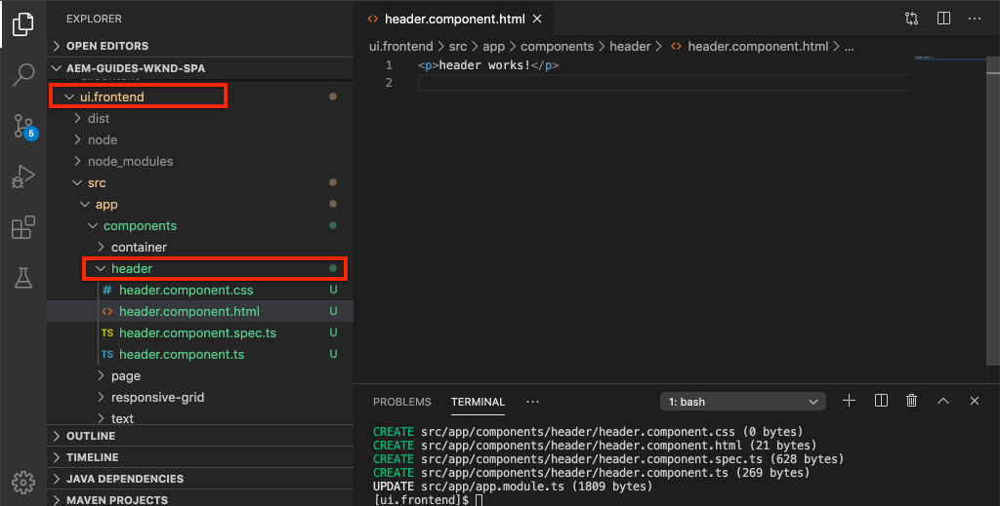

5. Aprire il file `header.component.html` e sostituire il contenuto con quanto segue:

   ```html
   <!--/* header.component.html */-->
   <header className="header">
       <div className="header-container">
           <h1>WKND</h1>
       </div>
   </header>
   ```

   In questo modo viene visualizzato il contenuto statico, pertanto questo componente Angular non richiede alcuna modifica al valore predefinito generato `header.component.ts`.

6. Apri il file **app.component.html** in `ui.frontend/src/app/app.component.html`. Aggiungi `app-header`:

   ```html
   <app-header></app-header>
   <router-outlet></router-outlet>
   ```

   Questo includerà il componente `header` prima di tutto il contenuto della pagina.

7. Aprire un nuovo terminale, passare alla cartella `ui.frontend` ed eseguire il comando `npm run build`:

   ```shell
   $ cd ui.frontend
   $ npm run build
   
   Linting "angular-app"...
   All files pass linting.
   Generating ES5 bundles for differential loading...
   ES5 bundle generation complete.
   ```

8. Passare alla cartella `ui.apps`. Sotto `ui.apps/src/main/content/jcr_root/apps/wknd-spa-angular/clientlibs/clientlib-angular` dovresti vedere che i file SPA compilati sono stati copiati dalla cartella `ui.frontend/build`.

   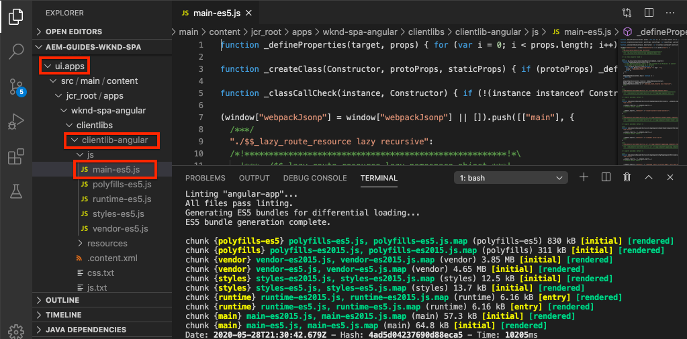

9. Tornare al terminale e spostarsi nella cartella `ui.apps`. Esegui il seguente comando Maven:

   ```shell
   $ cd ../ui.apps
   $ mvn clean install -PautoInstallPackage
   ...
   [INFO] ------------------------------------------------------------------------
   [INFO] BUILD SUCCESS
   [INFO] ------------------------------------------------------------------------
   [INFO] Total time:  9.629 s
   [INFO] Finished at: 2020-05-04T17:48:07-07:00
   [INFO] ------------------------------------------------------------------------
   ```

   Il pacchetto `ui.apps` verrà distribuito a un&#39;istanza in esecuzione locale di AEM.

10. Apri una scheda del browser e passa a [http://localhost:4502/editor.html/content/wknd-spa-angular/us/en/home.html](http://localhost:4502/editor.html/content/wknd-spa-angular/us/en/home.html). Il contenuto del componente `Header` dovrebbe essere visualizzato nell&#39;applicazione a pagina singola.

   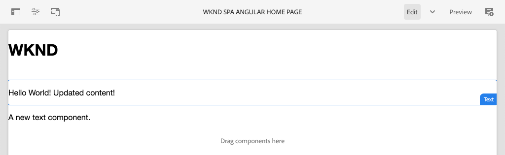

   I passaggi **7-9** vengono eseguiti automaticamente quando si attiva una build Maven dalla radice del progetto (ovvero `mvn clean install -PautoInstallSinglePackage`). Ora dovresti comprendere le nozioni di base sull’integrazione tra le librerie lato client di applicazioni a pagina singola e AEM. È comunque possibile modificare e aggiungere `Text` componenti in AEM, tuttavia il componente `Header` non è modificabile.

## Server di sviluppo Webpack: proxy dell’API JSON {#proxy-json}

Come mostrato negli esercizi precedenti, l’esecuzione di una build e la sincronizzazione della libreria client con un’istanza locale di AEM richiedono alcuni minuti. Questo è accettabile per il test finale, ma non è ideale per la maggior parte dello sviluppo di applicazioni a pagina singola.

È possibile utilizzare un server di sviluppo [webpack](https://webpack.js.org/configuration/dev-server/) per sviluppare rapidamente l&#39;applicazione a pagina singola. L’applicazione a pagina singola è guidata da un modello JSON generato da AEM. In questo esercizio il contenuto JSON di un&#39;istanza in esecuzione di AEM è **inviato tramite proxy** al server di sviluppo configurato dal [progetto Angular](https://angular.io/guide/build).

1. Torna all&#39;IDE e apri il file **proxy.conf.json** in `ui.frontend/proxy.conf.json`.

   ```json
   [
       {
           "context": [
                       "/content/**/*.(jpg|jpeg|png|model.json)",
                       "/etc.clientlibs/**/*"
                   ],
           "target": "http://localhost:4502",
           "auth": "admin:admin",
           "logLevel": "debug"
       }
   ]
   ```

   L&#39;[app Angular](https://angular.io/guide/build#proxying-to-a-backend-server) fornisce un semplice meccanismo per inoltrare le richieste API. I pattern specificati in `context` sono inviati tramite proxy tramite `localhost:4502`, l&#39;avvio rapido locale di AEM.

2. Apri il file **index.html** in `ui.frontend/src/index.html`. Si tratta del file HTML radice utilizzato dal server di sviluppo.

   Si noti che è presente una voce per `base href="/"`. Il [tag di base](https://angular.io/guide/deployment#the-base-tag) è fondamentale per la risoluzione degli URL relativi da parte dell&#39;app.

   ```html
   <base href="/">
   ```

3. Aprire una finestra del terminale e passare alla cartella `ui.frontend`. Eseguire il comando `npm start`:

   ```shell
   $ cd ui.frontend
   $ npm start
   
   > wknd-spa-angular@0.1.0 start /Users/dgordon/Documents/code/aem-guides-wknd-spa/ui.frontend
   > ng serve --open --proxy-config ./proxy.conf.json
   
   10% building 3/3 modules 0 active[HPM] Proxy created: [ '/content/**/*.(jpg|jpeg|png|model.json)', '/etc.clientlibs/**/*' ]  ->  http://localhost:4502
   [HPM] Subscribed to http-proxy events:  [ 'error', 'close' ]
   ℹ ｢wds｣: Project is running at http://localhost:4200/webpack-dev-server/
   ℹ ｢wds｣: webpack output is served from /
   ℹ ｢wds｣: 404s will fallback to //index.html
   ```

4. Apri una nuova scheda del browser (se non è già aperta) e passa a [http://localhost:4200/content/wknd-spa-angular/us/en/home.html](http://localhost:4200/content/wknd-spa-angular/us/en/home.html).

   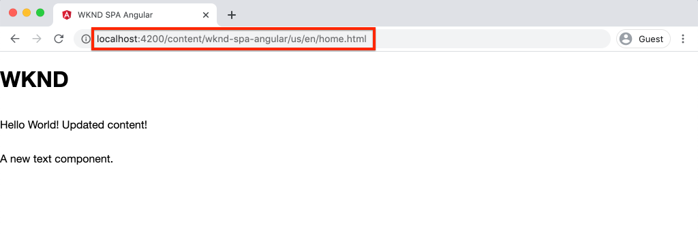

   Dovresti visualizzare gli stessi contenuti di AEM, ma senza alcuna funzionalità di authoring abilitata.

5. Tornare all&#39;IDE e creare una nuova cartella denominata `img` in `ui.frontend/src/assets`.
6. Scaricare e aggiungere il logo WKND seguente alla cartella `img`:

   

7. Apri **header.component.html** in `ui.frontend/src/app/components/header/header.component.html` e includi il logo:

   ```html
   <header class="header">
       <div class="header-container">
           <div class="logo">
               
           </div>
       </div>
   </header>
   ```

   Save the changes to **header.component.html**.

8. Return to the browser. You should immediately see the changes to the app reflected.

   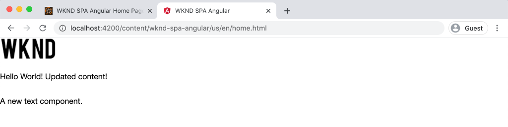

   You can continue to make content updates in **AEM** and see them reflected in **webpack dev server**, since we are proxying the content. Note that the content changes are only visible in the **webpack dev server**.

9. Stop the local web server with `ctrl+c` in the terminal.

## Webpack Dev Server - Mock JSON API {#mock-json}

Another approach to rapid development is to use a static JSON file to act as the JSON model. By &quot;mocking&quot; the JSON, we remove the dependency on a local AEM instance. It also allows a front-end developer to update the JSON model in order to test functionality and drive changes to the JSON API that would then be later implemented by a back-end developer.

The initial set up of the mock JSON does **require a local AEM instance**.

1. In the browser navigate to [http://localhost:4502/content/wknd-spa-angular/us/en.model.json](http://localhost:4502/content/wknd-spa-angular/us/en.model.json).

   This is the JSON exported by AEM that is driving the application. Copy the JSON output.

2. Return to the IDE navigate to `ui.frontend/src` and add new folders named **mocks** and **json** to match the following folder structure:

   ```plain
   |-- ui.frontend
       |-- src
           |-- mocks
               |-- json
   ```

3. Create a new file named **en.model.json** beneath `ui.frontend/public/mocks/json`. Paste the JSON output from **Step 1** here.

   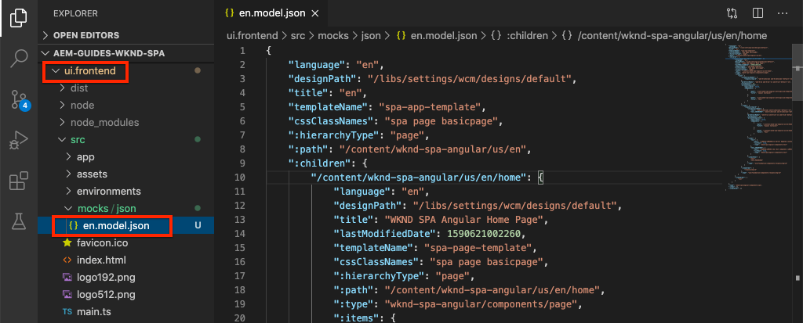

4. Create a new file **proxy.mock.conf.json** beneath `ui.frontend`. Populate the file with the following:

   ```json
   [
       {
       "context": [
           "/content/**/*.model.json"
       ],
       "pathRewrite": { "^/content/wknd-spa-angular/us" : "/mocks/json"} ,
       "target": "http://localhost:4200",
       "logLevel": "debug"
       }
   ]
   ```

   This proxy configuration will rewrite requests that start with `/content/wknd-spa-angular/us` with `/mocks/json` and serve the corresponding static JSON file, for example:

   ```plain
   /content/wknd-spa-angular/us/en.model.json -> /mocks/json/en.model.json
   ```

5. Open the file **angular.json**. Add a new **dev** configuration with an updated **assets** array to reference the **mocks** folder created.

   ```json
    "dev": {
             "assets": [
               "src/mocks",
               "src/assets",
               "src/favicon.ico",
               "src/logo192.png",
               "src/logo512.png",
               "src/manifest.json"
             ]
       },
   ```

   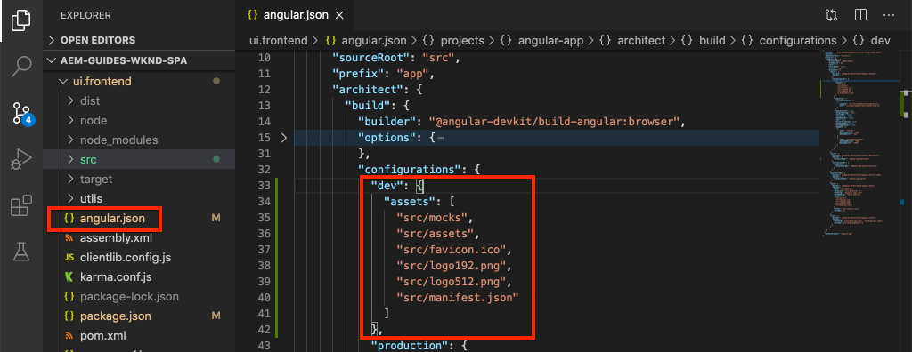

   La creazione di una configurazione **dev** dedicata garantisce che la cartella **mocks** venga utilizzata solo durante lo sviluppo e non venga mai distribuita ad AEM in una build di produzione.

6. Nel file **angular.json**, aggiorna la configurazione **browserTarget** per utilizzare la nuova configurazione **dev**:

   ```diff
     ...
     "serve": {
         "builder": "@angular-devkit/build-angular:dev-server",
         "options": {
   +       "browserTarget": "angular-app:build:dev"
   -       "browserTarget": "angular-app:build"
         },
     ...
   ```

   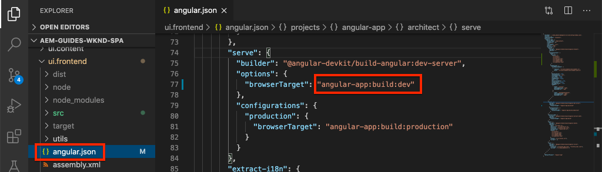

7. Apri il file `ui.frontend/package.json` e aggiungi un nuovo comando **start:mock** per fare riferimento al file **proxy.mock.conf.json**.

   ```diff
       "scripts": {
           "start": "ng serve --open --proxy-config ./proxy.conf.json",
   +       "start:mock": "ng serve --open --proxy-config ./proxy.mock.conf.json",
           "build": "ng lint && ng build && clientlib",
           "build:production": "ng lint && ng build --prod && clientlib",
           "test": "ng test",
           "sync": "aemsync -d -w ../ui.apps/src/main/content"
       }
   ```

   L’aggiunta di un nuovo comando consente di passare facilmente da una configurazione proxy all’altra.

8. Se è in esecuzione, arrestare il server di sviluppo **webpack**. Avvia il server di sviluppo **webpack** utilizzando lo script **start:mock**:

   ```shell
   $ npm run start:mock
   
   > wknd-spa-angular@0.1.0 start:mock /Users/dgordon/Documents/code/aem-guides-wknd-spa/ui.frontend
   > ng serve --open --proxy-config ./proxy.mock.conf.json
   ```

   Passa a [http://localhost:4200/content/wknd-spa-angular/us/en/home.html](http://localhost:4200/content/wknd-spa-angular/us/en/home.html) per visualizzare la stessa applicazione a pagina singola, ma il contenuto viene ora estratto dal file JSON **finto**.

9. Apporta una piccola modifica al file **en.model.json** creato in precedenza. Il contenuto aggiornato deve essere immediatamente riflesso nel **server di sviluppo Webpack**.

   

   La possibilità di manipolare il modello JSON e vedere gli effetti su un’applicazione a pagina singola live può aiutare uno sviluppatore a comprendere l’API del modello JSON. Consente inoltre lo sviluppo sia front-end che back-end in parallelo.

## Aggiungi stili con Sass

Successivamente, al progetto viene aggiunto uno stile aggiornato. Questo progetto aggiungerà il supporto di [Sass](https://sass-lang.com/) per alcune funzionalità utili come le variabili.

1. Aprire una finestra del terminale e arrestare il server di sviluppo **webpack**, se avviato. Dall&#39;interno della cartella `ui.frontend` immettere il comando seguente per aggiornare l&#39;app Angular per elaborare **.scss** file.

   ```shell
   $ cd ui.frontend
   $ ng config schematics.@schematics/angular:component.styleext scss
   ```

   Il file `angular.json` verrà aggiornato con una nuova voce nella parte inferiore del file:

   ```json
   "schematics": {
       "@schematics/angular:component": {
       "styleext": "scss"
       }
   }
   ```

2. Installa `normalize-scss` per normalizzare gli stili nei vari browser:

   ```shell
   $ npm install normalize-scss --save
   ```

3. Tornare all&#39;IDE e sotto `ui.frontend/src` creare una nuova cartella denominata `styles`.
4. Creare un nuovo file sotto `ui.frontend/src/styles` denominato `_variables.scss` e popolarlo con le seguenti variabili:

   ```scss
   //_variables.scss
   
   //== Colors
   //
   //## Gray and brand colors for use across theme.
   
   $black:                  #202020;
   $gray:                   #696969;
   $gray-light:             #EBEBEB;
   $gray-lighter:           #F7F7F7;
   $white:                  #FFFFFF;
   $yellow:                 #FFEA00;
   $blue:                   #0045FF;
   
   
   //== Typography
   //
   //## Font, line-height, and color for body text, headings, and more.
   
   $font-family-sans-serif:  "Helvetica Neue", Helvetica, Arial, sans-serif;
   $font-family-serif:       Georgia, "Times New Roman", Times, serif;
   $font-family-base:        $font-family-sans-serif;
   $font-size-base:          18px;
   
   $line-height-base:        1.5;
   $line-height-computed:    floor(($font-size-base * $line-height-base));
   
   // Functional Colors
   $brand-primary:             $yellow;
   $body-bg:                   $white;
   $text-color:                $black;
   $text-color-inverse:        $gray-light;
   $link-color:                $blue;
   
   //Layout
   $max-width: 1024px;
   $header-height: 75px;
   
   // Spacing
   $gutter-padding: 12px;
   ```

5. Rinomina l&#39;estensione del file **styles.css** in `ui.frontend/src/styles.css` in **styles.scss**. Sostituire il contenuto con quanto segue:

   ```scss
   /* styles.scss * /
   
   /* Normalize */
   @import '~normalize-scss/sass/normalize';
   
   @import './styles/variables';
   
   body {
       background-color: $body-bg;
       font-family: $font-family-base;
       margin: 0;
       padding: 0;
       font-size: $font-size-base;
       text-align: left;
       color: $text-color;
       line-height: $line-height-base;
   }
   
   body.page {
       max-width: $max-width;
       margin: 0 auto;
       padding: $gutter-padding;
       padding-top: $header-height;
   }
   ```

6. Aggiorna **angular.json** e rinomina tutti i riferimenti a **style.css** con **styles.scss**. Dovrebbero essere presenti 3 riferimenti.

   ```diff
     "styles": [
   -    "src/styles.css"
   +    "src/styles.scss"
      ],
   ```

## Aggiorna stili intestazione

Aggiungi quindi alcuni stili specifici del brand al componente **Intestazione** utilizzando Sass.

1. Avvia il server di sviluppo **webpack** per visualizzare gli stili aggiornati in tempo reale:

   ```shell
   $ npm run start:mock
   ```

2. In `ui.frontend/src/app/components/header` rinominare **header.component.css** in **header.component.scss**. Compila il file con quanto segue:

   ```scss
   @import "~src/styles/variables";
   
   .header {
       width: 100%;
       position: fixed;
       top: 0;
       left:0;
       z-index: 99;
       background-color: $brand-primary;
       box-shadow: 0px 0px 10px 0px rgba(0, 0, 0, 0.24);
   }
   
   .header-container {
       display: flex;
       max-width: $max-width;
       margin: 0 auto;
       padding-left: $gutter-padding;
       padding-right: $gutter-padding;
   }
   
   .logo {
       z-index: 100;
       display: flex;
       padding-top: $gutter-padding;
       padding-bottom: $gutter-padding;
   }
   
   .logo-img {
       width: 100px;
   }
   ```

3. Aggiorna **header.component.ts** per fare riferimento a **header.component.scss**:

   ```diff
   ...
     @Component({
       selector: 'app-header',
       templateUrl: './header.component.html',
   -   styleUrls: ['./header.component.css']
   +   styleUrls: ['./header.component.scss']
     })
   ...
   ```

4. Torna al browser e al server di sviluppo **webpack**:

   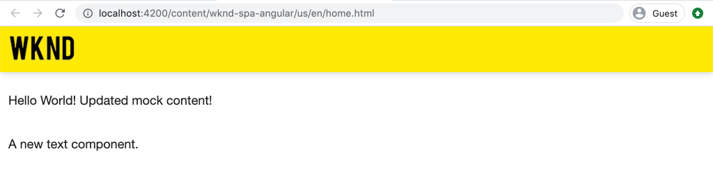

   Gli stili aggiornati dovrebbero essere aggiunti al componente **Intestazione**.

## Distribuire aggiornamenti SPA in AEM

Le modifiche apportate all&#39;**Intestazione** sono attualmente visibili solo tramite il **server di sviluppo Webpack**. Distribuisci l’applicazione a pagina singola aggiornata in AEM per visualizzare le modifiche.

1. Arresta il server di sviluppo **webpack**.
2. Passare alla directory principale del progetto `/aem-guides-wknd-spa` e distribuire il progetto in AEM utilizzando Maven:

   ```shell
   $ cd ..
   $ mvn clean install -PautoInstallSinglePackage
   ```

3. Passa a [http://localhost:4502/editor.html/content/wknd-spa-angular/us/en/home.html](http://localhost:4502/editor.html/content/wknd-spa-angular/us/en/home.html). Dovresti visualizzare l&#39;**Intestazione** aggiornata con logo e stili applicati:

   

   Ora che l’applicazione a pagina singola aggiornata è in AEM, l’authoring può continuare.

## Congratulazioni. {#congratulations}

Congratulazioni, hai aggiornato l’applicazione a pagina singola ed esplorato l’integrazione con AEM. Ora conosci due diversi approcci per lo sviluppo dell&#39;applicazione a pagina singola rispetto all&#39;API del modello JSON di AEM utilizzando un server di sviluppo **webpack**.

Puoi sempre visualizzare il codice finito su [GitHub](https://github.com/adobe/aem-guides-wknd-spa/tree/Angular/integrate-spa-solution) o estrarre il codice localmente passando al ramo `Angular/integrate-spa-solution`.

### Passaggi successivi {#next-steps}

[Mappatura dei componenti SPA sui componenti AEM](map-components.md) - Scopri come mappare i componenti Angular sui componenti Adobe Experience Manager (AEM) con AEM SPA Editor JS SDK. La mappatura dei componenti consente agli autori di apportare aggiornamenti dinamici ai componenti delle applicazioni a pagina singola nell’editor delle applicazioni a pagina singola di AEM, in modo simile all’authoring tradizionale AEM.
