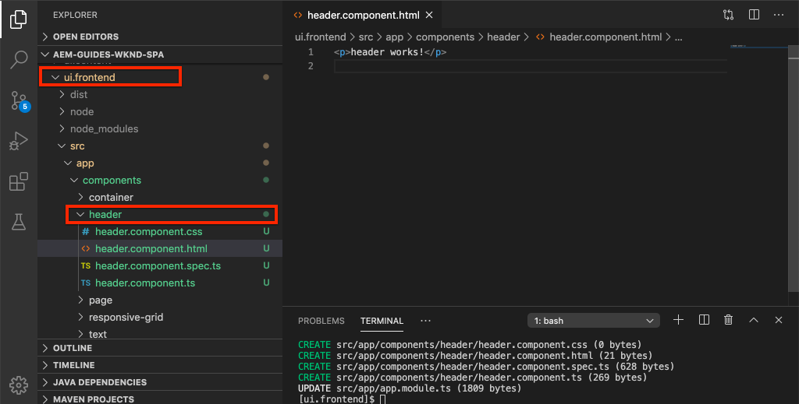

# Integrare un SPA {#integrate-spa}

Scopri come il codice sorgente per un’applicazione a pagina singola (SPA) scritta in Angular può essere integrato con un progetto Adobe Experience Manager (AEM). Scopri come utilizzare strumenti front-end moderni, come un server di sviluppo webpack, per sviluppare rapidamente il SPA rispetto all’API del modello JSON AEM.

## Obiettivo

1. Scopri come il progetto SPA è integrato con AEM con librerie lato client.
2. Scopri come utilizzare un server di sviluppo locale per lo sviluppo front-end dedicato.
3. Esplorare l&#39;utilizzo di un **proxy** e statici **deriso** file da sviluppare rispetto all’API del modello JSON AEM

## Cosa verrà creato

Questo capitolo aggiunge un semplice `Header` al SPA. Nel processo di costruzione di questo statico `Header` componente verranno utilizzati diversi approcci allo sviluppo SPA AEM.


*L’SPA viene estesa per aggiungere un `Header` component*

## Prerequisiti

Rivedere gli strumenti e le istruzioni necessari per la configurazione di un [ambiente di sviluppo locale](overview.md#local-dev-environment).

### Ottieni il codice

1. Scarica il punto di partenza per questa esercitazione tramite Git:

   ```shell
   $ git clone git@github.com:adobe/aem-guides-wknd-spa.git
   $ cd aem-guides-wknd-spa
   $ git checkout Angular/integrate-spa-start
   ```

2. Distribuisci la base di codice in un&#39;istanza AEM locale utilizzando Maven:

   ```shell
   $ mvn clean install -PautoInstallSinglePackage
   ```

   Se utilizzi [AEM 6.x](overview.md#compatibility) aggiungi le `classic` profilo:

   ```shell
   $ mvn clean install -PautoInstallSinglePackage -Pclassic
   ```

Puoi sempre visualizzare il codice finito su [GitHub](https://github.com/adobe/aem-guides-wknd-spa/tree/Angular/integrate-spa-solution) o controlla il codice localmente passando al ramo `Angular/integrate-spa-solution`.

## Metodo di integrazione {#integration-approach}

Nell’ambito del progetto AEM sono stati creati due moduli: `ui.apps` e `ui.frontend`.

La `ui.frontend` un modulo [webpack](https://webpack.js.org/) progetto che contiene tutto il codice sorgente SPA. La maggior parte dello sviluppo SPA e dei test verrà effettuata nel progetto webpack. Quando viene attivata una build di produzione, il SPA viene generato e compilato utilizzando il webpack. Gli artefatti compilati (CSS e Javascript) vengono copiati nel `ui.apps` che viene quindi distribuito al runtime AEM.


*Una descrizione di alto livello dell’integrazione SPA.*

Ulteriori informazioni sulla build front-end possono essere [qui](https://experienceleague.adobe.com/docs/experience-manager-core-components/using/developing/archetype/uifrontend-angular.html).

## Integrazione di Inspect SPA {#inspect-spa-integration}

Quindi, controlla il `ui.frontend` per comprendere il SPA generato automaticamente dal [Archetipo AEM progetto](https://experienceleague.adobe.com/docs/experience-manager-core-components/using/developing/archetype/uifrontend-angular.html).

1. Nell’IDE che preferisci, apri Progetto AEM per il SPA WKND. Questa esercitazione utilizzerà il [IDE codice di Visual Studio](https://experienceleague.adobe.com/docs/experience-manager-learn/cloud-service/local-development-environment-set-up/development-tools.html#microsoft-visual-studio-code).

   

2. Espandi ed esamina le `ui.frontend` cartella. Aprire il file `ui.frontend/package.json`

3. Sotto la `dependencies` dovresti vedere diversi `@angular`:

   ```json
   "@angular/animations": "~9.1.11",
   "@angular/common": "~9.1.11",
   "@angular/compiler": "~9.1.11",
   "@angular/core": "~9.1.11",
   "@angular/forms": "~9.1.10",
   "@angular/platform-browser": "~9.1.10",
   "@angular/platform-browser-dynamic": "~9.1.10",
   "@angular/router": "~9.1.10",
   ```

   La `ui.frontend` un modulo [applicazione Angular](https://angular.io) generato utilizzando [Strumento Angular CLI](https://angular.io/cli) che include il routing.

4. Ci sono anche tre dipendenze con prefisso `@adobe`:

   ```json
   "@adobe/cq-angular-editable-components": "^2.0.2",
   "@adobe/cq-spa-component-mapping": "^1.0.3",
   "@adobe/cq-spa-page-model-manager": "^1.1.3",
   ```

   I moduli di cui sopra costituiscono il [AEM Editor JS SDK](https://experienceleague.adobe.com/docs/experience-manager-65/developing/headless/spas/spa-blueprint.html) e fornisce le funzionalità necessarie per mappare SPA Componenti su Componenti AEM.

5. In `package.json` file diversi `scripts` sono definiti:

   ```json
   "scripts": {
       "start": "ng serve --open --proxy-config ./proxy.conf.json",
       "build": "ng lint && ng build && clientlib",
       "build:production": "ng lint && ng build --prod && clientlib",
       "test": "ng test",
       "sync": "aemsync -d -w ../ui.apps/src/main/content"
   }
   ```

   Questi script si basano sui comuni [Comandi CLI di Angular](https://angular.io/cli/build) ma sono state leggermente modificate per lavorare con il progetto AEM più grande.

   `start` - esegue l’app Angular localmente utilizzando un server web locale. È stato aggiornato per eseguire il proxy del contenuto dell’istanza AEM locale.

   `build` - compila l’app Angular per la distribuzione di produzione. L&#39;aggiunta di `&& clientlib` è responsabile della copia del SPA compilato nel `ui.apps` come libreria lato client durante una build. Modulo npm [aem-clientlib-generator](https://github.com/wcm-io-frontend/aem-clientlib-generator) è utilizzato per facilitare questa fase.

   Ulteriori dettagli sugli script disponibili sono disponibili [qui](https://experienceleague.adobe.com/docs/experience-manager-core-components/using/developing/archetype/uifrontend-angular.html).

6. Inspect il file `ui.frontend/clientlib.config.js`. Questo file di configurazione viene utilizzato da [aem-clientlib-generator](https://github.com/wcm-io-frontend/aem-clientlib-generator#clientlibconfigjs) per determinare come generare la libreria client.

7. Inspect il file `ui.frontend/pom.xml`. Questo file trasforma il `ui.frontend` in una cartella [Modulo Maven](https://maven.apache.org/guides/mini/guide-multiple-modules.html). La `pom.xml` è stato aggiornato per utilizzare il [frontend-maven-plugin](https://github.com/eirslett/frontend-maven-plugin) a **test** e **build** il SPA durante una build Maven.

8. Inspect il file `app.component.ts` a `ui.frontend/src/app/app.component.ts`:

   ```js
   import { Constants } from '@adobe/cq-angular-editable-components';
   import { ModelManager } from '@adobe/cq-spa-page-model-manager';
   import { Component } from '@angular/core';
   
   @Component({
   selector: '#spa-root', // tslint:disable-line
   styleUrls: ['./app.component.css'],
   templateUrl: './app.component.html'
   })
   export class AppComponent {
       ...
   
       constructor() {
           ModelManager.initialize().then(this.updateData);
       }
   
       private updateData = pageModel => {
           this.path = pageModel[Constants.PATH_PROP];
           this.items = pageModel[Constants.ITEMS_PROP];
           this.itemsOrder = pageModel[Constants.ITEMS_ORDER_PROP];
       }
   }
   ```

   `app.component.js` è il punto di ingresso del SPA. `ModelManager` è fornito dall’SDK JS AEM Editor SPA. È responsabile della chiamata e dell&#39;inserimento del `pageModel` (il contenuto JSON) nell’applicazione.

## Aggiungere un componente Intestazione {#header-component}

Quindi, aggiungi un nuovo componente al SPA e distribuisci le modifiche a un&#39;istanza AEM locale per visualizzare l&#39;integrazione.

1. Apri una nuova finestra terminale e passa alla `ui.frontend` cartella:

   ```shell
   $ cd aem-guides-wknd-spa/ui.frontend
   ```

2. Installa [Angular CLI](https://angular.io/cli#installing-angular-cli) a livello globale Viene utilizzato per generare componenti di Angular e per generare e servire l’applicazione di Angular tramite il **ng** comando.

   ```shell
   $ npm install -g @angular/cli
   ```

   >[!CAUTION]
   >
   > Versione di **@angular/cli** utilizzato da questo progetto è **9.1.7**. Si consiglia di mantenere sincronizzate le versioni di Angular CLI.

3. Crea un nuovo `Header` eseguendo Angular CLI `ng generate component` dall&#39;interno del `ui.frontend` cartella.

   ```shell
   $ ng generate component components/header
   
   CREATE src/app/components/header/header.component.css (0 bytes)
   CREATE src/app/components/header/header.component.html (21 bytes)
   CREATE src/app/components/header/header.component.spec.ts (628 bytes)
   CREATE src/app/components/header/header.component.ts (269 bytes)
   UPDATE src/app/app.module.ts (1809 bytes)
   ```

   Verrà creato uno scheletro per il nuovo componente Intestazione Angular in `ui.frontend/src/app/components/header`.

4. Apri `aem-guides-wknd-spa` nell’IDE che preferisci. Passa a `ui.frontend/src/app/components/header` cartella.

   

5. Apri il file . `header.component.html` e sostituisci il contenuto con quanto segue:

   ```html
   <!--/* header.component.html */-->
   <header className="header">
       <div className="header-container">
           <h1>WKND</h1>
       </div>
   </header>
   ```

   In questo modo viene visualizzato il contenuto statico, pertanto questo componente di Angular non richiede alcuna regolazione per il contenuto generato di default `header.component.ts`.

6. Apri il file . **app.component.html** a  `ui.frontend/src/app/app.component.html`. Aggiungi il `app-header`:

   ```html
   <app-header></app-header>
   <router-outlet></router-outlet>
   ```

   Ciò include `header` , sopra tutto il contenuto della pagina.

7. Apri un nuovo terminale e naviga nel `ui.frontend` ed esegui la `npm run build` comando:

   ```shell
   $ cd ui.frontend
   $ npm run build
   
   Linting "angular-app"...
   All files pass linting.
   Generating ES5 bundles for differential loading...
   ES5 bundle generation complete.
   ```

8. Passa a `ui.apps` cartella. Sotto `ui.apps/src/main/content/jcr_root/apps/wknd-spa-angular/clientlibs/clientlib-angular` dovresti vedere che i file compilati SPA sono stati copiati dal`ui.frontend/build` cartella.

   

9. Torna al terminale e naviga nel `ui.apps` cartella. Esegui il seguente comando Maven:

   ```shell
   $ cd ../ui.apps
   $ mvn clean install -PautoInstallPackage
   ...
   [INFO] ------------------------------------------------------------------------
   [INFO] BUILD SUCCESS
   [INFO] ------------------------------------------------------------------------
   [INFO] Total time:  9.629 s
   [INFO] Finished at: 2020-05-04T17:48:07-07:00
   [INFO] ------------------------------------------------------------------------
   ```

   Verrà distribuito il `ui.apps` a un&#39;istanza locale in esecuzione di AEM.

10. Apri una scheda del browser e passa a [http://localhost:4502/editor.html/content/wknd-spa-angular/us/en/home.html](http://localhost:4502/editor.html/content/wknd-spa-angular/us/en/home.html). Ora dovresti visualizzare il contenuto della `Header` componente visualizzato nella SPA.

   

   Passaggi **7-9** vengono eseguite automaticamente quando si attiva una build Maven dalla radice del progetto (ovvero `mvn clean install -PautoInstallSinglePackage`). È ora necessario comprendere le nozioni di base dell’integrazione tra le librerie lato client SPA e AEM. È comunque possibile modificare e aggiungere `Text` componenti in AEM, tuttavia `Header` il componente non è modificabile.

## Webpack Dev Server - Proxy dell&#39;API JSON {#proxy-json}

Come visto negli esercizi precedenti, l’esecuzione di una build e la sincronizzazione della libreria client con un’istanza locale di AEM richiede alcuni minuti. Ciò è accettabile per i test finali, ma non è ideale per la maggior parte dello sviluppo SPA.

A [server di sviluppo webpack](https://webpack.js.org/configuration/dev-server/) può essere utilizzato per sviluppare rapidamente il SPA. Il SPA è guidato da un modello JSON generato da AEM. In questo esercizio il contenuto JSON da un’istanza in esecuzione di AEM sarà **proxy** nel server di sviluppo configurato da [Progetto di Angular](https://angular.io/guide/build).

1. Torna all’IDE e apri il file . **proxy.conf.json** a `ui.frontend/proxy.conf.json`.

   ```json
   [
       {
           "context": [
                       "/content/**/*.(jpg|jpeg|png|model.json)",
                       "/etc.clientlibs/**/*"
                   ],
           "target": "http://localhost:4502",
           "auth": "admin:admin",
           "logLevel": "debug"
       }
   ]
   ```

   La [app Angular](https://angular.io/guide/build#proxying-to-a-backend-server) fornisce un meccanismo semplice per le richieste API proxy. I pattern specificati in `context` sono trasmessi tramite proxy `localhost:4502`, l&#39;avvio rapido AEM locale.

2. Apri il file . **index.html** a `ui.frontend/src/index.html`. Si tratta del file HTML principale utilizzato dal server di sviluppo.

   È presente una voce per `base href="/"`. La [tag base](https://angular.io/guide/deployment#the-base-tag) è fondamentale affinché l’app possa risolvere gli URL relativi.

   ```html
   <base href="/">
   ```

3. Apri una finestra terminale e passa alla `ui.frontend` cartella. Esegui il comando `npm start`:

   ```shell
   $ cd ui.frontend
   $ npm start
   
   > wknd-spa-angular@0.1.0 start /Users/dgordon/Documents/code/aem-guides-wknd-spa/ui.frontend
   > ng serve --open --proxy-config ./proxy.conf.json
   
   10% building 3/3 modules 0 active[HPM] Proxy created: [ '/content/**/*.(jpg|jpeg|png|model.json)', '/etc.clientlibs/**/*' ]  ->  http://localhost:4502
   [HPM] Subscribed to http-proxy events:  [ 'error', 'close' ]
   ℹ ｢wds｣: Project is running at http://localhost:4200/webpack-dev-server/
   ℹ ｢wds｣: webpack output is served from /
   ℹ ｢wds｣: 404s will fallback to //index.html
   ```

4. Apri una nuova scheda del browser (se non è già aperta) e passa a [http://localhost:4200/content/wknd-spa-angular/us/en/home.html](http://localhost:4200/content/wknd-spa-angular/us/en/home.html).

   

   Dovresti visualizzare lo stesso contenuto di AEM, ma senza che sia abilitata alcuna delle funzionalità di authoring.

5. Torna all’IDE e crea una nuova cartella denominata `img` a `ui.frontend/src/assets`.
6. Scarica e aggiungi il seguente logo WKND al `img` cartella:

   

7. Apri **header.component.html** a `ui.frontend/src/app/components/header/header.component.html` e includere il logo:

   ```html
   <header class="header">
       <div class="header-container">
           <div class="logo">
               
           </div>
       </div>
   </header>
   ```

   Salva le modifiche apportate a **header.component.html**.

8. Torna al browser. Dovresti vedere immediatamente le modifiche apportate all’app.

   

   Puoi continuare a eseguire aggiornamenti dei contenuti in **AEM** e vederli riflessi **server di sviluppo webpack**, dal momento che il contenuto viene proxy. Le modifiche al contenuto sono visibili solo nel **server di sviluppo webpack**.

9. Arresta il server web locale con `ctrl+c` nel terminale.

## Webpack Dev Server - API JSON Mock {#mock-json}

Un altro approccio per un rapido sviluppo è quello di utilizzare un file JSON statico per agire come modello JSON. &quot;prendendo in giro&quot; il JSON, rimuoviamo la dipendenza da un&#39;istanza AEM locale. Consente inoltre a uno sviluppatore front-end di aggiornare il modello JSON per testare la funzionalità e apportare modifiche all’API JSON che verranno implementate in seguito da uno sviluppatore back-end.

La configurazione iniziale del modello JSON **richiedere un&#39;istanza AEM locale**.

1. Nel browser passa a [http://localhost:4502/content/wknd-spa-angular/us/en.model.json](http://localhost:4502/content/wknd-spa-angular/us/en.model.json).

   Si tratta del JSON esportato da AEM che guida l’applicazione. Copia l’output JSON.

2. Torna all’IDE e passa a `ui.frontend/src` e aggiungi nuove cartelle denominate **deride** e **json** per corrispondere alla seguente struttura di cartelle:

   ```plain
   |-- ui.frontend
       |-- src
           |-- mocks
               |-- json
   ```

3. Crea un nuovo file denominato **en.model.json** sotto `ui.frontend/public/mocks/json`. Incolla l’output JSON da **Passaggio 1** qui.

   

4. Crea un nuovo file **proxy.mock.conf.json** sotto `ui.frontend`. Compila il file con le seguenti caratteristiche:

   ```json
   [
       {
       "context": [
           "/content/**/*.model.json"
       ],
       "pathRewrite": { "^/content/wknd-spa-angular/us" : "/mocks/json"} ,
       "target": "http://localhost:4200",
       "logLevel": "debug"
       }
   ]
   ```

   Questa configurazione proxy riscriverà le richieste che iniziano con `/content/wknd-spa-angular/us` con `/mocks/json` e distribuisci il file JSON statico corrispondente, ad esempio:

   ```plain
   /content/wknd-spa-angular/us/en.model.json -> /mocks/json/en.model.json
   ```

5. Apri il file . **angular.json**. Aggiungi un nuovo **dev** configurazione con un aggiornamento **assets** per fare riferimento alla **deride** cartella creata.

   ```json
    "dev": {
             "assets": [
               "src/mocks",
               "src/assets",
               "src/favicon.ico",
               "src/logo192.png",
               "src/logo512.png",
               "src/manifest.json"
             ]
       },
   ```

   

   Creazione di un **dev** la configurazione assicura che **deride** viene utilizzata solo durante lo sviluppo e non viene mai distribuita in AEM in una build di produzione.

6. In **angular.json** file, aggiornare il **browserTarget** configurazione per utilizzare la nuova **dev** configurazione:

   ```diff
     ...
     "serve": {
         "builder": "@angular-devkit/build-angular:dev-server",
         "options": {
   +       "browserTarget": "angular-app:build:dev"
   -       "browserTarget": "angular-app:build"
         },
     ...
   ```

   

7. Apri il file . `ui.frontend/package.json` e aggiungi una nuova **start:mock** per fare riferimento al comando **proxy.mock.conf.json** file.

   ```diff
       "scripts": {
           "start": "ng serve --open --proxy-config ./proxy.conf.json",
   +       "start:mock": "ng serve --open --proxy-config ./proxy.mock.conf.json",
           "build": "ng lint && ng build && clientlib",
           "build:production": "ng lint && ng build --prod && clientlib",
           "test": "ng test",
           "sync": "aemsync -d -w ../ui.apps/src/main/content"
       }
   ```

   L&#39;aggiunta di un nuovo comando semplifica l&#39;alternanza tra le configurazioni proxy.

8. Se è attualmente in esecuzione, interrompi la **server di sviluppo webpack**. Avvia la **server di sviluppo webpack** utilizzando **start:mock** script:

   ```shell
   $ npm run start:mock
   
   > wknd-spa-angular@0.1.0 start:mock /Users/dgordon/Documents/code/aem-guides-wknd-spa/ui.frontend
   > ng serve --open --proxy-config ./proxy.mock.conf.json
   ```

   Passa a [http://localhost:4200/content/wknd-spa-angular/us/en/home.html](http://localhost:4200/content/wknd-spa-angular/us/en/home.html) e dovresti vedere lo stesso SPA ma il contenuto viene ora estratto dal **deriso** File JSON.

9. Effettuare una piccola modifica al **en.model.json** file creato in precedenza. Il contenuto aggiornato deve riflettersi immediatamente nel **server di sviluppo webpack**.

   

   La possibilità di manipolare il modello JSON e visualizzare gli effetti su un SPA live può aiutare uno sviluppatore a comprendere l’API del modello JSON. Consente inoltre lo sviluppo front-end e back-end in parallelo.

## Aggiungi stili con ass

Successivamente, al progetto verrà aggiunto uno stile aggiornato. Questo progetto verrà aggiunto [Squalo](https://sass-lang.com/) supporta alcune funzioni utili, come le variabili.

1. Aprire una finestra terminale e arrestare la **server di sviluppo webpack** se avviato. Dall&#39;interno del `ui.frontend` immetti il seguente comando per aggiornare l’app Angular da elaborare **.scss** file.

   ```shell
   $ cd ui.frontend
   $ ng config schematics.@schematics/angular:component.styleext scss
   ```

   Verrà aggiornato il `angular.json` file con una nuova voce nella parte inferiore del file:

   ```json
   "schematics": {
       "@schematics/angular:component": {
       "styleext": "scss"
       }
   }
   ```

2. Installa `normalize-scss` per normalizzare gli stili tra i browser:

   ```shell
   $ npm install normalize-scss --save
   ```

3. Torna all’IDE e sotto `ui.frontend/src` crea una nuova cartella denominata `styles`.
4. Crea un nuovo file sotto `ui.frontend/src/styles` denominato `_variables.scss` e popolalo con le seguenti variabili:

   ```scss
   //_variables.scss
   
   //== Colors
   //
   //## Gray and brand colors for use across theme.
   
   $black:                  #202020;
   $gray:                   #696969;
   $gray-light:             #EBEBEB;
   $gray-lighter:           #F7F7F7;
   $white:                  #FFFFFF;
   $yellow:                 #FFEA00;
   $blue:                   #0045FF;
   
   
   //== Typography
   //
   //## Font, line-height, and color for body text, headings, and more.
   
   $font-family-sans-serif:  "Helvetica Neue", Helvetica, Arial, sans-serif;
   $font-family-serif:       Georgia, "Times New Roman", Times, serif;
   $font-family-base:        $font-family-sans-serif;
   $font-size-base:          18px;
   
   $line-height-base:        1.5;
   $line-height-computed:    floor(($font-size-base * $line-height-base));
   
   // Functional Colors
   $brand-primary:             $yellow;
   $body-bg:                   $white;
   $text-color:                $black;
   $text-color-inverse:        $gray-light;
   $link-color:                $blue;
   
   //Layout
   $max-width: 1024px;
   $header-height: 75px;
   
   // Spacing
   $gutter-padding: 12px;
   ```

5. Rinomina l’estensione del file **Styles.css** a `ui.frontend/src/styles.css` a **Styles.scss**. Sostituisci il contenuto con quanto segue:

   ```scss
   /* styles.scss * /
   
   /* Normalize */
   @import '~normalize-scss/sass/normalize';
   
   @import './styles/variables';
   
   body {
       background-color: $body-bg;
       font-family: $font-family-base;
       margin: 0;
       padding: 0;
       font-size: $font-size-base;
       text-align: left;
       color: $text-color;
       line-height: $line-height-base;
   }
   
   body.page {
       max-width: $max-width;
       margin: 0 auto;
       padding: $gutter-padding;
       padding-top: $header-height;
   }
   ```

6. Aggiorna **angular.json** e rinomina tutti i riferimenti a **style.css** con **Styles.scss**. Ci dovrebbero essere 3 riferimenti.

   ```diff
     "styles": [
   -    "src/styles.css"
   +    "src/styles.scss"
      ],
   ```

## Aggiorna stili di intestazione

Aggiungi quindi alcuni stili specifici del marchio al **Intestazione** tramite Sass.

1. Avvia la **server di sviluppo webpack** per visualizzare gli stili aggiornati in tempo reale:

   ```shell
   $ npm run start:mock
   ```

2. Sotto `ui.frontend/src/app/components/header` nome **header.component.css** a **header.component.scss**. Compila il file con le seguenti caratteristiche:

   ```scss
   @import "~src/styles/variables";
   
   .header {
       width: 100%;
       position: fixed;
       top: 0;
       left:0;
       z-index: 99;
       background-color: $brand-primary;
       box-shadow: 0px 0px 10px 0px rgba(0, 0, 0, 0.24);
   }
   
   .header-container {
       display: flex;
       max-width: $max-width;
       margin: 0 auto;
       padding-left: $gutter-padding;
       padding-right: $gutter-padding;
   }
   
   .logo {
       z-index: 100;
       display: flex;
       padding-top: $gutter-padding;
       padding-bottom: $gutter-padding;
   }
   
   .logo-img {
       width: 100px;
   }
   ```

3. Aggiorna **header.component.ts** riferimento **header.component.scss**:

   ```diff
   ...
     @Component({
       selector: 'app-header',
       templateUrl: './header.component.html',
   -   styleUrls: ['./header.component.css']
   +   styleUrls: ['./header.component.scss']
     })
   ...
   ```

4. Torna al browser e **server di sviluppo webpack**:

   

   Ora dovresti visualizzare gli stili aggiornati aggiunti al **Intestazione** componente.

## Distribuire aggiornamenti SPA a AEM

Le modifiche apportate al **Intestazione** al momento sono visibili solo attraverso **server di sviluppo webpack**. Distribuisci il SPA aggiornato per AEM per visualizzare le modifiche.

1. Interrompi **server di sviluppo webpack**.
2. Passa alla directory principale del progetto `/aem-guides-wknd-spa` e implementa il progetto per AEM utilizzando Maven:

   ```shell
   $ cd ..
   $ mvn clean install -PautoInstallSinglePackage
   ```

3. Passa a [http://localhost:4502/editor.html/content/wknd-spa-angular/us/en/home.html](http://localhost:4502/editor.html/content/wknd-spa-angular/us/en/home.html). Dovresti visualizzare l&#39;aggiornamento **Intestazione** con logo e stili applicati:

   

   Ora che il SPA aggiornato è in AEM, l’authoring può continuare.

## Congratulazioni! {#congratulations}

Congratulazioni, hai aggiornato il SPA ed esplorato l&#39;integrazione con AEM! Ora conosci due diversi approcci per lo sviluppo dell’SPA rispetto all’API del modello JSON AEM utilizzando un **server di sviluppo webpack**.

Puoi sempre visualizzare il codice finito su [GitHub](https://github.com/adobe/aem-guides-wknd-spa/tree/Angular/integrate-spa-solution) o controlla il codice localmente passando al ramo `Angular/integrate-spa-solution`.

### Passaggi successivi {#next-steps}

[Mappatura di componenti SPA per AEM componenti](map-components.md) - Scopri come mappare i componenti di Angular ai componenti di Adobe Experience Manager (AEM) con l’SDK JS dell’editor di SPA AEM. La mappatura dei componenti consente agli autori di apportare aggiornamenti dinamici ai componenti SPA all’interno dell’editor di SPA AEM, in modo simile all’authoring tradizionale AEM.
