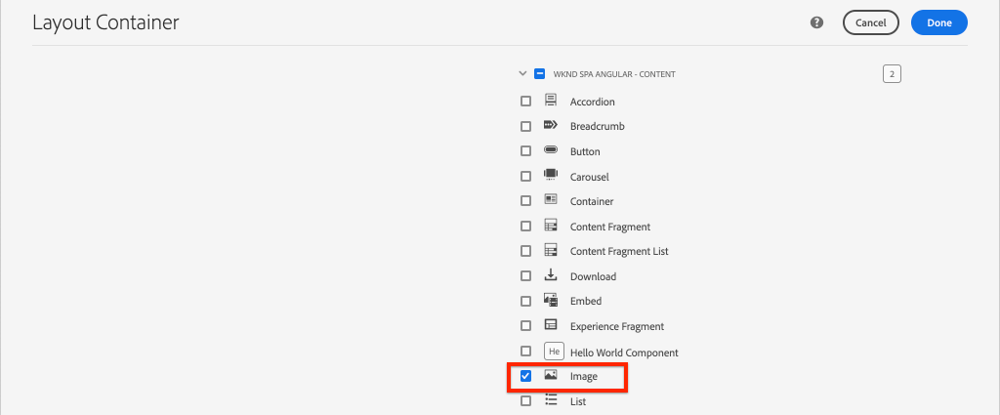
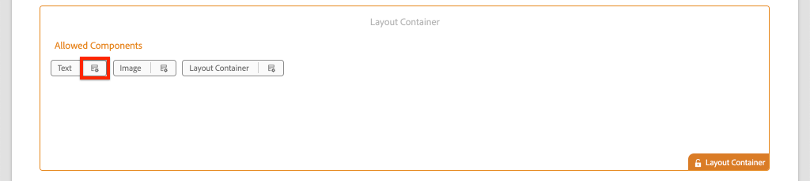

# Mappatura di componenti SPA per AEM componenti {#map-components}

Scopri come mappare i componenti di Angular ai componenti di Adobe Experience Manager (AEM) con l’SDK JS dell’editor di SPA AEM. La mappatura dei componenti consente agli utenti di apportare aggiornamenti dinamici ai componenti SPA all’interno dell’editor di SPA AEM, in modo simile all’authoring tradizionale AEM.

Questo capitolo descrive in modo più approfondito l’API del modello JSON AEM e come il contenuto JSON esposto da un componente AEM può essere inserito automaticamente in un componente Angular come proprietà.

## Obiettivo

1. Scopri come mappare AEM componenti su SPA componenti.
2. Comprendere la differenza tra **Contenitore** componenti e **Contenuto** componenti.
3. Crea un nuovo componente Angular associato a un componente AEM esistente.

## Cosa verrà creato

Questo capitolo esaminerà come il `Text` SPA componente è mappato al AEM `Text`componente. Nuovo `Image` Viene creato SPA componente che può essere utilizzato nella SPA e creato in AEM. Funzioni predefinite del **Contenitore di layout** e **Editor modelli** I criteri verranno inoltre utilizzati per creare una visualizzazione con un aspetto leggermente più vario.


## Prerequisiti

Rivedere gli strumenti e le istruzioni necessari per la configurazione di un [ambiente di sviluppo locale](overview.md#local-dev-environment).

### Ottieni il codice

1. Scarica il punto di partenza per questa esercitazione tramite Git:

   ```shell
   $ git clone git@github.com:adobe/aem-guides-wknd-spa.git
   $ cd aem-guides-wknd-spa
   $ git checkout Angular/map-components-start
   ```

2. Distribuisci la base di codice in un&#39;istanza AEM locale utilizzando Maven:

   ```shell
   $ mvn clean install -PautoInstallSinglePackage
   ```

   Se utilizzi [AEM 6.x](overview.md#compatibility) aggiungi le `classic` profilo:

   ```shell
   $ mvn clean install -PautoInstallSinglePackage -Pclassic
   ```

Puoi sempre visualizzare il codice finito su [GitHub](https://github.com/adobe/aem-guides-wknd-spa/tree/Angular/map-components-solution) o controlla il codice localmente passando al ramo `Angular/map-components-solution`.

## Approccio di mappatura

Il concetto di base consiste nel mappare un componente SPA a un componente AEM. AEM componenti, esegui lato server, esporta il contenuto come parte dell’API del modello JSON. Il contenuto JSON viene utilizzato dal SPA, che esegue lato client nel browser. Viene creata una mappatura 1:1 tra SPA componenti e un componente AEM.


*Panoramica di alto livello sulla mappatura di un componente AEM a un componente di Angular*

## Inspect come componente testo

La [Archetipo di progetto AEM](https://github.com/adobe/aem-project-archetype) fornisce un `Text` componente mappato al AEM [Componente testo](https://experienceleague.adobe.com/docs/experience-manager-core-components/using/components/text.html). Questo è un esempio di **content** componente, in quanto esegue il rendering *content* da AEM.

Vediamo come funziona il componente.

### Inspect il modello JSON

1. Prima di passare al codice SPA, è importante comprendere il modello JSON AEM fornito. Passa a [Libreria dei componenti core](https://www.aemcomponents.dev/content/core-components-examples/library/core-content/text.html) e visualizzare la pagina del componente Testo . La libreria dei componenti core fornisce esempi di tutti i componenti core AEM.
2. Seleziona la **JSON** per uno degli esempi:

   

   Dovresti visualizzare tre proprietà: `text`, `richText`e `:type`.

   `:type` è una proprietà riservata che elenca i `sling:resourceType` (o percorso) del componente AEM. Il valore di `:type` viene utilizzato per mappare il componente AEM al componente SPA.

   `text` e `richText` sono proprietà aggiuntive esposte al componente SPA.

### Inspect il componente Testo

1. Apri un nuovo terminale e passa alla `ui.frontend` all’interno del progetto. Esegui `npm install` e poi `npm start` per avviare la **server di sviluppo webpack**:

   ```shell
   $ cd ui.frontend
   $ npm run start:mock
   ```

   La `ui.frontend` il modulo è attualmente configurato per utilizzare [mock JSON model](./integrate-spa.md#mock-json).

2. Dovrebbe essere visualizzata una nuova finestra del browser aperta a [http://localhost:4200/content/wknd-spa-angular/us/en/home.html](http://localhost:4200/content/wknd-spa-angular/us/en/home.html)

   

3. Nell’IDE che preferisci, apri Progetto AEM per il SPA WKND. Espandi la `ui.frontend` modulo e apri il file **text.component.ts** sotto `ui.frontend/src/app/components/text/text.component.ts`:

   

4. La prima area da ispezionare è la `class TextComponent` alla ~linea 35:

   ```js
   export class TextComponent {
       @Input() richText: boolean;
       @Input() text: string;
       @Input() itemName: string;
   
       @HostBinding('innerHtml') get content() {
           return this.richText
           ? this.sanitizer.bypassSecurityTrustHtml(this.text)
           : this.text;
       }
       @HostBinding('attr.data-rte-editelement') editAttribute = true;
   
       constructor(private sanitizer: DomSanitizer) {}
   }
   ```

   [@Input()](https://angular.io/api/core/Input) decorator viene utilizzato per dichiarare i campi i cui valori sono impostati tramite l&#39;oggetto JSON mappato, rivisto in precedenza.

   `@HostBinding('innerHtml') get content()` è un metodo che espone il contenuto di testo creato dal valore di `this.text`. Se il contenuto è in formato RTF (determinato dalla variabile `this.richText` flag) La sicurezza integrata di Angular viene bypassata. Angular [DomSanitizer](https://angular.io/api/platform-browser/DomSanitizer) viene utilizzato per &quot;scorrere&quot; il HTML non elaborato ed evitare vulnerabilità di cross-site scripting. Il metodo è associato al `innerHtml` utilizzando [@HostBinding](https://angular.io/api/core/HostBinding) decoratore.

5. Ispezionare quindi `TextEditConfig` alla ~riga 24:

   ```js
   const TextEditConfig = {
       emptyLabel: 'Text',
       isEmpty: cqModel =>
           !cqModel || !cqModel.text || cqModel.text.trim().length < 1
   };
   ```

   Il codice riportato sopra ha la responsabilità di determinare quando eseguire il rendering del segnaposto nell’ambiente di authoring AEM. Se la `isEmpty` restituisce il metodo **true** quindi viene eseguito il rendering del segnaposto.

6. Infine, dai un&#39;occhiata al `MapTo` chiama a ~line 53:

   ```js
   MapTo('wknd-spa-angular/components/text')(TextComponent, TextEditConfig );
   ```

   **MapTo** è fornito dall’SDK JS dell’editor SPA AEM (`@adobe/cq-angular-editable-components`). Il percorso `wknd-spa-angular/components/text` rappresenta `sling:resourceType` del componente AEM. Questo percorso viene associato al `:type` esposto dal modello JSON osservato in precedenza. **MapTo** analizza la risposta del modello JSON e passa i valori corretti al `@Input()` variabili del componente SPA.

   Puoi trovare il AEM `Text` definizione del componente in `ui.apps/src/main/content/jcr_root/apps/wknd-spa-angular/components/text`.

7. Sperimenta modificando il **en.model.json** file a `ui.frontend/src/mocks/json/en.model.json`.

   A ~linea 62 aggiorna il primo `Text` valore per utilizzare un **`H1`** e **`u`** tag:

   ```json
       "text": {
           "text": "<h1><u>Hello World!</u></h1>",
           "richText": true,
           ":type": "wknd-spa-angular/components/text"
       }
   ```

   Torna al browser per vedere gli effetti serviti dal **server di sviluppo webpack**:

   

   Prova a attivare/disattivare la `richText` proprietà tra **true** / **false** per visualizzare la logica di rendering in azione.

8. Inspect **text.component.html** a `ui.frontend/src/app/components/text/text.component.html`.

   Questo file è vuoto perché l’intero contenuto del componente è impostato dalla `innerHTML` proprietà.

9. Inspect **app.module.ts** a `ui.frontend/src/app/app.module.ts`.

   ```js
   @NgModule({
   imports: [
       BrowserModule,
       SpaAngularEditableComponentsModule,
       AppRoutingModule
   ],
   providers: [ModelManagerService, { provide: APP_BASE_HREF, useValue: '/' }],
   declarations: [AppComponent, TextComponent, PageComponent, HeaderComponent],
   entryComponents: [TextComponent, PageComponent],
   bootstrap: [AppComponent]
   })
   export class AppModule {}
   ```

   La **TextComponent** non è incluso in modo esplicito, ma piuttosto in modo dinamico tramite **AEMResponsiveGridComponent** fornito dall’SDK JS dell’editor SPA AEM. Pertanto deve essere elencato nella **app.module.ts**&#39; [entryComponents](https://angular.io/guide/entry-components) array.

## Creare il componente Immagine

Quindi, crea un `Image` Componente Angular mappato al AEM [Componente immagine](https://experienceleague.adobe.com/docs/experience-manager-core-components/using/components/image.html). La `Image` è un altro esempio di **content** componente.

### Inspect JSON

Prima di passare al codice SPA, controlla il modello JSON fornito da AEM.

1. Passa a [Esempi di immagini nella libreria Componenti core](https://www.aemcomponents.dev/content/core-components-examples/library/core-content/image.html).

   

   Proprietà di `src`, `alt`e `title` vengono utilizzati per popolare il SPA `Image` componente.

   >[!NOTE]
   >
   > Sono state esposte altre proprietà Immagine (`lazyEnabled`, `widths`) che consente a uno sviluppatore di creare un componente adattivo e a caricamento lento. Il componente creato in questa esercitazione è semplice e funziona **not** utilizza queste proprietà avanzate.

2. Torna all’IDE e apri la `en.model.json` a `ui.frontend/src/mocks/json/en.model.json`. Poiché si tratta di un nuovo componente di rete per il nostro progetto, dobbiamo &quot;deridere&quot; l’immagine JSON.

   A ~riga 70 aggiungi una voce JSON per il `image` modello (non dimenticare la virgola finale `,` dopo il secondo `text_386303036`) e aggiorna la `:itemsOrder` array.

   ```json
   ...
   ":items": {
               ...
               "text_386303036": {
                   "text": "<p>A new text component.</p>\r\n",
                   "richText": true,
                   ":type": "wknd-spa-angular/components/text"
                   },
               "image": {
                   "alt": "Rock Climber in New Zealand",
                   "title": "Rock Climber in New Zealand",
                   "src": "/mocks/images/adobestock-140634652.jpeg",
                   ":type": "wknd-spa-angular/components/image"
               }
           },
           ":itemsOrder": [
               "text",
               "text_386303036",
               "image"
           ],
   ```

   Il progetto include un&#39;immagine di esempio in `/mock-content/adobestock-140634652.jpeg` utilizzato con **server di sviluppo webpack**.

   È possibile visualizzare l&#39;intero [en.model.json qui](https://github.com/adobe/aem-guides-wknd-spa/blob/Angular/map-components-solution/ui.frontend/src/mocks/json/en.model.json).

3. Aggiungi una foto stock da visualizzare dal componente.

   Crea una nuova cartella denominata **immagini** sotto `ui.frontend/src/mocks`. Scarica [adobestock-140634652.jpeg](assets/map-components/adobestock-140634652.jpeg) e inseriscilo nella nuova **immagini** cartella. Se lo desideri, puoi usare la tua immagine.

### Implementare il componente Immagine

1. Interrompi **server di sviluppo webpack** se avviato.
2. Crea un nuovo componente Immagine eseguendo l’Angular CLI `ng generate component` comando dall&#39;interno `ui.frontend` cartella:

   ```shell
   $ ng generate component components/image
   ```

3. Nell’IDE, apri **image.component.ts** a `ui.frontend/src/app/components/image/image.component.ts` e aggiornano come segue:

   ```js
   import {Component, Input, OnInit} from '@angular/core';
   import {MapTo} from '@adobe/cq-angular-editable-components';
   
   const ImageEditConfig = {
   emptyLabel: 'Image',
   isEmpty: cqModel =>
       !cqModel || !cqModel.src || cqModel.src.trim().length < 1
   };
   
   @Component({
   selector: 'app-image',
   templateUrl: './image.component.html',
   styleUrls: ['./image.component.scss']
   })
   export class ImageComponent implements OnInit {
   
   @Input() src: string;
   @Input() alt: string;
   @Input() title: string;
   
   constructor() { }
   
   get hasImage() {
       return this.src && this.src.trim().length > 0;
   }
   
   ngOnInit() { }
   }
   
   MapTo('wknd-spa-angular/components/image')(ImageComponent, ImageEditConfig);
   ```

   `ImageEditConfig` è la configurazione per determinare se eseguire il rendering del segnaposto autore in AEM, in base a se `src` è popolata.

   `@Input()` di `src`, `alt`e `title` sono le proprietà mappate dall’API JSON.

   `hasImage()` è un metodo che determina se l&#39;immagine deve essere sottoposta a rendering.

   `MapTo` mappa il componente SPA al componente AEM che si trova in `ui.apps/src/main/content/jcr_root/apps/wknd-spa-angular/components/image`.

4. Apri **image.component.html** e aggiornalo come segue:

   ```html
   <ng-container *ngIf="hasImage">
       
   </ng-container>
   ```

   Questo renderà il `` elemento if `hasImage` return **true**.

5. Apri **image.component.scss** e aggiornalo come segue:

   ```scss
   :host-context {
       display: block;
   }
   
   .image {
       margin: 1rem 0;
       width: 100%;
       border: 0;
   }
   ```

   >[!NOTE]
   >
   > La `:host-context` regola **critico** affinché il segnaposto dell’editor SPA AEM funzioni correttamente. Per tutti i componenti SPA destinati all’authoring nell’editor di pagine AEM questa regola è richiesta almeno.

6. Apri `app.module.ts` e aggiungi la `ImageComponent` al `entryComponents` array:

   ```js
   entryComponents: [TextComponent, PageComponent, ImageComponent],
   ```

   Come il `TextComponent`, `ImageComponent` viene caricato in modo dinamico e deve essere incluso nel `entryComponents` array.

7. Avvia la **server di sviluppo webpack** per visualizzare `ImageComponent` rendering.

   ```shell
   $ npm run start:mock
   ```

   

   *Immagine aggiunta al SPA*

   >[!NOTE]
   >
   > **Sfida bonus**: Implementa un nuovo metodo per visualizzare il valore di `title` come didascalia sotto l’immagine.

## Aggiorna criteri in AEM

La `ImageComponent` è visibile solo nel **server di sviluppo webpack**. Quindi, distribuisci il SPA aggiornato per AEM e aggiornare i criteri dei modelli.

1. Interrompi **server di sviluppo webpack** e dal **root** del progetto, implementa le modifiche a AEM utilizzando le tue competenze Maven:

   ```shell
   $ cd aem-guides-wknd-spa
   $ mvn clean install -PautoInstallSinglePackage
   ```

2. Dalla schermata iniziale AEM passare a **[!UICONTROL Strumenti]** > **[!UICONTROL Modelli]** > **[Angular SPA WKND](http://localhost:4502/libs/wcm/core/content/sites/templates.html/conf/wknd-spa-angular)**.

   Seleziona e modifica il **Pagina SPA**:

   

3. Seleziona la **Contenitore di layout** e clicca su **policy** per modificare il criterio:

   

4. Sotto **Componenti consentiti** > **Angular SPA WKND - Contenuto** > controlla il **Immagine** componente:

   

   Sotto **Componenti predefiniti** > **Aggiungi mappatura** e scegli la **Immagine - Angular WKND SPA - Contenuto** componente:

   

   Inserisci un **tipo mime** di `image/*`.

   Fai clic su **Fine** per salvare gli aggiornamenti dei criteri.

5. In **Contenitore di layout** fai clic su **policy** per **Testo** componente:

   

   Crea un nuovo criterio denominato **Testo WKND SPA**. Sotto **Plug-in** > **Formattazione** > seleziona tutte le caselle per abilitare ulteriori opzioni di formattazione:

   

   Sotto **Plug-in** > **Stili paragrafo** > seleziona la casella per **Abilitare gli stili di paragrafo**:

   

   Fai clic su **Fine** per salvare l&#39;aggiornamento dei criteri.

6. Passa a **Homepage** [http://localhost:4502/editor.html/content/wknd-spa-angular/us/en/home.html](http://localhost:4502/editor.html/content/wknd-spa-angular/us/en/home.html).

   Inoltre, dovresti essere in grado di modificare il `Text` e aggiungi altri stili di paragrafo in **a schermo intero** modalità.

   

7. È inoltre necessario essere in grado di trascinare e rilasciare un’immagine dal **Ricerca risorse**:

   

8. Aggiungi immagini personalizzate tramite [AEM Assets](http://localhost:4502/assets.html/content/dam) o installa la base di codice finita per lo standard [Sito di riferimento WKND](https://github.com/adobe/aem-guides-wknd/releases/latest). La [Sito di riferimento WKND](https://github.com/adobe/aem-guides-wknd/releases/latest) include molte immagini che possono essere riutilizzate sul SPA WKND. Il pacchetto può essere installato utilizzando [Gestione pacchetti AEM](http://localhost:4502/crx/packmgr/index.jsp).

   

## Inspect il contenitore di layout

Supporto per **Contenitore di layout** viene fornito automaticamente dall’SDK dell’editor SPA AEM. La **Contenitore di layout**, come indicato dal nome, è un **container** componente. I componenti contenitore sono componenti che accettano strutture JSON che rappresentano *altro* e crearli in modo dinamico.

Esaminiamo ulteriormente il Contenitore di layout.

1. Nell&#39;IDE aperto **responsive-grid.component.ts** a `ui.frontend/src/app/components/responsive-grid`:

   ```js
   import { AEMResponsiveGridComponent,MapTo } from '@adobe/cq-angular-editable-components';
   
   MapTo('wcm/foundation/components/responsivegrid')(AEMResponsiveGridComponent);
   ```

   La `AEMResponsiveGridComponent` è implementato come parte dell’SDK dell’editor di SPA AEM e viene incluso nel progetto tramite `import-components`.

2. In un browser, passa a [http://localhost:4502/content/wknd-spa-angular/us/en.model.json](http://localhost:4502/content/wknd-spa-angular/us/en.model.json)

   

   La **Contenitore di layout** un componente `sling:resourceType` di `wcm/foundation/components/responsivegrid` e viene riconosciuto dall’editor SPA utilizzando `:type` proprio come la proprietà `Text` e `Image` componenti.

   Le stesse funzionalità di ridimensionamento di un componente utilizzando [Modalità Layout](https://experienceleague.adobe.com/docs/experience-manager-65/authoring/siteandpage/responsive-layout.html#defining-layouts-layout-mode) sono disponibili con l’editor SPA.

3. Torna a [http://localhost:4502/editor.html/content/wknd-spa-angular/us/en/home.html](http://localhost:4502/editor.html/content/wknd-spa-angular/us/en/home.html). Aggiungi aggiuntivo **Immagine** e provare a ridimensionarli utilizzando **Layout** opzione:

   

4. Riaprire il modello JSON [http://localhost:4502/content/wknd-spa-angular/us/en.model.json](http://localhost:4502/content/wknd-spa-angular/us/en.model.json) e osservano `columnClassNames` come parte del JSON:

   

   Nome della classe `aem-GridColumn--default--4` indica che il componente deve essere largo 4 colonne in base a una griglia a 12 colonne. Maggiori dettagli sulla [la griglia reattiva si trova qui](https://adobe-marketing-cloud.github.io/aem-responsivegrid/).

5. Torna all’IDE e nella `ui.apps` nel modulo è presente una libreria lato client definita in `ui.apps/src/main/content/jcr_root/apps/wknd-spa-angular/clientlibs/clientlib-grid`. Aprire il file `less/grid.less`.

   Questo file determina i punti di interruzione (`default`, `tablet`e `phone`) utilizzata dal **Contenitore di layout**. Questo file deve essere personalizzato in base alle specifiche del progetto. Attualmente i punti di interruzione sono impostati su `1200px` e `650px`.

6. Dovresti essere in grado di utilizzare le funzionalità reattive e i criteri rich text aggiornati della `Text` per creare una visualizzazione come segue:

   

## Congratulazioni! {#congratulations}

Congratulazioni, hai imparato a mappare SPA componenti su componenti AEM e hai implementato una nuova `Image` componente. Hai anche la possibilità di esplorare le funzionalità reattive di **Contenitore di layout**.

Puoi sempre visualizzare il codice finito su [GitHub](https://github.com/adobe/aem-guides-wknd-spa/tree/Angular/map-components-solution) o controlla il codice localmente passando al ramo `Angular/map-components-solution`.

### Passaggi successivi {#next-steps}

[Navigazione e instradamento](navigation-routing.md) - Scopri come è possibile supportare più visualizzazioni nel SPA mappando le pagine AEM con l’SDK dell’editor SPA. La navigazione dinamica viene implementata tramite Router Angular e aggiunta a un componente Header esistente.

## Bonus - Configurazioni permanenti al controllo del codice sorgente {#bonus}

In molti casi, specialmente all’inizio di un progetto AEM, è utile mantenere le configurazioni, come i modelli e i relativi criteri dei contenuti, al controllo del codice sorgente. In questo modo tutti gli sviluppatori lavorano con lo stesso set di contenuti e configurazioni e possono garantire un’ulteriore coerenza tra gli ambienti. Quando un progetto raggiunge un certo livello di maturità, la gestione dei modelli può essere affidata a un gruppo speciale di utenti.

I passaggi successivi verranno eseguiti utilizzando l&#39;IDE di codice di Visual Studio e [Sincronizzazione AEM VSCode](https://marketplace.visualstudio.com/items?itemName=yamato-ltd.vscode-aem-sync) ma potrebbe utilizzare qualsiasi strumento e qualsiasi IDE configurato per **tirare** o **importare** contenuto da un’istanza locale di AEM.

1. Nell&#39;IDE di codice di Visual Studio, verificare di disporre di **Sincronizzazione AEM VSCode** installato tramite l’estensione Marketplace :

   

2. Espandi la **ui.content** modulo in Project explorer e passa a `/conf/wknd-spa-angular/settings/wcm/templates`.

3. **Clic con il pulsante destro** la `templates` e seleziona **Importa da AEM server**:

   

4. Ripeti i passaggi per importare il contenuto, ma seleziona la **politiche** cartella situata in `/conf/wknd-spa-angular/settings/wcm/policies`.

5. Inspect `filter.xml` file situato in `ui.content/src/main/content/META-INF/vault/filter.xml`.

   ```xml
   <!--ui.content filter.xml-->
   <?xml version="1.0" encoding="UTF-8"?>
    <workspaceFilter version="1.0">
        <filter root="/conf/wknd-spa-angular" mode="merge"/>
        <filter root="/content/wknd-spa-angular" mode="merge"/>
        <filter root="/content/dam/wknd-spa-angular" mode="merge"/>
        <filter root="/content/experience-fragments/wknd-spa-angular" mode="merge"/>
    </workspaceFilter>
   ```

   La `filter.xml` Il file è responsabile dell&#39;identificazione dei percorsi dei nodi installati con il pacchetto. Osserva che `mode="merge"` in ciascuno dei filtri che indica che il contenuto esistente non verrà modificato, viene aggiunto solo un nuovo contenuto. Poiché gli autori dei contenuti possono aggiornare questi percorsi, è importante che la distribuzione del codice lo faccia **not** sovrascrivi il contenuto. Consulta la sezione [Documentazione FileVault](https://jackrabbit.apache.org/filevault/filter.html) per ulteriori informazioni sull’utilizzo degli elementi filtro.

   Confronto `ui.content/src/main/content/META-INF/vault/filter.xml` e `ui.apps/src/main/content/META-INF/vault/filter.xml` per comprendere i diversi nodi gestiti da ciascun modulo.
