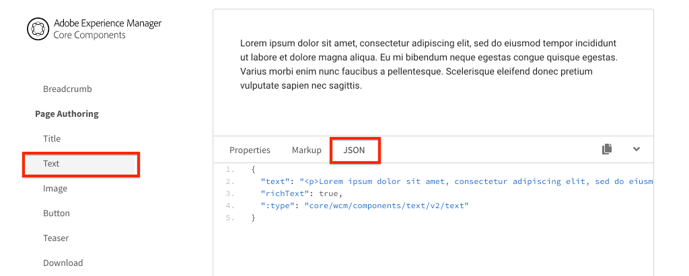

# Mappare i componenti dell’applicazione a pagina singola ai componenti di AEM {#map-components}

{{spa-editor-deprecation}}

Scopri come mappare i componenti di Angular ai componenti di Adobe Experience Manager (AEM) con AEM SPA Editor JS SDK. La mappatura dei componenti consente agli utenti di apportare aggiornamenti dinamici ai componenti delle applicazioni a pagina singola nell’Editor delle applicazioni a pagina singola di AEM, in modo simile all’authoring tradizionale AEM.

Questo capitolo approfondisce l’analisi dell’API del modello JSON AEM e di come il contenuto JSON esposto da un componente AEM può essere inserito automaticamente in un componente Angular come proprietà.

## Obiettivo

1. Scopri come mappare i componenti di AEM ai componenti SPA.
2. Comprendere la differenza tra i componenti **Container** e i componenti **Content**.
3. Crea un nuovo componente Angular mappato su un componente AEM esistente.

## Cosa verrà creato

Questo capitolo esaminerà come il componente SPA `Text` fornito è mappato al componente `Text` di AEM. Viene creato un nuovo componente `Image` per applicazioni a pagina singola che può essere utilizzato nell&#39;applicazione a pagina singola e creato in AEM. Le funzionalità predefinite dei criteri **Contenitore di layout** e **Editor modelli** verranno utilizzate anche per creare una visualizzazione con un aspetto leggermente più variabile.


## Prerequisiti

Esaminare gli strumenti e le istruzioni necessari per configurare un [ambiente di sviluppo locale](overview.md#local-dev-environment).

### Ottieni il codice

1. Scarica il punto di partenza per questa esercitazione tramite Git:

   ```shell
   $ git clone git@github.com:adobe/aem-guides-wknd-spa.git
   $ cd aem-guides-wknd-spa
   $ git checkout Angular/map-components-start
   ```

2. Implementa la base di codice in un’istanza AEM locale utilizzando Maven:

   ```shell
   $ mvn clean install -PautoInstallSinglePackage
   ```

   Se utilizzi [AEM 6.x](overview.md#compatibility), aggiungi il profilo `classic`:

   ```shell
   $ mvn clean install -PautoInstallSinglePackage -Pclassic
   ```

Puoi sempre visualizzare il codice finito su [GitHub](https://github.com/adobe/aem-guides-wknd-spa/tree/Angular/map-components-solution) o estrarre il codice localmente passando al ramo `Angular/map-components-solution`.

## Approccio di mappatura

Il concetto di base è quello di mappare un componente SPA a un componente AEM. I componenti AEM, esegui lato server, esportano contenuti come parte dell’API del modello JSON. Il contenuto JSON viene utilizzato dall’applicazione a pagina singola, che esegue sul lato client nel browser. Viene creata una mappatura 1:1 tra i componenti SPA e un componente AEM.


*Panoramica di alto livello sulla mappatura di un componente AEM a un componente Angular*

## Controllare il componente Testo

L&#39;[Archetipo progetto AEM](https://github.com/adobe/aem-project-archetype) fornisce un componente `Text` mappato al [Componente testo](https://experienceleague.adobe.com/docs/experience-manager-core-components/using/components/text.html) di AEM. Questo è un esempio di un componente **content**, in quanto esegue il rendering di *content* da AEM.

Vediamo come funziona il componente.

### Verifica il modello JSON

1. Prima di passare al codice SPA, è importante comprendere il modello JSON fornito da AEM. Passa alla [libreria dei componenti core](https://www.aemcomponents.dev/content/core-components-examples/library/core-content/text.html) e visualizza la pagina per il componente Testo. La libreria dei componenti core fornisce esempi di tutti i componenti core di AEM.
2. Selezionare la scheda **JSON** per uno degli esempi:

   

   Dovrebbero essere visualizzate tre proprietà: `text`, `richText` e `:type`.

   `:type` è una proprietà riservata che elenca `sling:resourceType` (o percorso) del componente AEM. Il valore di `:type` è ciò che viene utilizzato per mappare il componente AEM al componente SPA.

   `text` e `richText` sono proprietà aggiuntive esposte al componente SPA.

### Controllare il componente Testo

1. Aprire un nuovo terminale e passare alla cartella `ui.frontend` all&#39;interno del progetto. Eseguire `npm install` e quindi `npm start` per avviare il **server di sviluppo Webpack**:

   ```shell
   $ cd ui.frontend
   $ npm run start:mock
   ```

   Il modulo `ui.frontend` è attualmente configurato per utilizzare il [modello JSON fittizio](./integrate-spa.md#mock-json).

2. Dovresti visualizzare una nuova finestra del browser aperta per [http://localhost:4200/content/wknd-spa-angular/us/en/home.html](http://localhost:4200/content/wknd-spa-angular/us/en/home.html)

   

3. Nell’IDE che preferisci, apri il progetto AEM per l’applicazione a pagina singola WKND. Espandere il modulo `ui.frontend` e aprire il file **text.component.ts** in `ui.frontend/src/app/components/text/text.component.ts`:

   

4. La prima area da ispezionare è `class TextComponent` a ~riga 35:

   ```js
   export class TextComponent {
       @Input() richText: boolean;
       @Input() text: string;
       @Input() itemName: string;
   
       @HostBinding('innerHtml') get content() {
           return this.richText
           ? this.sanitizer.bypassSecurityTrustHtml(this.text)
           : this.text;
       }
       @HostBinding('attr.data-rte-editelement') editAttribute = true;
   
       constructor(private sanitizer: DomSanitizer) {}
   }
   ```

   [@Input()](https://angular.io/api/core/Input) decorator viene utilizzato per dichiarare i campi i cui valori sono impostati tramite l&#39;oggetto JSON mappato, rivisto in precedenza.

   `@HostBinding('innerHtml') get content()` è un metodo che espone il contenuto del testo creato dal valore di `this.text`. Nel caso in cui il contenuto sia in formato Rich Text (determinato dal flag `this.richText`), la sicurezza integrata di Angular viene ignorata. [DomSanitizer](https://angular.io/api/platform-browser/DomSanitizer) di Angular viene utilizzato per &quot;scorrere&quot; il HTML non elaborato e impedire vulnerabilità cross-site scripting. Il metodo è associato alla proprietà `innerHtml` utilizzando il decoratore [@HostBinding](https://angular.io/api/core/HostBinding).

5. Ispeziona `TextEditConfig` alla riga 24:

   ```js
   const TextEditConfig = {
       emptyLabel: 'Text',
       isEmpty: cqModel =>
           !cqModel || !cqModel.text || cqModel.text.trim().length < 1
   };
   ```

   Il codice di cui sopra è responsabile di determinare quando eseguire il rendering del segnaposto nell’ambiente di authoring di AEM. Se il metodo `isEmpty` restituisce **true**, viene eseguito il rendering del segnaposto.

6. Infine, dare un&#39;occhiata alla chiamata `MapTo` a ~riga 53:

   ```js
   MapTo('wknd-spa-angular/components/text')(TextComponent, TextEditConfig );
   ```

   **MapTo** è fornito da AEM SPA Editor JS SDK (`@adobe/cq-angular-editable-components`). Il percorso `wknd-spa-angular/components/text` rappresenta `sling:resourceType` del componente AEM. Questo percorso viene confrontato con `:type` esposto dal modello JSON osservato in precedenza. **MapTo** analizza la risposta del modello JSON e trasmette i valori corretti alle variabili `@Input()` del componente SPA.

   La definizione del componente AEM `Text` è disponibile in `ui.apps/src/main/content/jcr_root/apps/wknd-spa-angular/components/text`.

7. Prova a modificare il file **en.model.json** in `ui.frontend/src/mocks/json/en.model.json`.

   Alla ~riga 62 aggiornare il primo valore `Text` per utilizzare un tag **`H1`** e **`u`**:

   ```json
       "text": {
           "text": "<h1><u>Hello World!</u></h1>",
           "richText": true,
           ":type": "wknd-spa-angular/components/text"
       }
   ```

   Torna al browser per visualizzare gli effetti gestiti dal server di sviluppo **webpack**:

   

   Prova a impostare la proprietà `richText` tra **true** / **false** per visualizzare la logica di rendering in azione.

8. Esaminare **text.component.html** in `ui.frontend/src/app/components/text/text.component.html`.

   Questo file è vuoto perché l&#39;intero contenuto del componente è impostato dalla proprietà `innerHTML`.

9. Controlla **app.module.ts** in `ui.frontend/src/app/app.module.ts`.

   ```js
   @NgModule({
   imports: [
       BrowserModule,
       SpaAngularEditableComponentsModule,
       AppRoutingModule
   ],
   providers: [ModelManagerService, { provide: APP_BASE_HREF, useValue: '/' }],
   declarations: [AppComponent, TextComponent, PageComponent, HeaderComponent],
   entryComponents: [TextComponent, PageComponent],
   bootstrap: [AppComponent]
   })
   export class AppModule {}
   ```

   **TextComponent** non è incluso in modo esplicito, ma in modo dinamico tramite **AEMResponsiveGridComponent** fornito da AEM SPA Editor JS SDK. Pertanto deve essere elencato nell&#39;array **app.module.ts**&#39; [entryComponents](https://angular.io/guide/entry-components).

## Creare il componente Immagine

Creare quindi un componente Angular `Image` mappato al [componente immagine](https://experienceleague.adobe.com/docs/experience-manager-core-components/using/components/image.html?lang=it) di AEM. Il componente `Image` è un altro esempio di un componente **content**.

### Ispezionare JSON

Prima di passare al codice SPA, controlla il modello JSON fornito da AEM.

1. Passa a [Esempi di immagini nella libreria dei componenti core](https://www.aemcomponents.dev/content/core-components-examples/library/core-content/image.html).

   

   Le proprietà di `src`, `alt` e `title` sono utilizzate per popolare il componente SPA `Image`.

   >[!NOTE]
   >
   > Sono esposte altre proprietà Image (`lazyEnabled`, `widths`) che consentono a uno sviluppatore di creare un componente adattivo e a caricamento lento. Il componente creato in questa esercitazione è semplice e **non** utilizza queste proprietà avanzate.

2. Torna all&#39;IDE e apri `en.model.json` alle `ui.frontend/src/mocks/json/en.model.json`. Poiché si tratta di un componente nuovo per il nostro progetto, dobbiamo &quot;simulare&quot; il JSON dell’immagine.

   Alla ~riga 70 aggiungere una voce JSON per il modello `image` (non dimenticare la virgola finale `,` dopo il secondo `text_386303036`) e aggiornare l&#39;array `:itemsOrder`.

   ```json
   ...
   ":items": {
               ...
               "text_386303036": {
                   "text": "<p>A new text component.</p>\r\n",
                   "richText": true,
                   ":type": "wknd-spa-angular/components/text"
                   },
               "image": {
                   "alt": "Rock Climber in New Zealand",
                   "title": "Rock Climber in New Zealand",
                   "src": "/mocks/images/adobestock-140634652.jpeg",
                   ":type": "wknd-spa-angular/components/image"
               }
           },
           ":itemsOrder": [
               "text",
               "text_386303036",
               "image"
           ],
   ```

   Il progetto include un&#39;immagine di esempio in `/mock-content/adobestock-140634652.jpeg` utilizzata con il server di sviluppo **Webpack**.

   Puoi visualizzare il [en.model.json completo qui](https://github.com/adobe/aem-guides-wknd-spa/blob/Angular/map-components-solution/ui.frontend/src/mocks/json/en.model.json).

3. Aggiungete una foto d&#39;archivio che verrà visualizzata dal componente.

   Crea una nuova cartella denominata **images** sotto `ui.frontend/src/mocks`. Scarica [adobestock-140634652.jpeg](assets/map-components/adobestock-140634652.jpeg) e inseriscilo nella cartella **images** appena creata. Se lo desideri, puoi usare la tua immagine personale.

### Implementare il componente Immagine

1. Arrestare il server di sviluppo **webpack** se avviato.
2. Creare un nuovo componente Immagine eseguendo il comando Angular CLI `ng generate component` dalla cartella `ui.frontend`:

   ```shell
   $ ng generate component components/image
   ```

3. Nell&#39;IDE, apri **image.component.ts** in `ui.frontend/src/app/components/image/image.component.ts` e aggiorna come segue:

   ```js
   import {Component, Input, OnInit} from '@angular/core';
   import {MapTo} from '@adobe/cq-angular-editable-components';
   
   const ImageEditConfig = {
   emptyLabel: 'Image',
   isEmpty: cqModel =>
       !cqModel || !cqModel.src || cqModel.src.trim().length < 1
   };
   
   @Component({
   selector: 'app-image',
   templateUrl: './image.component.html',
   styleUrls: ['./image.component.scss']
   })
   export class ImageComponent implements OnInit {
   
   @Input() src: string;
   @Input() alt: string;
   @Input() title: string;
   
   constructor() { }
   
   get hasImage() {
       return this.src && this.src.trim().length > 0;
   }
   
   ngOnInit() { }
   }
   
   MapTo('wknd-spa-angular/components/image')(ImageComponent, ImageEditConfig);
   ```

   `ImageEditConfig` è la configurazione per determinare se eseguire il rendering del segnaposto autore in AEM, in base al popolamento della proprietà `src`.

   `@Input()` di `src`, `alt` e `title` sono le proprietà mappate dall&#39;API JSON.

   `hasImage()` è un metodo che determinerà se l&#39;immagine deve essere sottoposta a rendering.

   `MapTo` associa il componente SPA al componente AEM situato in `ui.apps/src/main/content/jcr_root/apps/wknd-spa-angular/components/image`.

4. Apri **image.component.html** e aggiornalo come segue:

   ```html
   <ng-container *ngIf="hasImage">
       
   </ng-container>
   ```

   L&#39;elemento `` verrà eseguito se `hasImage` restituisce **true**.

5. Apri **image.component.scss** e aggiornalo come segue:

   ```scss
   :host-context {
       display: block;
   }
   
   .image {
       margin: 1rem 0;
       width: 100%;
       border: 0;
   }
   ```

   >[!NOTE]
   >
   > La regola `:host-context` è **critica** perché il segnaposto dell&#39;editor SPA di AEM funzioni correttamente. Questa regola è necessaria almeno per tutti i componenti SPA destinati a essere creati nell’editor di pagine di AEM.

6. Apri `app.module.ts` e aggiungi `ImageComponent` all&#39;array `entryComponents`:

   ```js
   entryComponents: [TextComponent, PageComponent, ImageComponent],
   ```

   Come `TextComponent`, `ImageComponent` è caricato in modo dinamico e deve essere incluso nell&#39;array `entryComponents`.

7. Avvia il server di sviluppo **webpack** per visualizzare il rendering `ImageComponent`.

   ```shell
   $ npm run start:mock
   ```

   

   *Immagine aggiunta all&#39;applicazione a pagina singola*

   >[!NOTE]
   >
   > **Richiesta bonus**: implementa un nuovo metodo per visualizzare il valore di `title` come didascalia sotto l&#39;immagine.

## Aggiornare i criteri in AEM

Il componente `ImageComponent` è visibile solo nel server di sviluppo **webpack**. Quindi, distribuisci l’applicazione a pagina singola aggiornata in AEM e aggiorna i criteri dei modelli.

1. Arresta il **server di sviluppo Webpack** e dalla **radice** del progetto, distribuisci le modifiche in AEM utilizzando le abilità Maven:

   ```shell
   $ cd aem-guides-wknd-spa
   $ mvn clean install -PautoInstallSinglePackage
   ```

2. Dalla schermata iniziale di AEM, passa a **[!UICONTROL Strumenti]** > **[!UICONTROL Modelli]** > **[Angular SPA WKND](http://localhost:4502/libs/wcm/core/content/sites/templates.html/conf/wknd-spa-angular)**.

   Seleziona e modifica la **pagina SPA**:

   

3. Seleziona il **Contenitore di layout** e fai clic sulla relativa icona **criterio** per modificare il criterio:

   

4. In **Componenti consentiti** > **Angular SPA WKND - Contenuto** > controlla il componente **Immagine**:

   

   In **Componenti predefiniti** > **Aggiungi mappatura** e scegli il componente **Immagine - Angular SPA WKND - Contenuto**:

   

   Immetti un tipo **mime** di `image/*`.

   Fai clic su **Fine** per salvare gli aggiornamenti dei criteri.

5. Nel **Contenitore di layout** fare clic sull&#39;icona **criterio** per il componente **Testo**:

   

   Crea un nuovo criterio denominato **Testo SPA WKND**. In **Plug-in** > **Formattazione** > seleziona tutte le caselle per abilitare opzioni di formattazione aggiuntive:

   

   In **Plug-in** > **Stili di paragrafo** > seleziona la casella per **Abilitare gli stili di paragrafo**:

   

   Fai clic su **Fine** per salvare l&#39;aggiornamento dei criteri.

6. Passa alla **home page** [http://localhost:4502/editor.html/content/wknd-spa-angular/us/en/home.html](http://localhost:4502/editor.html/content/wknd-spa-angular/us/en/home.html).

   Dovresti anche poter modificare il componente `Text` e aggiungere altri stili di paragrafo in modalità **schermo intero**.

   

7. Dovresti anche essere in grado di trascinare e rilasciare un&#39;immagine da **Asset Finder**:

   

8. Aggiungi le tue immagini tramite [AEM Assets](http://localhost:4502/assets.html/content/dam) o installa la base di codice completata per il [sito di riferimento WKND standard](https://github.com/adobe/aem-guides-wknd/releases/latest). Il [sito di riferimento WKND](https://github.com/adobe/aem-guides-wknd/releases/latest) include molte immagini che possono essere riutilizzate nell&#39;applicazione a pagina singola WKND. È possibile installare il pacchetto utilizzando [Gestione pacchetti di AEM](http://localhost:4502/crx/packmgr/index.jsp).

   

## Ispezionare il contenitore di layout

Il supporto per **Contenitore di layout** viene fornito automaticamente da AEM SPA Editor SDK. Il **contenitore di layout**, come indicato dal nome, è un componente **contenitore**. I componenti contenitore sono componenti che accettano strutture JSON che rappresentano *altri* componenti e ne creano un&#39;istanza dinamica.

Esaminiamo ulteriormente il Contenitore di layout.

1. Nell&#39;IDE, apri **responsive-grid.component.ts** alle `ui.frontend/src/app/components/responsive-grid`:

   ```js
   import { AEMResponsiveGridComponent,MapTo } from '@adobe/cq-angular-editable-components';
   
   MapTo('wcm/foundation/components/responsivegrid')(AEMResponsiveGridComponent);
   ```

   `AEMResponsiveGridComponent` è implementato come parte del SDK dell&#39;Editor SPA di AEM ed è incluso nel progetto tramite `import-components`.

2. In un browser passa a [http://localhost:4502/content/wknd-spa-angular/us/en.model.json](http://localhost:4502/content/wknd-spa-angular/us/en.model.json)

   

   Il componente **Contenitore di layout** ha `sling:resourceType` di `wcm/foundation/components/responsivegrid` ed è riconosciuto dall&#39;editor SPA tramite la proprietà `:type`, proprio come i componenti `Text` e `Image`.

   Le stesse funzionalità di ridimensionamento di un componente mediante la [modalità Layout](https://experienceleague.adobe.com/docs/experience-manager-65/authoring/siteandpage/responsive-layout.html#defining-layouts-layout-mode) sono disponibili con l&#39;editor SPA.

3. Torna a [http://localhost:4502/editor.html/content/wknd-spa-angular/us/en/home.html](http://localhost:4502/editor.html/content/wknd-spa-angular/us/en/home.html). Aggiungi altri componenti **Immagine** e prova a ridimensionarli utilizzando l&#39;opzione **Layout**:

   

4. Riapri il modello JSON [http://localhost:4502/content/wknd-spa-angular/us/en.model.json](http://localhost:4502/content/wknd-spa-angular/us/en.model.json) e osserva `columnClassNames` come parte del JSON:

   

   Il nome di classe `aem-GridColumn--default--4` indica che il componente deve avere una larghezza di 4 colonne in base a una griglia a 12 colonne. Ulteriori dettagli sulla [griglia reattiva sono disponibili qui](https://adobe-marketing-cloud.github.io/aem-responsivegrid/).

5. Tornare all&#39;IDE e nel modulo `ui.apps` è presente una libreria lato client definita in `ui.apps/src/main/content/jcr_root/apps/wknd-spa-angular/clientlibs/clientlib-grid`. Aprire il file `less/grid.less`.

   Questo file determina i punti di interruzione (`default`, `tablet` e `phone`) utilizzati dal **Contenitore di layout**. Questo file è stato progettato per essere personalizzato in base alle specifiche del progetto. Attualmente i punti di interruzione sono impostati su `1200px` e `650px`.

6. Dovresti essere in grado di utilizzare le funzionalità reattive e i criteri Rich Text aggiornati del componente `Text` per creare una visualizzazione simile alla seguente:

   

## Congratulazioni. {#congratulations}

Congratulazioni, hai imparato a mappare i componenti SPA ai componenti AEM e hai implementato un nuovo componente `Image`. Hai anche la possibilità di esplorare le funzionalità reattive del **Contenitore di layout**.

Puoi sempre visualizzare il codice finito su [GitHub](https://github.com/adobe/aem-guides-wknd-spa/tree/Angular/map-components-solution) o estrarre il codice localmente passando al ramo `Angular/map-components-solution`.

### Passaggi successivi {#next-steps}

[Navigazione e indirizzamento](navigation-routing.md) - Scopri come è possibile supportare più visualizzazioni nell&#39;applicazione a pagina singola effettuando il mapping alle pagine di AEM con l&#39;editor di applicazioni a pagina singola SDK. La navigazione dinamica viene implementata utilizzando Angular Router e aggiunta a un componente Intestazione esistente.

## Bonus: mantenere le configurazioni per il controllo del codice sorgente {#bonus}

In molti casi, soprattutto all’inizio di un progetto AEM, è utile mantenere le configurazioni, come i modelli e i criteri dei contenuti correlati, nel controllo del codice sorgente. In questo modo tutti gli sviluppatori lavorano sullo stesso set di contenuti e configurazioni e possono garantire ulteriore coerenza tra gli ambienti. Quando un progetto raggiunge un certo livello di maturità, la pratica di gestione dei modelli può essere affidata a uno speciale gruppo di utenti esperti.

I passaggi successivi verranno eseguiti utilizzando l&#39;IDE del codice di Visual Studio e [VSCode AEM Sync](https://marketplace.visualstudio.com/items?itemName=yamato-ltd.vscode-aem-sync), ma potrebbero essere eseguiti utilizzando qualsiasi strumento e IDE configurato per **richiamare** o **importare** contenuto da un&#39;istanza locale di AEM.

1. Nell&#39;IDE di Visual Studio Code verificare che sia installato **VSCode AEM Sync** tramite l&#39;estensione Marketplace:

   

2. Espandi il modulo **ui.content** in Esplora progetti e passa a `/conf/wknd-spa-angular/settings/wcm/templates`.

3. **Fare clic con il pulsante destro del mouse** sulla cartella `templates` e selezionare **Importa da AEM Server**:

   

4. Ripeti i passaggi per importare il contenuto, ma seleziona la cartella **criteri** che si trova in `/conf/wknd-spa-angular/settings/wcm/policies`.

5. Controllare il file `filter.xml` che si trova in `ui.content/src/main/content/META-INF/vault/filter.xml`.

   ```xml
   <!--ui.content filter.xml-->
   <?xml version="1.0" encoding="UTF-8"?>
    <workspaceFilter version="1.0">
        <filter root="/conf/wknd-spa-angular" mode="merge"/>
        <filter root="/content/wknd-spa-angular" mode="merge"/>
        <filter root="/content/dam/wknd-spa-angular" mode="merge"/>
        <filter root="/content/experience-fragments/wknd-spa-angular" mode="merge"/>
    </workspaceFilter>
   ```

   Il file `filter.xml` è responsabile dell&#39;identificazione dei percorsi dei nodi installati con il pacchetto. Osserva `mode="merge"` su ciascuno dei filtri che indica che il contenuto esistente non verrà modificato, ma che verrà aggiunto solo il nuovo contenuto. Poiché gli autori di contenuto potrebbero aggiornare questi percorsi, è importante che una distribuzione del codice **non** sovrascriva il contenuto. Per ulteriori informazioni sull&#39;utilizzo degli elementi del filtro, vedere la [documentazione di FileVault](https://jackrabbit.apache.org/filevault/filter.html).

   Confrontare `ui.content/src/main/content/META-INF/vault/filter.xml` e `ui.apps/src/main/content/META-INF/vault/filter.xml` per comprendere i diversi nodi gestiti da ciascun modulo.
