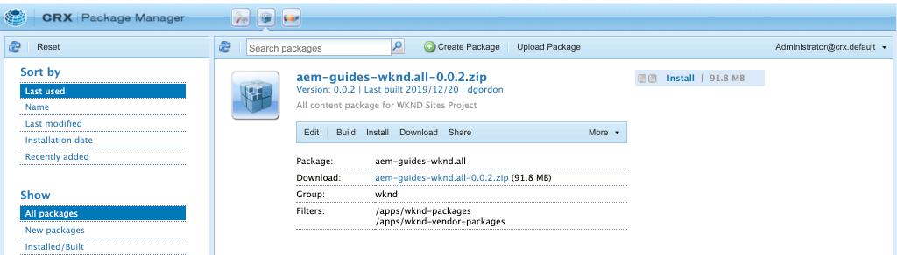
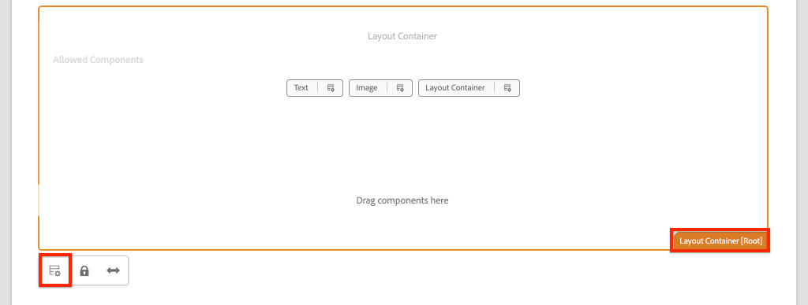
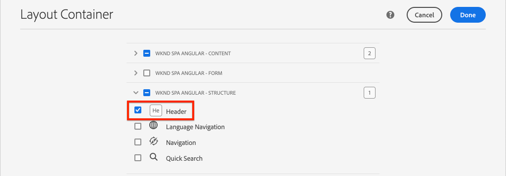
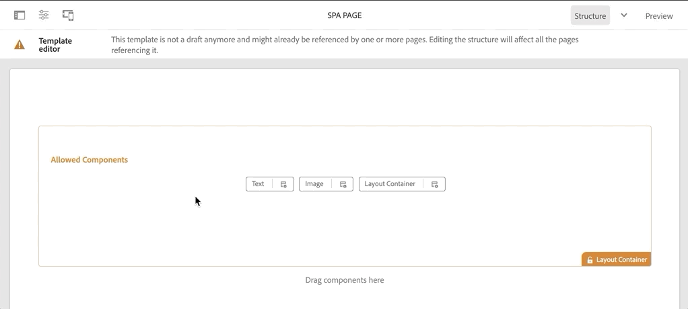
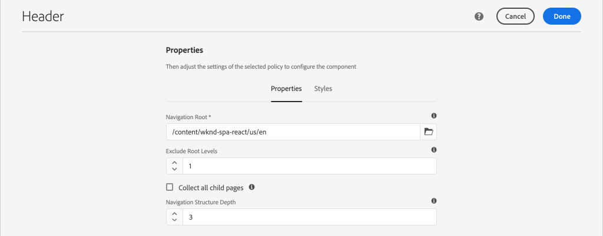
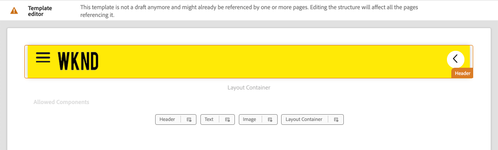
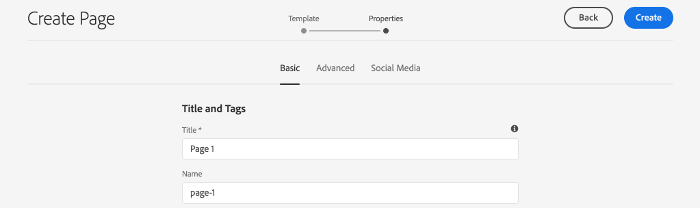
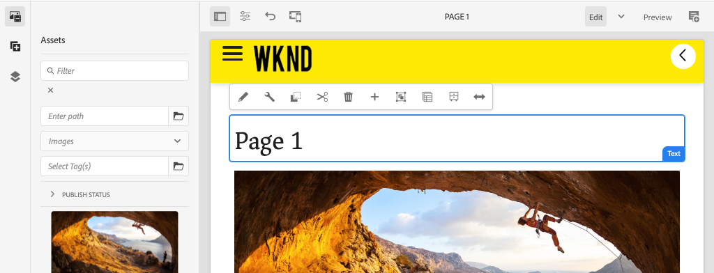
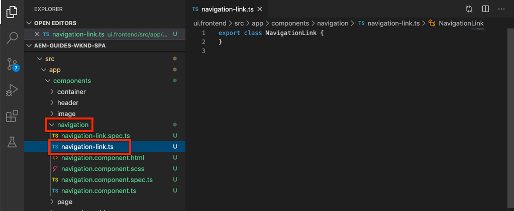
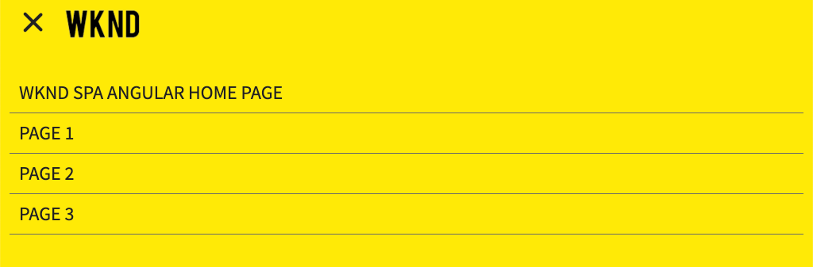

# Add navigation and routing {#navigation-routing}

{{spa-editor-deprecation}}

Learn how multiple views in the SPA are supported using AEM Pages and the SPA Editor SDK. Dynamic navigation is implemented using Angular routes and added to an existing Header component.

## Obiettivo

1. Understand the SPA model routing options available when using the SPA Editor.
2. Learn to use [Angular routing](https://angular.io/guide/router) to navigate between different views of the SPA.
3. Implement a dynamic navigation that is driven by the AEM page hierarchy.

## Cosa verrà creato

This chapter adds a navigation menu to an existing `Header` component. The navigation menu is driven by the AEM page hierarchy and uses the JSON model provided by the [Navigation Core Component](https://experienceleague.adobe.com/docs/experience-manager-core-components/using/components/navigation.html).


## Prerequisiti

Rivedi gli strumenti e le istruzioni necessari per configurare un [ambiente di sviluppo locale](overview.md#local-dev-environment).

### Ottieni il codice

1. Scarica il punto di partenza per questa esercitazione tramite Git:

   ```shell
   $ git clone git@github.com:adobe/aem-guides-wknd-spa.git
   $ cd aem-guides-wknd-spa
   $ git checkout Angular/navigation-routing-start
   ```

2. Implementa la base di codice in un’istanza AEM locale utilizzando Maven:

   ```shell
   $ mvn clean install -PautoInstallSinglePackage
   ```

   Se utilizzi [AEM 6.x](overview.md#compatibility), aggiungi il profilo `classic`:

   ```shell
   $ mvn clean install -PautoInstallSinglePackage -Pclassic
   ```

3. Installa il pacchetto finito per il [sito di riferimento WKND tradizionale](https://github.com/adobe/aem-guides-wknd/releases/latest). The images provided by [WKND reference site](https://github.com/adobe/aem-guides-wknd/releases/latest) are re-used on the WKND SPA. È possibile installare il pacchetto utilizzando [Gestione pacchetti di AEM](http://localhost:4502/crx/packmgr/index.jsp).

   

You can always view the finished code on [GitHub](https://github.com/adobe/aem-guides-wknd-spa/tree/Angular/navigation-routing-solution) or check the code out locally by switching to the branch `Angular/navigation-routing-solution`.

## Inspect HeaderComponent updates {#inspect-header}

In previous chapters, the `HeaderComponent` component was added as a pure Angular component included via `app.component.html`. In this chapter, the `HeaderComponent` component is removed from the app and is added via the [Template Editor](https://experienceleague.adobe.com/docs/experience-manager-learn/sites/page-authoring/template-editor-feature-video-use.html?lang=it). This allows users to configure the navigation menu of the `HeaderComponent` from within AEM.

>[!NOTE]
>
> Several CSS and JavaScript updates have already been made to the code base to start this chapter. To focus on core concepts, not **all** of the code changes are discussed. You can view the full changes [here](https://github.com/adobe/aem-guides-wknd-spa/compare/Angular/map-components-solution...Angular/navigation-routing-start).

1. In the IDE of your choice open the SPA starter project for this chapter.
2. Beneath the `ui.frontend` module inspect the file `header.component.ts` at: `ui.frontend/src/app/components/header/header.component.ts`.

   Several updates have been made, including the addition of a `HeaderEditConfig` and a `MapTo` to enable the component to be mapped to an AEM component `wknd-spa-angular/components/header`.

   ```js
   /* header.component.ts */
   ...
   const HeaderEditConfig = {
       ...
   };
   
   @Component({
   selector: 'app-header',
   templateUrl: './header.component.html',
   styleUrls: ['./header.component.scss']
   })
   export class HeaderComponent implements OnInit {
   @Input() items: object[];
       ...
   }
   ...
   MapTo('wknd-spa-angular/components/header')(withRouter(Header), HeaderEditConfig);
   ```

   Note the `@Input()` annotation for `items`. `items` will contain an array of navigation objects passed in from AEM.

3. In the `ui.apps` module inspect the component definition of the AEM `Header` component: `ui.apps/src/main/content/jcr_root/apps/wknd-spa-angular/components/header/.content.xml`:

   ```xml
   <?xml version="1.0" encoding="UTF-8"?>
   <jcr:root xmlns:sling="http://sling.apache.org/jcr/sling/1.0" xmlns:cq="http://www.day.com/jcr/cq/1.0"
       xmlns:jcr="http://www.jcp.org/jcr/1.0"
       jcr:primaryType="cq:Component"
       jcr:title="Header"
       sling:resourceSuperType="wknd-spa-angular/components/navigation"
       componentGroup="WKND SPA Angular - Structure"/>
   ```

   The AEM `Header` component will inherit all of the functionality of the [Navigation Core Component](https://experienceleague.adobe.com/docs/experience-manager-core-components/using/components/navigation.html) via the `sling:resourceSuperType` property.

## Add the HeaderComponent to the SPA template {#add-header-template}

1. Open a browser and login to AEM, [http://localhost:4502/](http://localhost:4502/). The starting code base should already be deployed.
2. Navigate to the **[!UICONTROL SPA Page Template]**: [http://localhost:4502/editor.html/conf/wknd-spa-angular/settings/wcm/templates/spa-page-template/structure.html](http://localhost:4502/editor.html/conf/wknd-spa-angular/settings/wcm/templates/spa-page-template/structure.html).
3. Select the outer-most **[!UICONTROL Root Layout Container]** and click its **[!UICONTROL Policy]** icon. Be careful **not** to select the **[!UICONTROL Layout Container]** un-locked for authoring.

   

4. Copy the current policy and create a new policy named **[!UICONTROL SPA Structure]**:

   

   Under **[!UICONTROL Allowed Components]** > **[!UICONTROL General]** > select the **[!UICONTROL Layout Container]** component.

   Under **[!UICONTROL Allowed Components]** > **[!UICONTROL WKND SPA ANGULAR - STRUCTURE]** > select the **[!UICONTROL Header]** component:

   

   Under **[!UICONTROL Allowed Components]** > **[!UICONTROL WKND SPA ANGULAR - Content]** > select the **[!UICONTROL Image]** and **[!UICONTROL Text]** components. You should have 4 total components selected.

   Per salvare le modifiche, fai clic su **[!UICONTROL Completati]**.

5. **Refresh** the page. Add the **[!UICONTROL Header]** component above the un-locked **[!UICONTROL Layout Container]**:

   

6. Select the **[!UICONTROL Header]** component and click its **Policy** icon to edit the policy.

   

7. Create a new policy with a **[!UICONTROL Policy Title]** of **&quot;WKND SPA Header&quot;**.

   Under the **[!UICONTROL Properties]**:

   * Set the **[!UICONTROL Navigation Root]** to `/content/wknd-spa-angular/us/en`.
   * Imposta **[!UICONTROL Escludi livelli principali]** su **1**.
   * Uncheck **[!UICONTROL Collect al child pages]**.
   * Imposta la **[!UICONTROL profondità della struttura di navigazione]** su **3**.

   

   This will collect the navigation 2 levels deep beneath `/content/wknd-spa-angular/us/en`.

8. After saving your changes you should see the populated `Header` as part of the template:

   

## Create child pages

Next, create additional pages in AEM that will serve as the different views in the SPA. We will also inspect the hierarchical structure of the JSON model provided by AEM.

1. Navigate to the **Sites** console: [http://localhost:4502/sites.html/content/wknd-spa-angular/us/en/home](http://localhost:4502/sites.html/content/wknd-spa-angular/us/en/home). Select the **WKND SPA Angular Home Page** and click **[!UICONTROL Create]** > **[!UICONTROL Page]**:

   

2. Under **[!UICONTROL Template]** select **[!UICONTROL SPA Page]**. Under **[!UICONTROL Properties]** enter **&quot;Page 1&quot;** for the **[!UICONTROL Title]** and **&quot;page-1&quot;** as the name.

   

   Click **[!UICONTROL Create]** and in the dialog pop-up, click **[!UICONTROL Open]** to open the page in the AEM SPA Editor.

3. Add a new **[!UICONTROL Text]** component to the main **[!UICONTROL Layout Container]**. Edit the component and enter the text: **&quot;Page 1&quot;** using the RTE and the **H1** element (you will have to enter full-screen mode to change the paragraph elements)

   

   Feel free to add additional content, like an image.

4. Return to the AEM Sites console and repeat the above steps, creating a second page named **&quot;Page 2&quot;** as a sibling of **Page 1**. Add content to **Page 2** so that it is easily identified.
5. Lastly create a third page, **&quot;Page 3&quot;** but as a **child** of **Page 2**. Once completed the site hierarchy should look like the following:

   

6. In a new tab, open the JSON model API provided by AEM: [http://localhost:4502/content/wknd-spa-angular/us/en.model.json](http://localhost:4502/content/wknd-spa-angular/us/en.model.json). This JSON content is requested when the SPA is first loaded. The outer structure looks like the following:

   ```json
   {
   "language": "en",
   "title": "en",
   "templateName": "spa-app-template",
   "designPath": "/libs/settings/wcm/designs/default",
   "cssClassNames": "spa page basicpage",
   ":type": "wknd-spa-angular/components/spa",
   ":items": {},
   ":itemsOrder": [],
   ":hierarchyType": "page",
   ":path": "/content/wknd-spa-angular/us/en",
   ":children": {
       "/content/wknd-spa-angular/us/en/home": {},
       "/content/wknd-spa-angular/us/en/home/page-1": {},
       "/content/wknd-spa-angular/us/en/home/page-2": {},
       "/content/wknd-spa-angular/us/en/home/page-2/page-3": {}
       }
   }
   ```

   Under `:children` you should see an entry for each of the pages created. The content for all of the pages is in this initial JSON request. Once, the navigation routing is implemented, subsequent views of the SPA is loaded rapidly, since the content is already available client-side.

   It is not wise to load **ALL** of the content of a SPA in the initial JSON request, as this would slow down the initial page load. Next, lets look at how the heirarchy depth of pages are collected.

7. Navigate to the **SPA Root** template at: [http://localhost:4502/editor.html/conf/wknd-spa-angular/settings/wcm/templates/spa-app-template/structure.html](http://localhost:4502/editor.html/conf/wknd-spa-angular/settings/wcm/templates/spa-app-template/structure.html).

   Click the **[!UICONTROL Page properties menu]** > **[!UICONTROL Page Policy]**:

   

8. The **SPA Root** template has an extra **[!UICONTROL Hierarchical Structure]** tab to control the JSON content collected. The **[!UICONTROL Structure Depth]** determines how deep in the site hierarchy to collect child pages beneath the **root**. You can also use the **[!UICONTROL Structure Patterns]** field to filter out additional pages based on a regular expression.

   Update the **[!UICONTROL Structure Depth]** to **&quot;2&quot;**:

   

   Click **[!UICONTROL Done]** to save the changes to the policy.

9. Re-open the JSON model [http://localhost:4502/content/wknd-spa-angular/us/en.model.json](http://localhost:4502/content/wknd-spa-angular/us/en.model.json).

   ```json
   {
   "language": "en",
   "title": "en",
   "templateName": "spa-app-template",
   "designPath": "/libs/settings/wcm/designs/default",
   "cssClassNames": "spa page basicpage",
   ":type": "wknd-spa-angular/components/spa",
   ":items": {},
   ":itemsOrder": [],
   ":hierarchyType": "page",
   ":path": "/content/wknd-spa-angular/us/en",
   ":children": {
       "/content/wknd-spa-angular/us/en/home": {},
       "/content/wknd-spa-angular/us/en/home/page-1": {},
       "/content/wknd-spa-angular/us/en/home/page-2": {}
       }
   }
   ```

   Notice that the **Page 3** path has been removed: `/content/wknd-spa-angular/us/en/home/page-2/page-3` from the initial JSON model.

   Later, we will observe how the AEM SPA Editor SDK can dynamically load additional content.

## Implement the navigation

Next, implement the navigation menu with a new `NavigationComponent`. We could add the code directly in `header.component.html` but a better practice is to avoid large components. Instead, implement a `NavigationComponent` that could potentially be re-used later.

1. Review the JSON exposed by the AEM `Header` component at [http://localhost:4502/content/wknd-spa-angular/us/en.model.json](http://localhost:4502/content/wknd-spa-angular/us/en.model.json):

   ```json
   ...
   "header": {
       "items": [
       {
       "level": 0,
       "active": true,
       "path": "/content/wknd-spa-angular/us/en/home",
       "description": null,
       "url": "/content/wknd-spa-angular/us/en/home.html",
       "lastModified": 1589062597083,
       "title": "WKND SPA Angular Home Page",
       "children": [
               {
               "children": [],
               "level": 1,
               "active": false,
               "path": "/content/wknd-spa-angular/us/en/home/page-1",
               "description": null,
               "url": "/content/wknd-spa-angular/us/en/home/page-1.html",
               "lastModified": 1589429385100,
               "title": "Page 1"
               },
               {
               "level": 1,
               "active": true,
               "path": "/content/wknd-spa-angular/us/en/home/page-2",
               "description": null,
               "url": "/content/wknd-spa-angular/us/en/home/page-2.html",
               "lastModified": 1589429603507,
               "title": "Page 2",
               "children": [
                   {
                   "children": [],
                   "level": 2,
                   "active": false,
                   "path": "/content/wknd-spa-angular/us/en/home/page-2/page-3",
                   "description": null,
                   "url": "/content/wknd-spa-angular/us/en/home/page-2/page-3.html",
                   "lastModified": 1589430413831,
                   "title": "Page 3"
                   }
               ],
               }
           ]
           }
       ],
   ":type": "wknd-spa-angular/components/header"
   ```

   The hierarchical nature of the AEM pages are modeled in the JSON that can be used to populate a navigation menu. Recall that the `Header` component inherits all of the functionality of the [Navigation Core Component](https://www.aemcomponents.dev/content/core-components-examples/library/core-structure/navigation.html) and the content exposed through the JSON is automatically mapped to the Angular `@Input` annotation.

2. Open a new terminal window and navigate to the `ui.frontend` folder of the SPA project. Create a new `NavigationComponent` using the Angular CLI tool:

   ```shell
   $ cd ui.frontend
   $ ng generate component components/navigation
   CREATE src/app/components/navigation/navigation.component.scss (0 bytes)
   CREATE src/app/components/navigation/navigation.component.html (25 bytes)
   CREATE src/app/components/navigation/navigation.component.spec.ts (656 bytes)
   CREATE src/app/components/navigation/navigation.component.ts (286 bytes)
   UPDATE src/app/app.module.ts (2032 bytes)
   ```

3. Next create a class named `NavigationLink` using the Angular CLI in the newly created `components/navigation` directory:

   ```shell
   $ cd src/app/components/navigation/
   $ ng generate class NavigationLink
   CREATE src/app/components/navigation/navigation-link.spec.ts (187 bytes)
   CREATE src/app/components/navigation/navigation-link.ts (32 bytes)
   ```

4. Return to the IDE of your choice and open the file at `navigation-link.ts` at `/src/app/components/navigation/navigation-link.ts`.

   

5. Popolare `navigation-link.ts` con quanto segue:

   ```js
   export class NavigationLink {
   
       title: string;
       path: string;
       url: string;
       level: number;
       children: NavigationLink[];
       active: boolean;
   
       constructor(data) {
           this.path = data.path;
           this.title = data.title;
           this.url = data.url;
           this.level = data.level;
           this.active = data.active;
           this.children = data.children.map( item => {
               return new NavigationLink(item);
           });
       }
   }
   ```

   This is a simple class to represent an individual navigation link. In the class constructor we expect `data` to be the JSON object passed in from AEM. This class is used within both the `NavigationComponent` and `HeaderComponent` to easily populate the navigation structure.

   No data transformation is performed, this class is primarily created to strongly type the JSON model. Notice that `this.children` is typed as `NavigationLink[]` and that the constructor recursively creates new `NavigationLink` objects for each of the items in the `children` array. Recall that JSON model for the `Header` is hierarchical.

6. Apri il file in `navigation-link.spec.ts`. This is the test file for the `NavigationLink` class. Update it with the following:

   ```js
   import { NavigationLink } from './navigation-link';
   
   describe('NavigationLink', () => {
       it('should create an instance', () => {
           const data = {
               children: [],
               level: 1,
               active: false,
               path: '/content/wknd-spa-angular/us/en/home/page-1',
               description: null,
               url: '/content/wknd-spa-angular/us/en/home/page-1.html',
               lastModified: 1589429385100,
               title: 'Page 1'
           };
           expect(new NavigationLink(data)).toBeTruthy();
       });
   });
   ```

   Notice that `const data` follows the same JSON model inspected earlier for a single link. This is far from a robust unit test, however it should suffice to test the constructor of `NavigationLink`.

7. Apri il file in `navigation.component.ts`. Update it with the following:

   ```js
   import { Component, OnInit, Input } from '@angular/core';
   import { NavigationLink } from './navigation-link';
   
   @Component({
   selector: 'app-navigation',
   templateUrl: './navigation.component.html',
   styleUrls: ['./navigation.component.scss']
   })
   export class NavigationComponent implements OnInit {
   
       @Input() items: object[];
   
       constructor() { }
   
       get navigationLinks(): NavigationLink[] {
   
           if (this.items && this.items.length > 0) {
               return this.items.map(item => {
                   return new NavigationLink(item);
               });
           }
   
           return null;
       }
   
       ngOnInit() {}
   
   }
   ```

   `NavigationComponent` expects an `object[]` named `items` that is the JSON model from AEM. Questa classe espone un singolo metodo `get navigationLinks()` che restituisce un array di `NavigationLink` oggetti.

8. Aprire il file `navigation.component.html` e aggiornarlo con quanto segue:

   ```html
   <ul *ngIf="navigationLinks && navigationLinks.length > 0" class="navigation__group">
       <ng-container *ngTemplateOutlet="recursiveListTmpl; context:{ links: navigationLinks }"></ng-container>
   </ul>
   ```

   Viene generato un `<ul>` iniziale e viene chiamato il metodo `get navigationLinks()` da `navigation.component.ts`. `<ng-container>` viene utilizzato per effettuare una chiamata a un modello denominato `recursiveListTmpl` e lo trasmette a `navigationLinks` come variabile denominata `links`.

   Aggiungi `recursiveListTmpl` dopo:

   ```html
   <ng-template #recursiveListTmpl let-links="links">
       <li *ngFor="let link of links" class="{{'navigation__item navigation__item--' + link.level}}">
           <a [routerLink]="link.url" class="navigation__item-link" [title]="link.title" [attr.aria-current]="link.active">
               {{link.title}}
           </a>
           <ul *ngIf="link.children && link.children.length > 0">
               <ng-container *ngTemplateOutlet="recursiveListTmpl; context:{ links: link.children }"></ng-container>
           </ul>
       </li>
   </ng-template>
   ```

   Qui viene implementato il resto del rendering per il collegamento di navigazione. Si noti che la variabile `link` è di tipo `NavigationLink` e che tutti i metodi/proprietà creati da tale classe sono disponibili. [`[routerLink]`](https://angular.io/api/router/RouterLink) viene utilizzato al posto del normale attributo `href`. Questo ci permette di collegarci a specifici percorsi nell’app, senza un aggiornamento a pagina intera.

   La parte ricorsiva della navigazione viene implementata anche creando un altro `<ul>` se l&#39;attuale `link` ha un array `children` non vuoto.

9. Aggiorna `navigation.component.spec.ts` per aggiungere il supporto per `RouterTestingModule`:

   ```diff
    ...
   + import { RouterTestingModule } from '@angular/router/testing';
    ...
    beforeEach(async(() => {
       TestBed.configureTestingModule({
   +   imports: [ RouterTestingModule ],
       declarations: [ NavigationComponent ]
       })
       .compileComponents();
    }));
    ...
   ```

   È necessario aggiungere `RouterTestingModule` perché il componente utilizza `[routerLink]`.

10. Aggiorna `navigation.component.scss` per aggiungere alcuni stili di base a `NavigationComponent`:

   ```scss
   @import "~src/styles/variables";
   
   $link-color: $black;
   $link-hover-color: $white;
   $link-background: $black;
   
   :host-context {
       display: block;
       width: 100%;
   }
   
   .navigation__item {
       list-style: none;
   }
   
   .navigation__item-link {
       color: $link-color;
       font-size: $font-size-large;
       text-transform: uppercase;
       padding: $gutter-padding;
       display: flex;
       border-bottom: 1px solid $gray;
   
       &:hover {
           background: $link-background;
           color: $link-hover-color;
       }
   
   }
   ```

## Aggiornare il componente intestazione

Ora che `NavigationComponent` è stato implementato, `HeaderComponent` deve essere aggiornato per farvi riferimento.

1. Aprire un terminale e passare alla cartella `ui.frontend` all&#39;interno del progetto SPA. Avvia il server di sviluppo **webpack**:

   ```shell
   $ npm start
   ```

2. Apri una scheda del browser e passa a [http://localhost:4200/](http://localhost:4200/).

   Il server di sviluppo **webpack** deve essere configurato per fungere da proxy del modello JSON da un&#39;istanza locale di AEM (`ui.frontend/proxy.conf.json`). Questo ci consentirà di eseguire il codice direttamente in base al contenuto creato in AEM dall’inizio dell’esercitazione.

   

   La funzionalità di attivazione/disattivazione menu di `HeaderComponent` è già stata implementata. Quindi, aggiungi il componente Navigazione.

3. Tornare all&#39;IDE desiderato e aprire il file `header.component.ts` in `ui.frontend/src/app/components/header/header.component.ts`.
4. Aggiorna il metodo `setHomePage()` per rimuovere la stringa hardcoded e utilizzare le proprietà dinamiche passate dal componente AEM:

   ```js
   /* header.component.ts */
   import { NavigationLink } from '../navigation/navigation-link';
   ...
    setHomePage() {
       if (this.hasNavigation) {
           const rootNavigationLink: NavigationLink = new NavigationLink(this.items[0]);
           this.isHome = rootNavigationLink.path === this.route.snapshot.data.path;
           this.homePageUrl = rootNavigationLink.url;
       }
   }
   ...
   ```

   Viene creata una nuova istanza di `NavigationLink` basata su `items[0]`, la radice del modello JSON di navigazione trasmesso da AEM. `this.route.snapshot.data.path` restituisce il percorso della route Angular corrente. Questo valore viene utilizzato per determinare se la route corrente è la **home page**. `this.homePageUrl` viene utilizzato per popolare il collegamento di ancoraggio nel **logo**.

5. Apri `header.component.html` e sostituisci il segnaposto statico per la navigazione con un riferimento al `NavigationComponent` appena creato:

   ```diff
       <div class="header-navigation">
           <div class="navigation">
   -            Navigation Placeholder
   +           <app-navigation [items]="items"></app-navigation>
           </div>
       </div>
   ```

   L&#39;attributo `[items]=items` passa `@Input() items` da `HeaderComponent` a `NavigationComponent` dove verrà compilata la navigazione.

6. Apri `header.component.spec.ts` e aggiungi una dichiarazione per `NavigationComponent`:

   ```diff
       /* header.component.spect.ts */
   +   import { NavigationComponent } from '../navigation/navigation.component';
   
       describe('HeaderComponent', () => {
       let component: HeaderComponent;
       let fixture: ComponentFixture<HeaderComponent>;
   
       beforeEach(async(() => {
           TestBed.configureTestingModule({
           imports: [ RouterTestingModule ],
   +       declarations: [ HeaderComponent, NavigationComponent ]
           })
           .compileComponents();
       }));
   ```

   Poiché `NavigationComponent` è ora utilizzato come parte di `HeaderComponent`, deve essere dichiarato come parte del banco di prova.

7. Salva le modifiche apportate ai file aperti e torna al server di sviluppo **webpack**: [http://localhost:4200/](http://localhost:4200/)

   

   Apri la navigazione facendo clic sull’interruttore del menu; dovresti visualizzare i collegamenti di navigazione compilati. Dovresti essere in grado di passare a diverse visualizzazioni dell’applicazione a pagina singola.

## Informazioni sul routing SPA

Ora che la navigazione è stata implementata, controlla il routing in AEM.

1. Nell&#39;IDE aprire il file `app-routing.module.ts` in `ui.frontend/src/app`.

   ```js
   /* app-routing.module.ts */
   import { AemPageDataResolver, AemPageRouteReuseStrategy } from '@adobe/cq-angular-editable-components';
   import { NgModule } from '@angular/core';
   import { RouteReuseStrategy, RouterModule, Routes, UrlMatchResult, UrlSegment } from '@angular/router';
   import { PageComponent } from './components/page/page.component';
   
   export function AemPageMatcher(url: UrlSegment[]): UrlMatchResult {
       if (url.length) {
           return {
               consumed: url,
               posParams: {
                   path: url[url.length - 1]
               }
           };
       }
   }
   
   const routes: Routes = [
       {
           matcher: AemPageMatcher,
           component: PageComponent,
           resolve: {
               path: AemPageDataResolver
           }
       }
   ];
   @NgModule({
       imports: [RouterModule.forRoot(routes)],
       exports: [RouterModule],
       providers: [
           AemPageDataResolver,
           {
           provide: RouteReuseStrategy,
           useClass: AemPageRouteReuseStrategy
           }
       ]
   })
   export class AppRoutingModule {}
   ```

   L&#39;array `routes: Routes = [];` definisce le route o i percorsi di navigazione per i mapping dei componenti Angular.

   `AemPageMatcher` è un router Angular personalizzato [UrlMatcher](https://angular.io/api/router/UrlMatcher), che corrisponde a qualsiasi elemento che &quot;assomiglia&quot; a una pagina in AEM che fa parte di questa applicazione Angular.

   `PageComponent` è il componente Angular che rappresenta una pagina in AEM ed è utilizzato per eseguire il rendering delle route corrispondenti. `PageComponent` viene rivisto più avanti nell&#39;esercitazione.

   `AemPageDataResolver`, fornito da AEM SPA Editor JS SDK, è un [Angular Router Resolver](https://angular.io/api/router/Resolve) personalizzato utilizzato per trasformare l&#39;URL del percorso, che è il percorso in AEM con estensione .html, nel percorso della risorsa in AEM, ovvero il percorso della pagina meno l&#39;estensione.

   Ad esempio, `AemPageDataResolver` trasforma l&#39;URL di una route di `content/wknd-spa-angular/us/en/home.html` in un percorso di `/content/wknd-spa-angular/us/en/home`. Viene utilizzato per risolvere il contenuto della pagina in base al percorso nell’API del modello JSON.

   `AemPageRouteReuseStrategy`, fornito da AEM SPA Editor JS SDK, è una [RouteReuseStrategy](https://angular.io/api/router/RouteReuseStrategy) personalizzata che impedisce il riutilizzo di `PageComponent` tra le route. In caso contrario, il contenuto della pagina &quot;A&quot; potrebbe apparire quando si passa alla pagina &quot;B&quot;.

2. Aprire il file `page.component.ts` in `ui.frontend/src/app/components/page/`.

   ```js
   ...
   export class PageComponent {
       items;
       itemsOrder;
       path;
   
       constructor(
           private route: ActivatedRoute,
           private modelManagerService: ModelManagerService
       ) {
           this.modelManagerService
           .getData({ path: this.route.snapshot.data.path })
           .then(data => {
               this.path = data[Constants.PATH_PROP];
               this.items = data[Constants.ITEMS_PROP];
               this.itemsOrder = data[Constants.ITEMS_ORDER_PROP];
           });
       }
   }
   ```

   `PageComponent` è necessario per elaborare il JSON recuperato da AEM e viene utilizzato come componente Angular per eseguire il rendering delle route.

   `ActivatedRoute`, fornito dal modulo Router Angular, contiene lo stato che indica quale contenuto JSON della pagina AEM deve essere caricato in questa istanza del componente Angular Page.

   `ModelManagerService`, ottiene i dati JSON in base alla route e mappa i dati alle variabili di classe `path`, `items`, `itemsOrder`. Questi verranno quindi passati a [AEMPageComponent](https://www.npmjs.com/package/@adobe/cq-angular-editable-components#aempagecomponent.md)

3. Apri il file `page.component.html` in `ui.frontend/src/app/components/page/`

   ```html
   <aem-page 
       class="structure-page" 
       [attr.data-cq-page-path]="path" 
       [cqPath]="path" 
       [cqItems]="items" 
       [cqItemsOrder]="itemsOrder">
   </aem-page>
   ```

   `aem-page` include [AEMPageComponent](https://www.npmjs.com/package/@adobe/cq-angular-editable-components#aempagecomponent.md). Le variabili `path`, `items` e `itemsOrder` sono passate a `AEMPageComponent`. `AemPageComponent`, fornito tramite l&#39;editor SPA JavaScript SDK, eseguirà quindi l&#39;iterazione di questi dati e creerà un&#39;istanza dinamica dei componenti Angular in base ai dati JSON, come mostrato nell&#39;esercitazione [Componenti mappa](./map-components.md).

   `PageComponent` è in realtà solo un proxy per `AEMPageComponent` ed è `AEMPageComponent` che esegue la maggior parte del lavoro pesante per mappare correttamente il modello JSON ai componenti di Angular.

## Ispezionare il routing SPA in AEM

1. Aprire un terminale e arrestare il server di sviluppo **webpack**, se avviato. Passa alla directory principale del progetto e implementa il progetto in AEM utilizzando le abilità Maven:

   ```shell
   $ cd aem-guides-wknd-spa
   $ mvn clean install -PautoInstallSinglePackage
   ```

   >[!CAUTION]
   >
   > Nel progetto Angular sono abilitate alcune regole di evidenziazione molto rigide. Se la compilazione Maven non riesce, controllare l&#39;errore e cercare **errori Lint trovati nei file elencati.**. Correggi eventuali problemi rilevati dal puntatore ed esegui nuovamente il comando Maven.

2. Passa alla home page dell&#39;applicazione a pagina singola in AEM: [http://localhost:4502/content/wknd-spa-angular/us/en/home.html](http://localhost:4502/content/wknd-spa-angular/us/en/home.html) e apri gli strumenti per sviluppatori del browser. Le schermate seguenti vengono acquisite dal browser Google Chrome.

   Aggiorna la pagina per visualizzare una richiesta XHR a `/content/wknd-spa-angular/us/en.model.json`, che è la radice SPA. In base alla configurazione della profondità della gerarchia rispetto al modello radice dell’applicazione a pagina singola creato in precedenza nell’esercitazione, vengono incluse solo tre pagine figlie. Non include **Pagina 3**.

   

3. Con gli strumenti per sviluppatori aperti, passa a **Pagina 3**:

   

   Si noti che è stata effettuata una nuova richiesta XHR a: `/content/wknd-spa-angular/us/en/home/page-2/page-3.model.json`

   

   AEM Model Manager riconosce che il contenuto JSON **Pagina 3** non è disponibile e attiva automaticamente la richiesta XHR aggiuntiva.

4. Continua a navigare nell’applicazione a pagina singola utilizzando i vari collegamenti di navigazione. Tieni presente che non vengono effettuate richieste XHR aggiuntive e che non si verifica alcun aggiornamento dell’intera pagina. In questo modo l’applicazione a pagina singola è veloce per l’utente finale e riduce le richieste non necessarie ad AEM.

   

5. Prova i collegamenti profondi navigando direttamente in: [http://localhost:4502/content/wknd-spa-angular/us/en/home/page-2.html](http://localhost:4502/content/wknd-spa-angular/us/en/home/page-2.html). Il pulsante Indietro del browser continua a funzionare.

## Congratulazioni. {#congratulations}

Congratulazioni, hai imparato come supportare più visualizzazioni nell’applicazione a pagina singola effettuando la mappatura sulle pagine AEM con l’editor per applicazioni a pagina singola SDK. La navigazione dinamica è stata implementata tramite il routing di Angular e aggiunta al componente `Header`.

Puoi sempre visualizzare il codice finito su [GitHub](https://github.com/adobe/aem-guides-wknd-spa/tree/Angular/navigation-routing-solution) o estrarre il codice localmente passando al ramo `Angular/navigation-routing-solution`.

### Passaggi successivi {#next-steps}

[Crea un componente personalizzato](custom-component.md) - Scopri come creare un componente personalizzato da utilizzare con l&#39;editor SPA di AEM. Scopri come sviluppare finestre di dialogo di authoring e modelli Sling per estendere il modello JSON e popolare un componente personalizzato.
