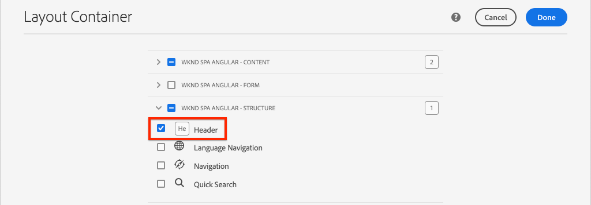
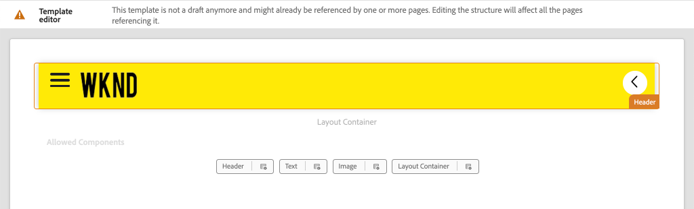

# Aggiungi navigazione e indirizzamento {#navigation-routing}

Scopri come sono supportate più visualizzazioni nell’applicazione a pagina singola utilizzando AEM Pages e l’editor per applicazioni a pagina singola SDK. La navigazione dinamica viene implementata utilizzando i percorsi di Angular e aggiunta a un componente Intestazione esistente.

## Obiettivo

1. Comprendi le opzioni di indirizzamento del modello SPA disponibili quando utilizzi l’Editor SPA.
2. Scopri come utilizzare il [routing di Angular](https://angular.io/guide/router) per spostarti tra le diverse visualizzazioni dell&#39;applicazione a pagina singola.
3. Implementa una navigazione dinamica guidata dalla gerarchia delle pagine di AEM.

## Cosa verrà creato

Questo capitolo aggiunge un menu di navigazione a un componente `Header` esistente. Il menu di navigazione è gestito dalla gerarchia di pagine di AEM e utilizza il modello JSON fornito dal [componente core Navigazione](https://experienceleague.adobe.com/docs/experience-manager-core-components/using/components/navigation.html?lang=it).


## Prerequisiti

Esaminare gli strumenti e le istruzioni necessari per configurare un [ambiente di sviluppo locale](overview.md#local-dev-environment).

### Ottieni il codice

1. Scarica il punto di partenza per questa esercitazione tramite Git:

   ```shell
   $ git clone git@github.com:adobe/aem-guides-wknd-spa.git
   $ cd aem-guides-wknd-spa
   $ git checkout Angular/navigation-routing-start
   ```

2. Implementa la base di codice in un’istanza AEM locale utilizzando Maven:

   ```shell
   $ mvn clean install -PautoInstallSinglePackage
   ```

   Se utilizzi [AEM 6.x](overview.md#compatibility), aggiungi il profilo `classic`:

   ```shell
   $ mvn clean install -PautoInstallSinglePackage -Pclassic
   ```

3. Installa il pacchetto finito per il [sito di riferimento WKND tradizionale](https://github.com/adobe/aem-guides-wknd/releases/latest). Le immagini fornite dal [sito di riferimento WKND](https://github.com/adobe/aem-guides-wknd/releases/latest) sono riutilizzate nell&#39;applicazione a pagina singola WKND. È possibile installare il pacchetto utilizzando [Gestione pacchetti di AEM](http://localhost:4502/crx/packmgr/index.jsp).

   

Puoi sempre visualizzare il codice finito su [GitHub](https://github.com/adobe/aem-guides-wknd-spa/tree/Angular/navigation-routing-solution) o estrarre il codice localmente passando al ramo `Angular/navigation-routing-solution`.

## Controlla aggiornamenti HeaderComponent {#inspect-header}

Nei capitoli precedenti, il componente `HeaderComponent` è stato aggiunto come componente Angular puro incluso tramite `app.component.html`. In questo capitolo, il componente `HeaderComponent` viene rimosso dall&#39;app e aggiunto tramite [Editor modelli](https://experienceleague.adobe.com/docs/experience-manager-learn/sites/page-authoring/template-editor-feature-video-use.html?lang=it). Questo consente agli utenti di configurare il menu di navigazione di `HeaderComponent` da AEM.

>[!NOTE]
>
> Per iniziare questo capitolo, sono già stati apportati diversi aggiornamenti CSS e JavaScript alla base di codice. Per concentrarsi sui concetti di base, non vengono discusse **tutte** le modifiche apportate al codice. Puoi visualizzare le modifiche complete [qui](https://github.com/adobe/aem-guides-wknd-spa/compare/Angular/map-components-solution...Angular/navigation-routing-start).

1. Nell’IDE che preferisci aprire il progetto iniziale dell’applicazione a pagina singola per questo capitolo.
2. Sotto il modulo `ui.frontend` controllare il file `header.component.ts` in: `ui.frontend/src/app/components/header/header.component.ts`.

   Sono stati apportati diversi aggiornamenti, tra cui l&#39;aggiunta di un `HeaderEditConfig` e un `MapTo` per consentire il mapping del componente a un componente AEM `wknd-spa-angular/components/header`.

   ```js
   /* header.component.ts */
   ...
   const HeaderEditConfig = {
       ...
   };
   
   @Component({
   selector: 'app-header',
   templateUrl: './header.component.html',
   styleUrls: ['./header.component.scss']
   })
   export class HeaderComponent implements OnInit {
   @Input() items: object[];
       ...
   }
   ...
   MapTo('wknd-spa-angular/components/header')(withRouter(Header), HeaderEditConfig);
   ```

   Annotare l&#39;annotazione `@Input()` per `items`. `items` conterrà un array di oggetti di navigazione passati da AEM.

3. Nel modulo `ui.apps` verificare la definizione del componente AEM `Header`: `ui.apps/src/main/content/jcr_root/apps/wknd-spa-angular/components/header/.content.xml`:

   ```xml
   <?xml version="1.0" encoding="UTF-8"?>
   <jcr:root xmlns:sling="http://sling.apache.org/jcr/sling/1.0" xmlns:cq="http://www.day.com/jcr/cq/1.0"
       xmlns:jcr="http://www.jcp.org/jcr/1.0"
       jcr:primaryType="cq:Component"
       jcr:title="Header"
       sling:resourceSuperType="wknd-spa-angular/components/navigation"
       componentGroup="WKND SPA Angular - Structure"/>
   ```

   Il componente AEM `Header` erediterà tutte le funzionalità del [componente core Navigazione](https://experienceleague.adobe.com/docs/experience-manager-core-components/using/components/navigation.html?lang=it) tramite la proprietà `sling:resourceSuperType`.

## Aggiungere il componente HeaderComponent al modello di applicazione a pagina singola {#add-header-template}

1. Apri un browser e accedi ad AEM, [http://localhost:4502/](http://localhost:4502/). La base di codice iniziale deve essere già distribuita.
2. Passare al **[!UICONTROL Modello pagina SPA]**: [http://localhost:4502/editor.html/conf/wknd-spa-angular/settings/wcm/templates/spa-page-template/structure.html](http://localhost:4502/editor.html/conf/wknd-spa-angular/settings/wcm/templates/spa-page-template/structure.html).
3. Seleziona il **[!UICONTROL contenitore di layout principale]** più esterno e fai clic sulla relativa icona **[!UICONTROL Criteri]**. Fai attenzione a **not** per selezionare il **[!UICONTROL Contenitore di layout]** non bloccato per l&#39;authoring.

   

4. Copia il criterio corrente e crea un nuovo criterio denominato **[!UICONTROL Struttura SPA]**:

   

   In **[!UICONTROL Componenti consentiti]** > **[!UICONTROL Generale]** > seleziona il componente **[!UICONTROL Contenitore di layout]**.

   In **[!UICONTROL Componenti consentiti]** > **[!UICONTROL ANGULAR SPA WKND - STRUTTURA]** > seleziona il componente **[!UICONTROL Intestazione]**:

   

   In **[!UICONTROL Componenti consentiti]** > **[!UICONTROL ANGULAR SPA WKND - Contenuto]** > seleziona i componenti **[!UICONTROL Immagine]** e **[!UICONTROL Testo]**. Dovresti aver selezionato 4 componenti totali.

   Per salvare le modifiche, fai clic su **[!UICONTROL Completati]**.

5. **Aggiorna** la pagina. Aggiungi il componente **[!UICONTROL Intestazione]** sopra il **[!UICONTROL Contenitore di layout]** non bloccato:

   

6. Selezionare il componente **[!UICONTROL Header]** e fare clic sulla relativa icona **Policy** per modificare il criterio.

   

7. Creare un nuovo criterio con un **[!UICONTROL Titolo criterio]** di **&quot;Intestazione SPA WKND&quot;**.

   In **[!UICONTROL Proprietà]**:

   * Impostare **[!UICONTROL Directory principale di navigazione]** su `/content/wknd-spa-angular/us/en`.
   * Imposta **[!UICONTROL Escludi livelli principali]** su **1**.
   * Deseleziona **[!UICONTROL Raccogli tutte le pagine figlie]**.
   * Impostare **[!UICONTROL Annidamento struttura di spostamento]** su **3**.

   

   In questo modo verranno raccolti i 2 livelli di navigazione inferiori a `/content/wknd-spa-angular/us/en`.

8. Dopo aver salvato le modifiche, dovresti visualizzare `Header` popolato come parte del modello:

   

## Creare pagine figlie

Quindi, crea ulteriori pagine in AEM che fungeranno da diverse visualizzazioni nell’applicazione a pagina singola. Esamineremo inoltre la struttura gerarchica del modello JSON fornito da AEM.

1. Passare alla console **Sites**: [http://localhost:4502/sites.html/content/wknd-spa-angular/us/en/home](http://localhost:4502/sites.html/content/wknd-spa-angular/us/en/home). Seleziona la **home page di Angular per applicazioni a pagina singola WKND** e fai clic su **[!UICONTROL Crea]** > **[!UICONTROL Pagina]**:

   

2. In **[!UICONTROL Modello]** selezionare **[!UICONTROL Pagina SPA]**. In **[!UICONTROL Proprietà]** immettere **&quot;Pagina 1&quot;** per il **[!UICONTROL Titolo]** e **&quot;pagina-1&quot;** come nome.

   

   Fai clic su **[!UICONTROL Crea]** e nella finestra a comparsa fai clic su **[!UICONTROL Apri]** per aprire la pagina nell&#39;editor SPA di AEM.

3. Aggiungi un nuovo componente **[!UICONTROL Testo]** al **[!UICONTROL Contenitore di layout]** principale. Modificare il componente e immettere il testo: **&quot;Pagina 1&quot;** utilizzando l&#39;editor Rich Text e l&#39;elemento **H1** (sarà necessario attivare la modalità a schermo intero per modificare gli elementi del paragrafo)

   

   Puoi aggiungere altri contenuti, come un’immagine.

4. Torna alla console AEM Sites e ripeti i passaggi precedenti, creando una seconda pagina denominata **&quot;Pagina 2&quot;** come pari livello di **Pagina 1**. Aggiungere contenuto a **Pagina 2** per identificarlo facilmente.
5. Infine, crea una terza pagina, **&quot;Pagina 3&quot;** ma come **elemento secondario** di **Pagina 2**. Una volta completato, la gerarchia del sito avrà l’aspetto seguente:

   

6. In una nuova scheda, apri l&#39;API del modello JSON fornita da AEM: [http://localhost:4502/content/wknd-spa-angular/us/en.model.json](http://localhost:4502/content/wknd-spa-angular/us/en.model.json). Questo contenuto JSON viene richiesto al primo caricamento dell’applicazione a pagina singola. La struttura esterna si presenta come segue:

   ```json
   {
   "language": "en",
   "title": "en",
   "templateName": "spa-app-template",
   "designPath": "/libs/settings/wcm/designs/default",
   "cssClassNames": "spa page basicpage",
   ":type": "wknd-spa-angular/components/spa",
   ":items": {},
   ":itemsOrder": [],
   ":hierarchyType": "page",
   ":path": "/content/wknd-spa-angular/us/en",
   ":children": {
       "/content/wknd-spa-angular/us/en/home": {},
       "/content/wknd-spa-angular/us/en/home/page-1": {},
       "/content/wknd-spa-angular/us/en/home/page-2": {},
       "/content/wknd-spa-angular/us/en/home/page-2/page-3": {}
       }
   }
   ```

   In `:children` dovresti visualizzare una voce per ciascuna delle pagine create. Il contenuto di tutte le pagine si trova in questa richiesta JSON iniziale. Una volta implementato il routing di navigazione, le visualizzazioni successive dell’applicazione a pagina singola vengono caricate rapidamente, in quanto il contenuto è già disponibile lato client.

   Non è consigliabile caricare **ALL** del contenuto di un&#39;applicazione a pagina singola nella richiesta JSON iniziale, in quanto ciò rallenterebbe il caricamento della pagina iniziale. Quindi, vediamo come viene raccolta la profondità gerarchica delle pagine.

7. Passa al modello **Radice applicazione a pagina singola** in: [http://localhost:4502/editor.html/conf/wknd-spa-angular/settings/wcm/templates/spa-app-template/structure.html](http://localhost:4502/editor.html/conf/wknd-spa-angular/settings/wcm/templates/spa-app-template/structure.html).

   Fai clic sul **[!UICONTROL menu Proprietà pagina]** > **[!UICONTROL Criterio pagina]**:

   

8. Il modello **Radice applicazione a pagina singola** include una scheda **[!UICONTROL Struttura gerarchica]** aggiuntiva per controllare il contenuto JSON raccolto. L&#39;**[!UICONTROL Annidamento struttura]** determina la profondità nella gerarchia del sito per raccogliere le pagine figlie sotto la **radice**. È inoltre possibile utilizzare il campo **[!UICONTROL Modelli struttura]** per filtrare ulteriori pagine in base a un&#39;espressione regolare.

   Aggiorna **[!UICONTROL Annidamento struttura]** in **&quot;2&quot;**:

   

   Fai clic su **[!UICONTROL Fine]** per salvare le modifiche al criterio.

9. Riapri il modello JSON [http://localhost:4502/content/wknd-spa-angular/us/en.model.json](http://localhost:4502/content/wknd-spa-angular/us/en.model.json).

   ```json
   {
   "language": "en",
   "title": "en",
   "templateName": "spa-app-template",
   "designPath": "/libs/settings/wcm/designs/default",
   "cssClassNames": "spa page basicpage",
   ":type": "wknd-spa-angular/components/spa",
   ":items": {},
   ":itemsOrder": [],
   ":hierarchyType": "page",
   ":path": "/content/wknd-spa-angular/us/en",
   ":children": {
       "/content/wknd-spa-angular/us/en/home": {},
       "/content/wknd-spa-angular/us/en/home/page-1": {},
       "/content/wknd-spa-angular/us/en/home/page-2": {}
       }
   }
   ```

   Il percorso **Pagina 3** è stato rimosso: `/content/wknd-spa-angular/us/en/home/page-2/page-3` dal modello JSON iniziale.

   Successivamente, osserveremo come AEM SPA Editor SDK può caricare dinamicamente contenuti aggiuntivi.

## Implementare la navigazione

Successivamente, implementare il menu di navigazione con un nuovo `NavigationComponent`. È possibile aggiungere il codice direttamente in `header.component.html`, ma è consigliabile evitare di utilizzare componenti di grandi dimensioni. Implementare invece un `NavigationComponent` che potrebbe essere riutilizzato in un secondo momento.

1. Rivedi il JSON esposto dal componente AEM `Header` in [http://localhost:4502/content/wknd-spa-angular/us/en.model.json](http://localhost:4502/content/wknd-spa-angular/us/en.model.json):

   ```json
   ...
   "header": {
       "items": [
       {
       "level": 0,
       "active": true,
       "path": "/content/wknd-spa-angular/us/en/home",
       "description": null,
       "url": "/content/wknd-spa-angular/us/en/home.html",
       "lastModified": 1589062597083,
       "title": "WKND SPA Angular Home Page",
       "children": [
               {
               "children": [],
               "level": 1,
               "active": false,
               "path": "/content/wknd-spa-angular/us/en/home/page-1",
               "description": null,
               "url": "/content/wknd-spa-angular/us/en/home/page-1.html",
               "lastModified": 1589429385100,
               "title": "Page 1"
               },
               {
               "level": 1,
               "active": true,
               "path": "/content/wknd-spa-angular/us/en/home/page-2",
               "description": null,
               "url": "/content/wknd-spa-angular/us/en/home/page-2.html",
               "lastModified": 1589429603507,
               "title": "Page 2",
               "children": [
                   {
                   "children": [],
                   "level": 2,
                   "active": false,
                   "path": "/content/wknd-spa-angular/us/en/home/page-2/page-3",
                   "description": null,
                   "url": "/content/wknd-spa-angular/us/en/home/page-2/page-3.html",
                   "lastModified": 1589430413831,
                   "title": "Page 3"
                   }
               ],
               }
           ]
           }
       ],
   ":type": "wknd-spa-angular/components/header"
   ```

   La natura gerarchica delle pagine AEM è modellata nel JSON e può essere utilizzata per popolare un menu di navigazione. Ricorda che il componente `Header` eredita tutte le funzionalità del [componente core Navigazione](https://www.aemcomponents.dev/content/core-components-examples/library/core-structure/navigation.html) e che il contenuto esposto tramite JSON viene mappato automaticamente all&#39;annotazione Angular `@Input`.

2. Aprire una nuova finestra del terminale e passare alla cartella `ui.frontend` del progetto SPA. Creare un nuovo `NavigationComponent` utilizzando lo strumento CLI di Angular:

   ```shell
   $ cd ui.frontend
   $ ng generate component components/navigation
   CREATE src/app/components/navigation/navigation.component.scss (0 bytes)
   CREATE src/app/components/navigation/navigation.component.html (25 bytes)
   CREATE src/app/components/navigation/navigation.component.spec.ts (656 bytes)
   CREATE src/app/components/navigation/navigation.component.ts (286 bytes)
   UPDATE src/app/app.module.ts (2032 bytes)
   ```

3. Creare quindi una classe denominata `NavigationLink` utilizzando Angular CLI nella directory `components/navigation` appena creata:

   ```shell
   $ cd src/app/components/navigation/
   $ ng generate class NavigationLink
   CREATE src/app/components/navigation/navigation-link.spec.ts (187 bytes)
   CREATE src/app/components/navigation/navigation-link.ts (32 bytes)
   ```

4. Torna all&#39;IDE desiderato e apri il file in `navigation-link.ts` alle `/src/app/components/navigation/navigation-link.ts`.

   

5. Popolare `navigation-link.ts` con quanto segue:

   ```js
   export class NavigationLink {
   
       title: string;
       path: string;
       url: string;
       level: number;
       children: NavigationLink[];
       active: boolean;
   
       constructor(data) {
           this.path = data.path;
           this.title = data.title;
           this.url = data.url;
           this.level = data.level;
           this.active = data.active;
           this.children = data.children.map( item => {
               return new NavigationLink(item);
           });
       }
   }
   ```

   Si tratta di una classe semplice che rappresenta un singolo collegamento di navigazione. Nel costruttore di classe è previsto che `data` sia l&#39;oggetto JSON trasmesso da AEM. Questa classe viene utilizzata sia in `NavigationComponent` che in `HeaderComponent` per popolare facilmente la struttura di navigazione.

   Non viene eseguita alcuna trasformazione dei dati, questa classe viene creata principalmente per digitare fortemente il modello JSON. Si noti che `this.children` è digitato come `NavigationLink[]` e che il costruttore crea in modo ricorsivo nuovi oggetti `NavigationLink` per ciascuno degli elementi nell&#39;array `children`. Ricorda che il modello JSON per `Header` è gerarchico.

6. Aprire il file `navigation-link.spec.ts`. File di test per la classe `NavigationLink`. Aggiornalo con quanto segue:

   ```js
   import { NavigationLink } from './navigation-link';
   
   describe('NavigationLink', () => {
       it('should create an instance', () => {
           const data = {
               children: [],
               level: 1,
               active: false,
               path: '/content/wknd-spa-angular/us/en/home/page-1',
               description: null,
               url: '/content/wknd-spa-angular/us/en/home/page-1.html',
               lastModified: 1589429385100,
               title: 'Page 1'
           };
           expect(new NavigationLink(data)).toBeTruthy();
       });
   });
   ```

   Tieni presente che `const data` segue lo stesso modello JSON ispezionato in precedenza per un singolo collegamento. Si tratta di un test di unità non valido, tuttavia dovrebbe essere sufficiente per testare il costruttore di `NavigationLink`.

7. Aprire il file `navigation.component.ts`. Aggiornalo con quanto segue:

   ```js
   import { Component, OnInit, Input } from '@angular/core';
   import { NavigationLink } from './navigation-link';
   
   @Component({
   selector: 'app-navigation',
   templateUrl: './navigation.component.html',
   styleUrls: ['./navigation.component.scss']
   })
   export class NavigationComponent implements OnInit {
   
       @Input() items: object[];
   
       constructor() { }
   
       get navigationLinks(): NavigationLink[] {
   
           if (this.items && this.items.length > 0) {
               return this.items.map(item => {
                   return new NavigationLink(item);
               });
           }
   
           return null;
       }
   
       ngOnInit() {}
   
   }
   ```

   `NavigationComponent` prevede un `object[]` denominato `items` che è il modello JSON di AEM. Questa classe espone un singolo metodo `get navigationLinks()` che restituisce un array di `NavigationLink` oggetti.

8. Aprire il file `navigation.component.html` e aggiornarlo con quanto segue:

   ```html
   <ul *ngIf="navigationLinks && navigationLinks.length > 0" class="navigation__group">
       <ng-container *ngTemplateOutlet="recursiveListTmpl; context:{ links: navigationLinks }"></ng-container>
   </ul>
   ```

   Viene generato un `<ul>` iniziale e viene chiamato il metodo `get navigationLinks()` da `navigation.component.ts`. `<ng-container>` viene utilizzato per effettuare una chiamata a un modello denominato `recursiveListTmpl` e lo trasmette a `navigationLinks` come variabile denominata `links`.

   Aggiungi `recursiveListTmpl` dopo:

   ```html
   <ng-template #recursiveListTmpl let-links="links">
       <li *ngFor="let link of links" class="{{'navigation__item navigation__item--' + link.level}}">
           <a [routerLink]="link.url" class="navigation__item-link" [title]="link.title" [attr.aria-current]="link.active">
               {{link.title}}
           </a>
           <ul *ngIf="link.children && link.children.length > 0">
               <ng-container *ngTemplateOutlet="recursiveListTmpl; context:{ links: link.children }"></ng-container>
           </ul>
       </li>
   </ng-template>
   ```

   Qui viene implementato il resto del rendering per il collegamento di navigazione. Si noti che la variabile `link` è di tipo `NavigationLink` e che tutti i metodi/proprietà creati da tale classe sono disponibili. [`[routerLink]`](https://angular.io/api/router/RouterLink) viene utilizzato al posto del normale attributo `href`. Questo ci permette di collegarci a specifici percorsi nell’app, senza un aggiornamento a pagina intera.

   La parte ricorsiva della navigazione viene implementata anche creando un altro `<ul>` se l&#39;attuale `link` ha un array `children` non vuoto.

9. Aggiorna `navigation.component.spec.ts` per aggiungere il supporto per `RouterTestingModule`:

   ```diff
    ...
   + import { RouterTestingModule } from '@angular/router/testing';
    ...
    beforeEach(async(() => {
       TestBed.configureTestingModule({
   +   imports: [ RouterTestingModule ],
       declarations: [ NavigationComponent ]
       })
       .compileComponents();
    }));
    ...
   ```

   È necessario aggiungere `RouterTestingModule` perché il componente utilizza `[routerLink]`.

10. Aggiorna `navigation.component.scss` per aggiungere alcuni stili di base a `NavigationComponent`:

   ```scss
   @import "~src/styles/variables";
   
   $link-color: $black;
   $link-hover-color: $white;
   $link-background: $black;
   
   :host-context {
       display: block;
       width: 100%;
   }
   
   .navigation__item {
       list-style: none;
   }
   
   .navigation__item-link {
       color: $link-color;
       font-size: $font-size-large;
       text-transform: uppercase;
       padding: $gutter-padding;
       display: flex;
       border-bottom: 1px solid $gray;
   
       &:hover {
           background: $link-background;
           color: $link-hover-color;
       }
   
   }
   ```

## Aggiornare il componente intestazione

Ora che `NavigationComponent` è stato implementato, `HeaderComponent` deve essere aggiornato per farvi riferimento.

1. Aprire un terminale e passare alla cartella `ui.frontend` all&#39;interno del progetto SPA. Avvia il server di sviluppo **webpack**:

   ```shell
   $ npm start
   ```

2. Apri una scheda del browser e passa a [http://localhost:4200/](http://localhost:4200/).

   Il server di sviluppo **webpack** deve essere configurato per fungere da proxy del modello JSON da un&#39;istanza locale di AEM (`ui.frontend/proxy.conf.json`). Questo ci consentirà di eseguire il codice direttamente in base al contenuto creato in AEM dall’inizio dell’esercitazione.

   

   La funzionalità di attivazione/disattivazione menu di `HeaderComponent` è già stata implementata. Quindi, aggiungi il componente Navigazione.

3. Tornare all&#39;IDE desiderato e aprire il file `header.component.ts` in `ui.frontend/src/app/components/header/header.component.ts`.
4. Aggiorna il metodo `setHomePage()` per rimuovere la stringa hardcoded e utilizzare le proprietà dinamiche passate dal componente AEM:

   ```js
   /* header.component.ts */
   import { NavigationLink } from '../navigation/navigation-link';
   ...
    setHomePage() {
       if (this.hasNavigation) {
           const rootNavigationLink: NavigationLink = new NavigationLink(this.items[0]);
           this.isHome = rootNavigationLink.path === this.route.snapshot.data.path;
           this.homePageUrl = rootNavigationLink.url;
       }
   }
   ...
   ```

   Viene creata una nuova istanza di `NavigationLink` basata su `items[0]`, la radice del modello JSON di navigazione trasmesso da AEM. `this.route.snapshot.data.path` restituisce il percorso della route Angular corrente. Questo valore viene utilizzato per determinare se la route corrente è la **home page**. `this.homePageUrl` viene utilizzato per popolare il collegamento di ancoraggio nel **logo**.

5. Apri `header.component.html` e sostituisci il segnaposto statico per la navigazione con un riferimento al `NavigationComponent` appena creato:

   ```diff
       <div class="header-navigation">
           <div class="navigation">
   -            Navigation Placeholder
   +           <app-navigation [items]="items"></app-navigation>
           </div>
       </div>
   ```

   L&#39;attributo `[items]=items` passa `@Input() items` da `HeaderComponent` a `NavigationComponent` dove verrà compilata la navigazione.

6. Apri `header.component.spec.ts` e aggiungi una dichiarazione per `NavigationComponent`:

   ```diff
       /* header.component.spect.ts */
   +   import { NavigationComponent } from '../navigation/navigation.component';
   
       describe('HeaderComponent', () => {
       let component: HeaderComponent;
       let fixture: ComponentFixture<HeaderComponent>;
   
       beforeEach(async(() => {
           TestBed.configureTestingModule({
           imports: [ RouterTestingModule ],
   +       declarations: [ HeaderComponent, NavigationComponent ]
           })
           .compileComponents();
       }));
   ```

   Poiché `NavigationComponent` è ora utilizzato come parte di `HeaderComponent`, deve essere dichiarato come parte del banco di prova.

7. Salva le modifiche apportate ai file aperti e torna al server di sviluppo **webpack**: [http://localhost:4200/](http://localhost:4200/)

   

   Apri la navigazione facendo clic sull’interruttore del menu; dovresti visualizzare i collegamenti di navigazione compilati. Dovresti essere in grado di passare a diverse visualizzazioni dell’applicazione a pagina singola.

## Informazioni sul routing SPA

Ora che la navigazione è stata implementata, controlla il routing in AEM.

1. Nell&#39;IDE aprire il file `app-routing.module.ts` in `ui.frontend/src/app`.

   ```js
   /* app-routing.module.ts */
   import { AemPageDataResolver, AemPageRouteReuseStrategy } from '@adobe/cq-angular-editable-components';
   import { NgModule } from '@angular/core';
   import { RouteReuseStrategy, RouterModule, Routes, UrlMatchResult, UrlSegment } from '@angular/router';
   import { PageComponent } from './components/page/page.component';
   
   export function AemPageMatcher(url: UrlSegment[]): UrlMatchResult {
       if (url.length) {
           return {
               consumed: url,
               posParams: {
                   path: url[url.length - 1]
               }
           };
       }
   }
   
   const routes: Routes = [
       {
           matcher: AemPageMatcher,
           component: PageComponent,
           resolve: {
               path: AemPageDataResolver
           }
       }
   ];
   @NgModule({
       imports: [RouterModule.forRoot(routes)],
       exports: [RouterModule],
       providers: [
           AemPageDataResolver,
           {
           provide: RouteReuseStrategy,
           useClass: AemPageRouteReuseStrategy
           }
       ]
   })
   export class AppRoutingModule {}
   ```

   L&#39;array `routes: Routes = [];` definisce le route o i percorsi di navigazione per i mapping dei componenti Angular.

   `AemPageMatcher` è un router Angular personalizzato [UrlMatcher](https://angular.io/api/router/UrlMatcher), che corrisponde a qualsiasi elemento che &quot;assomiglia&quot; a una pagina in AEM che fa parte di questa applicazione Angular.

   `PageComponent` è il componente Angular che rappresenta una pagina in AEM ed è utilizzato per eseguire il rendering delle route corrispondenti. `PageComponent` viene rivisto più avanti nell&#39;esercitazione.

   `AemPageDataResolver`, fornito da AEM SPA Editor JS SDK, è un [Angular Router Resolver](https://angular.io/api/router/Resolve) personalizzato utilizzato per trasformare l&#39;URL del percorso, che è il percorso in AEM con estensione .html, nel percorso della risorsa in AEM, ovvero il percorso della pagina meno l&#39;estensione.

   Ad esempio, `AemPageDataResolver` trasforma l&#39;URL di una route di `content/wknd-spa-angular/us/en/home.html` in un percorso di `/content/wknd-spa-angular/us/en/home`. Viene utilizzato per risolvere il contenuto della pagina in base al percorso nell’API del modello JSON.

   `AemPageRouteReuseStrategy`, fornito da AEM SPA Editor JS SDK, è una [RouteReuseStrategy](https://angular.io/api/router/RouteReuseStrategy) personalizzata che impedisce il riutilizzo di `PageComponent` tra le route. In caso contrario, il contenuto della pagina &quot;A&quot; potrebbe apparire quando si passa alla pagina &quot;B&quot;.

2. Aprire il file `page.component.ts` in `ui.frontend/src/app/components/page/`.

   ```js
   ...
   export class PageComponent {
       items;
       itemsOrder;
       path;
   
       constructor(
           private route: ActivatedRoute,
           private modelManagerService: ModelManagerService
       ) {
           this.modelManagerService
           .getData({ path: this.route.snapshot.data.path })
           .then(data => {
               this.path = data[Constants.PATH_PROP];
               this.items = data[Constants.ITEMS_PROP];
               this.itemsOrder = data[Constants.ITEMS_ORDER_PROP];
           });
       }
   }
   ```

   `PageComponent` è necessario per elaborare il JSON recuperato da AEM e viene utilizzato come componente Angular per eseguire il rendering delle route.

   `ActivatedRoute`, fornito dal modulo Router Angular, contiene lo stato che indica quale contenuto JSON della pagina AEM deve essere caricato in questa istanza del componente Angular Page.

   `ModelManagerService`, ottiene i dati JSON in base alla route e mappa i dati alle variabili di classe `path`, `items`, `itemsOrder`. Questi verranno quindi passati a [AEMPageComponent](https://www.npmjs.com/package/@adobe/cq-angular-editable-components#aempagecomponent.md)

3. Apri il file `page.component.html` in `ui.frontend/src/app/components/page/`

   ```html
   <aem-page 
       class="structure-page" 
       [attr.data-cq-page-path]="path" 
       [cqPath]="path" 
       [cqItems]="items" 
       [cqItemsOrder]="itemsOrder">
   </aem-page>
   ```

   `aem-page` include [AEMPageComponent](https://www.npmjs.com/package/@adobe/cq-angular-editable-components#aempagecomponent.md). Le variabili `path`, `items` e `itemsOrder` sono passate a `AEMPageComponent`. `AemPageComponent`, fornito tramite l&#39;editor SPA JavaScript SDK, eseguirà quindi l&#39;iterazione di questi dati e creerà un&#39;istanza dinamica dei componenti Angular in base ai dati JSON, come mostrato nell&#39;esercitazione [Componenti mappa](./map-components.md).

   `PageComponent` è in realtà solo un proxy per `AEMPageComponent` ed è `AEMPageComponent` che esegue la maggior parte del lavoro pesante per mappare correttamente il modello JSON ai componenti di Angular.

## Ispezionare il routing SPA in AEM

1. Aprire un terminale e arrestare il server di sviluppo **webpack**, se avviato. Passa alla directory principale del progetto e implementa il progetto in AEM utilizzando le abilità Maven:

   ```shell
   $ cd aem-guides-wknd-spa
   $ mvn clean install -PautoInstallSinglePackage
   ```

   >[!CAUTION]
   >
   > Nel progetto Angular sono abilitate alcune regole di evidenziazione molto rigide. Se la build Maven non riesce, verifica l’errore e cerca **gli errori Lint trovati nei file elencati.**. Correggi eventuali problemi rilevati dal puntatore ed esegui nuovamente il comando Maven.

2. Passa alla home page dell&#39;applicazione a pagina singola in AEM: [http://localhost:4502/content/wknd-spa-angular/us/en/home.html](http://localhost:4502/content/wknd-spa-angular/us/en/home.html) e apri gli strumenti per sviluppatori del browser. Le schermate seguenti vengono acquisite dal browser Google Chrome.

   Aggiorna la pagina per visualizzare una richiesta XHR a `/content/wknd-spa-angular/us/en.model.json`, che è la radice SPA. In base alla configurazione della profondità della gerarchia rispetto al modello radice dell’applicazione a pagina singola creato in precedenza nell’esercitazione, vengono incluse solo tre pagine figlie. Non include **Pagina 3**.

   

3. Con gli strumenti per sviluppatori aperti, passa a **Pagina 3**:

   

   Si noti che è stata effettuata una nuova richiesta XHR a: `/content/wknd-spa-angular/us/en/home/page-2/page-3.model.json`

   

   AEM Model Manager riconosce che il contenuto JSON **Pagina 3** non è disponibile e attiva automaticamente la richiesta XHR aggiuntiva.

4. Continua a navigare nell’applicazione a pagina singola utilizzando i vari collegamenti di navigazione. Tieni presente che non vengono effettuate richieste XHR aggiuntive e che non si verifica alcun aggiornamento dell’intera pagina. In questo modo l’applicazione a pagina singola è veloce per l’utente finale e riduce le richieste non necessarie ad AEM.

   

5. Prova i collegamenti profondi navigando direttamente in: [http://localhost:4502/content/wknd-spa-angular/us/en/home/page-2.html](http://localhost:4502/content/wknd-spa-angular/us/en/home/page-2.html). Il pulsante Indietro del browser continua a funzionare.

## Congratulazioni. {#congratulations}

Congratulazioni, hai imparato come supportare più visualizzazioni nell’applicazione a pagina singola effettuando la mappatura sulle pagine AEM con l’editor per applicazioni a pagina singola SDK. La navigazione dinamica è stata implementata tramite il routing di Angular e aggiunta al componente `Header`.

Puoi sempre visualizzare il codice finito su [GitHub](https://github.com/adobe/aem-guides-wknd-spa/tree/Angular/navigation-routing-solution) o estrarre il codice localmente passando al ramo `Angular/navigation-routing-solution`.

### Passaggi successivi {#next-steps}

[Crea un componente personalizzato](custom-component.md) - Scopri come creare un componente personalizzato da utilizzare con l&#39;editor SPA di AEM. Scopri come sviluppare finestre di dialogo di authoring e modelli Sling per estendere il modello JSON e popolare un componente personalizzato.
