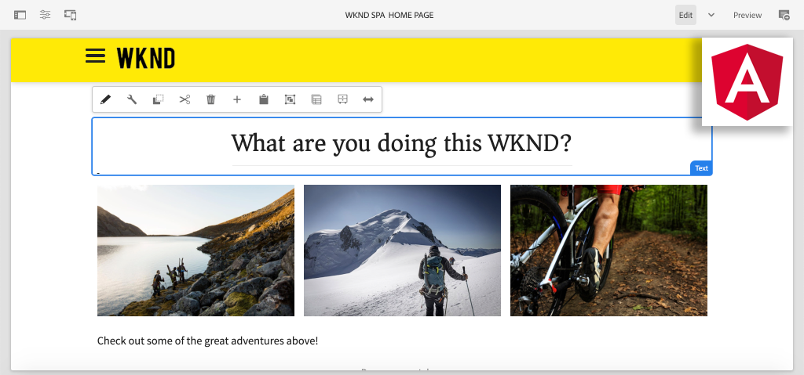

# Creare la prima applicazione a pagina singola Angular in AEM {#introduction}

{{spa-editor-deprecation}}

Questo tutorial in più parti è progettato per gli sviluppatori che non hanno mai utilizzato la funzione **Editor di SPA** in Adobe Experience Manager (AEM). Questo tutorial illustra l’implementazione di un’applicazione Angular per un brand di lifestyle fittizio, WKND. L’app Angular è sviluppata e progettata per essere implementata con l’Editor di SPA di AEM, che mappa i componenti Angular ai componenti di AEM. L’applicazione a pagina singola completata, implementata in AEM, può essere creata dinamicamente con i tradizionali strumenti di modifica in linea di AEM.



*Implementazione dell’applicazione a pagina singola WKND*

## Informazioni

L’obiettivo di questo tutorial in più parti è insegnare a uno sviluppatore come implementare un’applicazione Angular per funzionare con la funzione Editor di SPA di AEM. In uno scenario reale le attività di sviluppo vengono suddivise per utente tipo, spesso coinvolgendo uno **sviluppatore front-end** e uno **sviluppatore back-end**. Questo tutorial è molto utile per gli sviluppatori coinvolti in un progetto con l’editor di applicazioni a pagina singola di AEM.

Il tutorial è progettato per funzionare con **AEM as a Cloud Service** ed è compatibile con le versioni precedenti di **AEM 6.5.4+** e **AEM 6.4.8+**. L’applicazione a pagina singola viene implementata utilizzando:

* [Archetipo di progetto AEM Maven](https://experienceleague.adobe.com/docs/experience-manager-core-components/using/developing/archetype/overview.html?lang=it)
* [Editor di SPA di AEM](https://experienceleague.adobe.com/docs/experience-manager-65/developing/headless/spas/spa-walkthrough.html?lang=it#content-editing-experience-with-spa)
* [Componenti core](https://experienceleague.adobe.com/docs/experience-manager-core-components/using/introduction.html?lang=it)
* [Angular](https://angular.io/)

*Il completamento di ogni parte del tutorial dovrebbe richiedere 1-2 ore.*

## Codice più recente

Tutto il codice utilizzato nel tutorial si trova su [GitHub](https://github.com/adobe/aem-guides-wknd-spa).

La [base del codice più recente](https://github.com/adobe/aem-guides-wknd-spa/releases) è disponibile come pacchetto AEM scaricabile.

## Prerequisiti

Prima di iniziare questo tutorial, è necessario disporre dei seguenti elementi:

* Nozioni di base su HTML, CSS e JavaScript
* Familiarità di base con [Angular](https://angular.io/)
* [AEM as a Cloud Service SDK](https://experienceleague.adobe.com/docs/experience-manager-learn/cloud-service/local-development-environment-set-up/aem-runtime.html?lang=it#download-the-aem-as-a-cloud-service-sdk), [AEM 6.5.4+](https://helpx.adobe.com/it/experience-manager/aem-releases-updates.html#65) o [AEM 6.4.8+](https://helpx.adobe.com/it/experience-manager/aem-releases-updates.html#64)
* [Java](https://downloads.experiencecloud.adobe.com/content/software-distribution/en/general.html)
* [Apache Maven](https://maven.apache.org/) (3.3.9 o successivo)
* [Node.js](https://nodejs.org/it/) e [npm](https://www.npmjs.com/)

*Anche se non obbligatorio, è utile avere una conoscenza di base di [sviluppo di componenti AEM Sites tradizionali](https://experienceleague.adobe.com/it/docs/experience-manager-learn/getting-started-wknd-tutorial-develop/overview).*

## Ambiente di sviluppo locale {#local-dev-environment}

Per completare questo tutorial è necessario un ambiente di sviluppo locale. Le schermate e i video sono stati acquisiti utilizzando AEM as a Cloud Service SDK in esecuzione in un ambiente Mac OS con [Visual Studio Code](https://code.visualstudio.com/) come IDE. I comandi e il codice devono essere indipendenti dal sistema operativo locale, salvo diversa indicazione.

>[!NOTE]
>
> **Ti avvicini adesso ad AEM as a Cloud Service?** Consulta la [seguente guida per configurare un ambiente di sviluppo locale utilizzando SDK di AEM as a Cloud Service](https://experienceleague.adobe.com/it/docs/experience-manager-learn/cloud-service/local-development-environment-set-up/overview).
>
> **Utilizzi AEM 6.5 per la prima volta?** Consulta la [guida seguente per configurare un ambiente di sviluppo locale](https://experienceleague.adobe.com/docs/experience-manager-learn/foundation/development/set-up-a-local-aem-development-environment.html?lang=it).

## Passaggi successivi {#next-steps}

Per iniziare il tutorial, passa al capitolo [Progetto Editor di SPA](create-project.md) e scopri come generare un progetto abilitato per l’editor di applicazioni a pagine singole utilizzando l’archetipo di progetto AEM.

## Compatibilità con le versioni precedenti {#compatibility}

Il codice del progetto per questo tutorial è stato creato per AEM as a Cloud Service. Per rendere il codice del progetto compatibile con le versioni precedenti **6.5.4+** e **6.4.8+** sono state apportate diverse modifiche.

[UberJar](https://experienceleague.adobe.com/docs/experience-manager-65/developing/devtools/ht-projects-maven.html?lang=it#what-is-the-uberjar) **v6.4.4** è stato incluso come dipendenza:

```xml
<!-- Adobe AEM 6.x Dependencies -->
<dependency>
    <groupId>com.adobe.aem</groupId>
    <artifactId>uber-jar</artifactId>
    <version>6.4.4</version>
    <classifier>apis</classifier>
    <scope>provided</scope>
</dependency>
```

È stato aggiunto un ulteriore profilo Maven, denominato `classic`, per modificare la build per gli ambienti AEM 6.x:

```xml
  <!-- AEM 6.x Profile to include Core Components-->
    <profile>
        <id>classic</id>
        <activation>
            <activeByDefault>false</activeByDefault>
        </activation>
        <build>
        ...
    </profile>
```

Il profilo `classic` è disabilitato per impostazione predefinita. Se segui il tutorial con AEM 6.x, aggiungi il profilo `classic` ogni volta che ti viene richiesto di eseguire una build Maven:

```shell
$ mvn clean install -PautoInstallSinglePackage -Pclassic
```

Durante la generazione di un nuovo progetto per un’implementazione AEM utilizza sempre la versione più recente dell’[archetipo di progetto AEM](https://github.com/adobe/aem-project-archetype) e aggiorna `aemVersion` per la versione desiderata di AEM.
