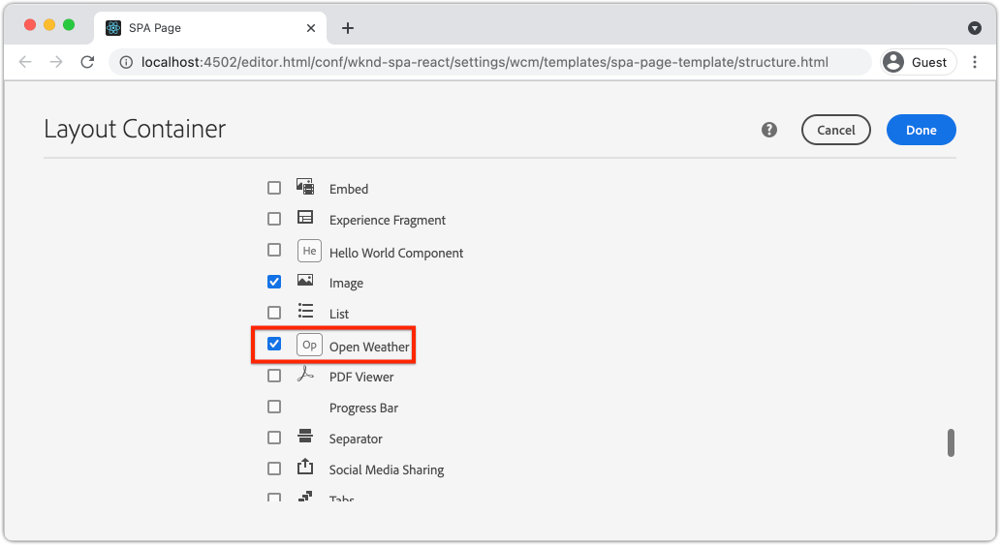

# Creare un componente meteo personalizzato {#custom-component}

Scopri come creare un componente meteo personalizzato da utilizzare con l’Editor SPA di AEM. Scopri come sviluppare finestre di dialogo di authoring e modelli Sling per estendere il modello JSON e popolare un componente personalizzato. Vengono utilizzati [Open Weather API](https://openweathermap.org) e [React Open Weather Component](https://www.npmjs.com/package/react-open-weather).

## Obiettivo

1. Comprendi il ruolo dei modelli Sling nella manipolazione dell’API del modello JSON fornita da AEM.
2. Scopri come creare nuove finestre di dialogo per i componenti di AEM.
3. Scopri come creare un componente AEM **personalizzato** compatibile con il framework dell’editor SPA.

## Cosa verrà creato

Viene creato un semplice componente meteo. Questo componente può essere aggiunto all’applicazione a pagina singola dagli autori di contenuti. Utilizzando una finestra di dialogo di AEM, gli autori possono impostare la posizione in cui visualizzare il meteo.  L’implementazione di questo componente illustra i passaggi necessari per creare un nuovo componente AEM compatibile con il framework dell’Editor SPA di AEM.


## Prerequisiti

Esaminare gli strumenti e le istruzioni necessari per configurare un [ambiente di sviluppo locale](overview.md#local-dev-environment). Questo capitolo è una continuazione del capitolo [Navigazione e indirizzamento](navigation-routing.md), tuttavia a seguire tutto ciò che serve è un progetto AEM abilitato per applicazioni a pagina singola distribuito a un&#39;istanza AEM locale.

### Apri chiave API meteo

È necessaria una chiave API di [Open Weather](https://openweathermap.org/) per seguire l&#39;esercitazione. [La registrazione è gratuita](https://home.openweathermap.org/users/sign_up) per un numero limitato di chiamate API.

## Definire il componente AEM

Un componente AEM è definito come nodo e proprietà. Nel progetto questi nodi e proprietà sono rappresentati come file XML nel modulo `ui.apps`. Creare quindi il componente AEM nel modulo `ui.apps`.

>[!NOTE]
>
> Un rapido aggiornamento sulle [nozioni di base dei componenti di AEM potrebbe essere utile](https://experienceleague.adobe.com/docs/experience-manager-learn/getting-started-wknd-tutorial-develop/project-archetype/component-basics.html).

1. Nell&#39;IDE scelto aprire la cartella `ui.apps`.
2. Passare a `ui.apps/src/main/content/jcr_root/apps/wknd-spa-react/components` e creare una nuova cartella denominata `open-weather`.
3. Creare un nuovo file denominato `.content.xml` sotto la cartella `open-weather`. Popolare `open-weather/.content.xml` con quanto segue:

   ```xml
   <?xml version="1.0" encoding="UTF-8"?>
   <jcr:root xmlns:sling="http://sling.apache.org/jcr/sling/1.0" xmlns:cq="http://www.day.com/jcr/cq/1.0" xmlns:jcr="http://www.jcp.org/jcr/1.0"
       jcr:primaryType="cq:Component"
       jcr:title="Open Weather"
       componentGroup="WKND SPA React - Content"/>
   ```

   

   `jcr:primaryType="cq:Component"` - identifica che questo nodo è un componente di AEM.

   `jcr:title` è il valore visualizzato agli autori di contenuti e `componentGroup` determina il raggruppamento di componenti nell&#39;interfaccia utente di creazione.

4. Nella cartella `custom-component` creare un&#39;altra cartella denominata `_cq_dialog`.
5. Nella cartella `_cq_dialog` creare un nuovo file denominato `.content.xml` e popolarlo con il seguente:

   ```xml
   <?xml version="1.0" encoding="UTF-8"?>
   <jcr:root xmlns:sling="http://sling.apache.org/jcr/sling/1.0" xmlns:granite="http://www.adobe.com/jcr/granite/1.0" xmlns:cq="http://www.day.com/jcr/cq/1.0" xmlns:jcr="http://www.jcp.org/jcr/1.0" xmlns:nt="http://www.jcp.org/jcr/nt/1.0"
       jcr:primaryType="nt:unstructured"
       jcr:title="Open Weather"
       sling:resourceType="cq/gui/components/authoring/dialog">
       <content
           jcr:primaryType="nt:unstructured"
           sling:resourceType="granite/ui/components/coral/foundation/container">
           <items jcr:primaryType="nt:unstructured">
               <tabs
                   jcr:primaryType="nt:unstructured"
                   sling:resourceType="granite/ui/components/coral/foundation/tabs"
                   maximized="{Boolean}true">
                   <items jcr:primaryType="nt:unstructured">
                       <properties
                           jcr:primaryType="nt:unstructured"
                           jcr:title="Properties"
                           sling:resourceType="granite/ui/components/coral/foundation/container"
                           margin="{Boolean}true">
                           <items jcr:primaryType="nt:unstructured">
                               <columns
                                   jcr:primaryType="nt:unstructured"
                                   sling:resourceType="granite/ui/components/coral/foundation/fixedcolumns"
                                   margin="{Boolean}true">
                                   <items jcr:primaryType="nt:unstructured">
                                       <column
                                           jcr:primaryType="nt:unstructured"
                                           sling:resourceType="granite/ui/components/coral/foundation/container">
                                           <items jcr:primaryType="nt:unstructured">
                                               <label
                                                   jcr:primaryType="nt:unstructured"
                                                   sling:resourceType="granite/ui/components/coral/foundation/form/textfield"
                                                   fieldDescription="The label to display for the component"
                                                   fieldLabel="Label"
                                                   name="./label"/>
                                               <lat
                                                   jcr:primaryType="nt:unstructured"
                                                   sling:resourceType="granite/ui/components/coral/foundation/form/numberfield"
                                                   fieldDescription="The latitude of the location."
                                                   fieldLabel="Latitude"
                                                   step="any"
                                                   name="./lat" />
                                               <lon
                                                   jcr:primaryType="nt:unstructured"
                                                   sling:resourceType="granite/ui/components/coral/foundation/form/numberfield"
                                                   fieldDescription="The longitude of the location."
                                                   fieldLabel="Longitude"
                                                   step="any"
                                                   name="./lon"/>
                                           </items>
                                       </column>
                                   </items>
                               </columns>
                           </items>
                       </properties>
                   </items>
               </tabs>
           </items>
       </content>
   </jcr:root>
   ```

   

   Il file XML sopra riportato genera una finestra di dialogo molto semplice per `Weather Component`. La parte critica del file è costituita dai nodi interni `<label>`, `<lat>` e `<lon>`. Questa finestra di dialogo contiene due `numberfield` e un `textfield` che consente a un utente di configurare il meteo da visualizzare.

   Accanto a è stato creato un modello Sling per esporre il valore delle proprietà `label`,`lat` e `long` tramite il modello JSON.

   >[!NOTE]
   >
   > Puoi visualizzare molti più [esempi di finestre di dialogo visualizzando le definizioni dei Componenti core](https://github.com/adobe/aem-core-wcm-components/tree/master/content/src/content/jcr_root/apps/core/wcm/components). Puoi anche visualizzare altri campi modulo, come `select`, `textarea`, `pathfield`, disponibili sotto `/libs/granite/ui/components/coral/foundation/form` in [CRXDE-Lite](http://localhost:4502/crx/de/index.jsp#/libs/granite/ui/components/coral/foundation/form).

   Con un componente AEM tradizionale, in genere è necessario uno script [HTL](https://experienceleague.adobe.com/docs/experience-manager-htl/using/overview.html?lang=it). Poiché l’applicazione a pagina singola eseguirà il rendering del componente, non è necessario alcuno script HTL.

## Creare il modello Sling

I modelli Sling sono Java &quot;POJO&quot; (Plain Old Java Objects) basati su annotazioni che facilitano la mappatura dei dati da JCR a variabili Java. [I modelli Sling](https://experienceleague.adobe.com/docs/experience-manager-learn/getting-started-wknd-tutorial-develop/project-archetype/component-basics.html?lang=en#sling-models) in genere funzionano per incapsulare una logica di business lato server complessa per i componenti AEM.

Nel contesto dell&#39;Editor SPA, i modelli Sling espongono il contenuto di un componente tramite il modello JSON tramite una funzione che utilizza [Sling Model Exporter](https://experienceleague.adobe.com/docs/experience-manager-learn/foundation/development/develop-sling-model-exporter.html?lang=it).

1. Nell&#39;IDE scelto aprire il modulo `core` in `aem-guides-wknd-spa.react/core`.
1. Creare un file denominato in `OpenWeatherModel.java` in `core/src/main/java/com/adobe/aem/guides/wkndspa/react/core/models`.
1. Popolare `OpenWeatherModel.java` con quanto segue:

   ```java
   package com.adobe.aem.guides.wkndspa.react.core.models;
   
   import com.adobe.cq.export.json.ComponentExporter;
   
   // Sling Models intended to be used with SPA Editor must extend ComponentExporter interface
   public interface OpenWeatherModel extends ComponentExporter {
       public String getLabel();
       public double getLat();
       public double getLon();
   }
   ```

   Questa è l’interfaccia Java del nostro componente. Affinché il nostro modello Sling sia compatibile con il framework dell’editor SPA, deve estendere la classe `ComponentExporter`.

1. Creare una cartella denominata `impl` sotto `core/src/main/java/com/adobe/aem/guides/wkndspa/react/core/models`.
1. Creare un file denominato `OpenWeatherModelImpl.java` sotto `impl` e popolarlo come segue:

   ```java
   package com.adobe.aem.guides.wkndspa.react.core.models.impl;
   
   import org.apache.sling.models.annotations.*;
   import org.apache.sling.models.annotations.injectorspecific.ValueMapValue;
   import com.adobe.cq.export.json.ComponentExporter;
   import com.adobe.cq.export.json.ExporterConstants;
   import org.apache.commons.lang3.StringUtils;
   import org.apache.sling.api.SlingHttpServletRequest;
   import com.adobe.aem.guides.wkndspa.react.core.models.OpenWeatherModel;
   
   // Sling Model annotation
   @Model(
       adaptables = SlingHttpServletRequest.class, 
       adapters = { OpenWeatherModel.class, ComponentExporter.class }, 
       resourceType = OpenWeatherModelImpl.RESOURCE_TYPE, 
       defaultInjectionStrategy = DefaultInjectionStrategy.OPTIONAL
   )
   @Exporter( //Exporter annotation that serializes the modoel as JSON
       name = ExporterConstants.SLING_MODEL_EXPORTER_NAME, 
       extensions = ExporterConstants.SLING_MODEL_EXTENSION
   )
   public class OpenWeatherModelImpl implements OpenWeatherModel {
   
       @ValueMapValue
       private String label; //maps variable to jcr property named "label" persisted by Dialog
   
       @ValueMapValue
       private double lat; //maps variable to jcr property named "lat"
   
       @ValueMapValue
       private double lon; //maps variable to jcr property named "lon"
   
       // points to AEM component definition in ui.apps
       static final String RESOURCE_TYPE = "wknd-spa-react/components/open-weather";
   
       // public getter method to expose value of private variable `label`
       // adds additional logic to default the label to "(Default)" if not set.
       @Override
       public String getLabel() {
           return StringUtils.isNotBlank(label) ? label : "(Default)";
       }
   
       // public getter method to expose value of private variable `lat`
       @Override
       public double getLat() {
           return lat;
       }
   
       // public getter method to expose value of private variable `lon`
       @Override
       public double getLon() {
           return lon;
       }
   
       // method required by `ComponentExporter` interface
       // exposes a JSON property named `:type` with a value of `wknd-spa-react/components/open-weather`
       // required to map the JSON export to the SPA component props via the `MapTo`
       @Override
       public String getExportedType() {
           return OpenWeatherModelImpl.RESOURCE_TYPE;
       }
   } 
   ```

   La variabile statica `RESOURCE_TYPE` deve puntare al percorso in `ui.apps` del componente. `getExportedType()` viene utilizzato per mappare le proprietà JSON al componente SPA tramite `MapTo`. `@ValueMapValue` è un&#39;annotazione che legge la proprietà jcr salvata dalla finestra di dialogo.

## Aggiornare l’applicazione a pagina singola

Quindi, aggiornare il codice React in modo da includere il [componente meteo React Open](https://www.npmjs.com/package/react-open-weather) e farlo mappare al componente AEM creato nei passaggi precedenti.

1. Installa il componente React Open Weather come dipendenza **npm**:

   ```shell
   $ cd aem-guides-wknd-spa.react/ui.frontend
   $ npm i react-open-weather
   ```

1. Creare una nuova cartella denominata `OpenWeather` in `ui.frontend/src/components/OpenWeather`.
1. Aggiungere un file denominato `OpenWeather.js` e popolarlo con il seguente:

   ```js
   import React from 'react';
   import {MapTo} from '@adobe/aem-react-editable-components';
   import ReactWeather, { useOpenWeather } from 'react-open-weather';
   
   // Open weather API Key
   // For simplicity it is hard coded in the file, ideally this is extracted in to an environment variable
   const API_KEY = 'YOUR_API_KEY';
   
   // Logic to render placeholder or component
   const OpenWeatherEditConfig = {
   
       emptyLabel: 'Weather',
       isEmpty: function(props) {
           return !props || !props.lat || !props.lon || !props.label;
       }
   };
   
   // Wrapper function that includes react-open-weather component
   function ReactWeatherWrapper(props) {
       const { data, isLoading, errorMessage } = useOpenWeather({
           key: API_KEY,
           lat: props.lat, // passed in from AEM JSON
           lon: props.lon, // passed in from AEM JSON
           lang: 'en',
           unit: 'imperial', // values are (metric, standard, imperial)
       });
   
       return (
           <div className="cmp-open-weather">
               <ReactWeather
                   isLoading={isLoading}
                   errorMessage={errorMessage}
                   data={data}
                   lang="en"
                   locationLabel={props.label} // passed in from AEM JSON
                   unitsLabels={{ temperature: 'F', windSpeed: 'mph' }}
                   showForecast={false}
                 />
           </div>
       );
   }
   
   export default function OpenWeather(props) {
   
           // render nothing if component not configured
           if (OpenWeatherEditConfig.isEmpty(props)) {
               return null;
           }
   
           // render ReactWeather component if component configured
           // pass props to ReactWeatherWrapper. These props include the mapped properties from AEM JSON
           return ReactWeatherWrapper(props);
   
   }
   
   // Map OpenWeather to AEM component
   MapTo('wknd-spa-react/components/open-weather')(OpenWeather, OpenWeatherEditConfig);
   ```

1. Aggiorna `import-components.js` alle `ui.frontend/src/components/import-components.js` per includere il componente `OpenWeather`:

   ```diff
     // import-component.js
     import './Container/Container';
     import './ExperienceFragment/ExperienceFragment';
   + import './OpenWeather/OpenWeather';
   ```

1. Distribuisci tutti gli aggiornamenti a un ambiente AEM locale dalla directory principale del progetto, utilizzando le abilità Maven:

   ```shell
   $ cd aem-guides-wknd-spa.react
   $ mvn clean install -PautoInstallSinglePackage
   ```

## Aggiornare il criterio del modello

Passare quindi ad AEM per verificare gli aggiornamenti e consentire l&#39;aggiunta del componente `OpenWeather` all&#39;applicazione a pagina singola.

1. Verifica la registrazione del nuovo modello Sling passando a [http://localhost:4502/system/console/status-slingmodels](http://localhost:4502/system/console/status-slingmodels).

   ```plain
   com.adobe.aem.guides.wkndspa.react.core.models.impl.OpenWeatherModelImpl - wknd-spa-react/components/open-weather
   
   com.adobe.aem.guides.wkndspa.react.core.models.impl.OpenWeatherModelImpl exports 'wknd-spa-react/components/open-weather' with selector 'model' and extension '[Ljava.lang.String;@2fd80fc5' with exporter 'jackson'
   ```

   Le due righe precedenti indicano che `OpenWeatherModelImpl` è associato al componente `wknd-spa-react/components/open-weather` e che è registrato tramite Sling Model Exporter.

1. Passa al modello per pagina SPA all&#39;indirizzo [http://localhost:4502/editor.html/conf/wknd-spa-react/settings/wcm/templates/spa-page-template/structure.html](http://localhost:4502/editor.html/conf/wknd-spa-react/settings/wcm/templates/spa-page-template/structure.html).
1. Aggiornare il criterio Contenitore di layout per aggiungere il nuovo `Open Weather` come componente consentito:

   

   Salvare le modifiche al criterio e osservare `Open Weather` come componente consentito:

   

## Creare il componente Tempo aperto

Quindi, creare il componente `Open Weather` utilizzando l&#39;editor SPA di AEM.

1. Passa a [http://localhost:4502/editor.html/content/wknd-spa-react/us/en/home.html](http://localhost:4502/editor.html/content/wknd-spa-react/us/en/home.html).
1. In modalità `Edit`, aggiungere `Open Weather` a `Layout Container`:

   

1. Apri la finestra di dialogo del componente e immetti un **Etichetta**, **Latitudine** e **Longitudine**. Ad esempio **San Diego**, **32.7157** e **-117.1611**. I numeri dell&#39;emisfero occidentale e dell&#39;emisfero australe sono rappresentati come numeri negativi con l&#39;API Open Weather

   

   Questa è la finestra di dialogo creata in base al file XML precedente nel capitolo.

1. Salva le modifiche. Osserva che il meteo per **San Diego** è ora visualizzato:

   

1. Visualizza il modello JSON passando a [http://localhost:4502/content/wknd-spa-react/us/en.model.json](http://localhost:4502/content/wknd-spa-react/us/en.model.json). Cerca `wknd-spa-react/components/open-weather`:

   ```json
   "open_weather": {
       "label": "San Diego",
       "lat": 32.7157,
       "lon": -117.1611,
       ":type": "wknd-spa-react/components/open-weather"
   }
   ```

   I valori JSON vengono generati dal modello Sling. Questi valori JSON vengono trasmessi nel componente React come prop.

## Congratulazioni. {#congratulations}

Congratulazioni, hai imparato a creare un componente AEM personalizzato da utilizzare con l’editor per applicazioni a pagina singola. Hai anche imparato come le finestre di dialogo, le proprietà JCR e i modelli Sling interagiscono per generare il modello JSON.

### Passaggi successivi {#next-steps}

[Estendere un componente core](extend-component.md) - Scopri come estendere un componente core AEM esistente da utilizzare con l&#39;editor SPA di AEM. Scopri come aggiungere proprietà e contenuto a un componente esistente per espandere le funzionalità di un’implementazione dell’Editor SPA di AEM.
