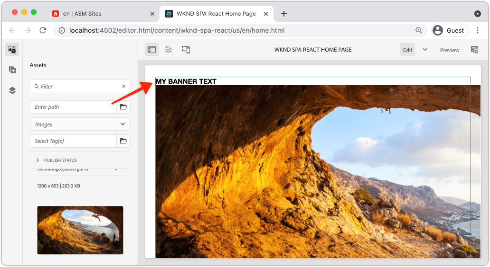

# Estendere un componente core {#extend-component}

Scopri come estendere un Componente core esistente da utilizzare con l’Editor SPA di AEM. Scopri come estendere un componente esistente è una tecnica potente per personalizzare ed espandere le funzionalità di un’implementazione dell’Editor SPA di AEM.

## Obiettivo

1. Estendi un componente core esistente con proprietà e contenuti aggiuntivi.
2. Comprendere le nozioni di base dell&#39;ereditarietà dei componenti con l&#39;utilizzo di `sling:resourceSuperType`.
3. Scopri come sfruttare il [Modello di delega](https://github.com/adobe/aem-core-wcm-components/wiki/Delegation-Pattern-for-Sling-Models) per modelli Sling per riutilizzare la logica e le funzionalità esistenti.

## Cosa verrà creato

Questo capitolo illustra il codice aggiuntivo necessario per aggiungere una proprietà aggiuntiva a un componente `Image` standard per soddisfare i requisiti per un nuovo componente `Banner`. Il componente `Banner` contiene tutte le stesse proprietà del componente standard `Image`, ma include una proprietà aggiuntiva per consentire agli utenti di popolare il **Testo banner**.


## Prerequisiti

Esaminare gli strumenti e le istruzioni necessari per configurare un [ambiente di sviluppo locale](overview.md#local-dev-environment). A questo punto, nell’esercitazione si presume che gli utenti abbiano una solida conoscenza della funzione Editor applicazioni a pagina singola di AEM.

## Ereditarietà con super tipo di risorsa Sling {#sling-resource-super-type}

Per estendere un componente esistente, impostare una proprietà denominata `sling:resourceSuperType` nella definizione del componente.  `sling:resourceSuperType`è una [proprietà](https://sling.apache.org/documentation/the-sling-engine/resources.html#resource-properties) che può essere impostata sulla definizione di un componente di AEM che punta a un altro componente. In questo modo il componente eredita in modo esplicito tutte le funzionalità del componente identificato come `sling:resourceSuperType`.

Se si desidera estendere il componente `Image` in `wknd-spa-react/components/image`, è necessario aggiornare il codice nel modulo `ui.apps`.

1. Crea una nuova cartella sotto il modulo `ui.apps` per `banner` alle `ui.apps/src/main/content/jcr_root/apps/wknd-spa-react/components/banner`.
1. Sotto `banner` creare una definizione di componente (`.content.xml`) simile alla seguente:

   ```xml
   <?xml version="1.0" encoding="UTF-8"?>
   <jcr:root xmlns:sling="http://sling.apache.org/jcr/sling/1.0" xmlns:cq="http://www.day.com/jcr/cq/1.0" xmlns:jcr="http://www.jcp.org/jcr/1.0"
       jcr:primaryType="cq:Component"
       jcr:title="Banner"
       sling:resourceSuperType="wknd-spa-react/components/image"
       componentGroup="WKND SPA React - Content"/>
   ```

   In questo modo `wknd-spa-react/components/banner` eredita tutte le funzionalità di `wknd-spa-react/components/image`.

## cq:editConfig {#cq-edit-config}

Il file `_cq_editConfig.xml` determina il comportamento di trascinamento nell&#39;interfaccia utente di authoring di AEM. Quando si estende il componente Immagine, è importante che il tipo di risorsa corrisponda al componente stesso.

1. Nel modulo `ui.apps` creare un altro file sotto `banner` denominato `_cq_editConfig.xml`.
1. Popolare `_cq_editConfig.xml` con il seguente XML:

   ```xml
   <?xml version="1.0" encoding="UTF-8"?>
   <jcr:root xmlns:sling="http://sling.apache.org/jcr/sling/1.0" xmlns:cq="http://www.day.com/jcr/cq/1.0" xmlns:jcr="http://www.jcp.org/jcr/1.0" xmlns:nt="http://www.jcp.org/jcr/nt/1.0"
       jcr:primaryType="cq:EditConfig">
       <cq:dropTargets jcr:primaryType="nt:unstructured">
           <image
               jcr:primaryType="cq:DropTargetConfig"
               accept="[image/gif,image/jpeg,image/png,image/webp,image/tiff,image/svg\\+xml]"
               groups="[media]"
               propertyName="./fileReference">
               <parameters
                   jcr:primaryType="nt:unstructured"
                   sling:resourceType="wknd-spa-react/components/banner"
                   imageCrop=""
                   imageMap=""
                   imageRotate=""/>
           </image>
       </cq:dropTargets>
       <cq:inplaceEditing
           jcr:primaryType="cq:InplaceEditingConfig"
           active="{Boolean}true"
           editorType="image">
           <inplaceEditingConfig jcr:primaryType="nt:unstructured">
               <plugins jcr:primaryType="nt:unstructured">
                   <crop
                       jcr:primaryType="nt:unstructured"
                       supportedMimeTypes="[image/jpeg,image/png,image/webp,image/tiff]"
                       features="*">
                       <aspectRatios jcr:primaryType="nt:unstructured">
                           <wideLandscape
                               jcr:primaryType="nt:unstructured"
                               name="Wide Landscape"
                               ratio="0.6180"/>
                           <landscape
                               jcr:primaryType="nt:unstructured"
                               name="Landscape"
                               ratio="0.8284"/>
                           <square
                               jcr:primaryType="nt:unstructured"
                               name="Square"
                               ratio="1"/>
                           <portrait
                               jcr:primaryType="nt:unstructured"
                               name="Portrait"
                               ratio="1.6180"/>
                       </aspectRatios>
                   </crop>
                   <flip
                       jcr:primaryType="nt:unstructured"
                       supportedMimeTypes="[image/jpeg,image/png,image/webp,image/tiff]"
                       features="-"/>
                   <map
                       jcr:primaryType="nt:unstructured"
                       supportedMimeTypes="[image/jpeg,image/png,image/webp,image/tiff,image/svg+xml]"
                       features="*"/>
                   <rotate
                       jcr:primaryType="nt:unstructured"
                       supportedMimeTypes="[image/jpeg,image/png,image/webp,image/tiff]"
                       features="*"/>
                   <zoom
                       jcr:primaryType="nt:unstructured"
                       supportedMimeTypes="[image/jpeg,image/png,image/webp,image/tiff]"
                       features="*"/>
               </plugins>
               <ui jcr:primaryType="nt:unstructured">
                   <inline
                       jcr:primaryType="nt:unstructured"
                       toolbar="[crop#launch,rotate#right,history#undo,history#redo,fullscreen#fullscreen,control#close,control#finish]">
                       <replacementToolbars
                           jcr:primaryType="nt:unstructured"
                           crop="[crop#identifier,crop#unlaunch,crop#confirm]"/>
                   </inline>
                   <fullscreen jcr:primaryType="nt:unstructured">
                       <toolbar
                           jcr:primaryType="nt:unstructured"
                           left="[crop#launchwithratio,rotate#right,flip#horizontal,flip#vertical,zoom#reset100,zoom#popupslider]"
                           right="[history#undo,history#redo,fullscreen#fullscreenexit]"/>
                       <replacementToolbars jcr:primaryType="nt:unstructured">
                           <crop
                               jcr:primaryType="nt:unstructured"
                               left="[crop#identifier]"
                               right="[crop#unlaunch,crop#confirm]"/>
                           <map
                               jcr:primaryType="nt:unstructured"
                               left="[map#rectangle,map#circle,map#polygon]"
                               right="[map#unlaunch,map#confirm]"/>
                       </replacementToolbars>
                   </fullscreen>
               </ui>
           </inplaceEditingConfig>
       </cq:inplaceEditing>
   </jcr:root>
   ```

1. L&#39;aspetto univoco del file è il nodo `<parameters>` che imposta resourceType su `wknd-spa-react/components/banner`.

   ```xml
   <parameters
       jcr:primaryType="nt:unstructured"
       sling:resourceType="wknd-spa-react/components/banner"
       imageCrop=""
       imageMap=""
       imageRotate=""/>
   ```

   La maggior parte dei componenti non richiede `_cq_editConfig`. I componenti immagine e i discendenti sono l’eccezione.

## Estendere la finestra di dialogo {#extend-dialog}

Per acquisire il componente `Banner` è necessario un campo di testo aggiuntivo nella finestra di dialogo. `bannerText` Poiché si utilizza l&#39;ereditarietà Sling, è possibile utilizzare le funzionalità di [Sling Resource Merger](https://experienceleague.adobe.com/docs/experience-manager-65/developing/platform/sling-resource-merger.html?lang=it) per ignorare o estendere parti della finestra di dialogo. In questo esempio è stata aggiunta una nuova scheda alla finestra di dialogo per acquisire dati aggiuntivi da un autore per popolare il componente Scheda.

1. Nel modulo `ui.apps`, sotto la cartella `banner`, creare una cartella denominata `_cq_dialog`.
1. Sotto `_cq_dialog` creare un file di definizione del dialogo `.content.xml`. Compila il file con quanto segue:

   ```xml
   <?xml version="1.0" encoding="UTF-8"?>
   <jcr:root xmlns:sling="http://sling.apache.org/jcr/sling/1.0" xmlns:granite="http://www.adobe.com/jcr/granite/1.0" xmlns:cq="http://www.day.com/jcr/cq/1.0" xmlns:jcr="http://www.jcp.org/jcr/1.0" xmlns:nt="http://www.jcp.org/jcr/nt/1.0"
       jcr:primaryType="nt:unstructured"
       jcr:title="Banner"
       sling:resourceType="cq/gui/components/authoring/dialog">
       <content jcr:primaryType="nt:unstructured">
           <items jcr:primaryType="nt:unstructured">
               <tabs jcr:primaryType="nt:unstructured">
                   <items jcr:primaryType="nt:unstructured">
                       <text
                           jcr:primaryType="nt:unstructured"
                           jcr:title="Text"
                           sling:orderBefore="asset"
                           sling:resourceType="granite/ui/components/coral/foundation/container"
                           margin="{Boolean}true">
                           <items jcr:primaryType="nt:unstructured">
                               <columns
                                   jcr:primaryType="nt:unstructured"
                                   sling:resourceType="granite/ui/components/coral/foundation/fixedcolumns"
                                   margin="{Boolean}true">
                                   <items jcr:primaryType="nt:unstructured">
                                       <column
                                           jcr:primaryType="nt:unstructured"
                                           sling:resourceType="granite/ui/components/coral/foundation/container">
                                           <items jcr:primaryType="nt:unstructured">
                                               <textGroup
                                                   granite:hide="${cqDesign.titleHidden}"
                                                   jcr:primaryType="nt:unstructured"
                                                   sling:resourceType="granite/ui/components/coral/foundation/well">
                                                   <items jcr:primaryType="nt:unstructured">
                                                       <bannerText
                                                           jcr:primaryType="nt:unstructured"
                                                           sling:resourceType="granite/ui/components/coral/foundation/form/textfield"
                                                           fieldDescription="Text to display on top of the banner."
                                                           fieldLabel="Banner Text"
                                                           name="./bannerText"/>
                                                   </items>
                                               </textGroup>
                                           </items>
                                       </column>
                                   </items>
                               </columns>
                           </items>
                       </text>
                   </items>
               </tabs>
           </items>
       </content>
   </jcr:root>
   ```

   La definizione XML precedente creerà una nuova scheda denominata **Testo** e la ordinerà *prima* della scheda **Risorsa** esistente. Conterrà un singolo campo **Testo banner**.

1. La finestra di dialogo si presenterà come segue:

   

   Non è stato necessario definire le schede per **Risorsa** o **Metadati**. Questi vengono ereditati tramite la proprietà `sling:resourceSuperType`.

   Prima di poter visualizzare l&#39;anteprima della finestra di dialogo, è necessario implementare il componente SPA e la funzione `MapTo`.

## Implementare il componente SPA {#implement-spa-component}

Per utilizzare il componente Banner con l&#39;editor SPA, è necessario creare un nuovo componente SPA che verrà mappato su `wknd-spa-react/components/banner`. Operazione eseguita nel modulo `ui.frontend`.

1. Nel modulo `ui.frontend` creare una nuova cartella per `Banner` alle `ui.frontend/src/components/Banner`.
1. Creare un nuovo file denominato `Banner.js` sotto la cartella `Banner`. Compila il file con quanto segue:

   ```js
   import React, {Component} from 'react';
   import {MapTo} from '@adobe/aem-react-editable-components';
   
   export const BannerEditConfig = {
       emptyLabel: 'Banner',
   
       isEmpty: function(props) {
           return !props || !props.src || props.src.trim().length < 1;
       }
   };
   
   export default class Banner extends Component {
   
       get content() {
           return ;
       }
   
       // display our custom bannerText property!
       get bannerText() {
           if(this.props.bannerText) {
               return <h4>{this.props.bannerText}</h4>;
           }
   
           return null;
       }
   
       render() {
           if (BannerEditConfig.isEmpty(this.props)) {
               return null;
           }
   
           return (
               <div className="Banner">
                   {this.bannerText}
                   <div className="BannerImage">{this.content}</div>
               </div>
           );
       }
   }
   
   MapTo('wknd-spa-react/components/banner')(Banner, BannerEditConfig);
   ```

   Questo componente SPA viene mappato al componente AEM `wknd-spa-react/components/banner` creato in precedenza.

1. Aggiorna `import-components.js` alle `ui.frontend/src/components/import-components.js` per includere il nuovo componente per applicazioni a pagina singola `Banner`:

   ```diff
     import './ExperienceFragment/ExperienceFragment';
     import './OpenWeather/OpenWeather';
   + import './Banner/Banner';
   ```

1. A questo punto il progetto può essere distribuito ad AEM ed è possibile testare la finestra di dialogo. Distribuisci il progetto utilizzando le abilità Maven:

   ```shell
   $ cd aem-guides-wknd-spa.react
   $ mvn clean install -PautoInstallSinglePackage
   ```

1. Aggiornare i criteri del modello di applicazioni a pagina singola per aggiungere il componente `Banner` come **componente consentito**.

1. Passare a una pagina di applicazioni a pagina singola e aggiungere il componente `Banner` a una delle pagine di applicazioni a pagina singola:

   

   >[!NOTE]
   >
   > La finestra di dialogo ti consentirà di salvare un valore per **Testo banner**, ma tale valore non si riflette nel componente SPA. Per abilitare, è necessario estendere il modello Sling per il componente.

## Aggiungi interfaccia Java {#java-interface}

Per esporre in definitiva i valori della finestra di dialogo del componente al componente React, è necessario aggiornare il modello Sling che compila il JSON per il componente `Banner`. Questa operazione viene eseguita nel modulo `core` che contiene tutto il codice Java per il progetto SPA.

Innanzitutto verrà creata una nuova interfaccia Java per `Banner` che estende l&#39;interfaccia Java `Image`.

1. Nel modulo `core` creare un nuovo file denominato `BannerModel.java` in `core/src/main/java/com/adobe/aem/guides/wkndspa/react/core/models`.
1. Popolare `BannerModel.java` con quanto segue:

   ```java
   package com.adobe.aem.guides.wkndspa.react.core.models;
   
   import com.adobe.cq.wcm.core.components.models.Image;
   import org.osgi.annotation.versioning.ProviderType;
   
   @ProviderType
   public interface BannerModel extends Image {
   
       public String getBannerText();
   
   }
   ```

   Tutti i metodi verranno ereditati dall&#39;interfaccia del componente core `Image` e verrà aggiunto un nuovo metodo `getBannerText()`.

## Implementare il modello Sling {#sling-model}

Successivamente, implementare il modello Sling per l&#39;interfaccia `BannerModel`.

1. Nel modulo `core` creare un nuovo file denominato `BannerModelImpl.java` in `core/src/main/java/com/adobe/aem/guides/wkndspa/react/core/models/impl`.

1. Popolare `BannerModelImpl.java` con quanto segue:

   ```java
   package com.adobe.aem.guides.wkndspa.react.core.models.impl;
   
   import com.adobe.aem.guides.wkndspa.react.core.models.BannerModel;
   import com.adobe.cq.export.json.ComponentExporter;
   import com.adobe.cq.export.json.ExporterConstants;
   import com.adobe.cq.wcm.core.components.models.Image;
   import org.apache.sling.models.annotations.*;
   import org.apache.sling.api.SlingHttpServletRequest;
   import org.apache.sling.models.annotations.Model;
   import org.apache.sling.models.annotations.injectorspecific.Self;
   import org.apache.sling.models.annotations.injectorspecific.ValueMapValue;
   import org.apache.sling.models.annotations.via.ResourceSuperType;
   
   @Model(
       adaptables = SlingHttpServletRequest.class, 
       adapters = { BannerModel.class,ComponentExporter.class}, 
       resourceType = BannerModelImpl.RESOURCE_TYPE, 
       defaultInjectionStrategy = DefaultInjectionStrategy.OPTIONAL
   )
   @Exporter(name = ExporterConstants.SLING_MODEL_EXPORTER_NAME, extensions = ExporterConstants.SLING_MODEL_EXTENSION)
   public class BannerModelImpl implements BannerModel {
   
       // points to the the component resource path in ui.apps
       static final String RESOURCE_TYPE = "wknd-spa-react/components/banner";
   
       @Self
       private SlingHttpServletRequest request;
   
       // With sling inheritance (sling:resourceSuperType) we can adapt the current resource to the Image class
       // this allows us to re-use all of the functionality of the Image class, without having to implement it ourself
       // see https://github.com/adobe/aem-core-wcm-components/wiki/Delegation-Pattern-for-Sling-Models
       @Self
       @Via(type = ResourceSuperType.class)
       private Image image;
   
       // map the property saved by the dialog to a variable named `bannerText`
       @ValueMapValue
       private String bannerText;
   
       // public getter to expose the value of `bannerText` via the Sling Model and JSON output
       @Override
       public String getBannerText() {
           return bannerText;
       }
   
       // Re-use the Image class for all other methods:
   
       @Override
       public String getSrc() {
           return null != image ? image.getSrc() : null;
       }
   
       @Override
       public String getAlt() {
           return null != image ? image.getAlt() : null;
       }
   
       @Override
       public String getTitle() {
           return null != image ? image.getTitle() : null;
       }
   
       // method required by `ComponentExporter` interface
       // exposes a JSON property named `:type` with a value of `wknd-spa-react/components/banner`
       // required to map the JSON export to the SPA component props via the `MapTo`
       @Override
       public String getExportedType() {
           return BannerModelImpl.RESOURCE_TYPE;
       }
   }
   ```

   Osserva l’utilizzo delle annotazioni `@Model` e `@Exporter` per garantire che il modello Sling possa essere serializzato come JSON tramite Sling Model Exporter.

   `BannerModelImpl.java` utilizza il [pattern di delega per modelli Sling](https://github.com/adobe/aem-core-wcm-components/wiki/Delegation-Pattern-for-Sling-Models) per evitare di riscrivere tutta la logica dal componente di base Immagine.

1. Rivedi le righe seguenti:

   ```java
   @Self
   @Via(type = ResourceSuperType.class)
   private Image image;
   ```

   L&#39;annotazione precedente creerà un&#39;istanza di un oggetto Image denominato `image` in base all&#39;ereditarietà `sling:resourceSuperType` del componente `Banner`.

   ```java
   @Override
   public String getSrc() {
       return null != image ? image.getSrc() : null;
   }
   ```

   È quindi possibile utilizzare semplicemente l&#39;oggetto `image` per implementare i metodi definiti dall&#39;interfaccia `Image`, senza dover scrivere direttamente la logica. Questa tecnica è utilizzata per `getSrc()`, `getAlt()` e `getTitle()`.

1. Aprire una finestra del terminale e distribuire solo gli aggiornamenti al modulo `core` utilizzando il profilo Maven `autoInstallBundle` dalla directory `core`.

   ```shell
   $ cd core/
   $ mvn clean install -PautoInstallBundle
   ```

## Tutti gli elementi insieme {#put-together}

1. Tornare ad AEM e aprire la pagina dell&#39;applicazione a pagina singola con il componente `Banner`.
1. Aggiorna il componente `Banner` per includere **Testo banner**:

   

1. Popola il componente con un’immagine:

   

   Salva gli aggiornamenti della finestra di dialogo.

1. Ora dovresti visualizzare il valore renderizzato di **Testo banner**:



1. Visualizza la risposta del modello JSON in: [http://localhost:4502/content/wknd-spa-react/us/en.model.json](http://localhost:4502/content/wknd-spa-react/us/en.model.json) e cerca `wknd-spa-react/components/card`:

   ```json
   "banner": {
       "bannerText": "My Banner Text",
       "src": "/content/wknd-spa-react/us/en/home/_jcr_content/root/responsivegrid/banner.coreimg.jpeg/1622167884688/sport-climbing.jpeg",
       "alt": "alt banner rock climber",
       ":type": "wknd-spa-react/components/banner"
    },
   ```

   Il modello JSON viene aggiornato con altre coppie chiave/valore dopo l&#39;implementazione del modello Sling in `BannerModelImpl.java`.

## Congratulazioni. {#congratulations}

Congratulazioni, hai imparato a estendere un componente AEM utilizzando e il funzionamento dei modelli e delle finestre di dialogo Sling con il modello JSON.
