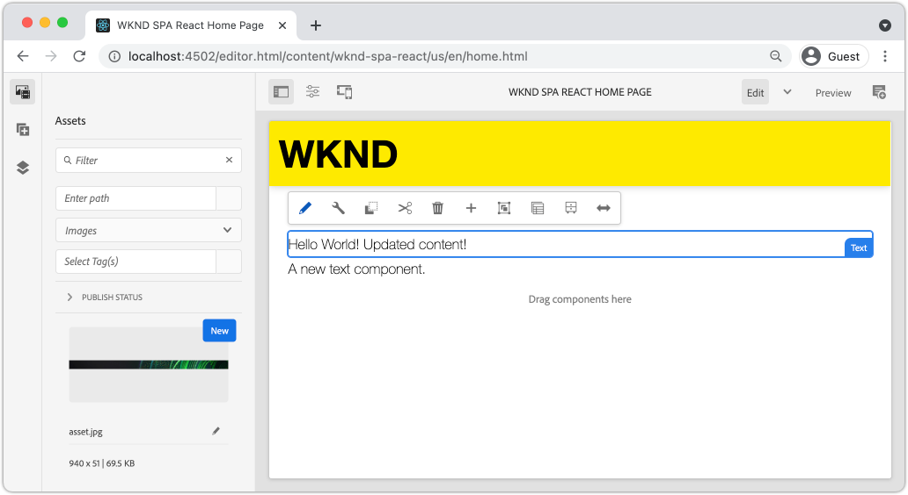
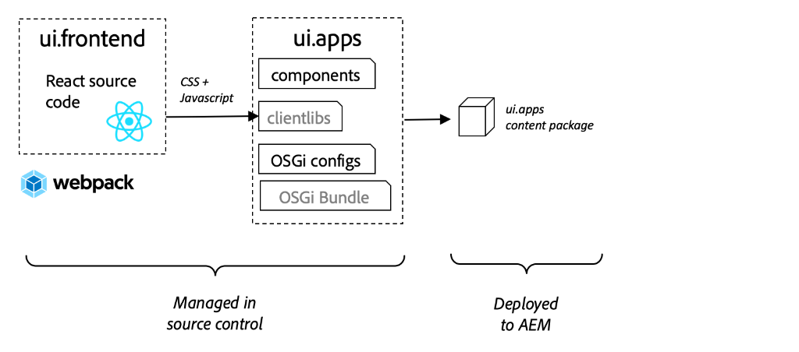
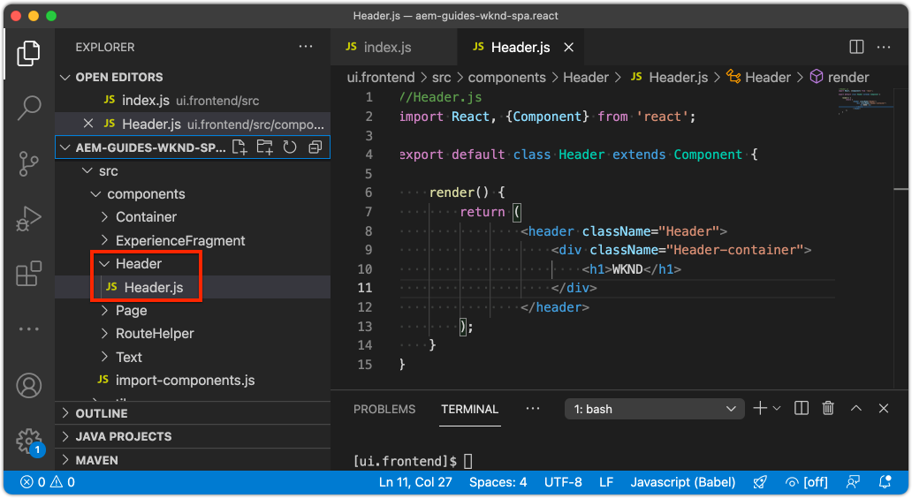
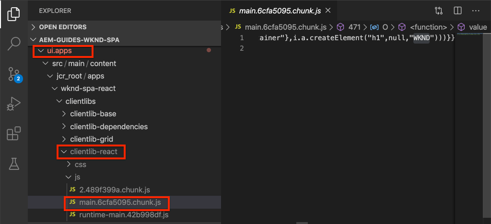
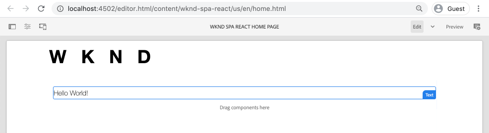
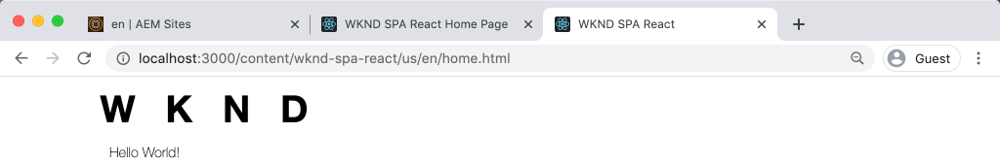
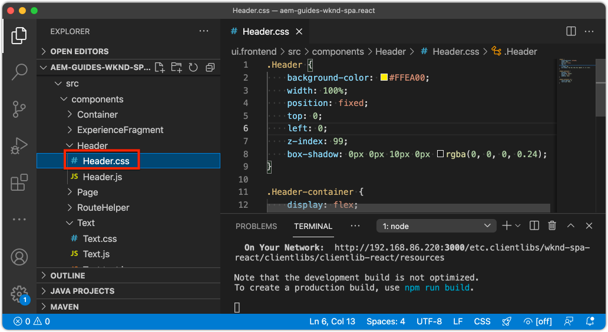
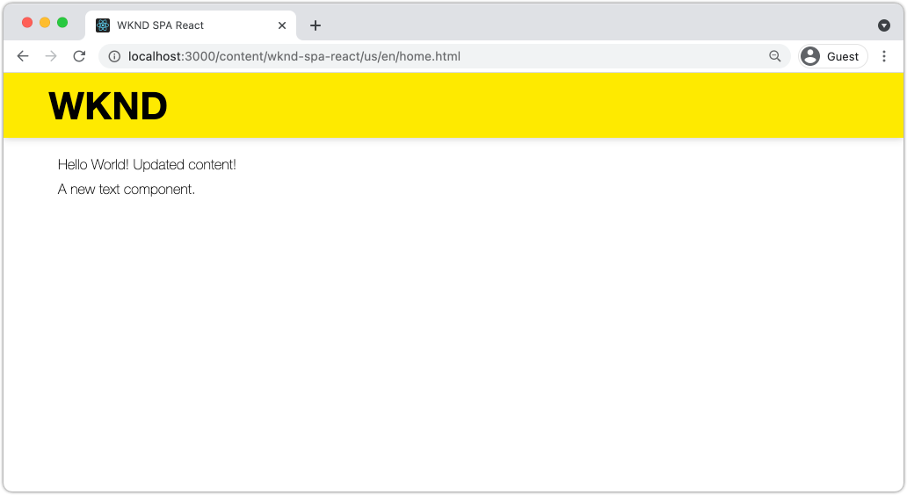
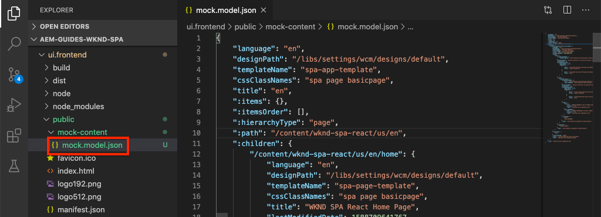

# Integrare l’applicazione a pagina singola {#developer-workflow}

{{spa-editor-deprecation}}

Scopri come il codice sorgente di un’applicazione a pagina singola scritto in React può essere integrato con un progetto Adobe Experience Manager (AEM). Scopri come utilizzare strumenti front-end moderni, come un server di sviluppo Webpack, per sviluppare rapidamente l’applicazione a pagina singola rispetto all’API del modello JSON di AEM.

## Obiettivo

1. Scopri in che modo il progetto SPA viene integrato con AEM con le librerie lato client.
2. Scopri come utilizzare un server di sviluppo Webpack per lo sviluppo front-end dedicato.
3. Esplora l&#39;utilizzo di un file **proxy** e di un file **fittizio** statico per lo sviluppo con l&#39;API del modello JSON AEM.

## Cosa verrà creato

In questo capitolo verranno apportate diverse piccole modifiche all’applicazione a pagina singola per comprendere come viene integrata con AEM.
Questo capitolo aggiungerà un semplice componente `Header` all&#39;applicazione a pagina singola. Durante la creazione di questo componente **static** `Header` vengono utilizzati diversi approcci allo sviluppo di applicazioni a pagina singola di AEM.



*L&#39;applicazione a pagina singola è stata estesa per aggiungere un componente `Header` statico*

## Prerequisiti

Rivedi gli strumenti e le istruzioni necessari per configurare un [ambiente di sviluppo locale](overview.md#local-dev-environment). Questo capitolo è una continuazione del capitolo [Crea progetto](create-project.md), tuttavia devi seguire tutto ciò che ti serve è un progetto AEM funzionante abilitato per applicazioni a pagina singola.

## Approccio all’integrazione {#integration-approach}

Due moduli sono stati creati come parte del progetto AEM: `ui.apps` e `ui.frontend`.

Il modulo `ui.frontend` è un progetto [webpack](https://webpack.js.org/) che contiene tutto il codice sorgente dell&#39;applicazione a pagina singola. La maggior parte dello sviluppo e del test delle applicazioni a pagina singola viene eseguita nel progetto webpack. Quando viene attivata una build di produzione, l’applicazione a pagina singola viene generata e compilata utilizzando Webpack. Gli artefatti compilati (CSS e JavaScript) vengono copiati nel modulo `ui.apps` che viene quindi distribuito nel runtime di AEM.



*Rappresentazione di alto livello dell&#39;integrazione SPA.*

Ulteriori informazioni sulla build front-end sono disponibili [qui](https://experienceleague.adobe.com/docs/experience-manager-core-components/using/developing/archetype/uifrontend-react.html?lang=it).

## Controllare l’integrazione con le applicazioni a pagina singola {#inspect-spa-integration}

Esaminare quindi il modulo `ui.frontend` per comprendere l&#39;applicazione a pagina singola generata automaticamente dall&#39;[archetipo progetto AEM](https://experienceleague.adobe.com/docs/experience-manager-core-components/using/developing/archetype/uifrontend-react.html?lang=it).

1. Nell’IDE che preferisci, apri il progetto AEM. Questa esercitazione utilizzerà l&#39;[IDE codice di Visual Studio](https://experienceleague.adobe.com/docs/experience-manager-learn/cloud-service/local-development-environment-set-up/development-tools.html?lang=it#microsoft-visual-studio-code).

   

1. Espandere ed esaminare la cartella `ui.frontend`. Apri il file in `ui.frontend/package.json`

1. Sotto `dependencies` dovresti vedere diversi relativi a `react` incluso `react-scripts`

   `ui.frontend` è un&#39;applicazione React basata su [Crea app React](https://create-react-app.dev/) o CRA in breve. La versione `react-scripts` indica quale versione di CRA viene utilizzata.

1. Ci sono anche diverse dipendenze con il prefisso `@adobe`:

   ```json
   "@adobe/aem-react-editable-components": "~1.1.2",
   "@adobe/aem-spa-component-mapping": "~1.1.0",
   "@adobe/aem-spa-page-model-manager": "~1.3.3",
   "@adobe/aem-core-components-react-base": "1.1.8",
   "@adobe/aem-core-components-react-spa": "1.1.7",
   ```

   I moduli di cui sopra costituiscono [AEM SPA Editor JS SDK](https://experienceleague.adobe.com/docs/experience-manager-65/developing/headless/spas/spa-blueprint.html?lang=it) e forniscono la funzionalità che consente di mappare i componenti SPA ai componenti AEM.

   Sono inclusi anche [Componenti AEM WCM - Implementazione React Core](https://github.com/adobe/aem-react-core-wcm-components-base) e [Componenti AEM WCM - Editor SPA - Implementazione React Core](https://github.com/adobe/aem-react-core-wcm-components-spa). Si tratta di un set di componenti riutilizzabili dell’interfaccia utente mappati su componenti AEM predefiniti. Sono progettati per essere utilizzati così come sono e progettati per soddisfare le esigenze del progetto.

1. Nel file `package.json` sono definiti diversi `scripts`:

   ```json
   "scripts": {
       "start": "react-scripts start",
       "build": "react-scripts build && clientlib",
       "test": "react-scripts test",
       "eject": "react-scripts eject",
   }
   ```

   Si tratta di script di build standard resi [disponibili](https://create-react-app.dev/docs/available-scripts) dalla funzione Crea app React.

   L&#39;unica differenza consiste nell&#39;aggiunta di `&& clientlib` allo script `build`. Questa istruzione aggiuntiva è responsabile della copia dell&#39;applicazione a pagina singola compilata nel modulo `ui.apps` come libreria lato client durante una compilazione.

   Per facilitare questa operazione, viene utilizzato il modulo npm [aem-clientlib-generator](https://github.com/wcm-io-frontend/aem-clientlib-generator).

1. Esamina il file `ui.frontend/clientlib.config.js`. Questo file di configurazione viene utilizzato da [aem-clientlib-generator](https://github.com/wcm-io-frontend/aem-clientlib-generator#clientlibconfigjs) per determinare come generare la libreria client.

1. Esamina il file `ui.frontend/pom.xml`. Questo file trasforma la cartella `ui.frontend` in un [modulo Maven](https://maven.apache.org/guides/mini/guide-multiple-modules.html). Il file `pom.xml` è stato aggiornato per utilizzare [frontend-maven-plugin](https://github.com/eirslett/frontend-maven-plugin) per **test** e **build** l&#39;applicazione a pagina singola durante una compilazione Maven.

1. Esaminare il file `index.js` in `ui.frontend/src/index.js`:

   ```js
   //ui.frontend/src/index.js
   ...
   document.addEventListener('DOMContentLoaded', () => {
       ModelManager.initialize().then(pageModel => {
           const history = createBrowserHistory();
           render(
           <Router history={history}>
               <App
               history={history}
               cqChildren={pageModel[Constants.CHILDREN_PROP]}
               cqItems={pageModel[Constants.ITEMS_PROP]}
               cqItemsOrder={pageModel[Constants.ITEMS_ORDER_PROP]}
               cqPath={pageModel[Constants.PATH_PROP]}
               locationPathname={window.location.pathname}
               />
           </Router>,
           document.getElementById('spa-root')
           );
       });
   });
   ```

   `index.js` è il punto di ingresso dell&#39;applicazione a pagina singola. `ModelManager` è fornito da AEM SPA Editor JS SDK. È responsabile della chiamata e dell&#39;inserimento di `pageModel` (contenuto JSON) nell&#39;applicazione.

1. Controllare il file `import-components.js` in `ui.frontend/src/components/import-components.js`. Questo file importa i **Componenti core React** predefiniti e li rende disponibili per il progetto. Nel prossimo capitolo verrà esaminata la mappatura dei contenuti AEM sui componenti SPA.

## Aggiungere un componente SPA statico {#static-spa-component}

Quindi, aggiungi un nuovo componente all’applicazione a pagina singola e distribuisci le modifiche a un’istanza AEM locale. Questa è una semplice modifica, solo per illustrare come viene aggiornata l’applicazione a pagina singola.

1. Nel modulo `ui.frontend`, sotto `ui.frontend/src/components`, creare una nuova cartella denominata `Header`.
1. Creare un file denominato `Header.js` sotto la cartella `Header`.

   

1. Popolare `Header.js` con quanto segue:

   ```js
   //Header.js
   import React, {Component} from 'react';
   
   export default class Header extends Component {
   
       render() {
           return (
                   <header className="Header">
                       <div className="Header-container">
                           <h1>WKND</h1>
                       </div>
                   </header>
           );
       }
   }
   ```

   Il precedente è un componente React standard che genererà una stringa di testo statica.

1. Apri il file in `ui.frontend/src/App.js`. Questo è il punto di ingresso dell&#39;applicazione.
1. Effettuare i seguenti aggiornamenti a `App.js` per includere `Header` statico:

   ```diff
     import { Page, withModel } from '@adobe/aem-react-editable-components';
     import React from 'react';
   + import Header from './components/Header/Header';
   
     // This component is the application entry point
     class App extends Page {
     render() {
         return (
         <div>
   +       <Header />
            {this.childComponents}
            {this.childPages}
        </div>
   ```

1. Aprire un nuovo terminale, passare alla cartella `ui.frontend` ed eseguire il comando `npm run build`:

   ```shell
   $ cd aem-guides-wknd-spa
   $ cd ui.frontend
   $ npm run build
   ...
   Compiled successfully.
   
   File sizes after gzip:
   
   118.95 KB (-33 B)  build/static/js/2.489f399a.chunk.js
   1.11 KB (+48 B)    build/static/js/main.6cfa5095.chunk.js
   806 B              build/static/js/runtime-main.42b998df.js
   451 B              build/static/css/main.e57bbe8a.chunk.css
   ```

1. Passare alla cartella `ui.apps`. Sotto `ui.apps/src/main/content/jcr_root/apps/wknd-spa-react/clientlibs/clientlib-react` dovresti vedere che i file SPA compilati sono stati copiati dalla cartella `ui.frontend/build`.

   

1. Tornare al terminale e spostarsi nella cartella `ui.apps`. Esegui il seguente comando Maven:

   ```shell
   $ cd ../ui.apps
   $ mvn clean install -PautoInstallPackage
   ...
   [INFO] ------------------------------------------------------------------------
   [INFO] BUILD SUCCESS
   [INFO] ------------------------------------------------------------------------
   [INFO] Total time:  9.629 s
   [INFO] Finished at: 2020-05-04T17:48:07-07:00
   [INFO] ------------------------------------------------------------------------
   ```

   Il pacchetto `ui.apps` verrà distribuito a un&#39;istanza in esecuzione locale di AEM.

1. Apri una scheda del browser e passa a [http://localhost:4502/editor.html/content/wknd-spa-react/us/en/home.html](http://localhost:4502/editor.html/content/wknd-spa-react/us/en/home.html). Il contenuto del componente `Header` dovrebbe essere visualizzato nell&#39;applicazione a pagina singola.

   

   I passaggi precedenti vengono eseguiti automaticamente quando si attiva una build Maven dalla radice del progetto (ovvero `mvn clean install -PautoInstallSinglePackage`). Ora dovresti comprendere le nozioni di base sull’integrazione tra le librerie lato client di applicazioni a pagina singola e AEM. È comunque possibile modificare e aggiungere `Text` componenti in AEM sotto il componente `Header` statico.

## Server di sviluppo Webpack: proxy dell’API JSON {#proxy-json}

Come mostrato negli esercizi precedenti, l’esecuzione di una build e la sincronizzazione della libreria client con un’istanza locale di AEM richiedono alcuni minuti. Questo è accettabile per il test finale, ma non è ideale per la maggior parte dello sviluppo di applicazioni a pagina singola.

È possibile utilizzare un [webpack-dev-server](https://webpack.js.org/configuration/dev-server/) per sviluppare rapidamente l&#39;applicazione a pagina singola. L’applicazione a pagina singola è guidata da un modello JSON generato da AEM. In this exercise the JSON content from a running instance of AEM is **proxied** into the development server.

1. Return to the IDE and open the file `ui.frontend/package.json`.

   Look for a line like the following:

   ```json
   "proxy": "http://localhost:4502",
   ```

   The [Create React App](https://create-react-app.dev/docs/proxying-api-requests-in-development) provides an easy mechanism to proxy API requests. All unknown requests are proxied through `localhost:4502`, the local AEM quickstart.

1. Aprire una finestra del terminale e passare alla cartella `ui.frontend`. Eseguire il comando `npm start`:

   ```shell
   $ cd ui.frontend
   $ npm start
   ...
   Compiled successfully!
   
   You can now view wknd-spa-react in the browser.
   
   Local:            http://localhost:3000
   On Your Network:  http://192.168.86.136:3000
   
   Note that the development build is not optimized.
   To create a production build, use npm run build.
   ```

1. Open a new browser tab (if not already opened) and navigate to [http://localhost:3000/content/wknd-spa-react/us/en/home.html](http://localhost:3000/content/wknd-spa-react/us/en/home.html).

   

   Dovresti visualizzare gli stessi contenuti di AEM, ma senza alcuna funzionalità di authoring abilitata.

   >[!NOTE]
   >
   > Due to the security requirements of AEM, you will need to be logged into the local AEM instance (http://localhost:4502) in the same browser but in a different tab.

1. Return to the IDE and create a file named `Header.css` in the `src/components/Header` folder.
1. Popolare `Header.css` con quanto segue:

   ```css
   .Header {
       background-color: #FFEA00;
       width: 100%;
       position: fixed;
       top: 0;
       left: 0;
       z-index: 99;
       box-shadow: 0px 0px 10px 0px rgba(0, 0, 0, 0.24);
   }
   
   .Header-container {
       display: flex;
       max-width: 1024px;
       margin: 0 auto;
       padding: 12px;
   }
   
   .Header-container h1 {
       letter-spacing: 0;
       font-size: 48px;
   }
   ```

   

1. Re-open `Header.js` and add the following line to reference `Header.css`:

   ```diff
     //Header.js
     import React, {Component} from 'react';
   + require('./Header.css');
   ```

   Salva le modifiche.

1. Navigate to [http://localhost:3000/content/wknd-spa-react/us/en/home.html](http://localhost:3000/content/wknd-spa-react/us/en/home.html) to see the style changes automatically reflected.

1. Aprire il file `Page.css` in `ui.frontend/src/components/Page`. Make the following changes to fix the padding:

   ```css
   .page {
     max-width: 1024px;
     margin: 0 auto;
     padding: 12px;
     padding-top: 50px;
   }
   ```

1. Return to the browser at [http://localhost:3000/content/wknd-spa-react/us/en/home.html](http://localhost:3000/content/wknd-spa-react/us/en/home.html). You should immediately see the changes to the app reflected.

   

   You can continue to make content updates in AEM and see them reflected in **webpack-dev-server**, since we are proxying the content.

1. Stop the webpack dev server with `ctrl+c` in the terminal.

## Distribuire aggiornamenti SPA in AEM

The changes made to the `Header` are currently only visible through the **webpack-dev-server**. Distribuisci l’applicazione a pagina singola aggiornata in AEM per visualizzare le modifiche.

1. Navigate to the root of the project (`aem-guides-wknd-spa`) and deploy the project to AEM using Maven:

   ```shell
   $ cd ..
   $ mvn clean install -PautoInstallSinglePackage
   ```

2. Passa a [http://localhost:4502/editor.html/content/wknd-spa-react/us/en/home.html](http://localhost:4502/editor.html/content/wknd-spa-react/us/en/home.html). You should see the updated `Header` and styles applied.

   

   Ora che l’applicazione a pagina singola aggiornata è in AEM, l’authoring può continuare.

## Congratulazioni. {#congratulations}

Congratulazioni, hai aggiornato l’applicazione a pagina singola ed esplorato l’integrazione con AEM. You now know how to develop the SPA against the AEM JSON model API using a **webpack-dev-server**.

### Passaggi successivi {#next-steps}

[Map SPA components to AEM components](map-components.md) - Learn how to map React components to Adobe Experience Manager (AEM) components with the AEM SPA Editor JS SDK. La mappatura dei componenti consente agli utenti di apportare aggiornamenti dinamici ai componenti delle applicazioni a pagina singola nell’Editor delle applicazioni a pagina singola di AEM, in modo simile all’authoring tradizionale AEM.

## (Bonus) Webpack Dev Server - Mock JSON API {#mock-json}

Another approach to rapid development is to use a static JSON file to act as the JSON model. By &quot;mocking&quot; the JSON, we remove the dependency on a local AEM instance. It also allows a front-end developer to update the JSON model in order to test functionality and drive changes to the JSON API that would then be later implemented by a back-end developer.

The initial set up of the mock JSON does **require a local AEM instance**.

1. Return to the IDE and navigate to `ui.frontend/public` and add a new folder named `mock-content`.
1. Crea un nuovo file denominato `mock.model.json` sotto a `ui.frontend/public/mock-content`.
1. In the browser navigate to [http://localhost:4502/content/wknd-spa-react/us/en.model.json](http://localhost:4502/content/wknd-spa-react/us/en.model.json).

   This is the JSON exported by AEM that is driving the application. Copy the JSON output.

1. Paste the JSON output from the previous step in the file `mock.model.json`.

   

1. Aprire il file `index.html` in `ui.frontend/public/index.html`. Update the metadata property for the AEM page model to point to a variable `%REACT_APP_PAGE_MODEL_PATH%`:

   ```html
       <!-- AEM page model -->
       <meta
          property="cq:pagemodel_root_url"
          content="%REACT_APP_PAGE_MODEL_PATH%"
       />
   ```

   Using a variable for the value of the `cq:pagemodel_root_url` will make it easier to toggle between the proxy and mock json model.

1. Open the file `ui.frontend/.env.development` and make the following updates to comment out the previous value for `REACT_APP_PAGE_MODEL_PATH` and `REACT_APP_API_HOST`:

   ```diff
   + PUBLIC_URL=/
   - PUBLIC_URL=/etc.clientlibs/wknd-spa-react/clientlibs/clientlib-react/resources
   
   - REACT_APP_PAGE_MODEL_PATH=/content/wknd-spa-react/us/en.model.json
   + REACT_APP_PAGE_MODEL_PATH=/mock-content/mock.model.json
   
   - REACT_APP_API_HOST=http://localhost:4502
   + #REACT_APP_API_HOST=http://localhost:4502
   
   REACT_APP_ROOT=/content/wknd-spa-react/us/en/home.html
   ```

1. Se è in esecuzione, arrestare **webpack-dev-server**. Avvia **webpack-dev-server** dal terminale:

   ```shell
   $ cd ui.frontend
   $ npm start
   ```

   Passa a [http://localhost:3000/content/wknd-spa-react/us/en/home.html](http://localhost:3000/content/wknd-spa-react/us/en/home.html) per visualizzare l&#39;applicazione a pagina singola con lo stesso contenuto utilizzato nel json **proxy**.

1. Apportare una piccola modifica al file `mock.model.json` creato in precedenza. Dovresti vedere il contenuto aggiornato immediatamente riflesso nel **webpack-dev-server**.

   

La possibilità di manipolare il modello JSON e vedere gli effetti su un’applicazione a pagina singola live può aiutare uno sviluppatore a comprendere l’API del modello JSON. Consente inoltre lo sviluppo sia front-end che back-end in parallelo.

È ora possibile cambiare la posizione in cui utilizzare il contenuto JSON attivando/disattivando le voci nel file `env.development`:

```plain
# JSON API via proxy to AEM
#REACT_APP_PAGE_MODEL_PATH=/content/wknd-spa-react/us/en.model.json
#REACT_APP_API_HOST=http://localhost:4502

# JSON API via static mock file
REACT_APP_PAGE_MODEL_PATH=/mock-content/mock.model.json
```
