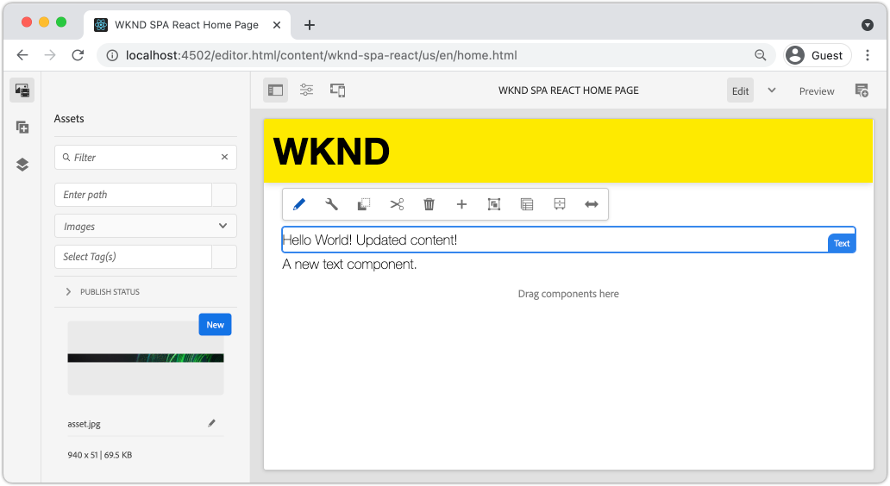

# Integrare l’SPA {#developer-workflow}

Comprendere come il codice sorgente di un’applicazione a pagina singola (SPA) scritto in React può essere integrato con un progetto Adobe Experience Manager (AEM). Scopri come utilizzare strumenti front-end moderni, come un server di sviluppo Webpack, per sviluppare rapidamente l’SPA contro l’API modello JSON dell’AEM.

## Obiettivo

1. Comprendere come il progetto SPA viene integrato con l’AEM con le librerie lato client.
2. Scopri come utilizzare un server di sviluppo Webpack per lo sviluppo front-end dedicato.
3. Esplorare l’utilizzo di **proxy** e statico **finta** file per lo sviluppo rispetto all’API del modello JSON AEM.

## Cosa verrà creato

In questo capitolo verranno apportate diverse piccole modifiche all’SPA per comprendere come questo viene integrato con l’AEM.
Questo capitolo aggiungerà un semplice `Header` all&#39;SPA. Nel processo di costruzione di questo **statico** `Header` componente vengono utilizzati diversi approcci allo sviluppo dell’SPA da parte dell’AEM.



*L’SPA viene esteso per aggiungere un’ `Header` componente*

## Prerequisiti

Esaminare gli strumenti e le istruzioni necessari per l&#39;impostazione di un [ambiente di sviluppo locale](overview.md#local-dev-environment). Questo capitolo è una continuazione del [Crea progetto](create-project.md) capitolo, tuttavia, per seguire tutto ciò che serve è un progetto di lavoro SPA-abilitato AEM.

## Approccio all’integrazione {#integration-approach}

Nell’ambito del progetto AEM sono stati creati due moduli: `ui.apps` e `ui.frontend`.

Il `ui.frontend` il modulo è un [webpack](https://webpack.js.org/) progetto che contiene tutto il codice sorgente dell’SPA. La maggior parte dello sviluppo e dei test dell’SPA viene effettuata nel progetto webpack. Quando viene attivata una build di produzione, l’SPA viene generato e compilato utilizzando Webpack. Gli artefatti compilati (CSS e JavaScript) vengono copiati nel `ui.apps` che viene quindi distribuito nel runtime AEM.


*Rappresentazione di alto livello dell’integrazione dell’SPA.*

Ulteriori informazioni sulla build front-end possono essere [trovato qui](https://experienceleague.adobe.com/docs/experience-manager-core-components/using/developing/archetype/uifrontend-react.html).

## Integrazione di Inspect con l’SPA {#inspect-spa-integration}

Quindi, controlla `ui.frontend` per comprendere l’SPA che è stato generato automaticamente dal [Archetipo progetto AEM](https://experienceleague.adobe.com/docs/experience-manager-core-components/using/developing/archetype/uifrontend-react.html).

1. Nell’IDE che preferisci, apri il Progetto AEM. Questa esercitazione utilizzerà [IDE codice Visual Studio](https://experienceleague.adobe.com/docs/experience-manager-learn/cloud-service/local-development-environment-set-up/development-tools.html#microsoft-visual-studio-code).

   

1. Espandere ed esaminare `ui.frontend` cartella. Apri il file `ui.frontend/package.json`

1. Sotto `dependencies` ne dovresti vedere diversi relativi a `react` tra cui `react-scripts`

   Il `ui.frontend` è un’applicazione React basata su [Crea app React](https://create-react-app.dev/) o CRA in breve. Il `react-scripts` La versione indica la versione di CRA utilizzata.

1. Esistono anche diverse dipendenze con prefisso `@adobe`:

   ```json
   "@adobe/aem-react-editable-components": "~1.1.2",
   "@adobe/aem-spa-component-mapping": "~1.1.0",
   "@adobe/aem-spa-page-model-manager": "~1.3.3",
   "@adobe/aem-core-components-react-base": "1.1.8",
   "@adobe/aem-core-components-react-spa": "1.1.7",
   ```

   I moduli di cui sopra costituiscono [SDK JS per l’editor SPA dell’AEM](https://experienceleague.adobe.com/docs/experience-manager-65/developing/headless/spas/spa-blueprint.html) e fornire la funzionalità che consente di mappare i Componenti SPA ai Componenti AEM.

   Sono inclusi anche [Componenti WCM AEM - Implementazione React Core](https://github.com/adobe/aem-react-core-wcm-components-base) e [Componenti WCM AEM - Editor SPA - Implementazione React Core](https://github.com/adobe/aem-react-core-wcm-components-spa). Si tratta di un set di componenti riutilizzabili dell’interfaccia utente mappati su componenti AEM predefiniti. Sono progettati per essere utilizzati così come sono e progettati per soddisfare le esigenze del progetto.

1. In `package.json` file sono presenti diversi `scripts` definito:

   ```json
   "scripts": {
       "start": "react-scripts start",
       "build": "react-scripts build && clientlib",
       "test": "react-scripts test",
       "eject": "react-scripts eject",
   }
   ```

   Si tratta di script di build standard creati [disponibile](https://create-react-app.dev/docs/available-scripts) tramite l’app Create React.

   L&#39;unica differenza è l&#39;aggiunta di `&& clientlib` al `build` script. Questa istruzione aggiuntiva è responsabile della copia dell&#39;SPA compilato nel `ui.apps` come libreria lato client durante una generazione.

   Il modulo npm [aem-clientlib-generator](https://github.com/wcm-io-frontend/aem-clientlib-generator) viene utilizzato per facilitare questa operazione.

1. Inspect il file `ui.frontend/clientlib.config.js`. Questo file di configurazione viene utilizzato da [aem-clientlib-generator](https://github.com/wcm-io-frontend/aem-clientlib-generator#clientlibconfigjs) per determinare come generare la libreria client.

1. Inspect il file `ui.frontend/pom.xml`. Questo file trasforma `ui.frontend` cartella in una [Modulo Maven](https://maven.apache.org/guides/mini/guide-multiple-modules.html). Il `pom.xml` il file è stato aggiornato per utilizzare [frontend-maven-plugin](https://github.com/eirslett/frontend-maven-plugin) a **test** e **build** l’SPA durante una build Maven.

1. Inspect il file `index.js` a `ui.frontend/src/index.js`:

   ```js
   //ui.frontend/src/index.js
   ...
   document.addEventListener('DOMContentLoaded', () => {
       ModelManager.initialize().then(pageModel => {
           const history = createBrowserHistory();
           render(
           <Router history={history}>
               <App
               history={history}
               cqChildren={pageModel[Constants.CHILDREN_PROP]}
               cqItems={pageModel[Constants.ITEMS_PROP]}
               cqItemsOrder={pageModel[Constants.ITEMS_ORDER_PROP]}
               cqPath={pageModel[Constants.PATH_PROP]}
               locationPathname={window.location.pathname}
               />
           </Router>,
           document.getElementById('spa-root')
           );
       });
   });
   ```

   `index.js` è il punto di ingresso dell&#39;SPA. `ModelManager` è fornito dall’SDK JS dell’editor SPA dell’AEM. È responsabile della chiamata e dell’iniezione della `pageModel` (il contenuto JSON) nell’applicazione.

1. Inspect il file `import-components.js` a `ui.frontend/src/components/import-components.js`. Questo file importa il predefinito **Componenti core React** e li rende disponibili per il progetto. Nel prossimo capitolo verrà esaminata la mappatura dei contenuti AEM sui componenti SPA.

## Aggiungere un componente SPA statico {#static-spa-component}

Quindi, aggiungi un nuovo componente all’SPA e implementa le modifiche in un’istanza AEM locale. Questo è un semplice cambiamento, giusto per illustrare come l&#39;SPA viene aggiornato.

1. In `ui.frontend` modulo, sotto `ui.frontend/src/components` crea una nuova cartella denominata `Header`.
1. Crea un file denominato `Header.js` sotto `Header` cartella.

   

1. Popolare `Header.js` con le seguenti caratteristiche:

   ```js
   //Header.js
   import React, {Component} from 'react';
   
   export default class Header extends Component {
   
       render() {
           return (
                   <header className="Header">
                       <div className="Header-container">
                           <h1>WKND</h1>
                       </div>
                   </header>
           );
       }
   }
   ```

   Il precedente è un componente React standard che genererà una stringa di testo statica.

1. Apri il file `ui.frontend/src/App.js`. Questo è il punto di ingresso dell&#39;applicazione.
1. Effettua i seguenti aggiornamenti a `App.js` per includere l&#39;elemento statico `Header`:

   ```diff
     import { Page, withModel } from '@adobe/aem-react-editable-components';
     import React from 'react';
   + import Header from './components/Header/Header';
   
     // This component is the application entry point
     class App extends Page {
     render() {
         return (
         <div>
   +       <Header />
            {this.childComponents}
            {this.childPages}
        </div>
   ```

1. Apri un nuovo terminale e accedi al `ui.frontend` ed eseguire il comando `npm run build` comando:

   ```shell
   $ cd aem-guides-wknd-spa
   $ cd ui.frontend
   $ npm run build
   ...
   Compiled successfully.
   
   File sizes after gzip:
   
   118.95 KB (-33 B)  build/static/js/2.489f399a.chunk.js
   1.11 KB (+48 B)    build/static/js/main.6cfa5095.chunk.js
   806 B              build/static/js/runtime-main.42b998df.js
   451 B              build/static/css/main.e57bbe8a.chunk.css
   ```

1. Accedi a `ui.apps` cartella. Sotto `ui.apps/src/main/content/jcr_root/apps/wknd-spa-react/clientlibs/clientlib-react` dovresti vedere che i file SPA compilati sono stati copiati dal`ui.frontend/build` cartella.

   

1. Torna al terminale e passa alla `ui.apps` cartella. Esegui il seguente comando Maven:

   ```shell
   $ cd ../ui.apps
   $ mvn clean install -PautoInstallPackage
   ...
   [INFO] ------------------------------------------------------------------------
   [INFO] BUILD SUCCESS
   [INFO] ------------------------------------------------------------------------
   [INFO] Total time:  9.629 s
   [INFO] Finished at: 2020-05-04T17:48:07-07:00
   [INFO] ------------------------------------------------------------------------
   ```

   Verrà distribuito `ui.apps` in un&#39;istanza locale in esecuzione dell&#39;AEM.

1. Apri una scheda del browser e passa a [http://localhost:4502/editor.html/content/wknd-spa-react/us/en/home.html](http://localhost:4502/editor.html/content/wknd-spa-react/us/en/home.html). Ora dovresti vedere il contenuto della sezione `Header` componente visualizzato nell’SPA.

   

   I passaggi precedenti vengono eseguiti automaticamente quando si attiva una build Maven dalla radice del progetto (ad esempio `mvn clean install -PautoInstallSinglePackage`). Ora dovresti comprendere le basi dell’integrazione tra l’SPA e le librerie lato client dell’AEM. Puoi comunque modificare e aggiungere `Text` componenti dell’AEM al di sotto del `Header` componente.

## Server di sviluppo Webpack: proxy dell’API JSON {#proxy-json}

Come visto negli esercizi precedenti, l’esecuzione di una build e la sincronizzazione della libreria client con un’istanza locale dell’AEM richiedono alcuni minuti. Questo è accettabile per i test finali, ma non è ideale per la maggior parte dello sviluppo dell&#39;SPA.

A [webpack-dev-server](https://webpack.js.org/configuration/dev-server/) può essere utilizzata per sviluppare rapidamente l’SPA. L’SPA è guidato da un modello JSON generato dall’AEM. In questo esercizio il contenuto JSON di un’istanza in esecuzione dell’AEM è **proxy** nel server di sviluppo.

1. Torna all’IDE e apri il file `ui.frontend/package.json`.

   Cerca una riga simile alla seguente:

   ```json
   "proxy": "http://localhost:4502",
   ```

   Il [Crea app React](https://create-react-app.dev/docs/proxying-api-requests-in-development) fornisce un semplice meccanismo per proxy le richieste API. Tutte le richieste sconosciute vengono elaborate tramite proxy `localhost:4502`, il modulo di avvio rapido per l’AEM locale.

1. Apri una finestra del terminale e passa a `ui.frontend` cartella. Esegui il comando `npm start`:

   ```shell
   $ cd ui.frontend
   $ npm start
   ...
   Compiled successfully!
   
   You can now view wknd-spa-react in the browser.
   
   Local:            http://localhost:3000
   On Your Network:  http://192.168.86.136:3000
   
   Note that the development build is not optimized.
   To create a production build, use npm run build.
   ```

1. Apri una nuova scheda del browser (se non è già aperta) e passa a [http://localhost:3000/content/wknd-spa-react/us/en/home.html](http://localhost:3000/content/wknd-spa-react/us/en/home.html).

   

   Dovresti visualizzare gli stessi contenuti dell’AEM, ma senza le funzionalità di authoring abilitate.

   >[!NOTE]
   >
   > A causa dei requisiti di sicurezza dell’AEM, dovrai aver effettuato l’accesso all’istanza AEM locale (http://localhost:4502) nello stesso browser ma in una scheda diversa.

1. Torna all’IDE e crea un file denominato `Header.css` nel `src/components/Header` cartella.
1. Popolare il `Header.css` con le seguenti caratteristiche:

   ```css
   .Header {
       background-color: #FFEA00;
       width: 100%;
       position: fixed;
       top: 0;
       left: 0;
       z-index: 99;
       box-shadow: 0px 0px 10px 0px rgba(0, 0, 0, 0.24);
   }
   
   .Header-container {
       display: flex;
       max-width: 1024px;
       margin: 0 auto;
       padding: 12px;
   }
   
   .Header-container h1 {
       letter-spacing: 0;
       font-size: 48px;
   }
   ```

   

1. Riapri `Header.js` e aggiungi la seguente riga come riferimento `Header.css`:

   ```diff
     //Header.js
     import React, {Component} from 'react';
   + require('./Header.css');
   ```

   Salva le modifiche.

1. Accedi a [http://localhost:3000/content/wknd-spa-react/us/en/home.html](http://localhost:3000/content/wknd-spa-react/us/en/home.html) per visualizzare le modifiche di stile riflesse automaticamente.

1. Apri il file `Page.css` a `ui.frontend/src/components/Page`. Apporta le seguenti modifiche per correggere la spaziatura:

   ```css
   .page {
     max-width: 1024px;
     margin: 0 auto;
     padding: 12px;
     padding-top: 50px;
   }
   ```

1. Torna al browser all’indirizzo [http://localhost:3000/content/wknd-spa-react/us/en/home.html](http://localhost:3000/content/wknd-spa-react/us/en/home.html). Dovresti vedere immediatamente le modifiche apportate all’app.

   

   Puoi continuare a eseguire aggiornamenti dei contenuti in AEM e vederli riflessi in **webpack-dev-server**, dal momento che stiamo eseguendo il proxy del contenuto.

1. Arresta il server di sviluppo Webpack con `ctrl+c` nel terminale.

## Distribuire gli aggiornamenti SPA all’AEM

Le modifiche apportate al `Header` sono attualmente visibili solo tramite **webpack-dev-server**. Distribuire l’SPA aggiornato nell’AEM per visualizzare le modifiche.

1. Passa alla directory principale del progetto (`aem-guides-wknd-spa`) e implementa il progetto in AEM utilizzando Maven:

   ```shell
   $ cd ..
   $ mvn clean install -PautoInstallSinglePackage
   ```

2. Accedi a [http://localhost:4502/editor.html/content/wknd-spa-react/us/en/home.html](http://localhost:4502/editor.html/content/wknd-spa-react/us/en/home.html). Dovresti visualizzare il `Header` e stili applicati.

   

   Ora che l’SPA aggiornato è in AEM, la creazione può continuare.

## Congratulazioni. {#congratulations}

Congratulazioni, hai aggiornato l’SPA ed esplorato l’integrazione con l’AEM! Ora sai come sviluppare l’SPA contro l’API del modello JSON dell’AEM utilizzando una **webpack-dev-server**.

### Passaggi successivi {#next-steps}

[Mappare i componenti dell’SPA ai componenti dell’AEM](map-components.md) - Scopri come mappare i componenti React ai componenti Adobe Experience Manager (AEM) con l’SDK JS dell’editor AEM SPA. La mappatura dei componenti consente agli utenti di apportare aggiornamenti dinamici ai componenti SPA nell’Editor SPA dell’AEM, in modo simile all’authoring AEM tradizionale.

## (Bonus) Server di sviluppo Webpack - Mock dell’API JSON {#mock-json}

Un altro approccio allo sviluppo rapido consiste nell’utilizzare un file JSON statico come modello JSON. &quot;Deridendo&quot; il JSON, rimuoviamo la dipendenza da un’istanza AEM locale. Consente inoltre a uno sviluppatore front-end di aggiornare il modello JSON per testare la funzionalità e apportare modifiche all’API JSON che verrebbero successivamente implementate da uno sviluppatore back-end.

L’impostazione iniziale del JSON fittizio **richiedono un’istanza AEM locale**.

1. Torna all’IDE e passa a `ui.frontend/public` e aggiungi una nuova cartella denominata `mock-content`.
1. Crea un nuovo file denominato `mock.model.json` sotto a `ui.frontend/public/mock-content`.
1. Nel browser passa a [http://localhost:4502/content/wknd-spa-react/us/en.model.json](http://localhost:4502/content/wknd-spa-react/us/en.model.json).

   Questo è il JSON esportato dall’AEM che sta guidando l’applicazione. Copia l’output JSON.

1. Incolla l’output JSON dal passaggio precedente nel file `mock.model.json`.

   

1. Apri il file `index.html` a `ui.frontend/public/index.html`. Aggiorna la proprietà dei metadati per il modello di pagina AEM per puntare a una variabile `%REACT_APP_PAGE_MODEL_PATH%`:

   ```html
       <!-- AEM page model -->
       <meta
          property="cq:pagemodel_root_url"
          content="%REACT_APP_PAGE_MODEL_PATH%"
       />
   ```

   Utilizzo di una variabile per il valore della proprietà `cq:pagemodel_root_url` renderà più semplice passare dal modello proxy a quello json fittizio e viceversa.

1. Apri il file `ui.frontend/.env.development` e apporta i seguenti aggiornamenti per commentare il valore precedente per `REACT_APP_PAGE_MODEL_PATH` e `REACT_APP_API_HOST`:

   ```diff
   + PUBLIC_URL=/
   - PUBLIC_URL=/etc.clientlibs/wknd-spa-react/clientlibs/clientlib-react/resources
   
   - REACT_APP_PAGE_MODEL_PATH=/content/wknd-spa-react/us/en.model.json
   + REACT_APP_PAGE_MODEL_PATH=/mock-content/mock.model.json
   
   - REACT_APP_API_HOST=http://localhost:4502
   + #REACT_APP_API_HOST=http://localhost:4502
   
   REACT_APP_ROOT=/content/wknd-spa-react/us/en/home.html
   ```

1. Se è in esecuzione, arrestare **webpack-dev-server**. Avvia il **webpack-dev-server** dal terminale:

   ```shell
   $ cd ui.frontend
   $ npm start
   ```

   Accedi a [http://localhost:3000/content/wknd-spa-react/us/en/home.html](http://localhost:3000/content/wknd-spa-react/us/en/home.html) e dovresti vedere l’SPA con lo stesso contenuto utilizzato negli **proxy** json.

1. Effettua una piccola modifica al `mock.model.json` file creato in precedenza. Dovresti vedere il contenuto aggiornato immediatamente riflesso nella **webpack-dev-server**.

   

La capacità di manipolare il modello JSON e di vedere gli effetti su un SPA in tempo reale può aiutare uno sviluppatore a comprendere l’API del modello JSON. Consente inoltre lo sviluppo sia front-end che back-end in parallelo.

Ora puoi attivare o disattivare la posizione in cui utilizzare il contenuto JSON attivando o disattivando le voci nel `env.development` file:

```plain
# JSON API via proxy to AEM
#REACT_APP_PAGE_MODEL_PATH=/content/wknd-spa-react/us/en.model.json
#REACT_APP_API_HOST=http://localhost:4502

# JSON API via static mock file
REACT_APP_PAGE_MODEL_PATH=/mock-content/mock.model.json
```
